# LocalStock Unified

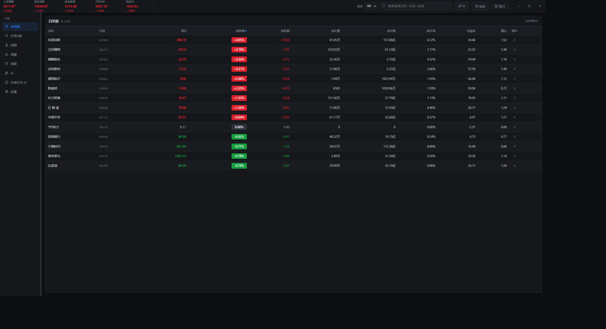

> 本地量化工作台：Electron 桌面端 + 聚宽兼容回测服务 + 统一行情库 + 价格行为 AI，全部跑在本地，不依赖云端。

## 演示视频

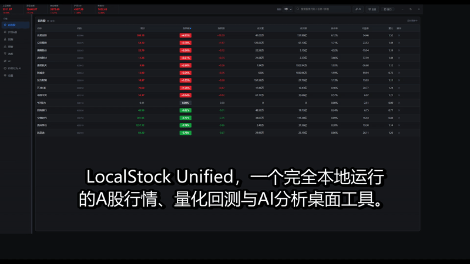

*1 分 42 秒项目讲解的无声预览 ｜ 完整视频：[`docs/项目讲解.mp4`](docs/项目讲解.mp4)（含解说音频）· [讲稿](docs/项目讲解讲稿.md)*

<!--
要在 GitHub 上内嵌带音频的播放器（而非动图），必须把 mp4 托管到 GitHub 自己的 CDN：
  方法一：网页编辑本文件时，把 docs/项目讲解.mp4 拖进编辑器，会得到
          https://github.com/<user>/<repo>/assets/<id> 形式的 URL，单独放一行即自动渲染为播放器
          （免费账号 10MB 上限，本视频 5.6MB，可用）。
  方法二：作为 Release 附件上传（无大小限制），把下载 URL 单独放一行同样会内嵌播放。
注意：<video src="仓库相对路径.mp4"> 在 GitHub 上不会播放，只对本地 Markdown 阅读器有效。
-->

## 项目定位

LocalStock Unified 是把桌面行情软件、本地研究/回测服务、统一行情数据库和策略知识库合并到一个工作区后的后续开发版本。三件套：

- **桌面端** `apps/desktop`：Electron + React，自选股 / 沪深 A 股 / K 线多周期 / 回测编辑器 / 预警 / 画线 / AI 助手
- **聚宽服务** `services/joinquant-local`：Node Express + Python，:3000 端口，因子计算与策略回测
- **价格行为 AI** `apps/desktop/python/pa-agent`：Al Brooks 两阶段推理，随桌面端自动拉起，不单独运行

唯一权威行情库为 `data/market/stock_data.db`（约 6.7 GB，5973 只 A 股，约 1884 万行日线，1991-06-01 至今）。

## 快速开始

```powershell
cd D:\pythonpro\LocalStock-unified
npm run install:all
npm run verify:workspace
powershell -ExecutionPolicy Bypass -File .\tools\start-all.ps1
```

也可以分别启动：

```powershell
powershell -ExecutionPolicy Bypass -File .\tools\start-quant.ps1
powershell -ExecutionPolicy Bypass -File .\tools\start-desktop.ps1
```

## 界面预览

### 行情浏览


*自选股主界面：红涨绿跌，实时刷新*

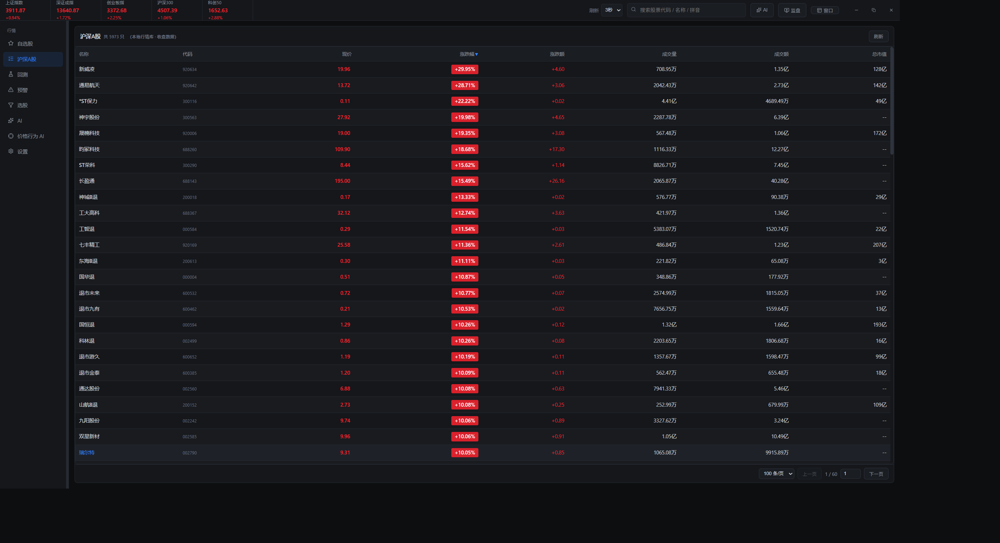
*沪深 A 股全市场：5973 只股票*

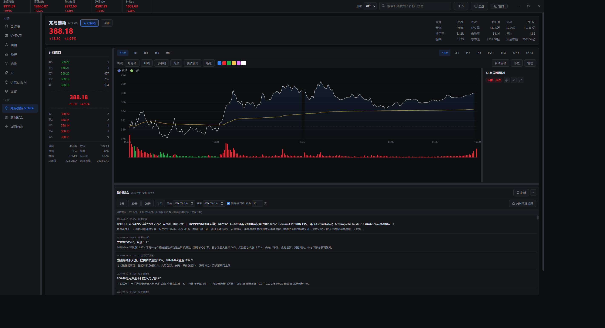
*分时图：价格线 + 均价线 + 昨收*

### K 线多周期

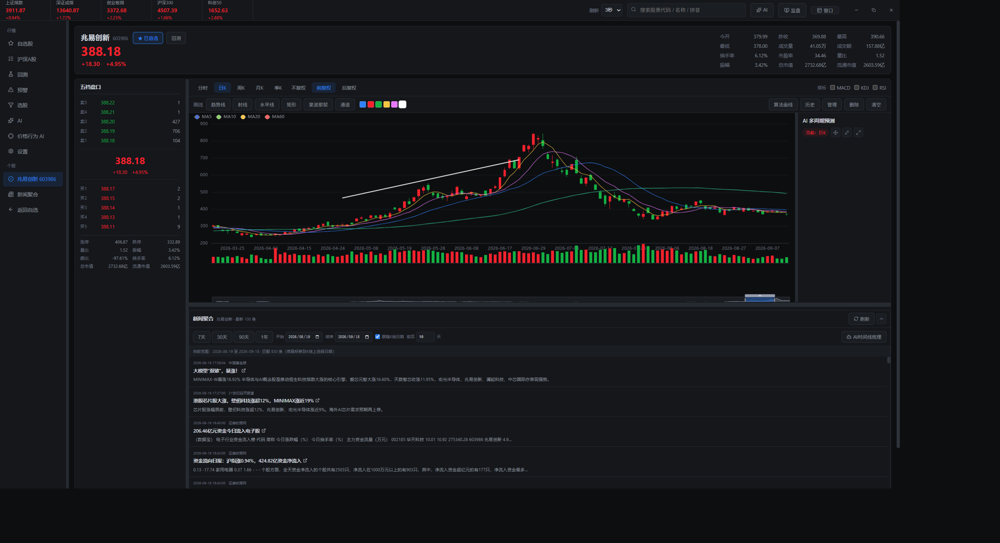
*日 K：蜡烛 + MA + 五档盘口 + 画线 + 新闻聚合*

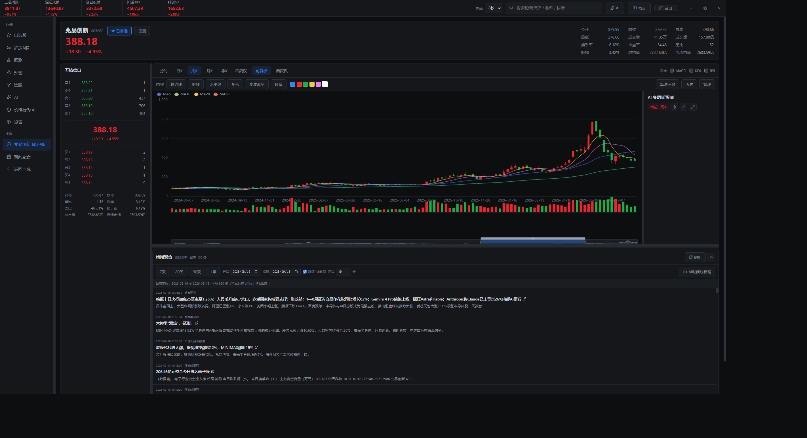
*周 K：本地日线聚合*

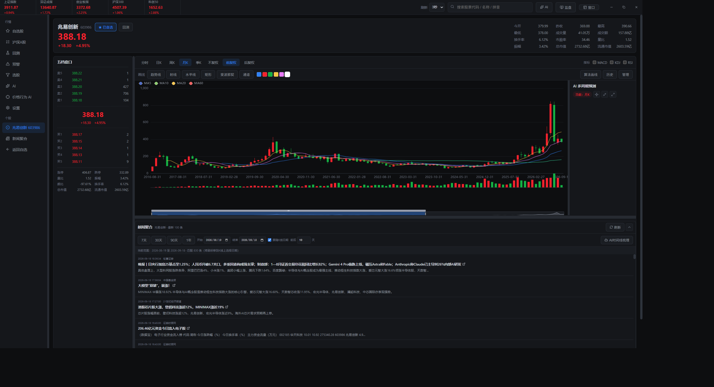
*月 K：长周期定位*

### 工具

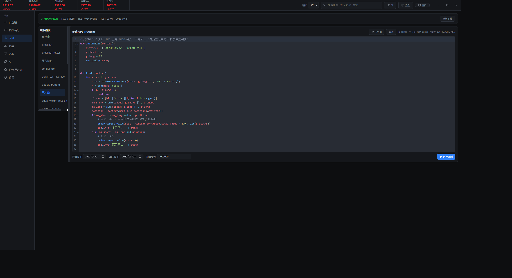
*回测编辑器：策略模板 + CodeMirror Python*

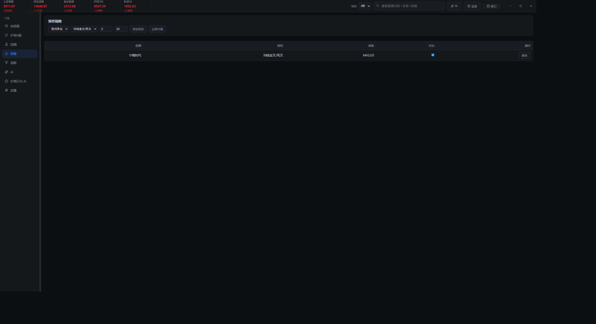
*预警规则：均线金叉死叉，立即扫描*

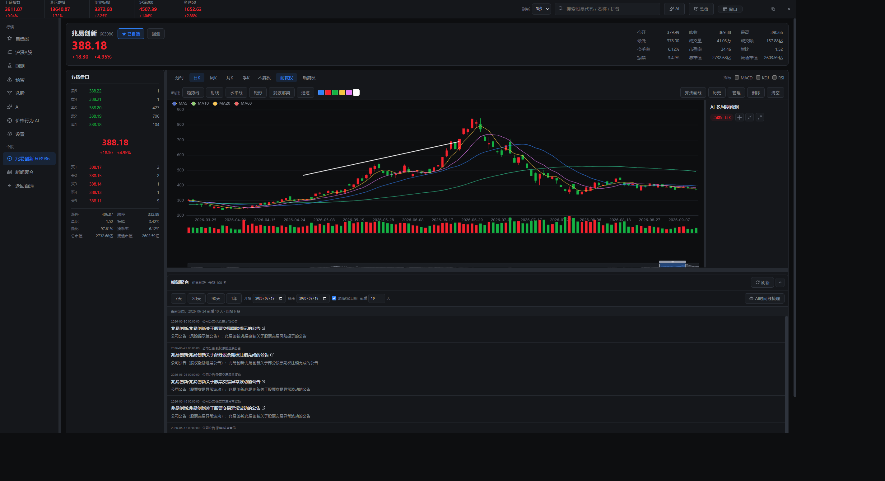
*K 线画线：趋势线拖拽，自动保存*

### AI 与设置

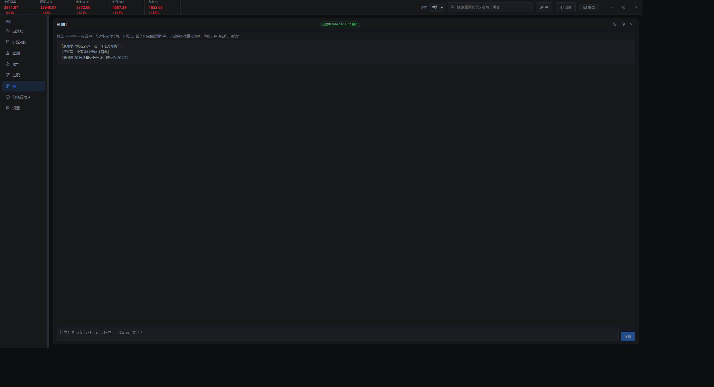
*AI 助手独立页：读行情 / 写策略 / 选股*

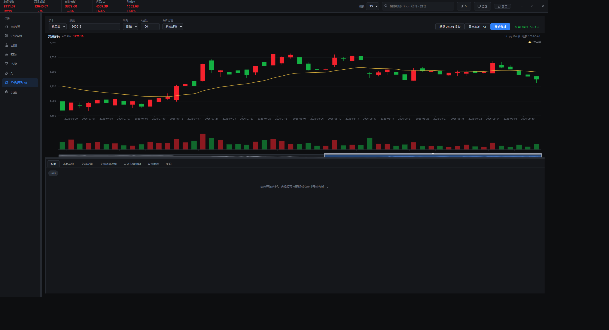
*价格行为 AI：贵州茅台 600519 日线 + EMA20 + 多阶段分析*

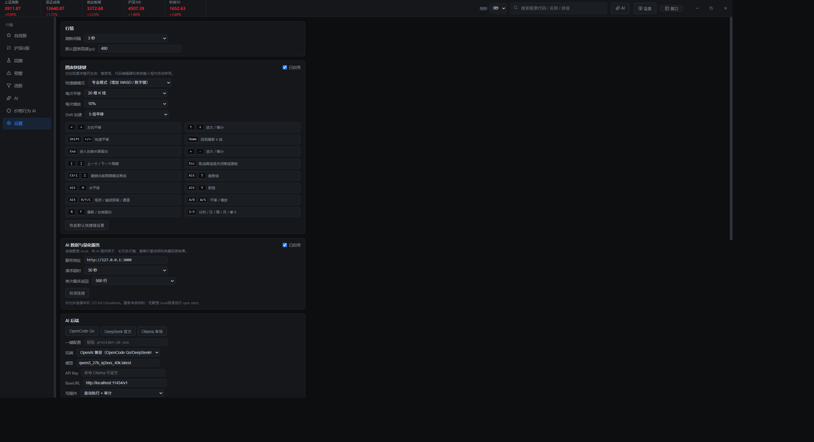
*全局设置：行情刷新 / 图表快捷键 / AI 后端配置*

### 聚宽服务网页

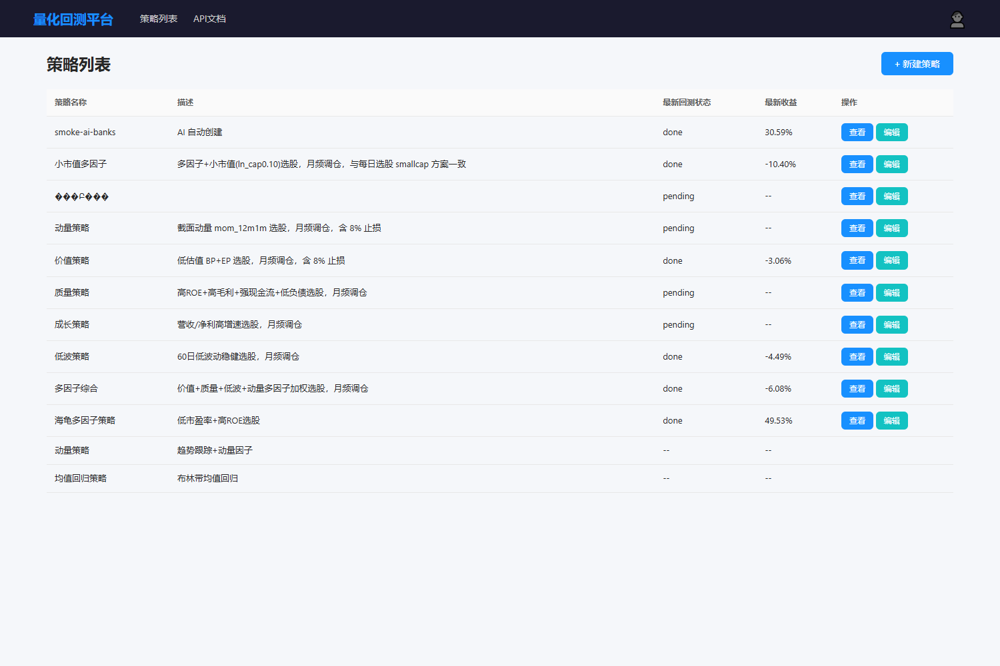
*策略列表：12 个因子策略*

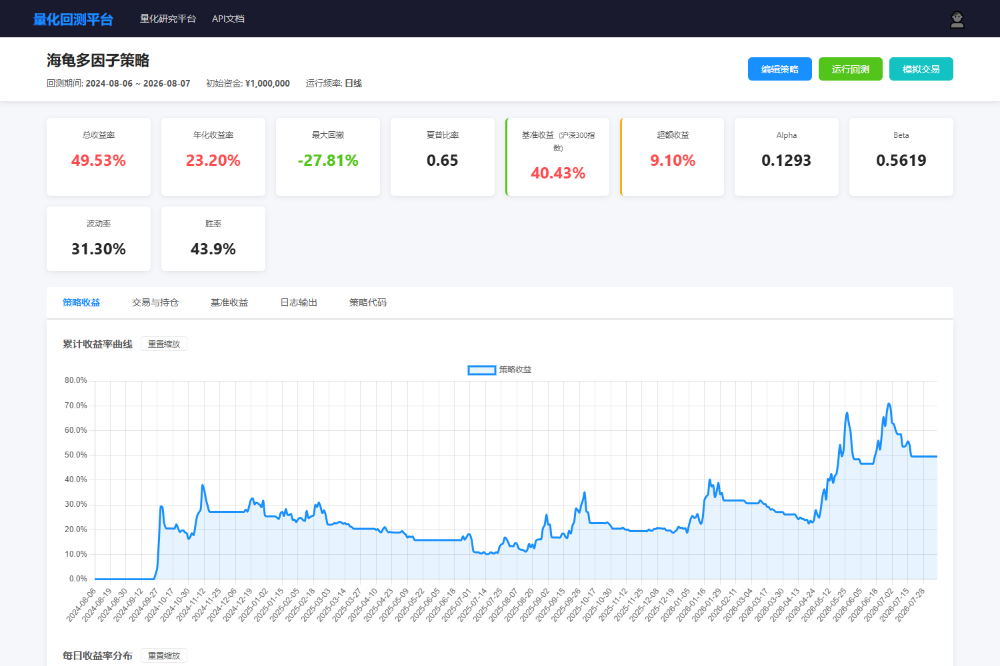
*海龟多因子回测详情：总收益 49.53% / 年化 23.20% / 夏普 0.65*

## 核心目录

| 目录                           | 用途                            |
| ---------------------------- | ----------------------------- |
| `apps/desktop`               | LocalStock Electron/React 桌面端 |
| `services/joinquant-local`   | 聚宽兼容数据、因子和回测服务                |
| `data/market`                | 唯一权威行情数据库                     |
| `data/runtime`               | 桌面配置、回测结果和运行数据                |
| `data/snapshots`             | 迁移时的只读运行资料快照                  |
| `knowledge/strategy-library` | AI 策略知识库                      |
| `knowledge/conversations`    | 历史对话积累                        |
| `knowledge/project-history`  | 原测试证据和 Git 历史元数据              |
| `docs/migration`             | 架构、迁移清单和验证记录                  |
| `tools`                      | 统一环境、启动和验证脚本                  |

旧目录保持不动，不再作为后续开发入口。
