# 每日选股报告 · 2026-08-12

> 方案：**smallcap** · 权重 账面市值比 0.30 + 盈余收益率 0.20 + 净资产收益率 0.15 + 毛利率 0.10 + 现金流/净利 0.10 + 60日波动 0.15 + 总市值(ln) 0.10 · 选 top-50 · 等权持仓（建议月频调仓）
> 历史验证 2018-2026（含交易成本）：总收益 **+12.8%** · 夏普 +0.02 · 最大回撤 -27.6%
> 生成：2026-08-12 21:31 · 数据截至 2026-08-11

## 一、市场概况

### 1.1 主要指数表现

| 指数 | 收盘 | 涨跌幅 |
|---|---|---|

### 1.2 市场广度

- 全市场 **5271 只**：上涨 **1567** / 下跌 **3545** / 平盘 159
- 总成交额 ≈ **22743 亿元**

- 当日可交易股票池（剔除 ST/涨跌停/停牌/次新/B股/北交所/金融股）：**4873 只**
- 打分因子：`smallcap` 权重因子共 7 个

## 二、选股方案与方法

- 模型：多因子截面打分。每因子先 [1%,99%] 缩尾去极端 → z-score 标准化 → 乘方向与权重加权求和 → 取 top-50 等权。
- 权重：账面市值比 0.3、盈余收益率 0.2、净资产收益率 0.15、毛利率 0.1、现金流/净利 0.1、60日波动 0.15、总市值(ln) 0.1（研究管线 `validate_daily_schemes.py` 历史验证选定）。
- 无未来函数：基本面用「报告期 + 4 个月披露滞后」；动量 skip 最近 20 交易日；股票池剔除 ST/涨跌停/停牌/次新(<120日)/B股/北交所/金融股。

### 2.1 因子定义与公式

> 打分公式：`综合得分 = Σ wᵢ × 方向ᵢ × z-score(缩尾[1%,99%] 因子ᵢ)`，缺失因子贡献 0。

| 因子 | 方向 | 权重 | 公式/定义 | 数据源 |
|---|---|---|---|---|
| 账面市值比（bp） | 1（越大越好） | 0.30 | 净资产(合并A003000000) / 总市值(元)（账面市值比） | fs_combas+price |
| 盈余收益率（ep_ttm） | 1（越大越好） | 0.20 | TTM归母净利润 / 总市值(元)（盈余收益率） | fs_comins+price |
| 净资产收益率（roe_ttm） | 1（越大越好） | 0.15 | TTM净利润 / 平均净资产 | fs_comins+fs_combas |
| 毛利率（gross_margin） | 1（越大越好） | 0.10 | (收入-营业总成本)/收入 | fs_comins |
| 现金流/净利（op_cf_ratio） | 1（越大越好） | 0.10 | 经营现金流净额/净利润 | fs_comscfd+fs_comins |
| 60日波动（vol_60d） | -1（越小越好） | 0.15 | 60日日收益率标准差，年化×√252 | stock_daily |
| 总市值(ln)（ln_cap） | -1（越小越好） | 0.10 | ln(推算总市值, 元) | stock_daily |

- 选股数：top-50 等权（建议月频调仓）；方向由 `factor_registry.json` 统一管理。

## 三、今日 Top-50 名单

> PE/PB 为按盈余收益率(ep_ttm)/账面市值比(bp)换算的**估算值**，仅供参考；baostock 段市值用参考股本×收盘推算，个别票 PE/PB 可能失真。

| 排名 | 代码 | 名称 | 收盘价 | PE(估) | PB(估) | 综合得分 | 账面市值比 | 盈余收益率 | 净资产收益率 | 毛利率 | 现金流/净利 | 60日波动 | 总市值(ln) |
|---|---|---|---|---|---|---|---|---|---|---|---|---|---|
| 1 | 600269 | 赣粤高速 | 3.8300 | 7.9 | 0.5 | 2.12 | 2.2078 | 0.1259 | 0.0570 | 40.8% | 209.7% | 25.7% | 22.9143 |
| 2 | 000726 | 鲁泰A | 5.9300 | 6.5 | 0.4 | 2.08 | 2.8141 | 0.1536 | 0.0546 | 7.3% | 172.4% | 22.2% | 21.9781 |
| 3 | 600639 | 浦东金桥 | 9.5300 | 7.8 | 0.5 | 1.94 | 1.8588 | 0.1287 | 0.0692 | 11.7% | 379.8% | 20.7% | 22.8155 |
| 4 | 600502 | 安徽建工 | 4.5900 | 5.1 | 0.4 | 1.89 | 2.6908 | 0.1965 | 0.0730 | 3.1% | -868.9% | 28.6% | 22.7875 |
| 5 | 000498 | 山东路桥 | 4.9800 | 3.6 | 0.3 | 1.87 | 3.4645 | 0.2775 | 0.0801 | 3.6% | -1839.7% | 20.6% | 22.7685 |
| 6 | 600694 | 大商股份 | 14.5100 | 10.0 | 0.5 | 1.86 | 1.8303 | 0.1001 | 0.0547 | 19.5% | 193.2% | 26.7% | 22.3320 |
| 7 | 600938 | 中国海油 | 33.7000 | 0.8 | 0.1 | 1.86 | 8.3076 | 1.2372 | 0.1489 | 44.8% | 140.9% | 42.6% | 25.3360 |
| 8 | 000900 | 现代投资 | 3.6700 | 14.1 | 0.4 | 1.85 | 2.2774 | 0.0707 | 0.0310 | 15.2% | 24.9% | 19.9% | 22.4407 |
| 9 | 600020 | 中原高速 | 3.7500 | 13.2 | 0.5 | 1.85 | 1.8939 | 0.0759 | 0.0401 | 33.2% | 119.8% | 22.2% | 22.8548 |
| 10 | 600941 | 中国移动 | 96.4200 | 0.6 | 0.1 | 1.84 | 16.3452 | 1.5602 | 0.0955 | 13.3% | 243.5% | 19.0% | 25.1897 |
| 11 | 000544 | 中原环保 | 7.4100 | 6.8 | 0.6 | 1.81 | 1.5792 | 0.1473 | 0.0933 | 36.4% | -111.9% | 21.1% | 22.7005 |
| 12 | 600820 | 隧道股份 | 5.4400 | 7.8 | 0.4 | 1.77 | 2.5806 | 0.1275 | 0.0494 | 0.2% | -1674.8% | 21.3% | 23.5626 |
| 13 | 601107 | 四川成渝 | 5.5700 | 8.0 | 0.6 | 1.75 | 1.7074 | 0.1256 | 0.0736 | 23.1% | 197.6% | 32.8% | 23.2120 |
| 14 | 600548 | 深高速 | 8.2800 | 12.6 | 0.5 | 1.75 | 1.8534 | 0.0796 | 0.0430 | 25.8% | 201.9% | 21.0% | 23.4195 |
| 15 | 600874 | 创业环保 | 5.5900 | 7.8 | 0.7 | 1.74 | 1.5318 | 0.1285 | 0.0839 | 28.9% | -44.9% | 19.0% | 22.6516 |
| 16 | 601811 | 新华文轩 | 11.9100 | 6.0 | 0.6 | 1.73 | 1.6494 | 0.1660 | 0.1006 | 10.0% | -66.4% | 23.0% | 22.9673 |
| 17 | 600035 | 楚天高速 | 3.4300 | 11.0 | 0.6 | 1.73 | 1.6480 | 0.0910 | 0.0552 | 27.4% | 175.9% | 17.5% | 22.4321 |
| 18 | 000028 | 国药一致 | 20.6500 | 9.1 | 0.5 | 1.72 | 1.8860 | 0.1093 | 0.0580 | 2.2% | -1021.1% | 25.9% | 23.0278 |
| 19 | 600585 | 海螺水泥 | 17.6200 | 9.1 | 0.4 | 1.72 | 2.7503 | 0.1103 | 0.0401 | 8.5% | 22.2% | 24.3% | 24.9785 |
| 20 | 600704 | 物产中大 | 4.8900 | 7.0 | 0.5 | 1.68 | 1.8250 | 0.1428 | 0.0782 | 1.5% | -797.1% | 22.0% | 23.9536 |
| 21 | 601186 | 中国铁建 | 6.1200 | 4.0 | 0.2 | 1.66 | 4.9652 | 0.2501 | 0.0504 | 2.6% | -1424.6% | 19.1% | 24.9775 |
| 22 | 601318 | 中国平安 | 52.5500 | 4.2 | 0.6 | 1.66 | 1.8178 | 0.2370 | 0.1304 | 25.4% | 523.8% | 31.6% | 27.0515 |
| 23 | 601800 | 中国交建 | 6.0400 | 5.3 | 0.2 | 1.65 | 4.3771 | 0.1869 | 0.0427 | 3.8% | -1344.3% | 23.7% | 24.9945 |
| 24 | 601668 | 中国建筑 | 4.5200 | 4.9 | 0.4 | 1.65 | 2.7043 | 0.2031 | 0.0751 | 3.9% | -554.6% | 17.7% | 25.9531 |
| 25 | 000932 | 华菱钢铁 | 3.6600 | 11.2 | 0.4 | 1.62 | 2.2264 | 0.0896 | 0.0402 | 0.4% | -835.9% | 28.4% | 23.9454 |
| 26 | 600104 | 上汽集团 | 10.3000 | 11.7 | 0.4 | 1.61 | 2.5380 | 0.0854 | 0.0336 | 2.3% | 1057.0% | 24.1% | 25.4973 |
| 27 | 600717 | 天津港 | 4.2000 | 11.5 | 0.6 | 1.61 | 1.6819 | 0.0871 | 0.0518 | 22.8% | 107.3% | 25.8% | 23.2210 |
| 28 | 601333 | 广深铁路 | 2.9500 | 10.8 | 0.6 | 1.61 | 1.7354 | 0.0922 | 0.0531 | 10.6% | -6.5% | 20.2% | 23.5371 |
| 29 | 000501 | 武商集团 | 7.2300 | 34.5 | 0.5 | 1.61 | 1.9849 | 0.0290 | 0.0146 | 8.4% | 379.1% | 31.3% | 22.4388 |
| 30 | 000709 | 河钢股份 | 2.1100 | 20.0 | 0.4 | 1.61 | 2.7302 | 0.0501 | 0.0183 | 0.3% | 1069.8% | 26.5% | 23.8057 |
| 31 | 600051 | 宁波联合 | 6.2200 | 25.5 | 0.6 | 1.59 | 1.7686 | 0.0392 | 0.0222 | 0.2% | 1117.3% | 31.6% | 21.3827 |
| 32 | 002061 | 浙江交科 | 3.5200 | 9.8 | 0.6 | 1.58 | 1.7032 | 0.1021 | 0.0600 | 3.2% | -778.0% | 24.7% | 22.9654 |
| 33 | 600528 | 中铁工业 | 7.1300 | 11.6 | 0.6 | 1.58 | 1.7682 | 0.0864 | 0.0488 | 4.5% | -226.2% | 21.5% | 23.4858 |
| 34 | 601390 | 中国中铁 | 4.4700 | 4.3 | 0.2 | 1.58 | 4.0888 | 0.2319 | 0.0567 | 2.7% | -1982.8% | 25.6% | 25.2400 |
| 35 | 601607 | 上海医药 | 16.6900 | 8.0 | 0.6 | 1.55 | 1.6605 | 0.1248 | 0.0752 | 3.2% | -71.2% | 20.2% | 24.5639 |
| 36 | 600064 | 南京高科 | 7.5700 | 7.4 | 0.7 | 1.54 | 1.5075 | 0.1348 | 0.0894 | -0.1% | 28.0% | 22.4% | 23.2958 |
| 37 | 600827 | 百联股份 | 7.8000 | 10.2 | 0.6 | 1.54 | 1.6444 | 0.0983 | 0.0598 | 2.7% | 133.1% | 27.0% | 23.2502 |
| 38 | 000560 | 我爱我家 | 2.2200 | — | 0.6 | 1.53 | 1.7749 | -0.0186 | -0.0105 | -8.7% | 10729.9% | 36.2% | 22.3775 |
| 39 | 600033 | 福建高速 | 3.5100 | 10.1 | 0.8 | 1.52 | 1.3070 | 0.0994 | 0.0761 | 51.6% | 221.1% | 22.1% | 22.9884 |
| 40 | 601669 | 中国电建 | 4.7700 | 8.8 | 0.5 | 1.51 | 2.0626 | 0.1135 | 0.0550 | 2.3% | -2261.2% | 29.2% | 25.1320 |
| 41 | 600508 | 上海能源 | 8.8400 | 33.7 | 0.5 | 1.49 | 1.9966 | 0.0297 | 0.0149 | 5.9% | 399.8% | 45.5% | 22.5778 |
| 42 | 600017 | 日照港 | 2.6900 | 18.9 | 0.6 | 1.49 | 1.6998 | 0.0530 | 0.0312 | 7.0% | 357.9% | 22.3% | 22.8363 |
| 43 | 600011 | 华能国际 | 6.9800 | 5.5 | 0.6 | 1.48 | 1.7523 | 0.1813 | 0.1035 | 12.1% | 277.4% | 48.5% | 25.0640 |
| 44 | 000789 | 万年青 | 4.1200 | — | 0.5 | 1.48 | 2.0097 | -0.0081 | -0.0040 | -5.9% | 464.1% | 25.7% | 21.9127 |
| 45 | 000589 | 贵州轮胎 | 4.3100 | 9.1 | 0.7 | 1.48 | 1.3718 | 0.1096 | 0.0799 | 6.8% | 208.3% | 23.3% | 22.6254 |
| 46 | 000885 | 城发环境 | 12.8500 | 6.5 | 0.8 | 1.47 | 1.1869 | 0.1548 | 0.1304 | 26.2% | 100.9% | 21.1% | 22.8336 |
| 47 | 600057 | 厦门象屿 | 6.3100 | 13.7 | 0.5 | 1.47 | 1.8986 | 0.0728 | 0.0384 | 1.7% | -1478.6% | 28.5% | 23.6094 |
| 48 | 002394 | 联发股份 | 9.9400 | 13.3 | 0.7 | 1.47 | 1.3484 | 0.0752 | 0.0558 | 7.3% | 3922.9% | 48.4% | 21.8919 |
| 49 | 603018 | 华设集团 | 5.3200 | 12.8 | 0.7 | 1.47 | 1.4982 | 0.0782 | 0.0522 | 9.4% | -160.4% | 25.6% | 22.0146 |
| 50 | 000090 | 天健集团 | 3.5000 | 40.9 | 0.5 | 1.47 | 2.2082 | 0.0244 | 0.0111 | -0.2% | 685.9% | 44.5% | 22.6012 |

## 四、组合画像（top-50 统计）

| 维度 | 数值 | 含义 |
|---|---|---|
| 账面市值比平均百分位 | **99%** | 组合在该因子上相对全市场的位置（越大越好） |
| 盈余收益率平均百分位 | **92%** | 组合在该因子上相对全市场的位置（越大越好） |
| 净资产收益率平均百分位 | **61%** | 组合在该因子上相对全市场的位置（越大越好） |
| 毛利率平均百分位 | **62%** | 组合在该因子上相对全市场的位置（越大越好） |
| 现金流/净利平均百分位 | **51%** | 组合在该因子上相对全市场的位置（越大越好） |
| 60日波动平均百分位 | **93%** | 组合在该因子上相对全市场的位置（越大越好） |
| 总市值(ln)平均百分位 | **33%** | 组合在该因子上相对全市场的位置（越大越好） |
| PE(中位数, 估) | 9.1 | 组合估值水平 |
| PB(中位数, 估) | 0.5 | 组合市净率水平 |
| 市值(中位数) | 100.2 亿元 | 组合规模风格 |

## 五、前 10 入选理由（因子百分位）

> 百分位为当日全市场该因子的分布位置（0-100，**已按因子方向归一**，越大越好）。

### 1. **赣粤高速**（600269，收盘 3.8300）

- 账面市值比 2.2078（权重 0.30，全市场前 99%）
- 盈余收益率 0.1259（权重 0.20，全市场前 99%）
- 净资产收益率 0.0570（权重 0.15，全市场前 62%）
- 毛利率 40.8%（权重 0.10，全市场前 98%）
- 现金流/净利 209.7%（权重 0.10，全市场前 74%）
- 60日波动 25.7%（权重 0.15，全市场前 97%）
- 总市值(ln) 22.9143（权重 0.10，全市场前 38%）

### 2. **鲁泰A**（000726，收盘 5.9300）

- 账面市值比 2.8141（权重 0.30，全市场前 100%）
- 盈余收益率 0.1536（权重 0.20，全市场前 100%）
- 净资产收益率 0.0546（权重 0.15，全市场前 60%）
- 毛利率 7.3%（权重 0.10，全市场前 62%）
- 现金流/净利 172.4%（权重 0.10，全市场前 70%）
- 60日波动 22.2%（权重 0.15，全市场前 99%）
- 总市值(ln) 21.9781（权重 0.10，全市场前 76%）

### 3. **浦东金桥**（600639，收盘 9.5300）

- 账面市值比 1.8588（权重 0.30，全市场前 99%）
- 盈余收益率 0.1287（权重 0.20，全市场前 99%）
- 净资产收益率 0.0692（权重 0.15，全市场前 68%）
- 毛利率 11.7%（权重 0.10，全市场前 75%）
- 现金流/净利 379.8%（权重 0.10，全市场前 85%）
- 60日波动 20.7%（权重 0.15，全市场前 99%）
- 总市值(ln) 22.8155（权重 0.10，全市场前 41%）

### 4. **安徽建工**（600502，收盘 4.5900）

- 账面市值比 2.6908（权重 0.30，全市场前 100%）
- 盈余收益率 0.1965（权重 0.20，全市场前 100%）
- 净资产收益率 0.0730（权重 0.15，全市场前 70%）
- 毛利率 3.1%（权重 0.10，全市场前 46%）
- 现金流/净利 -868.9%（权重 0.10，全市场前 9%）
- 60日波动 28.6%（权重 0.15，全市场前 94%）
- 总市值(ln) 22.7875（权重 0.10，全市场前 42%）

### 5. **山东路桥**（000498，收盘 4.9800）

- 账面市值比 3.4645（权重 0.30，全市场前 100%）
- 盈余收益率 0.2775（权重 0.20，全市场前 100%）
- 净资产收益率 0.0801（权重 0.15，全市场前 74%）
- 毛利率 3.6%（权重 0.10，全市场前 48%）
- 现金流/净利 -1839.7%（权重 0.10，全市场前 4%）
- 60日波动 20.6%（权重 0.15，全市场前 99%）
- 总市值(ln) 22.7685（权重 0.10，全市场前 43%）

### 6. **大商股份**（600694，收盘 14.5100）

- 账面市值比 1.8303（权重 0.30，全市场前 99%）
- 盈余收益率 0.1001（权重 0.20，全市场前 98%）
- 净资产收益率 0.0547（权重 0.15，全市场前 60%）
- 毛利率 19.5%（权重 0.10，全市场前 88%）
- 现金流/净利 193.2%（权重 0.10，全市场前 72%）
- 60日波动 26.7%（权重 0.15，全市场前 96%）
- 总市值(ln) 22.3320（权重 0.10，全市场前 60%）

### 7. **中国海油**（600938，收盘 33.7000）

- 账面市值比 8.3076（权重 0.30，全市场前 100%）
- 盈余收益率 1.2372（权重 0.20，全市场前 100%）
- 净资产收益率 0.1489（权重 0.15，全市场前 93%）
- 毛利率 44.8%（权重 0.10，全市场前 99%）
- 现金流/净利 140.9%（权重 0.10，全市场前 66%）
- 60日波动 42.6%（权重 0.15，全市场前 69%）
- 总市值(ln) 25.3360（权重 0.10，全市场前 3%）

### 8. **现代投资**（000900，收盘 3.6700）

- 账面市值比 2.2774（权重 0.30，全市场前 99%）
- 盈余收益率 0.0707（权重 0.20，全市场前 93%）
- 净资产收益率 0.0310（权重 0.15，全市场前 45%）
- 毛利率 15.2%（权重 0.10，全市场前 83%）
- 现金流/净利 24.9%（权重 0.10，全市场前 45%）
- 60日波动 19.9%（权重 0.15，全市场前 100%）
- 总市值(ln) 22.4407（权重 0.10，全市场前 55%）

### 9. **中原高速**（600020，收盘 3.7500）

- 账面市值比 1.8939（权重 0.30，全市场前 99%）
- 盈余收益率 0.0759（权重 0.20，全市场前 94%）
- 净资产收益率 0.0401（权重 0.15，全市场前 51%）
- 毛利率 33.2%（权重 0.10，全市场前 96%）
- 现金流/净利 119.8%（权重 0.10，全市场前 62%）
- 60日波动 22.2%（权重 0.15，全市场前 99%）
- 总市值(ln) 22.8548（权重 0.10，全市场前 40%）

### 10. **中国移动**（600941，收盘 96.4200）

- 账面市值比 16.3452（权重 0.30，全市场前 100%）
- 盈余收益率 1.5602（权重 0.20，全市场前 100%）
- 净资产收益率 0.0955（权重 0.15，全市场前 80%）
- 毛利率 13.3%（权重 0.10，全市场前 79%）
- 现金流/净利 243.5%（权重 0.10，全市场前 77%）
- 60日波动 19.0%（权重 0.15，全市场前 100%）
- 总市值(ln) 25.1897（权重 0.10，全市场前 4%）

## 六、口径与风险提示

- 因子无未来函数：基本面用「报告期 + 4 个月滞后」；动量 skip 最近 20 交易日；股票池剔除 ST/涨跌停/次新/金融股。
- **动量在 A 股 2018-2026 方向反向**，本方案不含动量因子；成长因子不显著，仅作参考。
- 小市值增强（ln_cap）是 A 股 2018-2026 有效因子，但小市值波动大、流动性差，请控制单票仓位。
- **名单是「当日截面快照」，不构成调仓指令**。建议月度调仓、等权持有，避免高频换手吞噬收益；单票止损参考 -8%。
- 数据源：CSMAR 全量 + baostock 每日增量；本地因子数据可能落后 1 天（baostock 滞后），实时行情请见 Claude 点评补充。

## 七、基本面与估值快照

> 估值：腾讯行情实时（PE_TTM/PB/总市值，数据日期 2026-08-11）；财务：CSMAR 最新报告期（4 个月披露滞后）。 可与此前因子换算的 PE/PB(估) 互相印证。

| 代码 | 名称 | 现价 | 涨跌% | PE_TTM | PB | 总市值(亿) | 盈余收益率 | ROE_TTM | 毛利率 | 现金流/净利 |
|---|---|---|---|---|---|---|---|---|---|---|
| 600269 | 赣粤高速 | 3.8 | -0.8% | 12.3 | 0.5 | 88.8 | 0.126 | 0.057 | 40.8% | 209.7% |
| 000726 | 鲁泰A | 5.9 | 0.0% | 9.0 | 0.5 | 35.0 | 0.154 | 0.055 | 7.3% | 172.4% |
| 600639 | 浦东金桥 | 9.7 | 1.5% | 10.4 | 0.7 | 82.2 | 0.129 | 0.069 | 11.7% | 379.8% |
| 600502 | 安徽建工 | 4.5 | -1.1% | 5.0 | 0.7 | 77.9 | 0.196 | 0.073 | 3.1% | -868.9% |
| 000498 | 山东路桥 | 5.0 | -0.2% | 3.6 | 0.5 | 72.0 | 0.278 | 0.080 | 3.6% | -1839.7% |
| 600694 | 大商股份 | 14.6 | 0.4% | 11.0 | 0.6 | 55.2 | 0.100 | 0.055 | 19.5% | 193.2% |
| 600938 | 中国海油 | 32.9 | -2.5% | 12.5 | 1.9 | 982.2 | 1.237 | 0.149 | 44.8% | 140.9% |
| 000900 | 现代投资 | 3.7 | 0.8% | 14.2 | 0.5 | 56.2 | 0.071 | 0.031 | 15.2% | 24.9% |
| 600020 | 中原高速 | 3.8 | 0.8% | 13.3 | 0.7 | 85.0 | 0.076 | 0.040 | 33.2% | 119.8% |
| 600941 | 中国移动 | 96.2 | -0.2% | 15.4 | 1.5 | 868.6 | 1.560 | 0.095 | 13.3% | 243.5% |
| 000544 | 中原环保 | 7.4 | -0.3% | 6.8 | 0.8 | 72.0 | 0.147 | 0.093 | 36.4% | -111.9% |
| 600820 | 隧道股份 | 5.5 | 0.4% | 7.9 | 0.5 | 171.7 | 0.128 | 0.049 | 0.2% | -1674.8% |
| 601107 | 四川成渝 | 5.5 | -0.9% | 11.4 | 1.0 | 119.4 | 0.126 | 0.074 | 23.1% | 197.6% |
| 600548 | 深高速 | 8.3 | 0.7% | 17.9 | 0.9 | 143.0 | 0.080 | 0.043 | 25.8% | 201.9% |
| 600874 | 创业环保 | 5.6 | 0.5% | 10.0 | 0.9 | 69.2 | 0.129 | 0.084 | 28.9% | -44.9% |
| 601811 | 新华文轩 | 11.9 | 0.2% | 9.4 | 1.0 | 94.5 | 0.166 | 0.101 | 10.0% | -66.4% |
| 600035 | 楚天高速 | 3.5 | 0.6% | 11.1 | 0.6 | 55.5 | 0.091 | 0.055 | 27.4% | 175.9% |
| 000028 | 国药一致 | 20.4 | -1.2% | 11.4 | 0.7 | 107.3 | 0.109 | 0.058 | 2.2% | -1021.1% |
| 600585 | 海螺水泥 | 17.7 | 0.5% | 12.0 | 0.5 | 704.0 | 0.110 | 0.040 | 8.5% | 22.2% |
| 600704 | 物产中大 | 4.9 | 0.4% | 7.0 | 0.6 | 253.9 | 0.143 | 0.078 | 1.5% | -797.1% |
| 601186 | 中国铁建 | 6.1 | 0.0% | 4.7 | 0.3 | 704.0 | 0.250 | 0.050 | 2.6% | -1424.6% |
| 601318 | 中国平安 | 52.6 | 0.1% | 7.2 | 1.0 | 5607.2 | 0.237 | 0.130 | 25.4% | 523.8% |
| 601800 | 中国交建 | 6.0 | 0.0% | 7.3 | 0.3 | 708.1 | 0.187 | 0.043 | 3.8% | -1344.3% |
| 601668 | 中国建筑 | 4.5 | -0.4% | 4.9 | 0.4 | 1859.4 | 0.203 | 0.075 | 3.9% | -554.6% |
| 000932 | 华菱钢铁 | 3.7 | 1.1% | 11.3 | 0.5 | 253.6 | 0.090 | 0.040 | 0.4% | -835.9% |
| 600104 | 上汽集团 | 10.4 | 0.7% | 11.8 | 0.4 | 1192.1 | 0.085 | 0.034 | 2.3% | 1057.0% |
| 600717 | 天津港 | 4.2 | 0.9% | 11.6 | 0.6 | 122.7 | 0.087 | 0.052 | 22.8% | 107.3% |
| 601333 | 广深铁路 | 2.9 | -0.3% | 13.6 | 0.7 | 166.2 | 0.092 | 0.053 | 10.6% | -6.5% |
| 000501 | 武商集团 | 7.3 | 1.1% | 34.9 | 0.5 | 56.2 | 0.029 | 0.015 | 8.4% | 379.1% |
| 000709 | 河钢股份 | 2.1 | 1.4% | 20.2 | 0.4 | 221.2 | 0.050 | 0.018 | 0.3% | 1069.8% |
| 600051 | 宁波联合 | 6.3 | 0.6% | 25.7 | 0.6 | 19.5 | 0.039 | 0.022 | 0.2% | 1117.3% |
| 002061 | 浙江交科 | 3.5 | 0.3% | 9.7 | 0.6 | 91.8 | 0.102 | 0.060 | 3.2% | -778.0% |
| 600528 | 中铁工业 | 7.1 | 0.1% | 11.6 | 0.6 | 158.6 | 0.086 | 0.049 | 4.5% | -226.2% |
| 601390 | 中国中铁 | 4.5 | -0.5% | 5.1 | 0.3 | 904.4 | 0.232 | 0.057 | 2.7% | -1982.8% |
| 601607 | 上海医药 | 16.6 | -0.8% | 10.6 | 0.8 | 461.9 | 0.125 | 0.075 | 3.2% | -71.2% |
| 600064 | 南京高科 | 7.6 | 0.9% | 7.5 | 0.7 | 132.2 | 0.135 | 0.089 | -0.1% | 28.0% |
| 600827 | 百联股份 | 7.8 | -0.1% | 11.3 | 0.7 | 125.0 | 0.098 | 0.060 | 2.7% | 133.1% |
| 000560 | 我爱我家 | 2.3 | 5.4% | -56.6 | 0.6 | 54.7 | -0.019 | -0.010 | -8.7% | 10729.9% |
| 600033 | 福建高速 | 3.5 | 0.3% | 10.1 | 0.8 | 96.6 | 0.099 | 0.076 | 51.6% | 221.1% |
| 601669 | 中国电建 | 4.8 | -0.4% | 8.8 | 0.6 | 620.9 | 0.113 | 0.055 | 2.3% | -2261.2% |
| 600508 | 上海能源 | 8.7 | -1.5% | 46.4 | 0.7 | 88.1 | 0.030 | 0.015 | 5.9% | 399.8% |
| 600017 | 日照港 | 2.7 | -0.4% | 18.8 | 0.6 | 82.4 | 0.053 | 0.031 | 7.0% | 357.9% |
| 600011 | 华能国际 | 7.0 | -0.4% | 7.8 | 1.7 | 764.3 | 0.181 | 0.103 | 12.1% | 277.4% |
| 000789 | 万年青 | 4.2 | 1.5% | -125.7 | 0.5 | 33.3 | -0.008 | -0.004 | -5.9% | 464.1% |
| 000589 | 贵州轮胎 | 4.4 | 1.6% | 9.3 | 0.8 | 67.6 | 0.110 | 0.080 | 6.8% | 208.3% |
| 000885 | 城发环境 | 12.8 | 0.0% | 6.5 | 0.9 | 82.5 | 0.155 | 0.130 | 26.2% | 100.9% |
| 600057 | 厦门象屿 | 6.3 | 0.0% | 13.7 | 1.2 | 132.0 | 0.073 | 0.038 | 1.7% | -1478.6% |
| 002394 | 联发股份 | 10.2 | 2.4% | 13.6 | 0.8 | 32.9 | 0.075 | 0.056 | 7.3% | 3922.9% |
| 603018 | 华设集团 | 5.4 | 0.9% | 15.5 | 0.8 | 44.0 | 0.078 | 0.052 | 9.4% | -160.4% |
| 000090 | 天健集团 | 3.6 | 2.6% | 42.0 | 0.6 | 67.1 | 0.024 | 0.011 | -0.2% | 685.9% |

- top-50 估值（腾讯）：PE_TTM 中位 **11.1** · PB 中位 **0.63** · 总市值中位 **107 亿**

> 说明：腾讯 PE/PB 与因子口径不同（腾讯用其财务模型），仅作实时参考；ROE/毛利率/现金流以 CSMAR 季度为准。

## 八、技术面辅助（K线 + 布林带 + 海龟通道）

> 图为**股价 K 线**（红涨绿跌，A 股惯例）+ 布林带（MA20 ± 2σ，超买/超卖参考）+ 海龟通道（20 日唐奇安高低轨，突破上下轨为潜在趋势信号）。 **仅辅助参考，不构成买卖指令。** 数据：`stock_daily` 截至 2026-08-11。

### 1. 赣粤高速（600269）

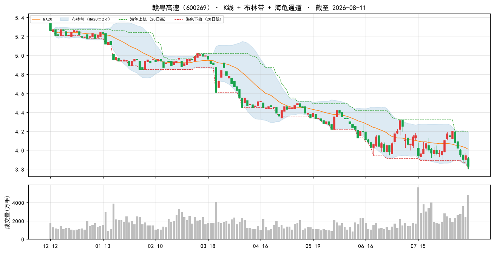

### 2. 鲁泰A（000726）

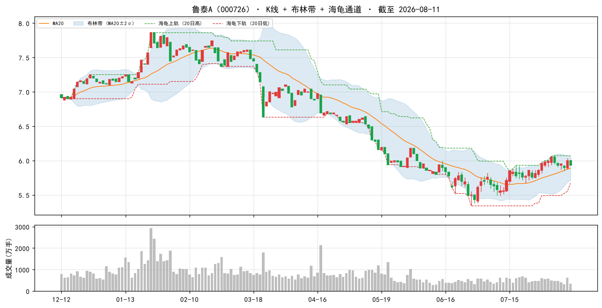

### 3. 浦东金桥（600639）

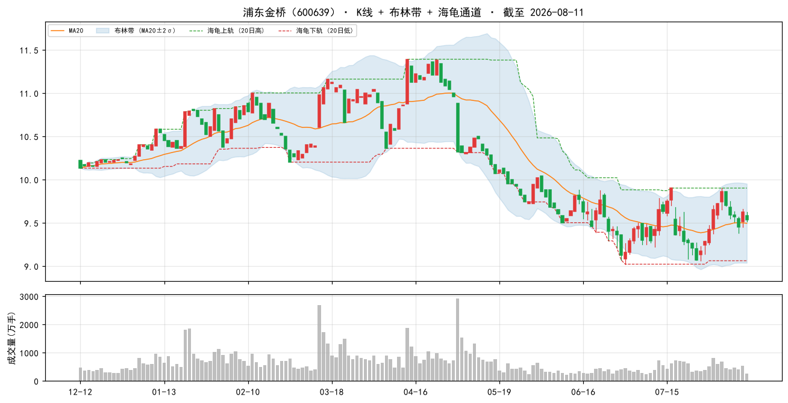

### 4. 安徽建工（600502）

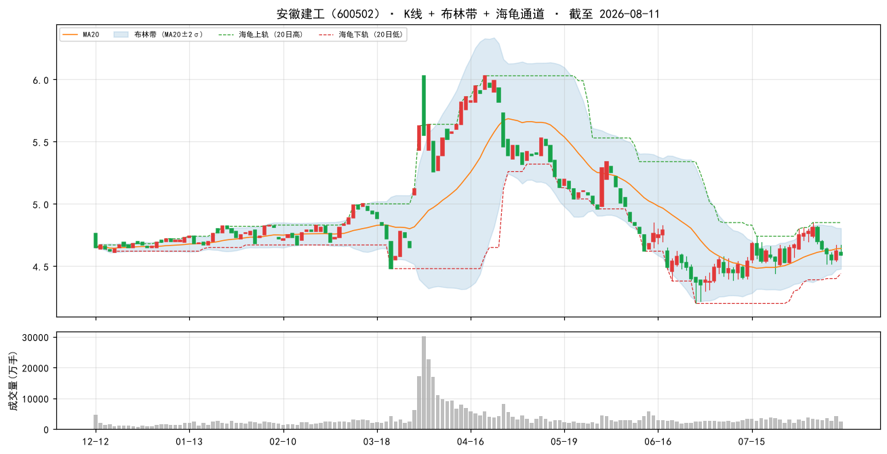

### 5. 山东路桥（000498）

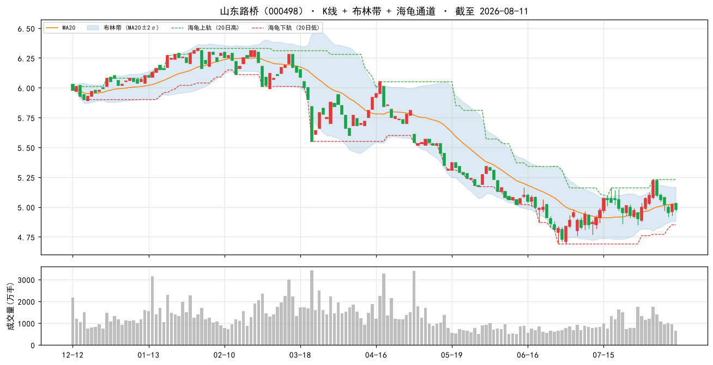

### 6. 大商股份（600694）

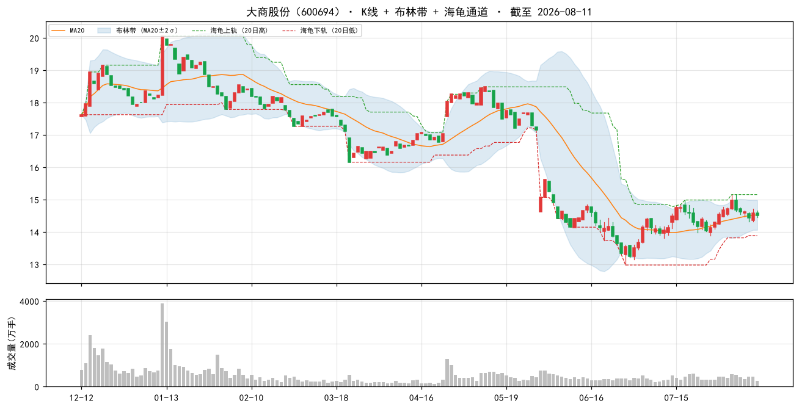

### 7. 中国海油（600938）

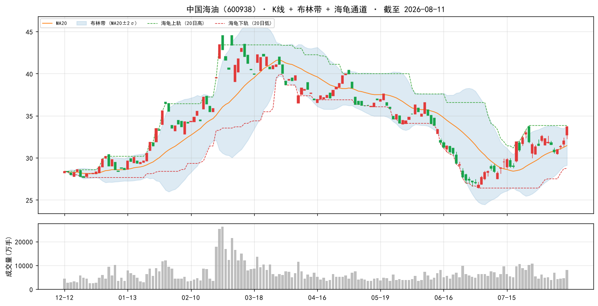

### 8. 现代投资（000900）

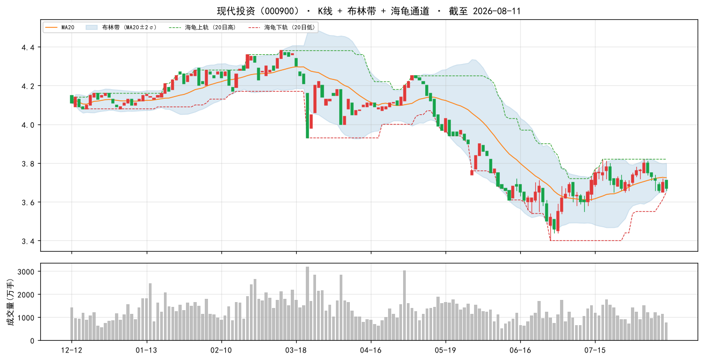

### 9. 中原高速（600020）

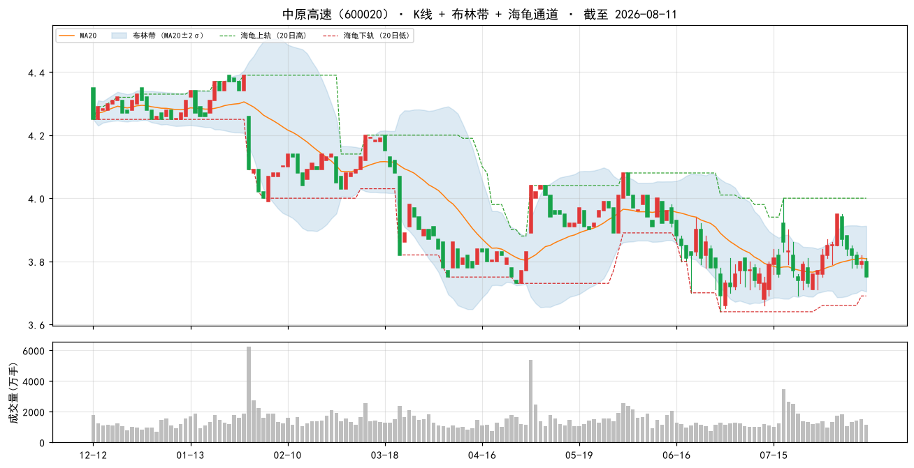

### 10. 中国移动（600941）

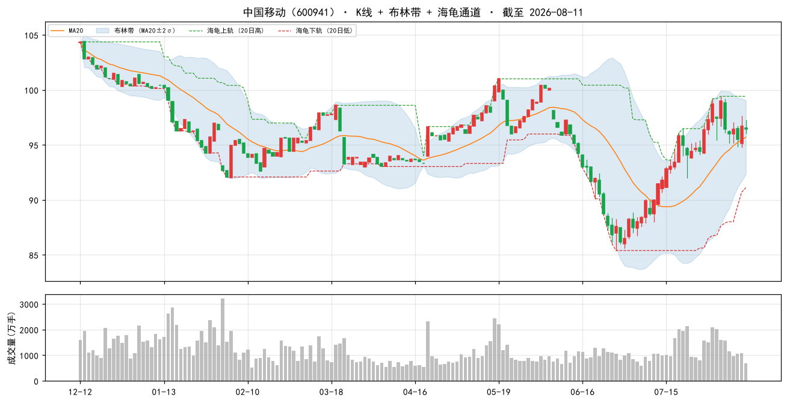

### 当日表现：top-10 vs 大盘

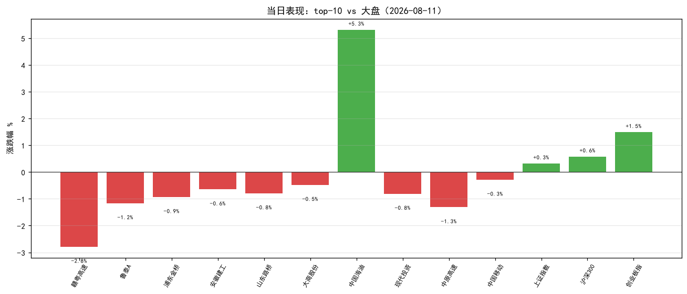

### 组合 vs 沪深300（近 60 交易日，当前名单回放近似）

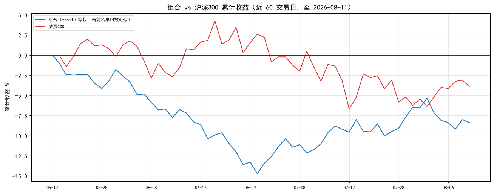

> 组合为**当前 top-10 名单**从窗口起点等权回放（非历史换手），仅作趋势参考；沪深300 用腾讯指数补齐最近两日。

## 九、因子诊断与优化建议

> 暂无完整历史窗口可追踪（需名单日早于今日且有行情）。
#### 8.2 因子 IC 诊断（近 11 周截面，因子 vs 未来 5 日收益）

| 因子 | 方向 | 近11个快照 IC | 有效快照 | 判断 |
|---|---|---|---|---|
| 账面市值比 | 1 | +0.056 | 11 | 有效 |
| 盈余收益率 | 1 | +0.039 | 11 | 有效 |
| 净资产收益率 | 1 | +0.012 | 11 | 中性（区分度弱） |
| 毛利率 | 1 | +0.016 | 11 | 中性（区分度弱） |
| 现金流/净利 | 1 | +0.013 | 11 | 中性（区分度弱） |
| 60日波动 | -1 | -0.090 | 11 | 有效 |
| 总市值(ln) | -1 | +0.011 | 11 | 中性（区分度弱） |

> IC = 因子值与未来 5 日收益的秩相关（越大越有效）；与注册表方向同号且 |IC|≥0.02 判为有效。 单因子短期 IC 波动大，仅供诊断，不构成当日调权依据。

#### 8.3 月度权重校验（research_panel.pkl 滚动）

> 面板数据截至 2026-07-31。仅作参考：**权重建议月度复核，不日更**（防过拟合）。

| 方案 | 最近37月总收益 | 夏普 | 回撤 |
|---|---|---|---|
| 当前 | +16.2% | +0.20 | -17.6% |
| bp0.3+ep0.2+roe0.15+毛利0.1+现金流0.1+低波0.15 | +15.2% | +0.18 | -16.6% |
| 当前+小市值0.05 | +19.7% | +0.25 | -16.7% |
| 纯价值 bp0.6+ep0.4 | +9.8% | +0.10 | -14.4% |

> ⚠ 候选「当前+小市值0.05」近期夏普最高（+0.25）且高于当前——建议**月度复核时**考虑微调权重，勿当日追改。
