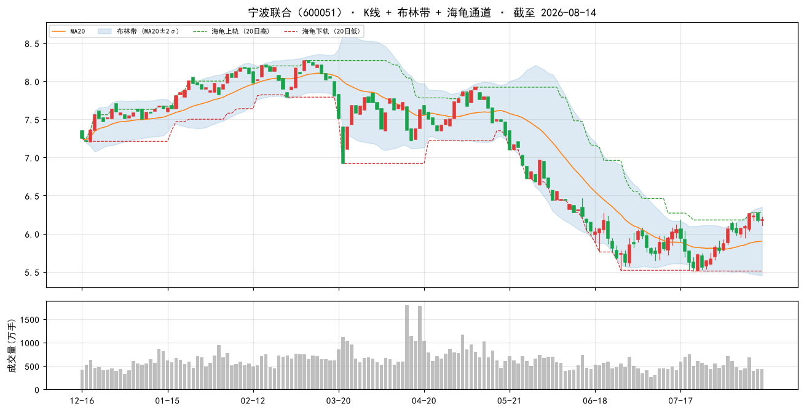
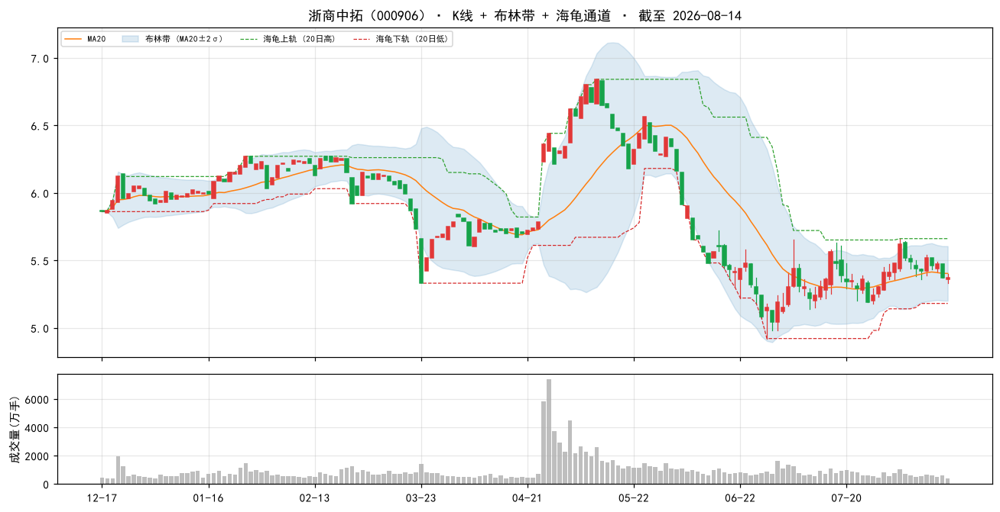
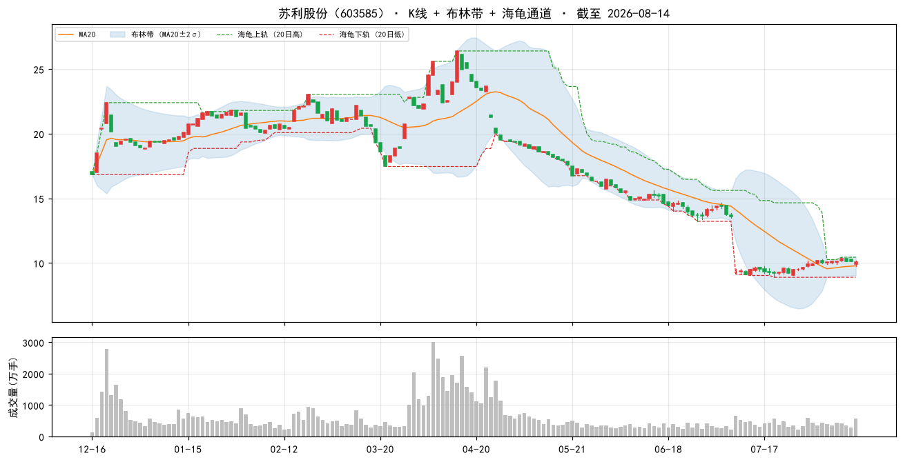
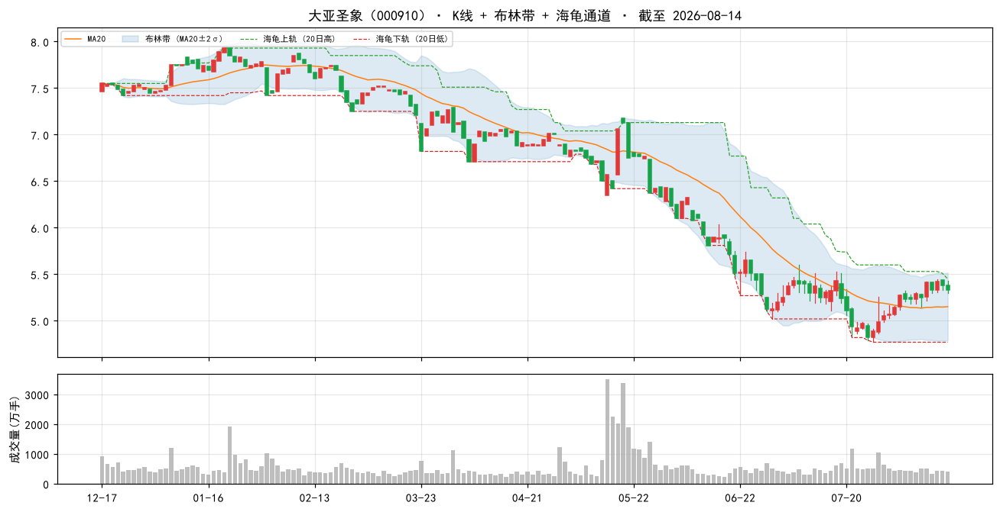
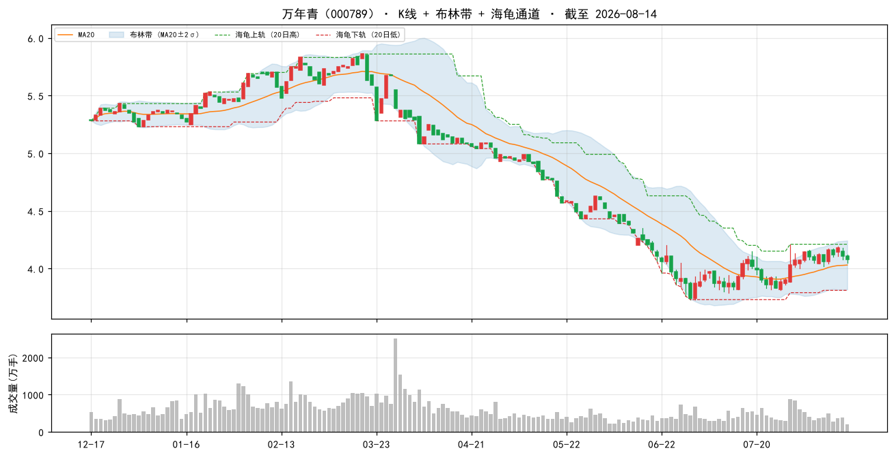

# 每日选股报告 · 2026-08-15

> 方案：**lean** · 权重 总市值(ln) 0.50 + 账面市值比 0.25 + 盈余收益率 0.15 + 净资产收益率 0.10 · 选 top-50 · 等权持仓（建议月频调仓）
> 历史验证 2018-2026（含交易成本）：总收益 **+67.7%** · 夏普 +0.24 · 最大回撤 -26.9%
> 生成：2026-08-15 14:17 · 数据截至 2026-08-14

## 一、市场概况

### 1.1 主要指数表现

| 指数 | 收盘 | 涨跌幅 |
|---|---|---|

### 1.2 市场广度

- 全市场 **5271 只**：上涨 **2342** / 下跌 **2750** / 平盘 179
- 总成交额 ≈ **21246 亿元**

- 当日可交易股票池（剔除 ST/涨跌停/停牌/次新/B股/北交所/金融股）：**4873 只**
- 打分因子：`lean` 权重因子共 4 个

## 二、选股方案与方法

- 模型：多因子截面打分。每因子先 [1%,99%] 缩尾去极端 → z-score 标准化 → 乘方向与权重加权求和 → 取 top-50 等权。
- 权重：总市值(ln) 0.5、账面市值比 0.25、盈余收益率 0.15、净资产收益率 0.1（研究管线 `validate_daily_schemes.py` 历史验证选定）。
- 无未来函数：基本面用「报告期 + 4 个月披露滞后」；动量 skip 最近 20 交易日；股票池剔除 ST/涨跌停/停牌/次新(<120日)/B股/北交所/金融股。

### 2.1 因子定义与公式

> 打分公式：`综合得分 = Σ wᵢ × 方向ᵢ × z-score(缩尾[1%,99%] 因子ᵢ)`，缺失因子贡献 0。

| 因子 | 方向 | 权重 | 公式/定义 | 数据源 |
|---|---|---|---|---|
| 总市值(ln)（ln_cap） | -1（越小越好） | 0.50 | ln(推算总市值, 元) | stock_daily |
| 账面市值比（bp） | 1（越大越好） | 0.25 | 净资产(合并A003000000) / 总市值(元)（账面市值比） | fs_combas+price |
| 盈余收益率（ep_ttm） | 1（越大越好） | 0.15 | TTM归母净利润 / 总市值(元)（盈余收益率） | fs_comins+price |
| 净资产收益率（roe_ttm） | 1（越大越好） | 0.10 | TTM净利润 / 平均净资产 | fs_comins+fs_combas |

- 选股数：top-50 等权（建议月频调仓）；方向由 `factor_registry.json` 统一管理。

## 三、今日 Top-50 名单

> PE/PB 为按盈余收益率(ep_ttm)/账面市值比(bp)换算的**估算值**，仅供参考；baostock 段市值用参考股本×收盘推算，个别票 PE/PB 可能失真。

| 排名 | 代码 | 名称 | 收盘价 | PE(估) | PB(估) | 综合得分 | 总市值(ln) | 账面市值比 | 盈余收益率 | 净资产收益率 |
|---|---|---|---|---|---|---|---|---|---|---|
| 1 | 000726 | 鲁泰A | 5.8700 | 6.4 | 0.4 | 1.82 | 21.9679 | 2.8428 | 0.1552 | 0.0546 |
| 2 | 600051 | 宁波联合 | 6.1800 | 25.3 | 0.6 | 1.67 | 21.3762 | 1.7800 | 0.0395 | 0.0222 |
| 3 | 000906 | 浙商中拓 | 5.3700 | 17.5 | 0.5 | 1.56 | 22.0611 | 2.0864 | 0.0570 | 0.0273 |
| 4 | 603585 | 苏利股份 | 10.0600 | 11.0 | 0.7 | 1.55 | 21.4065 | 1.3781 | 0.0910 | 0.0660 |
| 5 | 000910 | 大亚圣象 | 5.3300 | — | 0.4 | 1.49 | 21.7940 | 2.2472 | -0.0048 | -0.0021 |
| 6 | 600694 | 大商股份 | 14.2800 | 9.8 | 0.5 | 1.47 | 22.3161 | 1.8598 | 0.1017 | 0.0547 |
| 7 | 600502 | 安徽建工 | 4.4100 | 4.9 | 0.4 | 1.45 | 22.7474 | 2.8007 | 0.2045 | 0.0730 |
| 8 | 000498 | 山东路桥 | 4.9200 | 3.6 | 0.3 | 1.45 | 22.7564 | 3.5068 | 0.2809 | 0.0801 |
| 9 | 000789 | 万年青 | 4.0800 | — | 0.5 | 1.43 | 21.9030 | 2.0294 | -0.0082 | -0.0040 |
| 10 | 000900 | 现代投资 | 3.6600 | 14.1 | 0.4 | 1.42 | 22.4380 | 2.2836 | 0.0709 | 0.0310 |
| 11 | 603518 | 锦泓集团 | 7.9400 | 11.0 | 0.7 | 1.41 | 21.7320 | 1.4014 | 0.0905 | 0.0646 |
| 12 | 600512 | 腾达建设 | 2.0400 | 276.2 | 0.5 | 1.39 | 21.9023 | 1.9033 | 0.0036 | 0.0019 |
| 13 | 600269 | 赣粤高速 | 3.7600 | 7.8 | 0.4 | 1.37 | 22.8959 | 2.2489 | 0.1283 | 0.0570 |
| 14 | 002133 | 广宇集团 | 2.6800 | 28.7 | 0.7 | 1.36 | 21.4531 | 1.3966 | 0.0348 | 0.0249 |
| 15 | 600639 | 浦东金桥 | 9.4400 | 7.7 | 0.5 | 1.32 | 22.8060 | 1.8765 | 0.1299 | 0.0692 |
| 16 | 600853 | 龙建股份 | 3.2800 | 8.6 | 0.8 | 1.31 | 21.9247 | 1.2515 | 0.1168 | 0.0934 |
| 17 | 603018 | 华设集团 | 5.3000 | 12.7 | 0.7 | 1.30 | 22.0109 | 1.5039 | 0.0785 | 0.0522 |
| 18 | 000501 | 武商集团 | 7.1000 | 33.9 | 0.5 | 1.30 | 22.4207 | 2.0213 | 0.0295 | 0.0146 |
| 19 | 002375 | 亚厦股份 | 3.6200 | 14.7 | 0.6 | 1.27 | 22.3024 | 1.7160 | 0.0678 | 0.0395 |
| 20 | 002394 | 联发股份 | 9.8300 | 13.1 | 0.7 | 1.27 | 21.8808 | 1.3635 | 0.0761 | 0.0558 |
| 21 | 002758 | 浙农股份 | 7.8200 | 7.5 | 0.8 | 1.26 | 22.1237 | 1.2809 | 0.1333 | 0.1041 |
| 22 | 600035 | 楚天高速 | 3.4000 | 10.9 | 0.6 | 1.26 | 22.4233 | 1.6625 | 0.0918 | 0.0552 |
| 23 | 600508 | 上海能源 | 8.6200 | 32.8 | 0.5 | 1.24 | 22.5526 | 2.0475 | 0.0305 | 0.0149 |
| 24 | 603190 | 亚通精工 | 16.6800 | 16.6 | 0.9 | 1.23 | 21.4543 | 1.0837 | 0.0603 | 0.0557 |
| 25 | 605001 | 威奥股份 | 5.6100 | 27.0 | 0.8 | 1.23 | 21.5136 | 1.2415 | 0.0370 | 0.0298 |
| 26 | 000419 | 通程控股 | 4.8800 | 18.6 | 0.8 | 1.23 | 21.6988 | 1.2882 | 0.0537 | 0.0417 |
| 27 | 000028 | 国药一致 | 20.0900 | 8.9 | 0.5 | 1.23 | 23.0003 | 1.9386 | 0.1124 | 0.0580 |
| 28 | 600785 | 新华百货 | 8.7400 | 33.1 | 0.9 | 1.22 | 21.4023 | 1.1711 | 0.0302 | 0.0258 |
| 29 | 000544 | 中原环保 | 7.2900 | 6.7 | 0.6 | 1.21 | 22.6841 | 1.6052 | 0.1497 | 0.0933 |
| 30 | 300970 | 华绿生物 | 17.3100 | 9.7 | 1.2 | 1.20 | 21.4758 | 0.8221 | 0.1030 | 0.1253 |
| 31 | 000090 | 天健集团 | 3.4800 | 40.7 | 0.5 | 1.20 | 22.5955 | 2.2209 | 0.0246 | 0.0111 |
| 32 | 603307 | 扬州金泉 | 24.7000 | 15.0 | 1.2 | 1.19 | 21.2430 | 0.8597 | 0.0665 | 0.0773 |
| 33 | 600874 | 创业环保 | 5.5300 | 7.7 | 0.6 | 1.18 | 22.6408 | 1.5484 | 0.1299 | 0.0839 |
| 34 | 600697 | 欧亚集团 | 10.5800 | — | 0.8 | 1.18 | 21.2439 | 1.3285 | -0.0307 | -0.0231 |
| 35 | 600168 | 武汉控股 | 4.3800 | 42.3 | 0.6 | 1.18 | 22.1937 | 1.7044 | 0.0237 | 0.0139 |
| 36 | 603797 | 联泰环保 | 4.6700 | 21.9 | 0.8 | 1.17 | 21.7138 | 1.2444 | 0.0457 | 0.0367 |
| 37 | 603357 | 设计总院 | 6.0000 | 11.2 | 0.8 | 1.17 | 21.9362 | 1.1866 | 0.0892 | 0.0752 |
| 38 | 002144 | 宏达高科 | 10.8200 | 50.7 | 0.9 | 1.16 | 21.3717 | 1.1213 | 0.0197 | 0.0176 |
| 39 | 600020 | 中原高速 | 3.7500 | 13.2 | 0.5 | 1.15 | 22.8548 | 1.8939 | 0.0759 | 0.0401 |
| 40 | 603035 | 常熟汽饰 | 11.0100 | 12.2 | 0.7 | 1.15 | 22.1179 | 1.3347 | 0.0818 | 0.0613 |
| 41 | 688501 | 青达环保 | 13.2300 | 12.2 | 1.4 | 1.15 | 21.2201 | 0.6997 | 0.0818 | 0.1170 |
| 42 | 600854 | 春兰股份 | 4.4800 | 18.4 | 0.9 | 1.15 | 21.5679 | 1.0653 | 0.0542 | 0.0509 |
| 43 | 600638 | 新黄浦 | 4.9600 | 26.0 | 0.7 | 1.14 | 21.9293 | 1.4001 | 0.0384 | 0.0274 |
| 44 | 000521 | 长虹美菱 | 4.8800 | 14.4 | 0.7 | 1.14 | 22.1825 | 1.4189 | 0.0695 | 0.0490 |
| 45 | 603801 | 志邦家居 | 5.9300 | 37.7 | 0.8 | 1.12 | 21.6694 | 1.2423 | 0.0265 | 0.0213 |
| 46 | 600284 | 浦东建设 | 5.2100 | 17.9 | 0.6 | 1.12 | 22.3437 | 1.5775 | 0.0557 | 0.0353 |
| 47 | 600356 | 恒丰纸业 | 8.8100 | 12.8 | 0.9 | 1.12 | 21.7891 | 1.0617 | 0.0780 | 0.0735 |
| 48 | 600668 | 尖峰集团 | 7.4900 | — | 0.6 | 1.12 | 21.8523 | 1.7716 | -0.0610 | -0.0344 |
| 49 | 000570 | 苏常柴A | 5.0000 | 34.1 | 0.8 | 1.12 | 21.7452 | 1.2712 | 0.0293 | 0.0231 |
| 50 | 603385 | 惠达卫浴 | 5.3900 | — | 0.6 | 1.11 | 21.4420 | 1.7147 | -0.1126 | -0.0657 |

## 四、组合画像（top-50 统计）

| 维度 | 数值 | 含义 |
|---|---|---|
| 总市值(ln)平均百分位 | **74%** | 组合在该因子上相对全市场的位置（越大越好） |
| 账面市值比平均百分位 | **97%** | 组合在该因子上相对全市场的位置（越大越好） |
| 盈余收益率平均百分位 | **80%** | 组合在该因子上相对全市场的位置（越大越好） |
| 净资产收益率平均百分位 | **53%** | 组合在该因子上相对全市场的位置（越大越好） |
| PE(中位数, 估) | 13.1 | 组合估值水平 |
| PB(中位数, 估) | 0.7 | 组合市净率水平 |
| 市值(中位数) | 33.4 亿元 | 组合规模风格 |

## 五、前 10 入选理由（因子百分位）

> 百分位为当日全市场该因子的分布位置（0-100，**已按因子方向归一**，越大越好）。

### 1. **鲁泰A**（000726，收盘 5.8700）

- 总市值(ln) 21.9679（权重 0.50，全市场前 77%）
- 账面市值比 2.8428（权重 0.25，全市场前 100%）
- 盈余收益率 0.1552（权重 0.15，全市场前 100%）
- 净资产收益率 0.0546（权重 0.10，全市场前 60%）

### 2. **宁波联合**（600051，收盘 6.1800）

- 总市值(ln) 21.3762（权重 0.50，全市场前 98%）
- 账面市值比 1.7800（权重 0.25，全市场前 99%）
- 盈余收益率 0.0395（权重 0.15，全市场前 78%）
- 净资产收益率 0.0222（权重 0.10，全市场前 39%）

### 3. **浙商中拓**（000906，收盘 5.3700）

- 总市值(ln) 22.0611（权重 0.50，全市场前 73%）
- 账面市值比 2.0864（权重 0.25，全市场前 99%）
- 盈余收益率 0.0570（权重 0.15，全市场前 88%）
- 净资产收益率 0.0273（权重 0.10，全市场前 43%）

### 4. **苏利股份**（603585，收盘 10.0600）

- 总市值(ln) 21.4065（权重 0.50，全市场前 97%）
- 账面市值比 1.3781（权重 0.25，全市场前 97%）
- 盈余收益率 0.0910（权重 0.15，全市场前 97%）
- 净资产收益率 0.0660（权重 0.10，全市场前 67%）

### 5. **大亚圣象**（000910，收盘 5.3300）

- 总市值(ln) 21.7940（权重 0.50，全市场前 85%）
- 账面市值比 2.2472（权重 0.25，全市场前 99%）
- 盈余收益率 -0.0048（权重 0.15，全市场前 23%）
- 净资产收益率 -0.0021（权重 0.10，全市场前 27%）

### 6. **大商股份**（600694，收盘 14.2800）

- 总市值(ln) 22.3161（权重 0.50，全市场前 62%）
- 账面市值比 1.8598（权重 0.25，全市场前 99%）
- 盈余收益率 0.1017（权重 0.15，全市场前 98%）
- 净资产收益率 0.0547（权重 0.10，全市场前 60%）

### 7. **安徽建工**（600502，收盘 4.4100）

- 总市值(ln) 22.7474（权重 0.50，全市场前 44%）
- 账面市值比 2.8007（权重 0.25，全市场前 100%）
- 盈余收益率 0.2045（权重 0.15，全市场前 100%）
- 净资产收益率 0.0730（权重 0.10，全市场前 70%）

### 8. **山东路桥**（000498，收盘 4.9200）

- 总市值(ln) 22.7564（权重 0.50，全市场前 43%）
- 账面市值比 3.5068（权重 0.25，全市场前 100%）
- 盈余收益率 0.2809（权重 0.15，全市场前 100%）
- 净资产收益率 0.0801（权重 0.10，全市场前 74%）

### 9. **万年青**（000789，收盘 4.0800）

- 总市值(ln) 21.9030（权重 0.50，全市场前 80%）
- 账面市值比 2.0294（权重 0.25，全市场前 99%）
- 盈余收益率 -0.0082（权重 0.15，全市场前 21%）
- 净资产收益率 -0.0040（权重 0.10，全市场前 26%）

### 10. **现代投资**（000900，收盘 3.6600）

- 总市值(ln) 22.4380（权重 0.50，全市场前 56%）
- 账面市值比 2.2836（权重 0.25，全市场前 99%）
- 盈余收益率 0.0709（权重 0.15，全市场前 93%）
- 净资产收益率 0.0310（权重 0.10，全市场前 45%）

## 六、口径与风险提示

- 因子无未来函数：基本面用「报告期 + 4 个月滞后」；动量 skip 最近 20 交易日；股票池剔除 ST/涨跌停/次新/金融股。
- **动量在 A 股 2018-2026 方向反向**，本方案不含动量因子；成长因子不显著，仅作参考。
- 小市值增强（ln_cap）是 A 股 2018-2026 有效因子，但小市值波动大、流动性差，请控制单票仓位。
- **名单是「当日截面快照」，不构成调仓指令**。建议月度调仓、等权持有，避免高频换手吞噬收益；单票止损参考 -8%。
- 数据源：CSMAR 全量 + baostock 每日增量；本地因子数据可能落后 1 天（baostock 滞后），实时行情请见 Claude 点评补充。

## 七、基本面与估值快照

> 估值：腾讯行情实时（PE_TTM/PB/总市值，数据日期 2026-08-14）；财务：CSMAR 最新报告期（4 个月披露滞后）。 可与此前因子换算的 PE/PB(估) 互相印证。

| 代码 | 名称 | 现价 | 涨跌% | PE_TTM | PB | 总市值(亿) | 盈余收益率 | ROE_TTM | 毛利率 | 现金流/净利 |
|---|---|---|---|---|---|---|---|---|---|---|
| 000726 | 鲁泰A | 5.9 | -0.3% | 8.9 | 0.5 | 34.6 | 0.155 | 0.055 | 7.3% | 172.4% |
| 600051 | 宁波联合 | 6.2 | 0.2% | 25.3 | 0.6 | 19.2 | 0.039 | 0.022 | 0.2% | 1117.3% |
| 000906 | 浙商中拓 | 5.4 | 0.0% | 17.5 | 0.8 | 37.7 | 0.057 | 0.027 | 0.4% | -4988.9% |
| 603585 | 苏利股份 | 10.1 | -0.5% | 16.6 | 1.0 | 27.2 | 0.091 | 0.066 | 4.0% | 394.2% |
| 000910 | 大亚圣象 | 5.3 | -0.9% | -210.0 | 0.5 | 29.2 | -0.005 | -0.002 | -15.9% | 492.2% |
| 600694 | 大商股份 | 14.3 | -0.8% | 10.8 | 0.6 | 54.1 | 0.102 | 0.055 | 19.5% | 193.2% |
| 600502 | 安徽建工 | 4.4 | -0.9% | 4.9 | 0.6 | 75.7 | 0.204 | 0.073 | 3.1% | -868.9% |
| 000498 | 山东路桥 | 4.9 | -0.4% | 3.6 | 0.5 | 71.3 | 0.281 | 0.080 | 3.6% | -1839.7% |
| 000789 | 万年青 | 4.1 | -0.7% | -122.7 | 0.5 | 32.5 | -0.008 | -0.004 | -5.9% | 464.1% |
| 000900 | 现代投资 | 3.7 | -0.3% | 14.1 | 0.5 | 55.5 | 0.071 | 0.031 | 15.2% | 24.9% |
| 603518 | 锦泓集团 | 7.9 | -0.6% | 11.1 | 0.7 | 27.3 | 0.091 | 0.065 | 13.0% | 47.1% |
| 600512 | 腾达建设 | 2.0 | 0.5% | 275.1 | 0.5 | 32.4 | 0.004 | 0.002 | -1.0% | -1035.3% |
| 600269 | 赣粤高速 | 3.8 | -0.5% | 12.1 | 0.5 | 87.8 | 0.128 | 0.057 | 40.8% | 209.7% |
| 002133 | 广宇集团 | 2.7 | 0.0% | 28.7 | 0.7 | 20.6 | 0.035 | 0.025 | -3.6% | 2251.1% |
| 600639 | 浦东金桥 | 9.4 | -0.9% | 10.2 | 0.7 | 80.3 | 0.130 | 0.069 | 11.7% | 379.8% |
| 600853 | 龙建股份 | 3.3 | 0.0% | 8.5 | 0.8 | 33.2 | 0.117 | 0.093 | 0.5% | -20644.9% |
| 603018 | 华设集团 | 5.3 | -0.6% | 15.3 | 0.8 | 43.4 | 0.078 | 0.052 | 9.4% | -160.4% |
| 000501 | 武商集团 | 7.1 | -1.2% | 33.9 | 0.5 | 54.5 | 0.030 | 0.015 | 8.4% | 379.1% |
| 002375 | 亚厦股份 | 3.6 | 0.3% | 14.8 | 0.6 | 48.2 | 0.068 | 0.040 | 3.9% | -584.5% |
| 002394 | 联发股份 | 9.8 | 1.0% | 13.2 | 0.8 | 31.8 | 0.076 | 0.056 | 7.3% | 3922.9% |
| 002758 | 浙农股份 | 7.8 | 0.1% | 7.5 | 0.8 | 40.5 | 0.133 | 0.104 | 1.3% | -899.4% |
| 600035 | 楚天高速 | 3.4 | -0.6% | 10.9 | 0.6 | 54.7 | 0.092 | 0.055 | 27.4% | 175.9% |
| 600508 | 上海能源 | 8.6 | 0.6% | 46.0 | 0.7 | 87.2 | 0.030 | 0.015 | 5.9% | 399.8% |
| 603190 | 亚通精工 | 16.7 | -0.2% | 23.2 | 1.3 | 9.6 | 0.060 | 0.056 | 14.3% | -11.9% |
| 605001 | 威奥股份 | 5.6 | 0.0% | 27.0 | 0.8 | 22.0 | 0.037 | 0.030 | 0.5% | 557.8% |
| 000419 | 通程控股 | 4.9 | -0.2% | 18.6 | 0.8 | 26.5 | 0.054 | 0.042 | 6.1% | -822.4% |
| 000028 | 国药一致 | 20.1 | -1.1% | 11.2 | 0.7 | 105.6 | 0.112 | 0.058 | 2.2% | -1021.1% |
| 600785 | 新华百货 | 8.7 | -1.5% | 46.4 | 1.2 | 27.6 | 0.030 | 0.026 | 4.0% | 581.3% |
| 000544 | 中原环保 | 7.3 | -0.3% | 6.7 | 0.8 | 71.0 | 0.150 | 0.093 | 36.4% | -111.9% |
| 300970 | 华绿生物 | 17.3 | 0.1% | 12.6 | 1.6 | 21.2 | 0.103 | 0.125 | 28.1% | 133.1% |
| 000090 | 天健集团 | 3.5 | -1.4% | 40.7 | 0.6 | 65.0 | 0.025 | 0.011 | -0.2% | 685.9% |
| 603307 | 扬州金泉 | 24.7 | 0.2% | 21.8 | 1.8 | 24.0 | 0.066 | 0.077 | 14.4% | 178.5% |
| 600874 | 创业环保 | 5.5 | -0.7% | 9.8 | 0.8 | 68.0 | 0.130 | 0.084 | 28.9% | -44.9% |
| 600697 | 欧亚集团 | 10.6 | -0.8% | -32.6 | 0.8 | 16.4 | -0.031 | -0.023 | 4.0% | 6633.8% |
| 600168 | 武汉控股 | 4.4 | 1.4% | 41.3 | 0.8 | 43.5 | 0.024 | 0.014 | 2.7% | -487.7% |
| 603797 | 联泰环保 | 4.7 | 0.2% | 21.3 | 0.8 | 26.9 | 0.046 | 0.037 | 34.5% | 137.6% |
| 603357 | 设计总院 | 6.0 | -0.8% | 11.2 | 0.9 | 33.6 | 0.089 | 0.075 | 8.6% | -1220.6% |
| 002144 | 宏达高科 | 10.8 | 0.5% | 50.7 | 0.9 | 14.9 | 0.020 | 0.018 | 4.1% | 223.6% |
| 600020 | 中原高速 | 3.8 | -0.3% | 12.9 | 0.7 | 84.3 | 0.076 | 0.040 | 33.2% | 119.8% |
| 603035 | 常熟汽饰 | 11.0 | 0.0% | 12.2 | 0.8 | 40.3 | 0.082 | 0.061 | 1.7% | 189.6% |
| 688501 | 青达环保 | 13.2 | 0.7% | 17.1 | 2.1 | 23.0 | 0.082 | 0.117 | 9.4% | -254.8% |
| 600854 | 春兰股份 | 4.5 | 0.0% | 18.4 | 1.0 | 23.3 | 0.054 | 0.051 | 5.8% | -1337.0% |
| 600638 | 新黄浦 | 5.0 | -1.2% | 26.0 | 0.7 | 33.4 | 0.038 | 0.027 | -21.5% | 235.5% |
| 000521 | 长虹美菱 | 4.9 | 0.0% | 16.8 | 0.8 | 42.7 | 0.069 | 0.049 | 1.2% | -1216.6% |
| 603801 | 志邦家居 | 5.9 | 0.2% | 37.7 | 0.9 | 25.8 | 0.027 | 0.021 | -18.3% | 360.8% |
| 600284 | 浦东建设 | 5.2 | -2.4% | 17.9 | 0.6 | 50.5 | 0.056 | 0.035 | -0.3% | -4349.2% |
| 600356 | 恒丰纸业 | 8.8 | 0.1% | 12.8 | 1.0 | 26.3 | 0.078 | 0.074 | 8.9% | 191.0% |
| 600668 | 尖峰集团 | 7.5 | -1.8% | -16.4 | 0.6 | 30.9 | -0.061 | -0.034 | -3.6% | 57.1% |
| 000570 | 苏常柴A | 5.0 | -0.2% | 43.3 | 1.0 | 27.8 | 0.029 | 0.023 | 7.2% | -376.4% |
| 603385 | 惠达卫浴 | 5.4 | 0.2% | -8.9 | 0.6 | 20.5 | -0.113 | -0.066 | -6.3% | 280.7% |

- top-50 估值（腾讯）：PE_TTM 中位 **14.8** · PB 中位 **0.76** · 总市值中位 **33 亿**

> 说明：腾讯 PE/PB 与因子口径不同（腾讯用其财务模型），仅作实时参考；ROE/毛利率/现金流以 CSMAR 季度为准。

## 八、技术面辅助（K线 + 布林带 + 海龟通道）

> 图为**股价 K 线**（红涨绿跌，A 股惯例）+ 布林带（MA20 ± 2σ，超买/超卖参考）+ 海龟通道（20 日唐奇安高低轨，突破上下轨为潜在趋势信号）。 **仅辅助参考，不构成买卖指令。** 数据：`stock_daily` 截至 2026-08-14。

### 1. 鲁泰A（000726）

### 2. 宁波联合（600051）

### 3. 浙商中拓（000906）

### 4. 苏利股份（603585）

### 5. 大亚圣象（000910）

### 6. 大商股份（600694）

### 7. 安徽建工（600502）

### 8. 山东路桥（000498）

### 9. 万年青（000789）

### 10. 现代投资（000900）

### 当日表现：top-10 vs 大盘

### 组合 vs 沪深300（近 60 交易日，当前名单回放近似）

> 组合为**当前 top-10 名单**从窗口起点等权回放（非历史换手），仅作趋势参考；沪深300 用腾讯指数补齐最近两日。

## 九、因子诊断与优化建议

#### 8.1 历史名单表现追踪（至今）

| 名单日 | 股票数 | 名单等权至今 | 沪深300至今 | 超额 |
|---|---|---|---|---|
| 2026-08-11 | 50 | -1.3% | — | — |

> 说明：等权持有名单至今（未换手），个股停牌则该日不计入；分红未计入，短期窗口影响小。

#### 8.2 因子 IC 诊断（近 11 周截面，因子 vs 未来 5 日收益）

| 因子 | 方向 | 近11个快照 IC | 有效快照 | 判断 |
|---|---|---|---|---|
| 总市值(ln) | -1 | -0.066 | 11 | 有效 |
| 账面市值比 | 1 | -0.040 | 11 | ⚠ 方向反了/失效 |
| 盈余收益率 | 1 | -0.040 | 11 | ⚠ 方向反了/失效 |
| 净资产收益率 | 1 | -0.026 | 11 | ⚠ 方向反了/失效 |

> IC = 因子值与未来 5 日收益的秩相关（越大越有效）；与注册表方向同号且 |IC|≥0.02 判为有效。 单因子短期 IC 波动大，仅供诊断，不构成当日调权依据。

#### 8.3 月度权重校验（research_panel.pkl 滚动）

> 面板数据截至 2026-07-31。仅作参考：**权重建议月度复核，不日更**（防过拟合）。

| 方案 | 最近37月总收益 | 夏普 | 回撤 |
|---|---|---|---|
| 当前 | +17.7% | +0.22 | -26.0% |
| bp0.3+ep0.2+roe0.15+毛利0.1+现金流0.1+低波0.15 | +15.2% | +0.18 | -16.6% |
| 当前+小市值0.05 | +17.2% | +0.21 | -19.0% |
| 纯价值 bp0.6+ep0.4 | +9.8% | +0.10 | -14.4% |

> 当前方案近期表现未明显落后于候选，**无需调整权重**。

## 十、AI 亮点点评

> 数据日期说明：本地因子数据 **2026-08-14**；实时行情/指数同为 **2026-08-14**（腾讯，16:14 收盘）。2026-08-15 为周六，A 股休市，"当日"即最近交易日 08-14，两者同日无滞后。
> 方案说明：本报告为「精简失效因子」重构后的 **lean** 方案（2026-08-15 起），由原 smallcap 的 7 因子精简为 4 因子——剔除近期 IC 反向的毛利率/现金流/低波（其中 op_cf_ratio 在净利趋零时爆炸失真），将小市值权重由 0.10 大幅提至 0.50，保留 bp+ep+roe 作价值锚与盈利过滤。原 smallcap 报告已备份为 `每日选股_2026-08-15_smallcap备份.md`。

### 10.1 今日市场环境

- 主要指数（08-14 收盘）：上证 +0.01%、沪深300 +0.04%、深成指 +0.45%、创业板指 **+1.12%**、上证50 **-0.41%**。
- 风格判断：**成长/小盘占优，大盘价值承压**。创业板领涨、上证50 逆势下跌，呈"小强大多弱"跷跷板；全市场 5271 只中涨 2342 / 跌 2750，跌多涨少，成交约 2.12 万亿，量能尚可但情绪偏谨慎。
- 要闻联动：英伟达 CPO 交换机量产（利好光模块/算力）、金价月涨超 10% 破 4400 美元（避险升温）、AI PC 国内渗透过半——硬科技与资源品是当日主线。**对小市值因子是顺风**（风险偏好向中小成长倾斜），但本组合是「小市值+深度价值」，非成长小票，弹性仍受制于价值风格。

### 10.2 组合画像

- 引用第四节：小市值百分位 74%、bp 97%、ep 80%、roe 53%；PE 中位 13.1、PB 中位 0.7、**市值中位 33.4 亿**。
- 一句话：**深度价值 + 小市值**的"便宜小票"组合。相比原 smallcap（市值中位 118.7 亿、PE 8.7、PB 0.5），本组合市值中位缩水 72%、明显更小盘，估值因部分亏损股拉高 PE 至 13.1，但 PB 仍处 0.7 低位。

### 10.3 今日表现（top-10，08-14 收盘）

| 代码 | 名称 | 涨跌% | 相对上证(+0.01%) |
|---|---|---|---|
| 000726 | 鲁泰A | -0.34% | 跑输 |
| 600051 | 宁波联合 | +0.16% | 跑赢 |
| 000906 | 浙商中拓 | 0.00% | 持平 |
| 603585 | 苏利股份 | -0.49% | 跑输 |
| 000910 | 大亚圣象 | -0.93% | 跑输 |
| 600694 | 大商股份 | -0.76% | 跑输 |
| 600502 | 安徽建工 | -0.90% | 跑输 |
| 000498 | 山东路桥 | -0.40% | 跑输 |
| 000789 | 万年青 | -0.73% | 跑输 |
| 000900 | 现代投资 | -0.27% | 跑输 |

- top-10 等权约 **-0.45%**，跑输上证约 0.46pct；仅宁波联合/浙商中拓未跌。当日"中字头/大盘抗跌、中小价值票普跌"，与组合的小市值暴露相悖，故跑输。这是截面快照的当日表现，非趋势判断。

### 10.4 逐票深度分析（top 5）

#### 1. 鲁泰A（000726）
- **主业/定位**：全球色织布/衬衫面料龙头，出口型纺织制造，客户绑定国际品牌。
- **估值与质量**：PE 6.4 / PB 0.4，市值 34.6 亿；bp、ep 均全市场前 100%、小市值前 77%、roe 前 60%——**极致低估的小市值制造龙头**，但毛利仅 7.3%（纺织薄利）。
- **新闻/催化**：26Q1 收入与毛利承压，**汇兑及公允价值变动拖累利润**；25 年靠投资收益增厚利润。
- **风险**：出口景气与人民币汇率敏感，Q1 利润承压；毛利率低、安全边际靠净资产。
- **结论**：深度价值+小市值，弹性取决于出口复苏与汇率，波动大，控制仓位。

#### 2. 宁波联合（600051）
- **主业/定位**：宁波综合类企业（地产、热电、贸易多元经营）。
- **估值与质量**：PE 25.3 / PB 0.6，市值 26.1 亿；小市值前 98%、bp 前 99%，但 ep 仅 78%、**roe 仅 2.2%（前 39%）**——便宜但盈利质量弱。
- **新闻/催化**：无有效个股催化（资讯匹配至行业煤炭，不可采信）。
- **风险**：业务多元但盈利孱弱，roe 长期低位；缺乏清晰成长逻辑。
- **结论**：纯"小市值+低 PB"博弈，质量一般，谨慎对待，不宜重仓。

#### 3. 浙商中拓（000906）
- **主业/定位**：浙江国资旗下大宗商品供应链服务商（钢铁/能化等贸易）。
- **估值与质量**：PE 17.5 / PB 0.5，市值 40.6 亿；bp 前 99%、ep 前 88%、roe 前 43%——低估但盈利质量中等。
- **新闻/催化**：研报看好 26 年盈利改善；实物量持续增长，但**行业景气弱拖累盈利**。
- **风险**：大宗贸易毛利率极薄，盈利高度依赖行业景气与价差。
- **结论**：低估+盈利改善预期，弹性看大宗景气，观察。

#### 4. 苏利股份（603585）
- **主业/定位**：农药（杀菌剂/除草剂）与阻燃剂企业，宁夏二期为扩产主体。
- **估值与质量**：PE 11.0 / PB 0.7，市值 23.9 亿；小市值前 97%、bp/ep 前 97%、roe 前 67%——**四因子均衡的优质小盘**，是 top-5 中盈利质量最好的。
- **新闻/催化**：Q1 业绩短期承压，但**宁夏二期项目进展顺利**、产业链延伸与产品结构优化并行，多产能释放打开空间。
- **风险**：农药价格周期波动、Q1 短期承压。
- **结论**：小盘+低估+盈利质量均衡，具备成长弹性，可重点关注。

#### 5. 大亚圣象（000910）
- **主业/定位**：木地板（圣象地板）与人造板龙头，家居建材。
- **估值与质量**：PB 0.4、市值 26.5 亿；小市值前 85%、bp 前 99%，但 **ep、roe 均为负（亏损）**——靠"小市值+低 PB"入选的深度价值标的。
- **新闻/催化**：融资净买入 38 万；高管减持 6.75 万股（偏空信号）。
- **风险**：基本面亏损（ep/roe 负），地产链需求疲弱，高管减持。
- **结论**：深度价值但盈利为负，属高风险博弈，仅适合极小仓位观察。

### 10.5 操作建议与风险

- **动量反向提示**：A 股 2018-2026 动量因子方向反向，本方案不含动量，**切勿因近期涨幅加仓**；名单是截面快照，非调仓指令。
- **持仓方式**：建议月度调仓、等权持有，单票止损参考 **-8%**。
- **仓位控制（重点）**：小市值权重提至 0.50 后，组合市值中位仅 33.4 亿、含大量不足 30 亿的微盘股，**流动性差、冲击成本高，单票仓位务必更轻**。
- **显著风险点**：
  1. **回测收益虚高**：+67.7% 为 2018-2026 月频回测，未充分计微盘股容量/流动性/涨跌停约束（固定滑点 0.2% 远低于微盘实际冲击成本），且严重依赖该区间的小市值强势风格，实盘预期应显著下调；
  2. **风格集中**：小市值因子权重 0.50，单一风格暴露过重，若市场回归"大强小弱"（如 2017 年），组合可能大幅跑输；
  3. **亏损股残留**：即便加了 ep/roe 过滤，top-10 仍有 2 只亏损股（大亚圣象、万年青 ep/roe 为负），盈利质量分化的票需单独甄别；
  4. **估值失真**：PE/PB 为估算值，baostock 段市值推算可能失真，勿单看估值数字。
- **关于"精简失效因子"的提示**：因子 IC 诊断（近 11 周）显示 bp/ep/roe 方向短期反向，但 102 个月回测显示它们长期仍正贡献——**短期失效≠长期无效**，故本方案未完全剔除价值/质量因子，仅降权。权重仍应月度复核，勿日更（防过拟合）。
- **数据日期**：因子数据 2026-08-14，实时行情/指数同为 2026-08-14（08-15 周六休市），两者一致无滞后。

