# 每日选股报告 · 2026-08-15

> 方案：**smallcap** · 权重 账面市值比 0.30 + 盈余收益率 0.20 + 净资产收益率 0.15 + 毛利率 0.10 + 现金流/净利 0.10 + 60日波动 0.15 + 总市值(ln) 0.10 · 选 top-50 · 等权持仓（建议月频调仓）
> 历史验证 2018-2026（含交易成本）：总收益 **+12.8%** · 夏普 +0.02 · 最大回撤 -27.6%
> 生成：2026-08-15 13:54 · 数据截至 2026-08-14

## 一、市场概况

### 1.1 主要指数表现

| 指数 | 收盘 | 涨跌幅 |
|---|---|---|

### 1.2 市场广度

- 全市场 **5271 只**：上涨 **2342** / 下跌 **2750** / 平盘 179
- 总成交额 ≈ **21246 亿元**

- 当日可交易股票池（剔除 ST/涨跌停/停牌/次新/B股/北交所/金融股）：**4873 只**
- 打分因子：`smallcap` 权重因子共 7 个

## 二、选股方案与方法

- 模型：多因子截面打分。每因子先 [1%,99%] 缩尾去极端 → z-score 标准化 → 乘方向与权重加权求和 → 取 top-50 等权。
- 权重：账面市值比 0.3、盈余收益率 0.2、净资产收益率 0.15、毛利率 0.1、现金流/净利 0.1、60日波动 0.15、总市值(ln) 0.1（研究管线 `validate_daily_schemes.py` 历史验证选定）。
- 无未来函数：基本面用「报告期 + 4 个月披露滞后」；动量 skip 最近 20 交易日；股票池剔除 ST/涨跌停/停牌/次新(<120日)/B股/北交所/金融股。

### 2.1 因子定义与公式

> 打分公式：`综合得分 = Σ wᵢ × 方向ᵢ × z-score(缩尾[1%,99%] 因子ᵢ)`，缺失因子贡献 0。

| 因子 | 方向 | 权重 | 公式/定义 | 数据源 |
|---|---|---|---|---|
| 账面市值比（bp） | 1（越大越好） | 0.30 | 净资产(合并A003000000) / 总市值(元)（账面市值比） | fs_combas+price |
| 盈余收益率（ep_ttm） | 1（越大越好） | 0.20 | TTM归母净利润 / 总市值(元)（盈余收益率） | fs_comins+price |
| 净资产收益率（roe_ttm） | 1（越大越好） | 0.15 | TTM净利润 / 平均净资产 | fs_comins+fs_combas |
| 毛利率（gross_margin） | 1（越大越好） | 0.10 | (收入-营业总成本)/收入 | fs_comins |
| 现金流/净利（op_cf_ratio） | 1（越大越好） | 0.10 | 经营现金流净额/净利润 | fs_comscfd+fs_comins |
| 60日波动（vol_60d） | -1（越小越好） | 0.15 | 60日日收益率标准差，年化×√252 | stock_daily |
| 总市值(ln)（ln_cap） | -1（越小越好） | 0.10 | ln(推算总市值, 元) | stock_daily |

- 选股数：top-50 等权（建议月频调仓）；方向由 `factor_registry.json` 统一管理。

## 三、今日 Top-50 名单

> PE/PB 为按盈余收益率(ep_ttm)/账面市值比(bp)换算的**估算值**，仅供参考；baostock 段市值用参考股本×收盘推算，个别票 PE/PB 可能失真。

| 排名 | 代码 | 名称 | 收盘价 | PE(估) | PB(估) | 综合得分 | 账面市值比 | 盈余收益率 | 净资产收益率 | 毛利率 | 现金流/净利 | 60日波动 | 总市值(ln) |
|---|---|---|---|---|---|---|---|---|---|---|---|---|---|
| 1 | 600269 | 赣粤高速 | 3.7600 | 7.8 | 0.4 | 2.14 | 2.2489 | 0.1283 | 0.0570 | 40.8% | 209.7% | 25.5% | 22.8959 |
| 2 | 000726 | 鲁泰A | 5.8700 | 6.4 | 0.4 | 2.10 | 2.8428 | 0.1552 | 0.0546 | 7.3% | 172.4% | 21.3% | 21.9679 |
| 3 | 600639 | 浦东金桥 | 9.4400 | 7.7 | 0.5 | 1.95 | 1.8765 | 0.1299 | 0.0692 | 11.7% | 379.8% | 21.0% | 22.8060 |
| 4 | 600502 | 安徽建工 | 4.4100 | 4.9 | 0.4 | 1.91 | 2.8007 | 0.2045 | 0.0730 | 3.1% | -868.9% | 28.6% | 22.7474 |
| 5 | 000498 | 山东路桥 | 4.9200 | 3.6 | 0.3 | 1.89 | 3.5068 | 0.2809 | 0.0801 | 3.6% | -1839.7% | 20.4% | 22.7564 |
| 6 | 600938 | 中国海油 | 32.6700 | 0.8 | 0.1 | 1.88 | 8.5696 | 1.2762 | 0.1489 | 44.8% | 140.9% | 42.4% | 25.3050 |
| 7 | 600694 | 大商股份 | 14.2800 | 9.8 | 0.5 | 1.87 | 1.8598 | 0.1017 | 0.0547 | 19.5% | 193.2% | 26.6% | 22.3161 |
| 8 | 000900 | 现代投资 | 3.6600 | 14.1 | 0.4 | 1.86 | 2.2836 | 0.0709 | 0.0310 | 15.2% | 24.9% | 19.3% | 22.4380 |
| 9 | 600941 | 中国移动 | 97.7100 | 0.6 | 0.1 | 1.86 | 16.1294 | 1.5396 | 0.0955 | 13.3% | 243.5% | 18.9% | 25.2030 |
| 10 | 000544 | 中原环保 | 7.2900 | 6.7 | 0.6 | 1.83 | 1.6052 | 0.1497 | 0.0933 | 36.4% | -111.9% | 20.4% | 22.6841 |
| 11 | 600020 | 中原高速 | 3.7500 | 13.2 | 0.5 | 1.82 | 1.8939 | 0.0759 | 0.0401 | 33.2% | 119.8% | 21.9% | 22.8548 |
| 12 | 600820 | 隧道股份 | 5.4300 | 7.8 | 0.4 | 1.79 | 2.5854 | 0.1277 | 0.0494 | 0.2% | -1674.8% | 21.2% | 23.5607 |
| 13 | 601107 | 四川成渝 | 5.4900 | 7.8 | 0.6 | 1.76 | 1.7323 | 0.1275 | 0.0736 | 23.1% | 197.6% | 32.5% | 23.1976 |
| 14 | 000028 | 国药一致 | 20.0900 | 8.9 | 0.5 | 1.76 | 1.9386 | 0.1124 | 0.0580 | 2.2% | -1021.1% | 26.0% | 23.0003 |
| 15 | 600874 | 创业环保 | 5.5300 | 7.7 | 0.6 | 1.75 | 1.5484 | 0.1299 | 0.0839 | 28.9% | -44.9% | 18.9% | 22.6408 |
| 16 | 600585 | 海螺水泥 | 17.3600 | 8.9 | 0.4 | 1.73 | 2.7915 | 0.1119 | 0.0401 | 8.5% | 22.2% | 24.4% | 24.9637 |
| 17 | 601811 | 新华文轩 | 11.9100 | 6.0 | 0.6 | 1.73 | 1.6494 | 0.1660 | 0.1006 | 10.0% | -66.4% | 22.5% | 22.9673 |
| 18 | 600035 | 楚天高速 | 3.4000 | 10.9 | 0.6 | 1.73 | 1.6625 | 0.0918 | 0.0552 | 27.4% | 175.9% | 17.5% | 22.4233 |
| 19 | 600548 | 深高速 | 8.3700 | 12.7 | 0.5 | 1.71 | 1.8335 | 0.0788 | 0.0430 | 25.8% | 201.9% | 20.8% | 23.4303 |
| 20 | 600704 | 物产中大 | 4.8500 | 6.9 | 0.5 | 1.69 | 1.8400 | 0.1440 | 0.0782 | 1.5% | -797.1% | 21.8% | 23.9453 |
| 21 | 601186 | 中国铁建 | 6.0500 | 4.0 | 0.2 | 1.68 | 5.0226 | 0.2530 | 0.0504 | 2.6% | -1424.6% | 18.7% | 24.9660 |
| 22 | 601800 | 中国交建 | 5.9300 | 5.3 | 0.2 | 1.68 | 4.4583 | 0.1904 | 0.0427 | 3.8% | -1344.3% | 23.4% | 24.9761 |
| 23 | 601668 | 中国建筑 | 4.4000 | 4.8 | 0.4 | 1.67 | 2.7780 | 0.2087 | 0.0751 | 3.9% | -554.6% | 17.9% | 25.9262 |
| 24 | 601318 | 中国平安 | 51.7500 | 4.2 | 0.5 | 1.67 | 1.8459 | 0.2407 | 0.1304 | 25.4% | 523.8% | 31.8% | 27.0362 |
| 25 | 600104 | 上汽集团 | 10.1000 | 11.5 | 0.4 | 1.63 | 2.5883 | 0.0871 | 0.0336 | 2.3% | 1057.0% | 24.1% | 25.4777 |
| 26 | 000932 | 华菱钢铁 | 3.6000 | 11.0 | 0.4 | 1.63 | 2.2635 | 0.0911 | 0.0402 | 0.4% | -835.9% | 28.5% | 23.9288 |
| 27 | 601333 | 广深铁路 | 2.9000 | 10.7 | 0.6 | 1.63 | 1.7653 | 0.0938 | 0.0531 | 10.6% | -6.5% | 20.0% | 23.5200 |
| 28 | 000501 | 武商集团 | 7.1000 | 33.9 | 0.5 | 1.62 | 2.0213 | 0.0295 | 0.0146 | 8.4% | 379.1% | 30.8% | 22.4207 |
| 29 | 000709 | 河钢股份 | 2.0900 | 19.8 | 0.4 | 1.61 | 2.7564 | 0.0506 | 0.0183 | 0.3% | 1069.8% | 26.7% | 23.7962 |
| 30 | 600717 | 天津港 | 4.1800 | 11.4 | 0.6 | 1.60 | 1.6900 | 0.0875 | 0.0518 | 22.8% | 107.3% | 25.9% | 23.2162 |
| 31 | 601390 | 中国中铁 | 4.3600 | 4.2 | 0.2 | 1.60 | 4.1919 | 0.2377 | 0.0567 | 2.7% | -1982.8% | 25.4% | 25.2151 |
| 32 | 600528 | 中铁工业 | 7.0100 | 11.4 | 0.6 | 1.59 | 1.7984 | 0.0878 | 0.0488 | 4.5% | -226.2% | 21.5% | 23.4688 |
| 33 | 600051 | 宁波联合 | 6.1800 | 25.3 | 0.6 | 1.58 | 1.7800 | 0.0395 | 0.0222 | 0.2% | 1117.3% | 31.4% | 21.3762 |
| 34 | 002061 | 浙江交科 | 3.4900 | 9.7 | 0.6 | 1.58 | 1.7179 | 0.1030 | 0.0600 | 3.2% | -778.0% | 24.5% | 22.9569 |
| 35 | 600827 | 百联股份 | 7.6000 | 9.9 | 0.6 | 1.56 | 1.6877 | 0.1009 | 0.0598 | 2.7% | 133.1% | 27.0% | 23.2242 |
| 36 | 601607 | 上海医药 | 16.5900 | 8.0 | 0.6 | 1.55 | 1.6705 | 0.1255 | 0.0752 | 3.2% | -71.2% | 20.3% | 24.5579 |
| 37 | 600064 | 南京高科 | 7.5300 | 7.4 | 0.7 | 1.54 | 1.5155 | 0.1355 | 0.0894 | -0.1% | 28.0% | 22.1% | 23.2905 |
| 38 | 000560 | 我爱我家 | 2.1600 | — | 0.5 | 1.54 | 1.8242 | -0.0192 | -0.0105 | -8.7% | 10729.9% | 38.8% | 22.3501 |
| 39 | 601669 | 中国电建 | 4.7000 | 8.7 | 0.5 | 1.53 | 2.0933 | 0.1151 | 0.0550 | 2.3% | -2261.2% | 28.8% | 25.1173 |
| 40 | 600011 | 华能国际 | 6.8400 | 5.4 | 0.6 | 1.52 | 1.7882 | 0.1851 | 0.1035 | 12.1% | 277.4% | 46.9% | 25.0437 |
| 41 | 600033 | 福建高速 | 3.4900 | 10.0 | 0.8 | 1.52 | 1.3144 | 0.1000 | 0.0761 | 51.6% | 221.1% | 21.9% | 22.9827 |
| 42 | 600508 | 上海能源 | 8.6200 | 32.8 | 0.5 | 1.51 | 2.0475 | 0.0305 | 0.0149 | 5.9% | 399.8% | 45.2% | 22.5526 |
| 43 | 600057 | 厦门象屿 | 6.1500 | 13.4 | 0.5 | 1.50 | 1.9480 | 0.0747 | 0.0384 | 1.7% | -1478.6% | 28.6% | 23.5837 |
| 44 | 600017 | 日照港 | 2.6600 | 18.7 | 0.6 | 1.49 | 1.7190 | 0.0536 | 0.0312 | 7.0% | 357.9% | 21.8% | 22.8251 |
| 45 | 000789 | 万年青 | 4.0800 | — | 0.5 | 1.49 | 2.0294 | -0.0082 | -0.0040 | -5.9% | 464.1% | 25.4% | 21.9030 |
| 46 | 000885 | 城发环境 | 12.6700 | 6.4 | 0.8 | 1.49 | 1.2038 | 0.1570 | 0.1304 | 26.2% | 100.9% | 20.6% | 22.8195 |
| 47 | 000090 | 天健集团 | 3.4800 | 40.7 | 0.5 | 1.48 | 2.2209 | 0.0246 | 0.0111 | -0.2% | 685.9% | 44.5% | 22.5955 |
| 48 | 002394 | 联发股份 | 9.8300 | 13.1 | 0.7 | 1.47 | 1.3635 | 0.0761 | 0.0558 | 7.3% | 3922.9% | 48.3% | 21.8808 |
| 49 | 600027 | 华电国际 | 4.5400 | 7.6 | 0.6 | 1.46 | 1.5806 | 0.1320 | 0.0835 | 7.4% | 315.5% | 31.8% | 24.5282 |
| 50 | 603018 | 华设集团 | 5.3000 | 12.7 | 0.7 | 1.46 | 1.5039 | 0.0785 | 0.0522 | 9.4% | -160.4% | 25.3% | 22.0109 |

## 四、组合画像（top-50 统计）

| 维度 | 数值 | 含义 |
|---|---|---|
| 账面市值比平均百分位 | **99%** | 组合在该因子上相对全市场的位置（越大越好） |
| 盈余收益率平均百分位 | **92%** | 组合在该因子上相对全市场的位置（越大越好） |
| 净资产收益率平均百分位 | **61%** | 组合在该因子上相对全市场的位置（越大越好） |
| 毛利率平均百分位 | **62%** | 组合在该因子上相对全市场的位置（越大越好） |
| 现金流/净利平均百分位 | **52%** | 组合在该因子上相对全市场的位置（越大越好） |
| 60日波动平均百分位 | **93%** | 组合在该因子上相对全市场的位置（越大越好） |
| 总市值(ln)平均百分位 | **33%** | 组合在该因子上相对全市场的位置（越大越好） |
| PE(中位数, 估) | 8.7 | 组合估值水平 |
| PB(中位数, 估) | 0.5 | 组合市净率水平 |
| 市值(中位数) | 118.7 亿元 | 组合规模风格 |

## 五、前 10 入选理由（因子百分位）

> 百分位为当日全市场该因子的分布位置（0-100，**已按因子方向归一**，越大越好）。

### 1. **赣粤高速**（600269，收盘 3.7600）

- 账面市值比 2.2489（权重 0.30，全市场前 99%）
- 盈余收益率 0.1283（权重 0.20，全市场前 99%）
- 净资产收益率 0.0570（权重 0.15，全市场前 62%）
- 毛利率 40.8%（权重 0.10，全市场前 98%）
- 现金流/净利 209.7%（权重 0.10，全市场前 74%）
- 60日波动 25.5%（权重 0.15，全市场前 97%）
- 总市值(ln) 22.8959（权重 0.10，全市场前 38%）

### 2. **鲁泰A**（000726，收盘 5.8700）

- 账面市值比 2.8428（权重 0.30，全市场前 100%）
- 盈余收益率 0.1552（权重 0.20，全市场前 100%）
- 净资产收益率 0.0546（权重 0.15，全市场前 60%）
- 毛利率 7.3%（权重 0.10，全市场前 62%）
- 现金流/净利 172.4%（权重 0.10，全市场前 70%）
- 60日波动 21.3%（权重 0.15，全市场前 99%）
- 总市值(ln) 21.9679（权重 0.10，全市场前 77%）

### 3. **浦东金桥**（600639，收盘 9.4400）

- 账面市值比 1.8765（权重 0.30，全市场前 99%）
- 盈余收益率 0.1299（权重 0.20，全市场前 99%）
- 净资产收益率 0.0692（权重 0.15，全市场前 68%）
- 毛利率 11.7%（权重 0.10，全市场前 75%）
- 现金流/净利 379.8%（权重 0.10，全市场前 85%）
- 60日波动 21.0%（权重 0.15，全市场前 99%）
- 总市值(ln) 22.8060（权重 0.10，全市场前 41%）

### 4. **安徽建工**（600502，收盘 4.4100）

- 账面市值比 2.8007（权重 0.30，全市场前 100%）
- 盈余收益率 0.2045（权重 0.20，全市场前 100%）
- 净资产收益率 0.0730（权重 0.15，全市场前 70%）
- 毛利率 3.1%（权重 0.10，全市场前 46%）
- 现金流/净利 -868.9%（权重 0.10，全市场前 9%）
- 60日波动 28.6%（权重 0.15，全市场前 94%）
- 总市值(ln) 22.7474（权重 0.10，全市场前 44%）

### 5. **山东路桥**（000498，收盘 4.9200）

- 账面市值比 3.5068（权重 0.30，全市场前 100%）
- 盈余收益率 0.2809（权重 0.20，全市场前 100%）
- 净资产收益率 0.0801（权重 0.15，全市场前 74%）
- 毛利率 3.6%（权重 0.10，全市场前 48%）
- 现金流/净利 -1839.7%（权重 0.10，全市场前 4%）
- 60日波动 20.4%（权重 0.15，全市场前 99%）
- 总市值(ln) 22.7564（权重 0.10，全市场前 43%）

### 6. **中国海油**（600938，收盘 32.6700）

- 账面市值比 8.5696（权重 0.30，全市场前 100%）
- 盈余收益率 1.2762（权重 0.20，全市场前 100%）
- 净资产收益率 0.1489（权重 0.15，全市场前 93%）
- 毛利率 44.8%（权重 0.10，全市场前 99%）
- 现金流/净利 140.9%（权重 0.10，全市场前 66%）
- 60日波动 42.4%（权重 0.15，全市场前 69%）
- 总市值(ln) 25.3050（权重 0.10，全市场前 3%）

### 7. **大商股份**（600694，收盘 14.2800）

- 账面市值比 1.8598（权重 0.30，全市场前 99%）
- 盈余收益率 0.1017（权重 0.20，全市场前 98%）
- 净资产收益率 0.0547（权重 0.15，全市场前 60%）
- 毛利率 19.5%（权重 0.10，全市场前 88%）
- 现金流/净利 193.2%（权重 0.10，全市场前 72%）
- 60日波动 26.6%（权重 0.15，全市场前 96%）
- 总市值(ln) 22.3161（权重 0.10，全市场前 62%）

### 8. **现代投资**（000900，收盘 3.6600）

- 账面市值比 2.2836（权重 0.30，全市场前 99%）
- 盈余收益率 0.0709（权重 0.20，全市场前 93%）
- 净资产收益率 0.0310（权重 0.15，全市场前 45%）
- 毛利率 15.2%（权重 0.10，全市场前 83%）
- 现金流/净利 24.9%（权重 0.10，全市场前 45%）
- 60日波动 19.3%（权重 0.15，全市场前 100%）
- 总市值(ln) 22.4380（权重 0.10，全市场前 56%）

### 9. **中国移动**（600941，收盘 97.7100）

- 账面市值比 16.1294（权重 0.30，全市场前 100%）
- 盈余收益率 1.5396（权重 0.20，全市场前 100%）
- 净资产收益率 0.0955（权重 0.15，全市场前 80%）
- 毛利率 13.3%（权重 0.10，全市场前 79%）
- 现金流/净利 243.5%（权重 0.10，全市场前 77%）
- 60日波动 18.9%（权重 0.15，全市场前 100%）
- 总市值(ln) 25.2030（权重 0.10，全市场前 3%）

### 10. **中原环保**（000544，收盘 7.2900）

- 账面市值比 1.6052（权重 0.30，全市场前 98%）
- 盈余收益率 0.1497（权重 0.20，全市场前 100%）
- 净资产收益率 0.0933（权重 0.15，全市场前 80%）
- 毛利率 36.4%（权重 0.10，全市场前 98%）
- 现金流/净利 -111.9%（权重 0.10，全市场前 28%）
- 60日波动 20.4%（权重 0.15，全市场前 99%）
- 总市值(ln) 22.6841（权重 0.10，全市场前 46%）

## 六、口径与风险提示

- 因子无未来函数：基本面用「报告期 + 4 个月滞后」；动量 skip 最近 20 交易日；股票池剔除 ST/涨跌停/次新/金融股。
- **动量在 A 股 2018-2026 方向反向**，本方案不含动量因子；成长因子不显著，仅作参考。
- 小市值增强（ln_cap）是 A 股 2018-2026 有效因子，但小市值波动大、流动性差，请控制单票仓位。
- **名单是「当日截面快照」，不构成调仓指令**。建议月度调仓、等权持有，避免高频换手吞噬收益；单票止损参考 -8%。
- 数据源：CSMAR 全量 + baostock 每日增量；本地因子数据可能落后 1 天（baostock 滞后），实时行情请见 Claude 点评补充。

## 七、基本面与估值快照

> 估值：腾讯行情实时（PE_TTM/PB/总市值，数据日期 2026-08-14）；财务：CSMAR 最新报告期（4 个月披露滞后）。 可与此前因子换算的 PE/PB(估) 互相印证。

| 代码 | 名称 | 现价 | 涨跌% | PE_TTM | PB | 总市值(亿) | 盈余收益率 | ROE_TTM | 毛利率 | 现金流/净利 |
|---|---|---|---|---|---|---|---|---|---|---|
| 600269 | 赣粤高速 | 3.8 | -0.5% | 12.1 | 0.5 | 87.8 | 0.128 | 0.057 | 40.8% | 209.7% |
| 000726 | 鲁泰A | 5.9 | -0.3% | 8.9 | 0.5 | 34.6 | 0.155 | 0.055 | 7.3% | 172.4% |
| 600639 | 浦东金桥 | 9.4 | -0.9% | 10.2 | 0.7 | 80.3 | 0.130 | 0.069 | 11.7% | 379.8% |
| 600502 | 安徽建工 | 4.4 | -0.9% | 4.9 | 0.6 | 75.7 | 0.204 | 0.073 | 3.1% | -868.9% |
| 000498 | 山东路桥 | 4.9 | -0.4% | 3.6 | 0.5 | 71.3 | 0.281 | 0.080 | 3.6% | -1839.7% |
| 600938 | 中国海油 | 32.7 | 0.1% | 12.5 | 1.9 | 976.8 | 1.276 | 0.149 | 44.8% | 140.9% |
| 600694 | 大商股份 | 14.3 | -0.8% | 10.8 | 0.6 | 54.1 | 0.102 | 0.055 | 19.5% | 193.2% |
| 000900 | 现代投资 | 3.7 | -0.3% | 14.1 | 0.5 | 55.5 | 0.071 | 0.031 | 15.2% | 24.9% |
| 600941 | 中国移动 | 97.7 | 1.7% | 16.1 | 1.5 | 882.1 | 1.540 | 0.095 | 13.3% | 243.5% |
| 000544 | 中原环保 | 7.3 | -0.3% | 6.7 | 0.8 | 71.0 | 0.150 | 0.093 | 36.4% | -111.9% |
| 600020 | 中原高速 | 3.8 | -0.3% | 12.9 | 0.7 | 84.3 | 0.076 | 0.040 | 33.2% | 119.8% |
| 600820 | 隧道股份 | 5.4 | 0.2% | 7.8 | 0.5 | 170.7 | 0.128 | 0.049 | 0.2% | -1674.8% |
| 601107 | 四川成渝 | 5.5 | -0.7% | 11.3 | 1.0 | 118.7 | 0.127 | 0.074 | 23.1% | 197.6% |
| 000028 | 国药一致 | 20.1 | -1.1% | 11.2 | 0.7 | 105.6 | 0.112 | 0.058 | 2.2% | -1021.1% |
| 600874 | 创业环保 | 5.5 | -0.7% | 9.8 | 0.8 | 68.0 | 0.130 | 0.084 | 28.9% | -44.9% |
| 600585 | 海螺水泥 | 17.4 | -0.7% | 11.8 | 0.5 | 690.5 | 0.112 | 0.040 | 8.5% | 22.2% |
| 601811 | 新华文轩 | 11.9 | -0.2% | 9.4 | 1.0 | 94.3 | 0.166 | 0.101 | 10.0% | -66.4% |
| 600035 | 楚天高速 | 3.4 | -0.6% | 10.9 | 0.6 | 54.7 | 0.092 | 0.055 | 27.4% | 175.9% |
| 600548 | 深高速 | 8.4 | 0.0% | 18.0 | 0.9 | 143.5 | 0.079 | 0.043 | 25.8% | 201.9% |
| 600704 | 物产中大 | 4.8 | -0.2% | 7.0 | 0.6 | 250.8 | 0.144 | 0.078 | 1.5% | -797.1% |
| 601186 | 中国铁建 | 6.0 | -0.3% | 4.7 | 0.3 | 696.0 | 0.253 | 0.050 | 2.6% | -1424.6% |
| 601800 | 中国交建 | 5.9 | -0.7% | 7.2 | 0.3 | 695.2 | 0.190 | 0.043 | 3.8% | -1344.3% |
| 601668 | 中国建筑 | 4.4 | -0.9% | 4.8 | 0.4 | 1818.1 | 0.209 | 0.075 | 3.9% | -554.6% |
| 601318 | 中国平安 | 51.8 | -2.0% | 7.1 | 0.9 | 5516.6 | 0.241 | 0.130 | 25.4% | 523.8% |
| 600104 | 上汽集团 | 10.1 | -0.7% | 11.5 | 0.4 | 1161.0 | 0.087 | 0.034 | 2.3% | 1057.0% |
| 000932 | 华菱钢铁 | 3.6 | 0.3% | 11.0 | 0.5 | 246.7 | 0.091 | 0.040 | 0.4% | -835.9% |
| 601333 | 广深铁路 | 2.9 | -1.0% | 13.4 | 0.7 | 163.9 | 0.094 | 0.053 | 10.6% | -6.5% |
| 000501 | 武商集团 | 7.1 | -1.2% | 33.9 | 0.5 | 54.5 | 0.030 | 0.015 | 8.4% | 379.1% |
| 000709 | 河钢股份 | 2.1 | 0.0% | 19.8 | 0.4 | 216.0 | 0.051 | 0.018 | 0.3% | 1069.8% |
| 600717 | 天津港 | 4.2 | -0.2% | 11.4 | 0.6 | 121.0 | 0.088 | 0.052 | 22.8% | 107.3% |
| 601390 | 中国中铁 | 4.4 | -0.7% | 5.0 | 0.3 | 886.1 | 0.238 | 0.057 | 2.7% | -1982.8% |
| 600528 | 中铁工业 | 7.0 | 0.0% | 11.4 | 0.6 | 155.7 | 0.088 | 0.049 | 4.5% | -226.2% |
| 600051 | 宁波联合 | 6.2 | 0.2% | 25.3 | 0.6 | 19.2 | 0.039 | 0.022 | 0.2% | 1117.3% |
| 002061 | 浙江交科 | 3.5 | 0.0% | 9.6 | 0.6 | 90.7 | 0.103 | 0.060 | 3.2% | -778.0% |
| 600827 | 百联股份 | 7.6 | -1.4% | 11.0 | 0.7 | 121.9 | 0.101 | 0.060 | 2.7% | 133.1% |
| 601607 | 上海医药 | 16.6 | -1.1% | 10.6 | 0.8 | 462.7 | 0.126 | 0.075 | 3.2% | -71.2% |
| 600064 | 南京高科 | 7.5 | -0.7% | 7.4 | 0.7 | 130.3 | 0.135 | 0.089 | -0.1% | 28.0% |
| 000560 | 我爱我家 | 2.2 | -4.0% | -52.2 | 0.6 | 50.5 | -0.019 | -0.010 | -8.7% | 10729.9% |
| 601669 | 中国电建 | 4.7 | 0.2% | 8.7 | 0.6 | 614.4 | 0.115 | 0.055 | 2.3% | -2261.2% |
| 600011 | 华能国际 | 6.8 | -1.2% | 7.7 | 1.7 | 752.2 | 0.185 | 0.103 | 12.1% | 277.4% |
| 600033 | 福建高速 | 3.5 | -0.3% | 10.0 | 0.8 | 95.8 | 0.100 | 0.076 | 51.6% | 221.1% |
| 600508 | 上海能源 | 8.6 | 0.6% | 46.0 | 0.7 | 87.2 | 0.030 | 0.015 | 5.9% | 399.8% |
| 600057 | 厦门象屿 | 6.2 | -1.6% | 13.4 | 1.1 | 128.7 | 0.075 | 0.038 | 1.7% | -1478.6% |
| 600017 | 日照港 | 2.7 | -0.4% | 18.7 | 0.6 | 81.8 | 0.054 | 0.031 | 7.0% | 357.9% |
| 000789 | 万年青 | 4.1 | -0.7% | -122.7 | 0.5 | 32.5 | -0.008 | -0.004 | -5.9% | 464.1% |
| 000885 | 城发环境 | 12.7 | -0.6% | 6.4 | 0.8 | 81.3 | 0.157 | 0.130 | 26.2% | 100.9% |
| 000090 | 天健集团 | 3.5 | -1.4% | 40.7 | 0.6 | 65.0 | 0.025 | 0.011 | -0.2% | 685.9% |
| 002394 | 联发股份 | 9.8 | 1.0% | 13.2 | 0.8 | 31.8 | 0.076 | 0.056 | 7.3% | 3922.9% |
| 600027 | 华电国际 | 4.5 | -1.3% | 9.0 | 1.1 | 418.4 | 0.132 | 0.083 | 7.4% | 315.5% |
| 603018 | 华设集团 | 5.3 | -0.6% | 15.3 | 0.8 | 43.4 | 0.078 | 0.052 | 9.4% | -160.4% |

- top-50 估值（腾讯）：PE_TTM 中位 **10.9** · PB 中位 **0.62** · 总市值中位 **119 亿**

> 说明：腾讯 PE/PB 与因子口径不同（腾讯用其财务模型），仅作实时参考；ROE/毛利率/现金流以 CSMAR 季度为准。

## 八、技术面辅助（K线 + 布林带 + 海龟通道）

> 图为**股价 K 线**（红涨绿跌，A 股惯例）+ 布林带（MA20 ± 2σ，超买/超卖参考）+ 海龟通道（20 日唐奇安高低轨，突破上下轨为潜在趋势信号）。 **仅辅助参考，不构成买卖指令。** 数据：`stock_daily` 截至 2026-08-14。

### 1. 赣粤高速（600269）

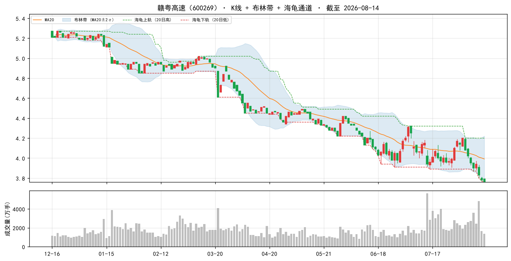

### 2. 鲁泰A（000726）

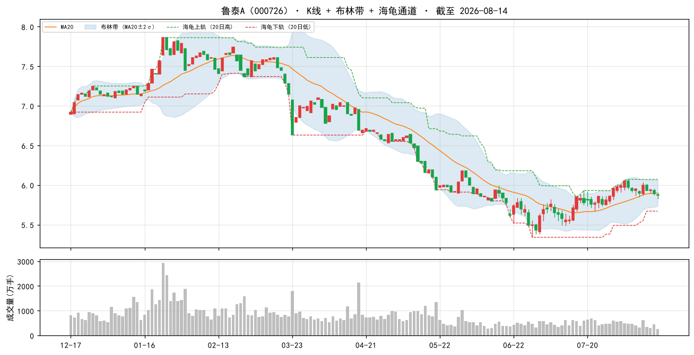

### 3. 浦东金桥（600639）

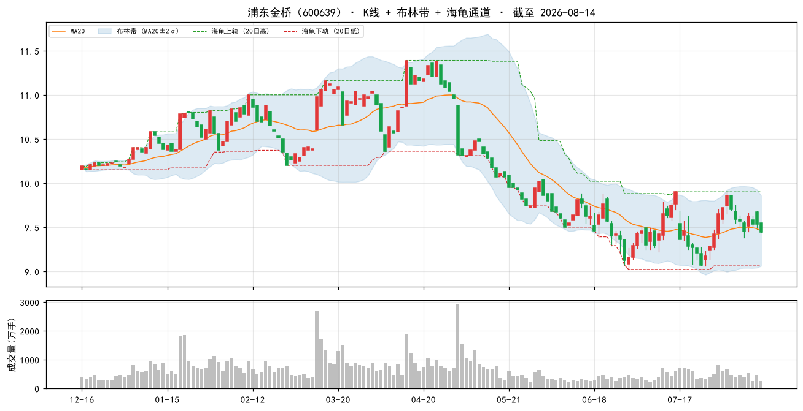

### 4. 安徽建工（600502）

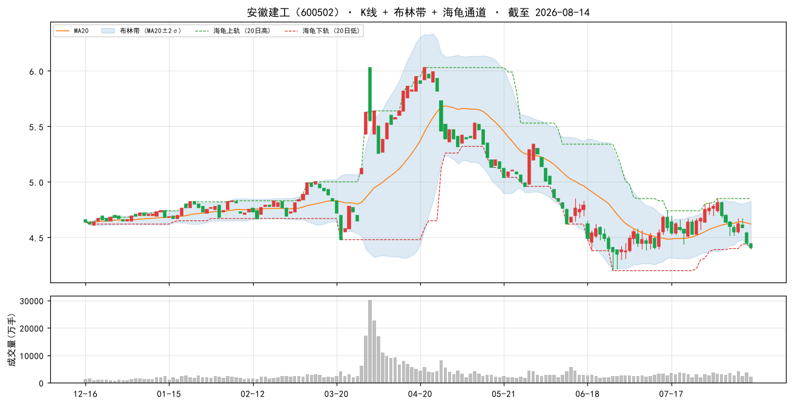

### 5. 山东路桥（000498）

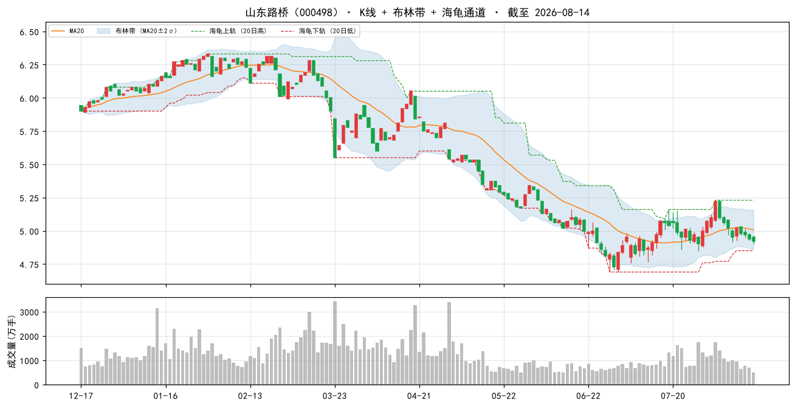

### 6. 中国海油（600938）

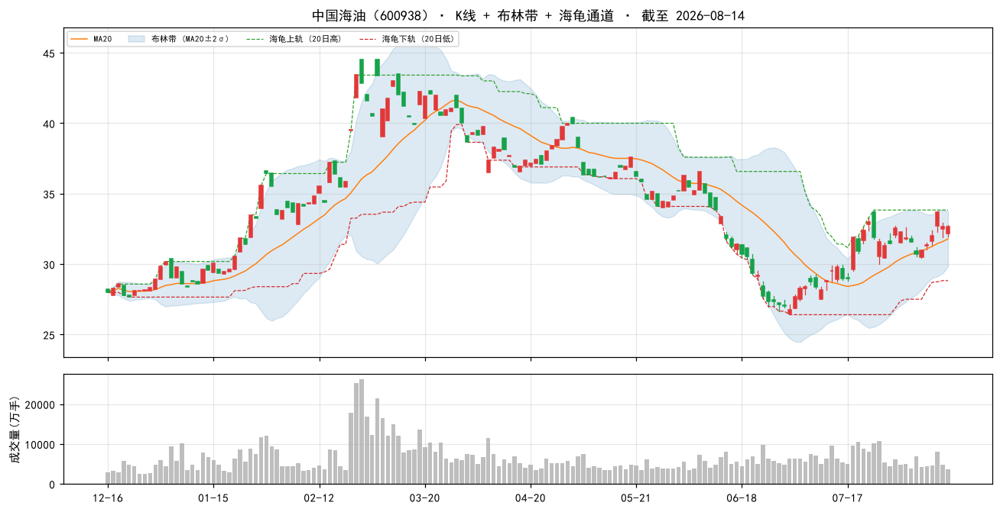

### 7. 大商股份（600694）

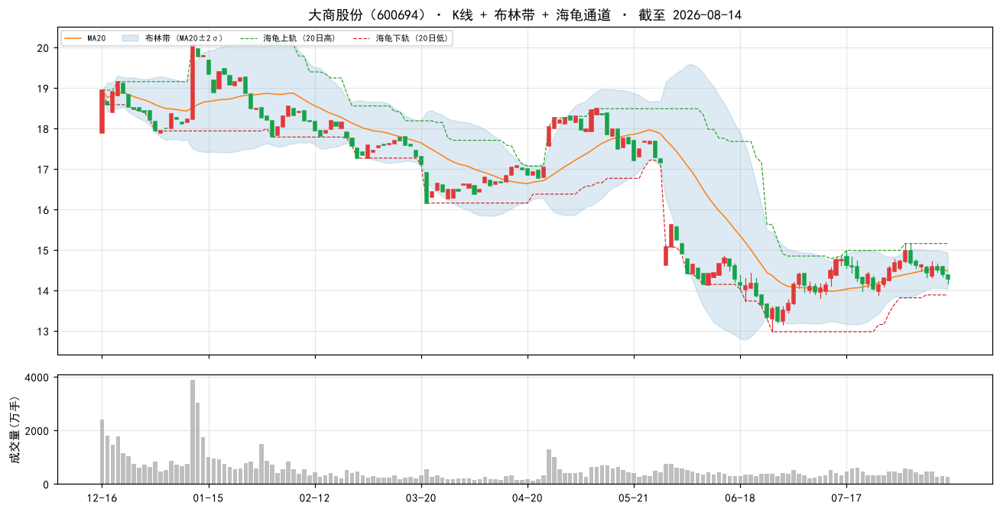

### 8. 现代投资（000900）

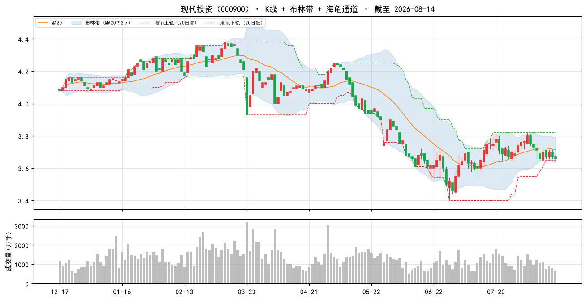

### 9. 中国移动（600941）

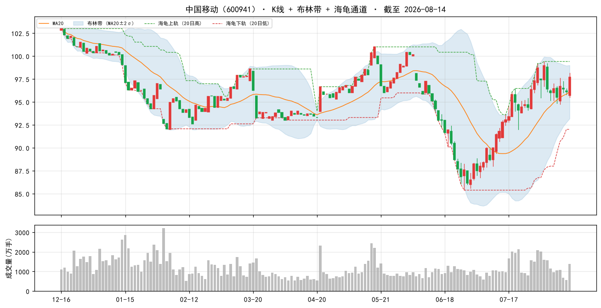

### 10. 中原环保（000544）

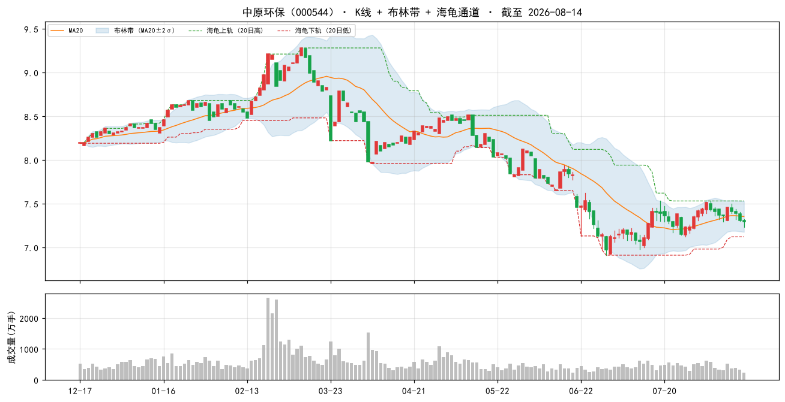

### 当日表现：top-10 vs 大盘

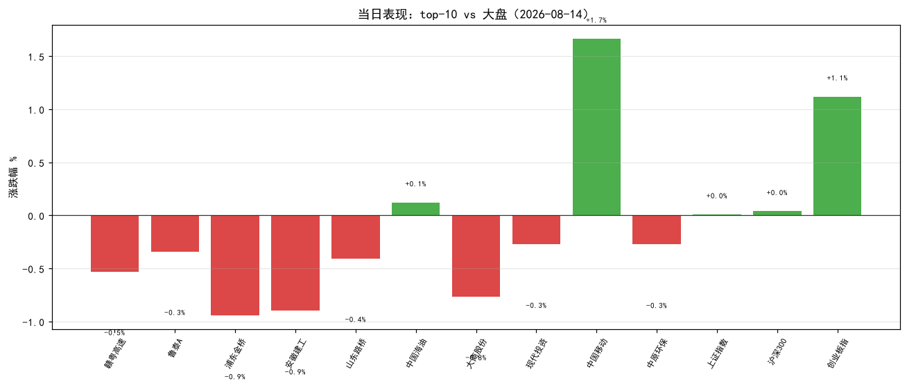

### 组合 vs 沪深300（近 60 交易日，当前名单回放近似）

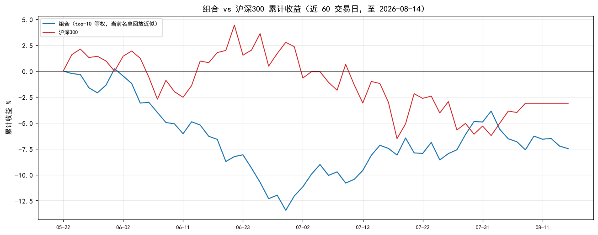

> 组合为**当前 top-10 名单**从窗口起点等权回放（非历史换手），仅作趋势参考；沪深300 用腾讯指数补齐最近两日。

## 九、因子诊断与优化建议

#### 8.1 历史名单表现追踪（至今）

| 名单日 | 股票数 | 名单等权至今 | 沪深300至今 | 超额 |
|---|---|---|---|---|
| 2026-08-11 | 50 | -1.3% | — | — |

> 说明：等权持有名单至今（未换手），个股停牌则该日不计入；分红未计入，短期窗口影响小。

#### 8.2 因子 IC 诊断（近 11 周截面，因子 vs 未来 5 日收益）

| 因子 | 方向 | 近11个快照 IC | 有效快照 | 判断 |
|---|---|---|---|---|
| 账面市值比 | 1 | -0.040 | 11 | ⚠ 方向反了/失效 |
| 盈余收益率 | 1 | -0.040 | 11 | ⚠ 方向反了/失效 |
| 净资产收益率 | 1 | -0.026 | 11 | ⚠ 方向反了/失效 |
| 毛利率 | 1 | -0.026 | 11 | ⚠ 方向反了/失效 |
| 现金流/净利 | 1 | -0.003 | 11 | 中性（区分度弱） |
| 60日波动 | -1 | +0.052 | 11 | ⚠ 方向反了/失效 |
| 总市值(ln) | -1 | -0.066 | 11 | 有效 |

> IC = 因子值与未来 5 日收益的秩相关（越大越有效）；与注册表方向同号且 |IC|≥0.02 判为有效。 单因子短期 IC 波动大，仅供诊断，不构成当日调权依据。

#### 8.3 月度权重校验（research_panel.pkl 滚动）

> 面板数据截至 2026-07-31。仅作参考：**权重建议月度复核，不日更**（防过拟合）。

| 方案 | 最近37月总收益 | 夏普 | 回撤 |
|---|---|---|---|
| 当前 | +16.2% | +0.20 | -17.6% |
| bp0.3+ep0.2+roe0.15+毛利0.1+现金流0.1+低波0.15 | +15.2% | +0.18 | -16.6% |
| 当前+小市值0.05 | +19.7% | +0.25 | -16.7% |
| 纯价值 bp0.6+ep0.4 | +9.8% | +0.10 | -14.4% |

> ⚠ 候选「当前+小市值0.05」近期夏普最高（+0.25）且高于当前——建议**月度复核时**考虑微调权重，勿当日追改。

## 十、AI 亮点点评

> 数据日期说明：本地因子数据 **2026-08-14**；实时行情/指数数据同为 **2026-08-14**（腾讯，16:14 收盘）。2026-08-15 为周六，A 股休市，故"当日"即最近交易日 08-14。两者同日，无滞后。

### 10.1 今日市场环境

- 主要指数（08-14 收盘）：上证 +0.01%、沪深300 +0.04%、深成指 +0.45%、创业板指 **+1.12%**、上证50 **-0.41%**。
- 风格判断：**成长/小盘明显占优，大盘价值承压**。创业板领涨、上证50 逆势下跌，呈"小强大多弱"的跷跷板。市场广度方面，全市场 5271 只中上涨 2342 / 下跌 2750，跌多涨少，成交额约 2.12 万亿——量能尚可但情绪偏谨慎。
- 要闻联动：英伟达 CPO 交换机量产（利好光模块/算力）、金价月涨超 10% 突破 4400 美元（避险升温）、AI PC 国内渗透过半——硬科技与资源品是当日主线，传统基建/高速等低估值蓝筹缺乏催化。

### 10.2 组合画像

- 引用第四节：组合 bp 百分位 99%、ep 92%、低波 93%、roe 61%、毛利 62%，市值中位 118.7 亿、PE 中位 8.7、PB 中位 0.5。
- 一句话：**深度价值 + 低波动 + 中小市值**的防御偏价值组合，以高账面市值比/高盈余收益率为核心，叠加低波与中小盘增强。典型"便宜、稳、小"三特征。

### 10.3 今日表现（top-10，08-14 收盘）

| 代码 | 名称 | 涨跌% | 相对上证(+0.01%) |
|---|---|---|---|
| 600269 | 赣粤高速 | -0.53% | 跑输 |
| 000726 | 鲁泰A | -0.34% | 跑输 |
| 600639 | 浦东金桥 | -0.94% | 跑输 |
| 600502 | 安徽建工 | -0.90% | 跑输 |
| 000498 | 山东路桥 | -0.40% | 跑输 |
| 600938 | 中国海油 | +0.12% | 跑赢 |
| 600694 | 大商股份 | -0.76% | 跑输 |
| 000900 | 现代投资 | -0.27% | 跑输 |
| 600941 | 中国移动 | +1.66% | 跑赢 |
| 000544 | 中原环保 | -0.27% | 跑输 |

- top-10 等权 **约 -0.26%**，跑输上证（≈+0.01%）约 0.27pct；10 只中仅 2 只上涨，且恰好是两只中字头央企蓝筹（中国海油、中国移动）。
- 解读：当日为"中字头/大盘价值抗跌、中小票普跌"格局，与组合中小市值暴露相悖，故组合小幅跑输。**这是截面快照的当日表现，不构成趋势判断**。

### 10.4 逐票深度分析（top 5）

#### 1. 赣粤高速（600269）
- **主业/定位**：江西省收费高速公路运营龙头，路产主业现金流极稳，属典型防御型红利资产。
- **估值与质量**：PE_TTM 12.1 / PB 0.5，市值 87.8 亿；bp 全市场前 99%、ep 前 99%、毛利 40.8%（前 98%）——**便宜且质量尚可**，roe 5.7% 中等。
- **新闻/催化**：华创证券强推目标价 5.71 元（较 08-14 收盘 3.76 有约 52% 空间）；半年报点评称核心路产稳健，但**金融投资波动拖累业绩**。
- **风险**：业绩受金融投资公允价值扰动，非纯路费收入；估值修复依赖分红与利率下行。
- **结论**：防御底仓，下行有限，弹性靠估值修复与高股息，建议持有观察。

#### 2. 鲁泰A（000726）
- **主业/定位**：全球色织布/衬衫面料龙头，出口型纺织制造，客户绑定国际品牌。
- **估值与质量**：PE 8.9 / PB 0.5，市值仅 34.6 亿；bp/ep 均处全市场前 100%——**极致低估的小市值制造龙头**，但毛利仅 7.3%（纺织业薄利特征）。
- **新闻/催化**：26Q1 收入与毛利短期承压，**汇兑及公允价值变动拖累利润**；25 年靠投资收益增厚利润。
- **风险**：出口景气与人民币汇率敏感，Q1 利润承压；毛利率低、安全边际靠净资产。
- **结论**：深度价值小票，弹性取决于出口复苏与汇率，波动大，控制仓位。

#### 3. 浦东金桥（600639）
- **主业/定位**：上海浦东园区开发与物业租赁，持有优质经营性物业，出租率稳中有升。
- **估值与质量**：PE 10.2 / PB 0.7，市值 80.3 亿；bp 前 99%、ep 前 99%、现金流/净利 379.8%（前 85%）——**物业现金牛，估值不贵**。
- **新闻/催化**：研报称"收入高增利润增长，经营性物业出租率稳中有升"；4 月获融资净买入。
- **风险**：区域地产周期与园区招商波动；roe 6.9% 一般。
- **结论**：稳健收租型资产，防御属性强，适合作为组合压舱石。

#### 4. 安徽建工（600502）
- **主业/定位**：安徽省属基建施工龙头，房建/市政/水利为主，受益稳增长与 REITs。
- **估值与质量**：PE 4.9 / PB 0.6，市值 75.7 亿；bp/ep 全市场前 100%——**极低估值的基建股**，但毛利仅 3.1%、现金流/净利 **-868.9%**（垫资回款滞后，行业特征）。
- **新闻/催化**：研报称收入利润稳健增长、重点项目持续落地；4 月获融资净买入 1321 万（环比 +502%）；行业周报看好内需/出海/算力。
- **风险**：经营现金流长期为负、应收账款高；毛利率极低，盈利质量弱。
- **结论**：低估值弹性票，订单催化明确但现金流是硬伤，宜短线博弈政策催化。

#### 5. 山东路桥（000498）
- **主业/定位**：山东高速集团旗下路桥施工平台，高速/桥梁工程为主。
- **估值与质量**：PE 3.6 / PB 0.5，市值 71.3 亿；bp/ep 全市场前 100%——**全名单最低估之一**，roe 8.0% 居前；但现金流/净利 **-1839.7%**（垫资模式）。
- **新闻/催化**：25 年新签订单较快增长、现金流同比大幅改善；"进城出海"激发新动能；Q1 订单继续增长。
- **风险**：现金流为负、回款周期长；基建投资节奏波动。
- **结论**：低估+订单改善，弹性优于同业，但需紧盯回款与现金流改善的持续性。

### 10.5 操作建议与风险

- **动量反向提示**：A 股 2018-2026 动量因子方向反向，本方案不含动量因子，**切勿因近期涨幅加仓**；名单是截面快照，非调仓指令。
- **持仓方式**：建议月度调仓、等权持有，避免高频换手吞噬收益；单票止损参考 **-8%**。
- **仓位控制**：组合含中小市值票（中位 118.7 亿、部分不足 50 亿），波动大、流动性差，**单票仓位勿过重**。
- **显著风险点**：
  1. 基建/路桥类（安徽建工、山东路桥等）经营现金流大幅为负，盈利质量弱，回款是核心风险；
  2. 当日组合跑输大盘（中小票普跌、中字头抗跌），若市场延续"大强小弱"风格，组合短期承压；
  3. 部分票 PE/PB 为估算值，baostock 段市值推算可能失真（如我爱我家、万年青 PE 为负，已剔除出前 10），勿单看估值数字；
  4. 因子近期 IC 诊断显示 bp/ep/roe/低波方向短期反向（见第九节），价值因子阶段性失效，需月度复核权重。
- **数据日期**：因子数据 2026-08-14，实时行情/指数同为 2026-08-14（08-15 周六休市），两者一致无滞后。
