# 每日选股报告 · 2026-08-18

> 方案：**smallcap** · 权重 账面市值比 0.30 + 盈余收益率 0.20 + 净资产收益率 0.15 + 毛利率 0.10 + 现金流/净利 0.10 + 60日波动 0.15 + 总市值(ln) 0.10 · 选 top-50 · 等权持仓（建议月频调仓）
> 历史验证 2018-2026（含交易成本）：总收益 **+12.8%** · 夏普 +0.02 · 最大回撤 -27.6%
> 生成：2026-08-18 06:02 · 数据截至 2026-08-17

## 一、市场概况

### 1.1 主要指数表现

| 指数 | 收盘 | 涨跌幅 |
|---|---|---|

### 1.2 市场广度

- 全市场 **5269 只**：上涨 **4092** / 下跌 **1028** / 平盘 149
- 总成交额 ≈ **23782 亿元**

- 当日可交易股票池（剔除 ST/涨跌停/停牌/次新/B股/北交所/金融股）：**4871 只**
- 打分因子：`smallcap` 权重因子共 7 个

## 二、选股方案与方法

- 模型：多因子截面打分。每因子先 [1%,99%] 缩尾去极端 → z-score 标准化 → 乘方向与权重加权求和 → 取 top-50 等权。
- 权重：账面市值比 0.3、盈余收益率 0.2、净资产收益率 0.15、毛利率 0.1、现金流/净利 0.1、60日波动 0.15、总市值(ln) 0.1（研究管线 `validate_daily_schemes.py` 历史验证选定）。
- 无未来函数：基本面用「报告期 + 4 个月披露滞后」；动量 skip 最近 20 交易日；股票池剔除 ST/涨跌停/停牌/次新(<120日)/B股/北交所/金融股。

### 2.1 因子定义与公式

> 打分公式：`综合得分 = Σ wᵢ × 方向ᵢ × z-score(缩尾[1%,99%] 因子ᵢ)`，缺失因子贡献 0。

| 因子 | 方向 | 权重 | 公式/定义 | 数据源 |
|---|---|---|---|---|
| 账面市值比（bp） | 1（越大越好） | 0.30 | 净资产(合并A003000000) / 总市值(元)（账面市值比） | fs_combas+price |
| 盈余收益率（ep_ttm） | 1（越大越好） | 0.20 | TTM归母净利润 / 总市值(元)（盈余收益率） | fs_comins+price |
| 净资产收益率（roe_ttm） | 1（越大越好） | 0.15 | TTM净利润 / 平均净资产 | fs_comins+fs_combas |
| 毛利率（gross_margin） | 1（越大越好） | 0.10 | (收入-营业总成本)/收入 | fs_comins |
| 现金流/净利（op_cf_ratio） | 1（越大越好） | 0.10 | 经营现金流净额/净利润 | fs_comscfd+fs_comins |
| 60日波动（vol_60d） | -1（越小越好） | 0.15 | 60日日收益率标准差，年化×√252 | stock_daily |
| 总市值(ln)（ln_cap） | -1（越小越好） | 0.10 | ln(推算总市值, 元) | stock_daily |

- 选股数：top-50 等权（建议月频调仓）；方向由 `factor_registry.json` 统一管理。

## 三、今日 Top-50 名单

> PE/PB 为按盈余收益率(ep_ttm)/账面市值比(bp)换算的**估算值**，仅供参考；baostock 段市值用参考股本×收盘推算，个别票 PE/PB 可能失真。

| 排名 | 代码 | 名称 | 收盘价 | PE(估) | PB(估) | 综合得分 | 账面市值比 | 盈余收益率 | 净资产收益率 | 毛利率 | 现金流/净利 | 60日波动 | 总市值(ln) |
|---|---|---|---|---|---|---|---|---|---|---|---|---|---|
| 1 | 600269 | 赣粤高速 | 3.7900 | 7.9 | 0.4 | 2.13 | 2.2311 | 0.1273 | 0.0570 | 40.8% | 209.7% | 25.6% | 22.9038 |
| 2 | 000726 | 鲁泰A | 5.9000 | 6.5 | 0.4 | 2.09 | 2.8284 | 0.1544 | 0.0546 | 7.3% | 172.4% | 21.2% | 21.9730 |
| 3 | 600639 | 浦东金桥 | 9.5100 | 7.8 | 0.5 | 1.96 | 1.8627 | 0.1290 | 0.0692 | 11.7% | 379.8% | 20.9% | 22.8134 |
| 4 | 600502 | 安徽建工 | 4.4300 | 4.9 | 0.4 | 1.90 | 2.7880 | 0.2035 | 0.0730 | 3.1% | -868.9% | 28.4% | 22.7520 |
| 5 | 000498 | 山东路桥 | 4.9600 | 3.6 | 0.3 | 1.88 | 3.4785 | 0.2786 | 0.0801 | 3.6% | -1839.7% | 20.4% | 22.7645 |
| 6 | 600694 | 大商股份 | 14.4000 | 9.9 | 0.5 | 1.88 | 1.8443 | 0.1008 | 0.0547 | 19.5% | 193.2% | 26.3% | 22.3244 |
| 7 | 600938 | 中国海油 | 32.8900 | 0.8 | 0.1 | 1.88 | 8.5122 | 1.2677 | 0.1489 | 44.8% | 140.9% | 41.8% | 25.3117 |
| 8 | 600941 | 中国移动 | 96.0200 | 0.6 | 0.1 | 1.85 | 16.4133 | 1.5667 | 0.0955 | 13.3% | 243.5% | 18.6% | 25.1855 |
| 9 | 600020 | 中原高速 | 3.7500 | 13.2 | 0.5 | 1.84 | 1.8939 | 0.0759 | 0.0401 | 33.2% | 119.8% | 21.9% | 22.8548 |
| 10 | 000900 | 现代投资 | 3.6900 | 14.2 | 0.4 | 1.84 | 2.2651 | 0.0703 | 0.0310 | 15.2% | 24.9% | 19.4% | 22.4462 |
| 11 | 000544 | 中原环保 | 7.3400 | 6.7 | 0.6 | 1.84 | 1.5943 | 0.1487 | 0.0933 | 36.4% | -111.9% | 20.4% | 22.6910 |
| 12 | 000028 | 国药一致 | 20.0300 | 8.9 | 0.5 | 1.79 | 1.9444 | 0.1127 | 0.0580 | 2.2% | -1021.1% | 26.0% | 22.9973 |
| 13 | 600820 | 隧道股份 | 5.4300 | 7.8 | 0.4 | 1.78 | 2.5854 | 0.1277 | 0.0494 | 0.2% | -1674.8% | 21.0% | 23.5607 |
| 14 | 601107 | 四川成渝 | 5.5200 | 7.9 | 0.6 | 1.77 | 1.7228 | 0.1268 | 0.0736 | 23.1% | 197.6% | 32.6% | 23.2030 |
| 15 | 600874 | 创业环保 | 5.5600 | 7.7 | 0.6 | 1.77 | 1.5401 | 0.1292 | 0.0839 | 28.9% | -44.9% | 18.6% | 22.6462 |
| 16 | 601811 | 新华文轩 | 11.9100 | 6.0 | 0.6 | 1.75 | 1.6494 | 0.1660 | 0.1006 | 10.0% | -66.4% | 22.4% | 22.9673 |
| 17 | 600035 | 楚天高速 | 3.4000 | 10.9 | 0.6 | 1.75 | 1.6625 | 0.0918 | 0.0552 | 27.4% | 175.9% | 17.5% | 22.4233 |
| 18 | 600548 | 深高速 | 8.3300 | 12.6 | 0.5 | 1.74 | 1.8423 | 0.0792 | 0.0430 | 25.8% | 201.9% | 20.8% | 23.4255 |
| 19 | 600585 | 海螺水泥 | 17.3700 | 8.9 | 0.4 | 1.72 | 2.7899 | 0.1118 | 0.0401 | 8.5% | 22.2% | 24.3% | 24.9642 |
| 20 | 600704 | 物产中大 | 4.8700 | 7.0 | 0.5 | 1.71 | 1.8324 | 0.1434 | 0.0782 | 1.5% | -797.1% | 21.6% | 23.9495 |
| 21 | 601318 | 中国平安 | 51.8000 | 4.2 | 0.5 | 1.68 | 1.8441 | 0.2405 | 0.1304 | 25.4% | 523.8% | 31.8% | 27.0372 |
| 22 | 601186 | 中国铁建 | 6.0400 | 3.9 | 0.2 | 1.67 | 5.0309 | 0.2534 | 0.0504 | 2.6% | -1424.6% | 18.6% | 24.9643 |
| 23 | 601668 | 中国建筑 | 4.3600 | 4.7 | 0.4 | 1.67 | 2.8035 | 0.2106 | 0.0751 | 3.9% | -554.6% | 17.9% | 25.9171 |
| 24 | 601800 | 中国交建 | 5.9100 | 5.2 | 0.2 | 1.67 | 4.4734 | 0.1911 | 0.0427 | 3.8% | -1344.3% | 23.3% | 24.9728 |
| 25 | 601333 | 广深铁路 | 2.9200 | 10.7 | 0.6 | 1.63 | 1.7532 | 0.0931 | 0.0531 | 10.6% | -6.5% | 19.9% | 23.5269 |
| 26 | 600104 | 上汽集团 | 10.0700 | 11.5 | 0.4 | 1.62 | 2.5960 | 0.0873 | 0.0336 | 2.3% | 1057.0% | 24.1% | 25.4748 |
| 27 | 000932 | 华菱钢铁 | 3.6000 | 11.0 | 0.4 | 1.62 | 2.2635 | 0.0911 | 0.0402 | 0.4% | -835.9% | 28.5% | 23.9288 |
| 28 | 600528 | 中铁工业 | 7.0300 | 11.4 | 0.6 | 1.60 | 1.7933 | 0.0876 | 0.0488 | 4.5% | -226.2% | 21.4% | 23.4717 |
| 29 | 000501 | 武商集团 | 7.2400 | 34.5 | 0.5 | 1.60 | 1.9822 | 0.0290 | 0.0146 | 8.4% | 379.1% | 31.0% | 22.4402 |
| 30 | 000709 | 河钢股份 | 2.1000 | 19.9 | 0.4 | 1.60 | 2.7433 | 0.0503 | 0.0183 | 0.3% | 1069.8% | 26.7% | 23.8009 |
| 31 | 600717 | 天津港 | 4.2400 | 11.6 | 0.6 | 1.59 | 1.6661 | 0.0863 | 0.0518 | 22.8% | 107.3% | 26.1% | 23.2305 |
| 32 | 002061 | 浙江交科 | 3.5000 | 9.7 | 0.6 | 1.59 | 1.7130 | 0.1027 | 0.0600 | 3.2% | -778.0% | 24.5% | 22.9597 |
| 33 | 601390 | 中国中铁 | 4.3700 | 4.2 | 0.2 | 1.59 | 4.1823 | 0.2372 | 0.0567 | 2.7% | -1982.8% | 25.3% | 25.2174 |
| 34 | 600827 | 百联股份 | 7.6100 | 9.9 | 0.6 | 1.58 | 1.6855 | 0.1007 | 0.0598 | 2.7% | 133.1% | 26.8% | 23.2255 |
| 35 | 601607 | 上海医药 | 16.4700 | 7.9 | 0.6 | 1.58 | 1.6827 | 0.1265 | 0.0752 | 3.2% | -71.2% | 20.3% | 24.5506 |
| 36 | 600051 | 宁波联合 | 6.3200 | 25.9 | 0.6 | 1.56 | 1.7406 | 0.0386 | 0.0222 | 0.2% | 1117.3% | 31.4% | 21.3986 |
| 37 | 600064 | 南京高科 | 7.6000 | 7.5 | 0.7 | 1.55 | 1.5015 | 0.1342 | 0.0894 | -0.1% | 28.0% | 21.9% | 23.2997 |
| 38 | 000560 | 我爱我家 | 2.1700 | — | 0.6 | 1.55 | 1.8158 | -0.0191 | -0.0105 | -8.7% | 10729.9% | 38.8% | 22.3547 |
| 39 | 600011 | 华能国际 | 6.8900 | 5.4 | 0.6 | 1.53 | 1.7752 | 0.1837 | 0.1035 | 12.1% | 277.4% | 46.7% | 25.0510 |
| 40 | 601669 | 中国电建 | 4.6900 | 8.7 | 0.5 | 1.52 | 2.0978 | 0.1154 | 0.0550 | 2.3% | -2261.2% | 28.2% | 25.1151 |
| 41 | 600033 | 福建高速 | 3.5400 | 10.1 | 0.8 | 1.51 | 1.2959 | 0.0986 | 0.0761 | 51.6% | 221.1% | 22.1% | 22.9970 |
| 42 | 600017 | 日照港 | 2.6700 | 18.7 | 0.6 | 1.50 | 1.7126 | 0.0534 | 0.0312 | 7.0% | 357.9% | 21.8% | 22.8289 |
| 43 | 000885 | 城发环境 | 12.7200 | 6.4 | 0.8 | 1.50 | 1.1991 | 0.1564 | 0.1304 | 26.2% | 100.9% | 20.6% | 22.8234 |
| 44 | 600508 | 上海能源 | 8.6500 | 32.9 | 0.5 | 1.50 | 2.0404 | 0.0304 | 0.0149 | 5.9% | 399.8% | 44.2% | 22.5561 |
| 45 | 600057 | 厦门象屿 | 6.2100 | 13.5 | 0.5 | 1.50 | 1.9291 | 0.0740 | 0.0384 | 1.7% | -1478.6% | 28.7% | 23.5934 |
| 46 | 002394 | 联发股份 | 9.8300 | 13.1 | 0.7 | 1.49 | 1.3635 | 0.0761 | 0.0558 | 7.3% | 3922.9% | 48.0% | 21.8808 |
| 47 | 600027 | 华电国际 | 4.5500 | 7.6 | 0.6 | 1.48 | 1.5772 | 0.1317 | 0.0835 | 7.4% | 315.5% | 31.6% | 24.5304 |
| 48 | 000789 | 万年青 | 4.1200 | — | 0.5 | 1.47 | 2.0097 | -0.0081 | -0.0040 | -5.9% | 464.1% | 25.5% | 21.9127 |
| 49 | 000589 | 贵州轮胎 | 4.3100 | 9.1 | 0.7 | 1.47 | 1.3718 | 0.1096 | 0.0799 | 6.8% | 208.3% | 23.5% | 22.6254 |
| 50 | 000090 | 天健集团 | 3.4700 | 40.6 | 0.4 | 1.46 | 2.2273 | 0.0246 | 0.0111 | -0.2% | 685.9% | 44.5% | 22.5926 |

## 四、组合画像（top-50 统计）

| 维度 | 数值 | 含义 |
|---|---|---|
| 账面市值比平均百分位 | **99%** | 组合在该因子上相对全市场的位置（越大越好） |
| 盈余收益率平均百分位 | **92%** | 组合在该因子上相对全市场的位置（越大越好） |
| 净资产收益率平均百分位 | **61%** | 组合在该因子上相对全市场的位置（越大越好） |
| 毛利率平均百分位 | **62%** | 组合在该因子上相对全市场的位置（越大越好） |
| 现金流/净利平均百分位 | **53%** | 组合在该因子上相对全市场的位置（越大越好） |
| 60日波动平均百分位 | **93%** | 组合在该因子上相对全市场的位置（越大越好） |
| 总市值(ln)平均百分位 | **33%** | 组合在该因子上相对全市场的位置（越大越好） |
| PE(中位数, 估) | 8.7 | 组合估值水平 |
| PB(中位数, 估) | 0.5 | 组合市净率水平 |
| 市值(中位数) | 119.4 亿元 | 组合规模风格 |

## 五、前 10 入选理由（因子百分位）

> 百分位为当日全市场该因子的分布位置（0-100，**已按因子方向归一**，越大越好）。

### 1. **赣粤高速**（600269，收盘 3.7900）

- 账面市值比 2.2311（权重 0.30，全市场前 99%）
- 盈余收益率 0.1273（权重 0.20，全市场前 99%）
- 净资产收益率 0.0570（权重 0.15，全市场前 62%）
- 毛利率 40.8%（权重 0.10，全市场前 98%）
- 现金流/净利 209.7%（权重 0.10，全市场前 74%）
- 60日波动 25.6%（权重 0.15，全市场前 97%）
- 总市值(ln) 22.9038（权重 0.10，全市场前 39%）

### 2. **鲁泰A**（000726，收盘 5.9000）

- 账面市值比 2.8284（权重 0.30，全市场前 100%）
- 盈余收益率 0.1544（权重 0.20，全市场前 100%）
- 净资产收益率 0.0546（权重 0.15，全市场前 60%）
- 毛利率 7.3%（权重 0.10，全市场前 62%）
- 现金流/净利 172.4%（权重 0.10，全市场前 70%）
- 60日波动 21.2%（权重 0.15，全市场前 99%）
- 总市值(ln) 21.9730（权重 0.10，全市场前 77%）

### 3. **浦东金桥**（600639，收盘 9.5100）

- 账面市值比 1.8627（权重 0.30，全市场前 99%）
- 盈余收益率 0.1290（权重 0.20，全市场前 99%）
- 净资产收益率 0.0692（权重 0.15，全市场前 68%）
- 毛利率 11.7%（权重 0.10，全市场前 75%）
- 现金流/净利 379.8%（权重 0.10，全市场前 85%）
- 60日波动 20.9%（权重 0.15，全市场前 99%）
- 总市值(ln) 22.8134（权重 0.10，全市场前 42%）

### 4. **安徽建工**（600502，收盘 4.4300）

- 账面市值比 2.7880（权重 0.30，全市场前 100%）
- 盈余收益率 0.2035（权重 0.20，全市场前 100%）
- 净资产收益率 0.0730（权重 0.15，全市场前 70%）
- 毛利率 3.1%（权重 0.10，全市场前 46%）
- 现金流/净利 -868.9%（权重 0.10，全市场前 9%）
- 60日波动 28.4%（权重 0.15，全市场前 94%）
- 总市值(ln) 22.7520（权重 0.10，全市场前 44%）

### 5. **山东路桥**（000498，收盘 4.9600）

- 账面市值比 3.4785（权重 0.30，全市场前 100%）
- 盈余收益率 0.2786（权重 0.20，全市场前 100%）
- 净资产收益率 0.0801（权重 0.15，全市场前 74%）
- 毛利率 3.6%（权重 0.10，全市场前 48%）
- 现金流/净利 -1839.7%（权重 0.10，全市场前 4%）
- 60日波动 20.4%（权重 0.15，全市场前 99%）
- 总市值(ln) 22.7645（权重 0.10，全市场前 44%）

### 6. **大商股份**（600694，收盘 14.4000）

- 账面市值比 1.8443（权重 0.30，全市场前 99%）
- 盈余收益率 0.1008（权重 0.20，全市场前 98%）
- 净资产收益率 0.0547（权重 0.15，全市场前 60%）
- 毛利率 19.5%（权重 0.10，全市场前 88%）
- 现金流/净利 193.2%（权重 0.10，全市场前 72%）
- 60日波动 26.3%（权重 0.15，全市场前 96%）
- 总市值(ln) 22.3244（权重 0.10，全市场前 62%）

### 7. **中国海油**（600938，收盘 32.8900）

- 账面市值比 8.5122（权重 0.30，全市场前 100%）
- 盈余收益率 1.2677（权重 0.20，全市场前 100%）
- 净资产收益率 0.1489（权重 0.15，全市场前 93%）
- 毛利率 44.8%（权重 0.10，全市场前 99%）
- 现金流/净利 140.9%（权重 0.10，全市场前 66%）
- 60日波动 41.8%（权重 0.15，全市场前 70%）
- 总市值(ln) 25.3117（权重 0.10，全市场前 3%）

### 8. **中国移动**（600941，收盘 96.0200）

- 账面市值比 16.4133（权重 0.30，全市场前 100%）
- 盈余收益率 1.5667（权重 0.20，全市场前 100%）
- 净资产收益率 0.0955（权重 0.15，全市场前 80%）
- 毛利率 13.3%（权重 0.10，全市场前 79%）
- 现金流/净利 243.5%（权重 0.10，全市场前 77%）
- 60日波动 18.6%（权重 0.15，全市场前 100%）
- 总市值(ln) 25.1855（权重 0.10，全市场前 4%）

### 9. **中原高速**（600020，收盘 3.7500）

- 账面市值比 1.8939（权重 0.30，全市场前 99%）
- 盈余收益率 0.0759（权重 0.20，全市场前 94%）
- 净资产收益率 0.0401（权重 0.15，全市场前 51%）
- 毛利率 33.2%（权重 0.10，全市场前 96%）
- 现金流/净利 119.8%（权重 0.10，全市场前 62%）
- 60日波动 21.9%（权重 0.15，全市场前 99%）
- 总市值(ln) 22.8548（权重 0.10，全市场前 40%）

### 10. **现代投资**（000900，收盘 3.6900）

- 账面市值比 2.2651（权重 0.30，全市场前 99%）
- 盈余收益率 0.0703（权重 0.20，全市场前 93%）
- 净资产收益率 0.0310（权重 0.15，全市场前 45%）
- 毛利率 15.2%（权重 0.10，全市场前 83%）
- 现金流/净利 24.9%（权重 0.10，全市场前 45%）
- 60日波动 19.4%（权重 0.15，全市场前 100%）
- 总市值(ln) 22.4462（权重 0.10，全市场前 56%）

## 六、口径与风险提示

- 因子无未来函数：基本面用「报告期 + 4 个月滞后」；动量 skip 最近 20 交易日；股票池剔除 ST/涨跌停/次新/金融股。
- **动量在 A 股 2018-2026 方向反向**，本方案不含动量因子；成长因子不显著，仅作参考。
- 小市值增强（ln_cap）是 A 股 2018-2026 有效因子，但小市值波动大、流动性差，请控制单票仓位。
- **名单是「当日截面快照」，不构成调仓指令**。建议月度调仓、等权持有，避免高频换手吞噬收益；单票止损参考 -8%。
- 数据源：CSMAR 全量 + baostock 每日增量；本地因子数据可能落后 1 天（baostock 滞后），实时行情请见 Claude 点评补充。

## 七、基本面与估值快照

> 估值：腾讯行情实时（PE_TTM/PB/总市值，数据日期 2026-08-17）；财务：CSMAR 最新报告期（4 个月披露滞后）。 可与此前因子换算的 PE/PB(估) 互相印证。

| 代码 | 名称 | 现价 | 涨跌% | PE_TTM | PB | 总市值(亿) | 盈余收益率 | ROE_TTM | 毛利率 | 现金流/净利 |
|---|---|---|---|---|---|---|---|---|---|---|
| 600269 | 赣粤高速 | 3.8 | 0.8% | 12.2 | 0.5 | 88.5 | 0.127 | 0.057 | 40.8% | 209.7% |
| 000726 | 鲁泰A | 5.9 | 0.5% | 8.9 | 0.5 | 34.8 | 0.154 | 0.055 | 7.3% | 172.4% |
| 600639 | 浦东金桥 | 9.5 | 0.7% | 10.2 | 0.7 | 80.9 | 0.129 | 0.069 | 11.7% | 379.8% |
| 600502 | 安徽建工 | 4.4 | 0.5% | 4.9 | 0.6 | 76.0 | 0.204 | 0.073 | 3.1% | -868.9% |
| 000498 | 山东路桥 | 5.0 | 0.8% | 3.6 | 0.5 | 71.9 | 0.279 | 0.080 | 3.6% | -1839.7% |
| 600694 | 大商股份 | 14.4 | 0.8% | 10.9 | 0.6 | 54.5 | 0.101 | 0.055 | 19.5% | 193.2% |
| 600938 | 中国海油 | 32.9 | 0.7% | 12.5 | 1.9 | 983.4 | 1.268 | 0.149 | 44.8% | 140.9% |
| 600941 | 中国移动 | 96.0 | -1.7% | 15.8 | 1.5 | 866.8 | 1.567 | 0.095 | 13.3% | 243.5% |
| 600020 | 中原高速 | 3.8 | 0.0% | 12.9 | 0.7 | 84.3 | 0.076 | 0.040 | 33.2% | 119.8% |
| 000900 | 现代投资 | 3.7 | 0.8% | 14.2 | 0.5 | 56.0 | 0.070 | 0.031 | 15.2% | 24.9% |
| 000544 | 中原环保 | 7.3 | 0.7% | 6.7 | 0.8 | 71.5 | 0.149 | 0.093 | 36.4% | -111.9% |
| 000028 | 国药一致 | 20.0 | -0.3% | 11.4 | 0.7 | 105.3 | 0.113 | 0.058 | 2.2% | -1021.1% |
| 600820 | 隧道股份 | 5.4 | 0.0% | 7.8 | 0.5 | 170.7 | 0.128 | 0.049 | 0.2% | -1674.8% |
| 601107 | 四川成渝 | 5.5 | 0.6% | 11.4 | 1.0 | 119.4 | 0.127 | 0.074 | 23.1% | 197.6% |
| 600874 | 创业环保 | 5.6 | 0.5% | 9.9 | 0.9 | 68.4 | 0.129 | 0.084 | 28.9% | -44.9% |
| 601811 | 新华文轩 | 11.9 | 0.0% | 9.4 | 1.0 | 94.3 | 0.166 | 0.101 | 10.0% | -66.4% |
| 600035 | 楚天高速 | 3.4 | 0.0% | 10.9 | 0.6 | 54.7 | 0.092 | 0.055 | 27.4% | 175.9% |
| 600548 | 深高速 | 8.3 | -0.5% | 17.9 | 0.9 | 142.8 | 0.079 | 0.043 | 25.8% | 201.9% |
| 600585 | 海螺水泥 | 17.4 | 0.1% | 11.8 | 0.5 | 690.9 | 0.112 | 0.040 | 8.5% | 22.2% |
| 600704 | 物产中大 | 4.9 | 0.4% | 7.0 | 0.6 | 251.8 | 0.143 | 0.078 | 1.5% | -797.1% |
| 601318 | 中国平安 | 51.8 | 0.1% | 7.1 | 0.9 | 5521.9 | 0.240 | 0.130 | 25.4% | 523.8% |
| 601186 | 中国铁建 | 6.0 | -0.2% | 4.7 | 0.3 | 694.8 | 0.253 | 0.050 | 2.6% | -1424.6% |
| 601668 | 中国建筑 | 4.4 | -0.9% | 4.8 | 0.4 | 1801.6 | 0.211 | 0.075 | 3.9% | -554.6% |
| 601800 | 中国交建 | 5.9 | -0.3% | 7.2 | 0.3 | 692.8 | 0.191 | 0.043 | 3.8% | -1344.3% |
| 601333 | 广深铁路 | 2.9 | 0.7% | 13.5 | 0.7 | 165.1 | 0.093 | 0.053 | 10.6% | -6.5% |
| 600104 | 上汽集团 | 10.1 | -0.3% | 11.4 | 0.4 | 1157.6 | 0.087 | 0.034 | 2.3% | 1057.0% |
| 000932 | 华菱钢铁 | 3.6 | 0.0% | 11.0 | 0.5 | 246.7 | 0.091 | 0.040 | 0.4% | -835.9% |
| 600528 | 中铁工业 | 7.0 | 0.3% | 11.4 | 0.6 | 156.2 | 0.088 | 0.049 | 4.5% | -226.2% |
| 000501 | 武商集团 | 7.2 | 2.0% | 34.5 | 0.5 | 55.6 | 0.029 | 0.015 | 8.4% | 379.1% |
| 000709 | 河钢股份 | 2.1 | 0.5% | 19.9 | 0.4 | 217.0 | 0.050 | 0.018 | 0.3% | 1069.8% |
| 600717 | 天津港 | 4.2 | 1.4% | 11.6 | 0.6 | 122.7 | 0.086 | 0.052 | 22.8% | 107.3% |
| 002061 | 浙江交科 | 3.5 | 0.3% | 9.6 | 0.6 | 91.0 | 0.103 | 0.060 | 3.2% | -778.0% |
| 601390 | 中国中铁 | 4.4 | 0.2% | 5.0 | 0.3 | 888.2 | 0.237 | 0.057 | 2.7% | -1982.8% |
| 600827 | 百联股份 | 7.6 | 0.1% | 11.0 | 0.7 | 122.1 | 0.101 | 0.060 | 2.7% | 133.1% |
| 601607 | 上海医药 | 16.5 | -0.7% | 10.5 | 0.8 | 459.4 | 0.126 | 0.075 | 3.2% | -71.2% |
| 600051 | 宁波联合 | 6.3 | 2.3% | 25.9 | 0.6 | 19.6 | 0.039 | 0.022 | 0.2% | 1117.3% |
| 600064 | 南京高科 | 7.6 | 0.9% | 7.5 | 0.7 | 131.5 | 0.134 | 0.089 | -0.1% | 28.0% |
| 000560 | 我爱我家 | 2.2 | 0.5% | -52.5 | 0.6 | 50.7 | -0.019 | -0.010 | -8.7% | 10729.9% |
| 600011 | 华能国际 | 6.9 | 0.7% | 7.8 | 1.7 | 757.7 | 0.184 | 0.103 | 12.1% | 277.4% |
| 601669 | 中国电建 | 4.7 | -0.2% | 8.7 | 0.6 | 613.0 | 0.115 | 0.055 | 2.3% | -2261.2% |
| 600033 | 福建高速 | 3.5 | 1.4% | 10.1 | 0.8 | 97.2 | 0.099 | 0.076 | 51.6% | 221.1% |
| 600017 | 日照港 | 2.7 | 0.4% | 18.7 | 0.6 | 82.1 | 0.053 | 0.031 | 7.0% | 357.9% |
| 000885 | 城发环境 | 12.7 | 0.4% | 6.4 | 0.9 | 81.7 | 0.156 | 0.130 | 26.2% | 100.9% |
| 600508 | 上海能源 | 8.7 | 0.3% | 46.1 | 0.7 | 87.5 | 0.030 | 0.015 | 5.9% | 399.8% |
| 600057 | 厦门象屿 | 6.2 | 1.0% | 13.5 | 1.1 | 129.9 | 0.074 | 0.038 | 1.7% | -1478.6% |
| 002394 | 联发股份 | 9.8 | 0.0% | 13.2 | 0.8 | 31.8 | 0.076 | 0.056 | 7.3% | 3922.9% |
| 600027 | 华电国际 | 4.5 | 0.2% | 9.0 | 1.1 | 419.3 | 0.132 | 0.083 | 7.4% | 315.5% |
| 000789 | 万年青 | 4.1 | 1.0% | -123.9 | 0.5 | 32.9 | -0.008 | -0.004 | -5.9% | 464.1% |
| 000589 | 贵州轮胎 | 4.3 | 0.0% | 9.1 | 0.7 | 66.5 | 0.110 | 0.080 | 6.8% | 208.3% |
| 000090 | 天健集团 | 3.5 | -0.3% | 40.6 | 0.6 | 64.8 | 0.025 | 0.011 | -0.2% | 685.9% |

- top-50 估值（腾讯）：PE_TTM 中位 **10.9** · PB 中位 **0.62** · 总市值中位 **119 亿**

> 说明：腾讯 PE/PB 与因子口径不同（腾讯用其财务模型），仅作实时参考；ROE/毛利率/现金流以 CSMAR 季度为准。

## 八、技术面辅助（K线 + 布林带 + 海龟通道）

> 图为**股价 K 线**（红涨绿跌，A 股惯例）+ 布林带（MA20 ± 2σ，超买/超卖参考）+ 海龟通道（20 日唐奇安高低轨，突破上下轨为潜在趋势信号）。 **仅辅助参考，不构成买卖指令。** 数据：`stock_daily` 截至 2026-08-17。

### 1. 赣粤高速（600269）

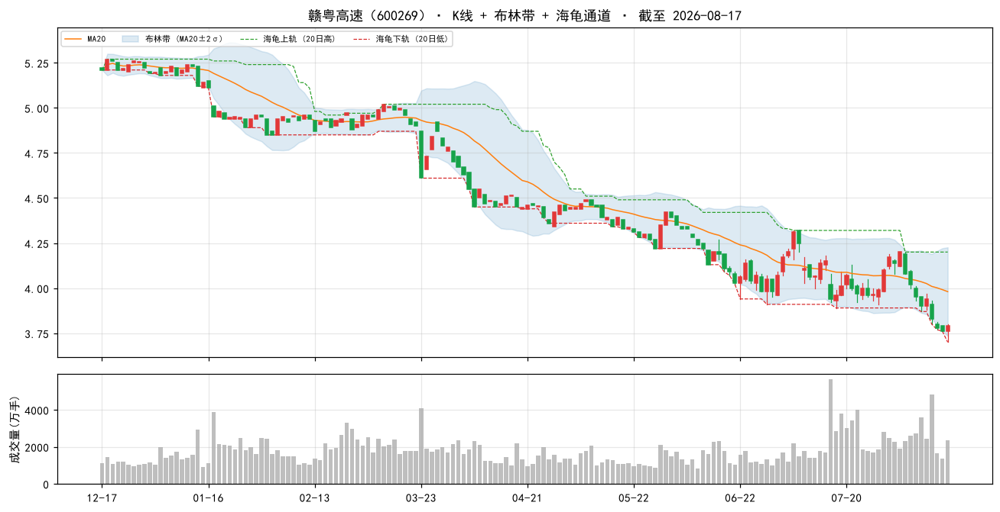

### 2. 鲁泰A（000726）

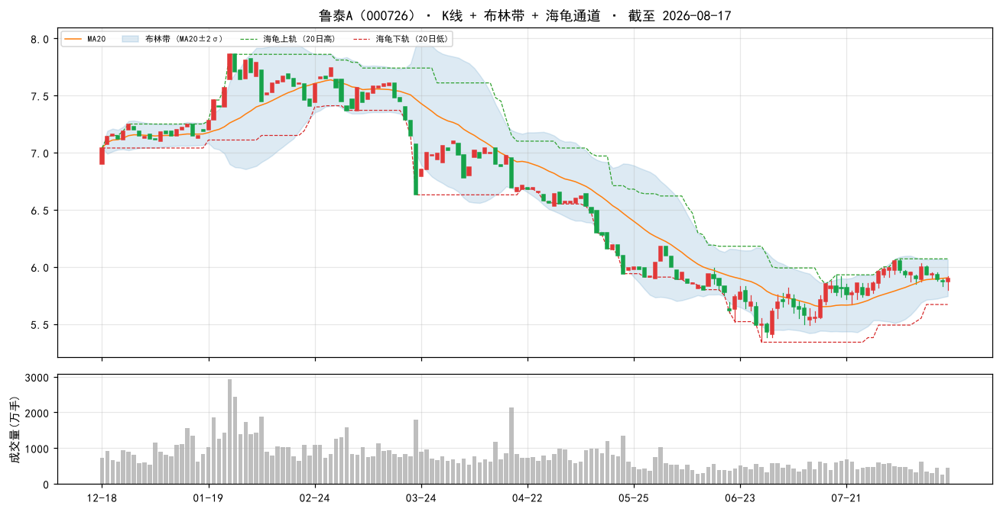

### 3. 浦东金桥（600639）

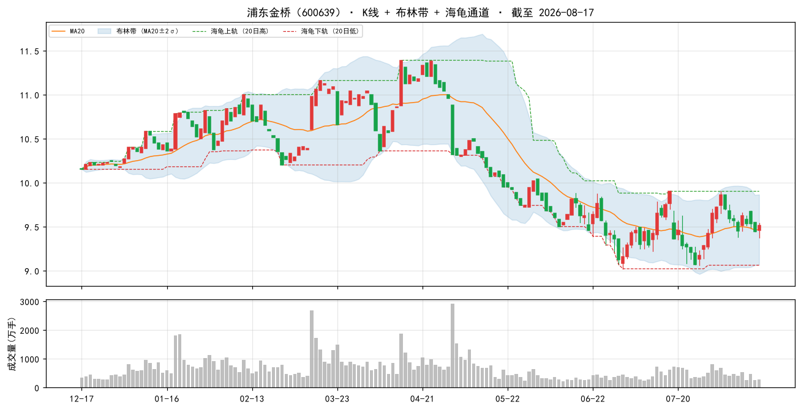

### 4. 安徽建工（600502）

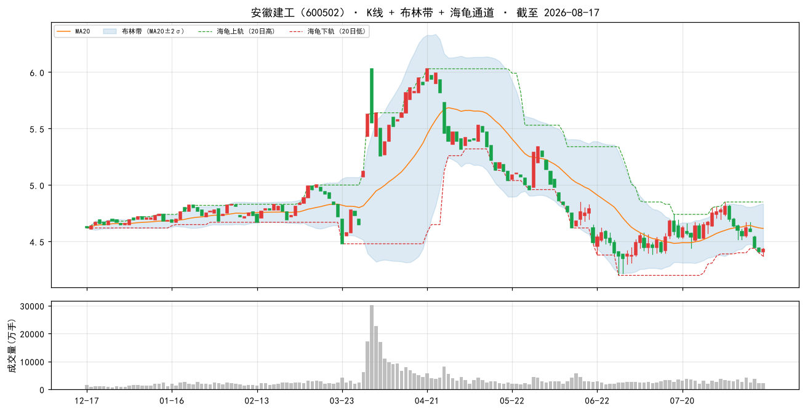

### 5. 山东路桥（000498）

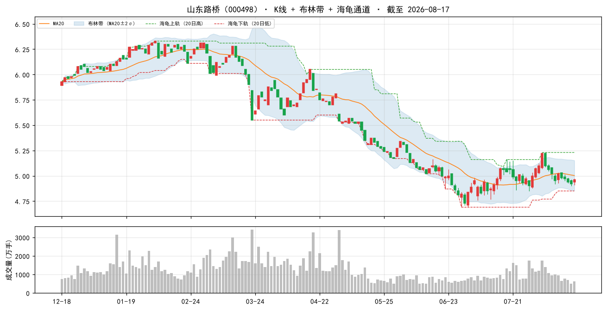

### 6. 大商股份（600694）

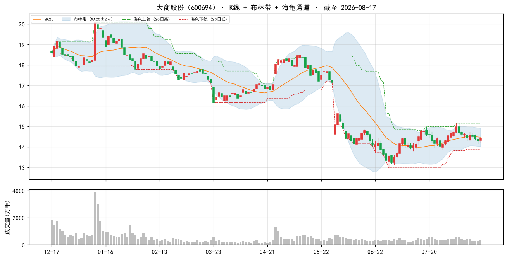

### 7. 中国海油（600938）

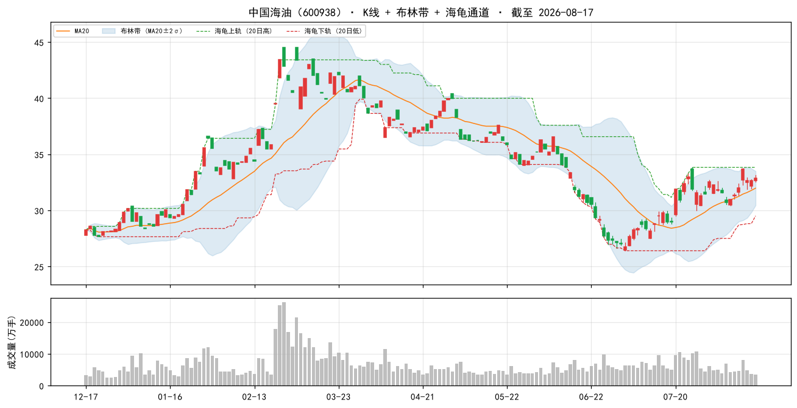

### 8. 中国移动（600941）

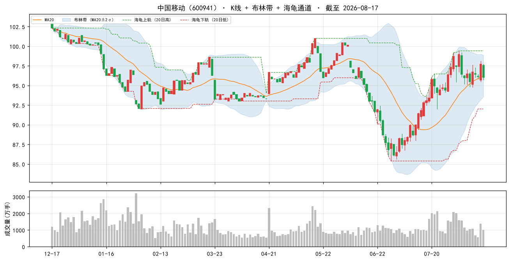

### 9. 中原高速（600020）

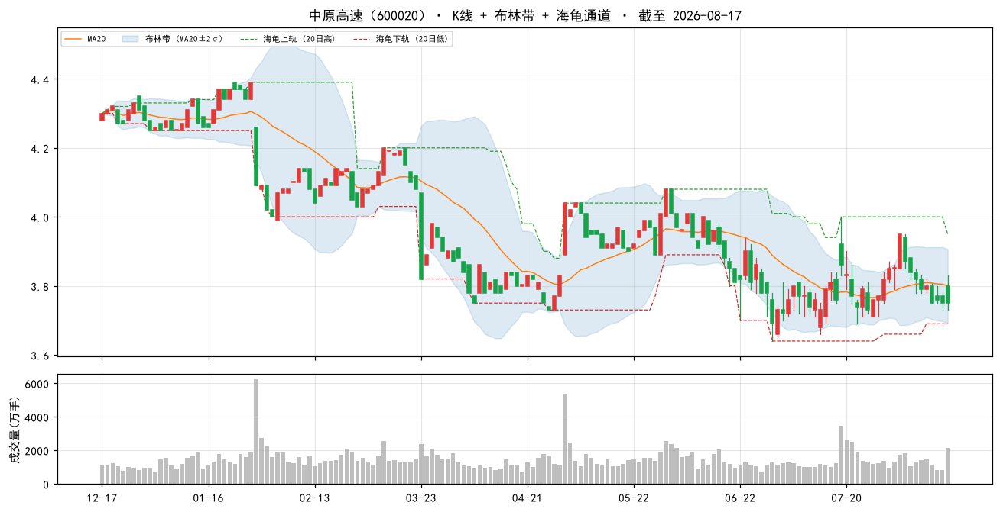

### 10. 现代投资（000900）

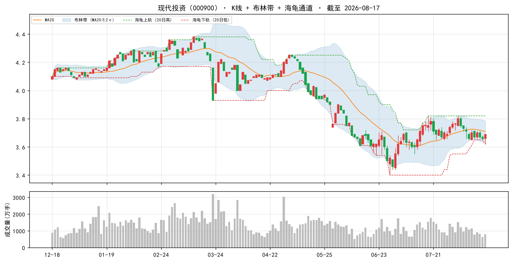

### 当日表现：top-10 vs 大盘

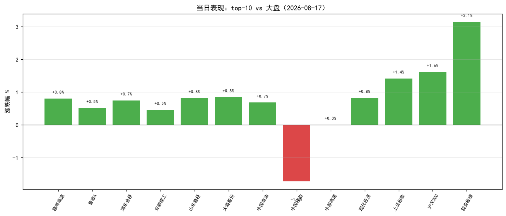

### 组合 vs 沪深300（近 60 交易日，当前名单回放近似）

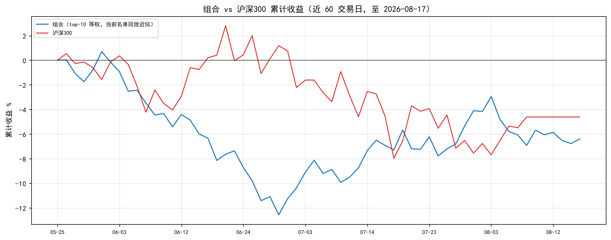

> 组合为**当前 top-10 名单**从窗口起点等权回放（非历史换手），仅作趋势参考；沪深300 用腾讯指数补齐最近两日。

## 九、因子诊断与优化建议

#### 8.1 历史名单表现追踪（至今）

| 名单日 | 股票数 | 名单等权至今 | 沪深300至今 | 超额 |
|---|---|---|---|---|
| 2026-08-11 | 50 | -0.9% | — | — |
| 2026-08-14 | 50 | +0.4% | — | — |

> 说明：等权持有名单至今（未换手），个股停牌则该日不计入；分红未计入，短期窗口影响小。

#### 8.2 因子 IC 诊断（近 11 周截面，因子 vs 未来 5 日收益）

| 因子 | 方向 | 近11个快照 IC | 有效快照 | 判断 |
|---|---|---|---|---|
| 账面市值比 | 1 | -0.022 | 11 | ⚠ 方向反了/失效 |
| 盈余收益率 | 1 | -0.015 | 11 | 中性（区分度弱） |
| 净资产收益率 | 1 | -0.004 | 11 | 中性（区分度弱） |
| 毛利率 | 1 | -0.014 | 11 | 中性（区分度弱） |
| 现金流/净利 | 1 | -0.000 | 11 | 中性（区分度弱） |
| 60日波动 | -1 | +0.024 | 11 | ⚠ 方向反了/失效 |
| 总市值(ln) | -1 | +0.039 | 11 | ⚠ 方向反了/失效 |

> IC = 因子值与未来 5 日收益的秩相关（越大越有效）；与注册表方向同号且 |IC|≥0.02 判为有效。 单因子短期 IC 波动大，仅供诊断，不构成当日调权依据。

#### 8.3 月度权重校验（research_panel.pkl 滚动）

> 面板数据截至 2026-07-31。仅作参考：**权重建议月度复核，不日更**（防过拟合）。

| 方案 | 最近37月总收益 | 夏普 | 回撤 |
|---|---|---|---|
| 当前 | +16.2% | +0.20 | -17.6% |
| bp0.3+ep0.2+roe0.15+毛利0.1+现金流0.1+低波0.15 | +15.2% | +0.18 | -16.6% |
| 当前+小市值0.05 | +19.7% | +0.25 | -16.7% |
| 纯价值 bp0.6+ep0.4 | +9.8% | +0.10 | -14.4% |

> ⚠ 候选「当前+小市值0.05」近期夏普最高（+0.25）且高于当前——建议**月度复核时**考虑微调权重，勿当日追改。

## 十、AI 亮点点评

> 数据口径：本地因子数据截至 **2026-08-17**（最近交易日收盘）；实时行情/大盘指数/新闻均为 **2026-08-17 16:14 收盘**（非盘中）。今日 08-18 尚未开盘，本点评基于 08-17 收盘快照。

### 10.1 今日市场环境

2026-08-17 为典型的 **risk-on 普涨日**：上证 +1.41%、沪深300 +1.61%、深成 +2.44%、创业板 +3.14%、上证50 +1.00%。风格上**成长/小盘显著占优**（创业板 +3.14% 远超上证50 +1.00%），全市场 4092 只上涨、成交额约 2.38 万亿，广度与量能俱佳。

外围：美股中概涨跌不一（华住 +11%、小鹏 +4%）；原油黄金上涨、铜持平，大宗商品偏强对能源股（中国海油）有托底。要闻层面"AI 基建推动企业举债""美光存储涨超4%"指向海外 AI 硬件链景气，对 A 股科技成长形成情绪映射——这正是创业板领涨的底层逻辑。

对价值/低波组合的含义：**在普涨且成长占优的交易日，深度价值+低波策略系统性跑输指数**，属正常风格偏离，非个股基本面恶化。

### 10.2 组合画像

本期 top-50 为典型 **"深度价值 + 低波动 + 中小市值"防御型组合**：账面市值比均值全市场前 99%、盈余收益率前 92%、60日波动前 93%（低波）、总市值(ln)前 33%（偏小）。PE(中位) 8.7、PB(中位) 0.5、市值中位 119 亿。质量端 ROE/毛利约 6 成分位，属"便宜为主、质量为辅"的估值驱动型名单，叠加低波与小市值增强。

### 10.3 今日表现（top-10，2026-08-17 收盘）

| 代码 | 名称 | 涨跌% | 相对沪深300(+1.61%) |
|---|---|---|---|
| 600269 | 赣粤高速 | +0.80% | -0.81% |
| 000726 | 鲁泰A | +0.51% | -1.10% |
| 600639 | 浦东金桥 | +0.74% | -0.87% |
| 600502 | 安徽建工 | +0.45% | -1.16% |
| 000498 | 山东路桥 | +0.81% | -0.80% |
| 600694 | 大商股份 | +0.84% | -0.77% |
| 600938 | 中国海油 | +0.67% | -0.94% |
| 600941 | 中国移动 | -1.73% | -3.34% |
| 600020 | 中原高速 | 0.00% | -1.61% |
| 000900 | 现代投资 | +0.82% | -0.79% |

组合 9 涨 1 跌，但**全部跑输沪深300 +1.61%**（中国移动 -1.73% 为唯一逆市下跌、拖累最重）。这与低波因子在普涨日"涨得少"的特性一致——防御属性在 risk-on 日转化为相对落后，属策略预期内。

### 10.4 逐票深度分析（top 5）

**① 赣粤高速（600269）** — 江西省高速公路投资运营，收费路产主业，区域经济干线，现金流稳定型防御标的。
- 估值与质量：bp 全市场前 99%（PB≈0.4）、ep 前 99%（PE 估 7.9），极度低估；roe 5.7%（57%分位）偏低，但毛利率 40.8%（前 98%）、现金流/净利 209.7%（前 74%，现金覆盖利润 2 倍）质量扎实。腾讯实时 PE_TTM 12.2 / PB 0.5 / 总市值 88.5 亿。
- 新闻/催化：08-11 半年报点评"核心路产主业稳健，金融投资波动致业绩承压"；华创证券旧研报强推目标价 5.71 元（较现价 3.79 有空间但偏旧）。低估值+高股息防御属性在震荡市受青睐。
- 风险：净利润受参股金融投资波动拖累，主业增长平缓；目标价研报偏旧。
- 结论：**防御型低估底仓，上行弹性有限。**

**② 鲁泰A（000726）** — 全球领先色织布/衬衫面料制造商，出口导向纺织龙头。
- 估值与质量：bp 前 100%（PB≈0.4）、ep 前 100%（PE 估 6.5），极致低估；毛利率仅 7.3%（薄利），现金流/净利 172.4%（前 70%）。腾讯 PE_TTM 8.9 / PB 0.5 / 总市值 34.8 亿（小盘）。
- 新闻/催化：多份点评指出 26Q1 收入与毛利承压，汇兑及公允价值变动/所得税拖累利润；出口型受汇率与关税扰动。
- 风险：毛利薄、利润对汇兑高度敏感；小市值流动性偏弱。
- 结论：**极致低估小盘价值，短期业绩承压，观察/小仓位。**

**③ 浦东金桥（600639）** — 上海浦东园区开发/物业租赁（金桥开发区），持有型物业收租。
- 估值与质量：bp 前 99%（PB 0.5–0.7）、ep 前 99%（PE 估 7.8），低估；现金流/净利 379.8%（前 85%，收租模式现金极好），roe 69%分位。腾讯 PE_TTM 10.2 / PB 0.7 / 总市值 80.9 亿。
- 新闻/催化：04-21 点评"收入高增利润增长，经营性物业出租率稳中有升"；融资净买入 183 万。园区收租+浦东区域逻辑，质量优于纯建筑股。
- 风险：区域房地产周期、租金增长放缓。
- 结论：**现金流强劲的园区收租防御标的，质量占优。**

**④ 安徽建工（600502）** — 安徽国资背景建筑工程施工/基建总承包，受益内需基建。
- 估值与质量：bp 前 100%（PB 0.4–0.6）、ep 前 100%（PE 估 4.9，极低），但**现金流/净利 -868.9%（前 9%，利润无现金支撑）**、毛利率仅 3.1%。腾讯 PE_TTM 4.9 / PB 0.6 / 总市值 76 亿。典型"低估值陷阱"预警。
- 新闻/催化：05-13 点评"收入利润稳健增长，重点项目持续落地"；融资净买入 1321 万（环比 +502%，资金关注）；行业周报看好内需/出海/算力。
- 风险：现金流严重为负（应收账款/垫资），低估值可能是价值陷阱；建筑回款周期长。
- 结论：**低估值+政策催化，但现金流质量差，谨慎控仓。**

**⑤ 山东路桥（000498）** — 山东国资公路/桥梁工程施工，路桥基建。
- 估值与质量：bp 前 100%（PB 0.3–0.5，极低）、ep 前 100%（PE 估 3.6，全组合最低），但**现金流/净利 -1839.7%（前 4%，极差）**、毛利率 3.6%。腾讯 PE_TTM 3.6 / PB 0.5 / 总市值 71.9 亿。
- 新闻/催化：06-17 最新点评"25年新签订单较快增长，现金流同比大幅改善"；"进城出海"激发新动能；Q1 订单继续增长。正面订单+现金流改善叙事。
- 风险：现金流仍为负（虽同比改善）；低毛利工程承包；地方基建投资节奏。
- 结论：**极致低估+订单改善，弹性与风险并存。**

### 10.5 操作建议与风险

- **风格偏离属正常**：本组合在 08-17 普涨日全员跑输指数，是低波/价值因子在 risk-on 日的固有表现，**不代表基本面弱化**，勿误判为"弱势"。
- **动量在 A 股反向**（2018–2026 实证）：勿因近期涨幅追高；本方案不含动量因子。
- **显著风险点（必须关注）**：
  1. **因子 IC 全线反向/失效**（近 11 周）：bp -0.022、ep -0.015、roe -0.004、毛利 -0.014、现金流 ≈0，且 60日波动（+0.024）、ln_cap（+0.039）IC 方向**恰好与策略相反**——即近期"大盘成长/高波动"跑赢，价值小盘策略正与当前市场风格背离。建议**月度复核权重**，勿日更追改。
  2. **建筑股现金流陷阱**：安徽建工、山东路桥现金流/净利分别为 -869% / -1840%，低估值缺乏现金支撑，警惕价值陷阱；仅适合小仓位、设 -8% 止损。
  3. **中国移动 -1.73% 逆市拖累**：防御大盘股在风险偏好回升时遭资金切换，属风格轮动，非经营问题。
  4. **非确定性**：同数据重跑 top-10 可能变动（历史已观测），本名单为当日截面快照。
- **仓位与频率**：建议月度调仓、等权持有、单票仓位别太重（小市值波动大），单票止损参考 -8%。名单不构成调仓指令。
- **数据日期说明**：本地因子截至 2026-08-17；实时行情/指数/新闻同为 08-17 收盘（今日 08-18 未开盘）。PE/PB 含估算口径，腾讯实时 PE 与因子换算 PE 略有差异，勿单看估值数字。
