# 每日选股报告 · 2026-08-20

> 方案：**smallcap** · 权重 账面市值比 0.30 + 盈余收益率 0.20 + 净资产收益率 0.15 + 毛利率 0.10 + 现金流/净利 0.10 + 60日波动 0.15 + 总市值(ln) 0.10 · 选 top-50 · 等权持仓（建议月频调仓）
> 历史验证 2018-2026（含交易成本）：总收益 **+12.8%** · 夏普 +0.02 · 最大回撤 -27.6%
> 生成：2026-08-20 19:53 · 数据截至 2026-08-20

## 一、市场概况

### 1.1 主要指数表现

| 指数 | 收盘 | 涨跌幅 |
|---|---|---|

### 1.2 市场广度

- 全市场 **5236 只**：上涨 **3943** / 下跌 **1199** / 平盘 94
- 总成交额 ≈ **20347 亿元**

- 当日可交易股票池（剔除 ST/涨跌停/停牌/次新/B股/北交所/金融股）：**4841 只**
- 打分因子：`smallcap` 权重因子共 7 个

## 二、选股方案与方法

- 模型：多因子截面打分。每因子先 [1%,99%] 缩尾去极端 → z-score 标准化 → 乘方向与权重加权求和 → 取 top-50 等权。
- 权重：账面市值比 0.3、盈余收益率 0.2、净资产收益率 0.15、毛利率 0.1、现金流/净利 0.1、60日波动 0.15、总市值(ln) 0.1（研究管线 `validate_daily_schemes.py` 历史验证选定）。
- 无未来函数：基本面用「报告期 + 4 个月披露滞后」；动量 skip 最近 20 交易日；股票池剔除 ST/涨跌停/停牌/次新(<120日)/B股/北交所/金融股。

### 2.1 因子定义与公式

> 打分公式：`综合得分 = Σ wᵢ × 方向ᵢ × z-score(缩尾[1%,99%] 因子ᵢ)`，缺失因子贡献 0。

| 因子 | 方向 | 权重 | 公式/定义 | 数据源 |
|---|---|---|---|---|
| 账面市值比（bp） | 1（越大越好） | 0.30 | 净资产(合并A003000000) / 总市值(元)（账面市值比） | fs_combas+price |
| 盈余收益率（ep_ttm） | 1（越大越好） | 0.20 | TTM归母净利润 / 总市值(元)（盈余收益率） | fs_comins+price |
| 净资产收益率（roe_ttm） | 1（越大越好） | 0.15 | TTM净利润 / 平均净资产 | fs_comins+fs_combas |
| 毛利率（gross_margin） | 1（越大越好） | 0.10 | (收入-营业总成本)/收入 | fs_comins |
| 现金流/净利（op_cf_ratio） | 1（越大越好） | 0.10 | 经营现金流净额/净利润 | fs_comscfd+fs_comins |
| 60日波动（vol_60d） | -1（越小越好） | 0.15 | 60日日收益率标准差，年化×√252 | stock_daily |
| 总市值(ln)（ln_cap） | -1（越小越好） | 0.10 | ln(推算总市值, 元) | stock_daily |

- 选股数：top-50 等权（建议月频调仓）；方向由 `factor_registry.json` 统一管理。

## 三、今日 Top-50 名单

> PE/PB 为按盈余收益率(ep_ttm)/账面市值比(bp)换算的**估算值**，仅供参考；baostock 段市值用参考股本×收盘推算，个别票 PE/PB 可能失真。

| 排名 | 代码 | 名称 | 收盘价 | PE(估) | PB(估) | 综合得分 | 账面市值比 | 盈余收益率 | 净资产收益率 | 毛利率 | 现金流/净利 | 60日波动 | 总市值(ln) |
|---|---|---|---|---|---|---|---|---|---|---|---|---|---|
| 1 | 600269 | 赣粤高速 | 3.7900 | 7.9 | 0.4 | 2.09 | 2.2311 | 0.1273 | 0.0570 | 40.8% | 209.7% | 25.6% | 22.9038 |
| 2 | 000726 | 鲁泰A | 5.9800 | 6.6 | 0.4 | 2.05 | 2.7906 | 0.1524 | 0.0546 | 7.3% | 172.4% | 21.4% | 21.9865 |
| 3 | 600639 | 浦东金桥 | 9.5600 | 7.8 | 0.5 | 1.93 | 1.8530 | 0.1283 | 0.0692 | 11.7% | 379.8% | 20.9% | 22.8186 |
| 4 | 600502 | 安徽建工 | 4.4700 | 5.0 | 0.4 | 1.86 | 2.7631 | 0.2017 | 0.0730 | 3.1% | -868.9% | 28.4% | 22.7610 |
| 5 | 600694 | 大商股份 | 14.5500 | 10.0 | 0.5 | 1.85 | 1.8253 | 0.0998 | 0.0547 | 19.5% | 193.2% | 26.4% | 22.3348 |
| 6 | 000498 | 山东路桥 | 4.9700 | 3.6 | 0.3 | 1.84 | 3.4715 | 0.2781 | 0.0801 | 3.6% | -1839.7% | 20.4% | 22.7665 |
| 7 | 600938 | 中国海油 | 33.3000 | 0.8 | 0.1 | 1.84 | 8.4074 | 1.2521 | 0.1489 | 44.8% | 140.9% | 41.3% | 25.3241 |
| 8 | 000900 | 现代投资 | 3.6700 | 14.1 | 0.4 | 1.83 | 2.2774 | 0.0707 | 0.0310 | 15.2% | 24.9% | 19.3% | 22.4407 |
| 9 | 600020 | 中原高速 | 3.7800 | 13.3 | 0.5 | 1.82 | 1.8789 | 0.0753 | 0.0401 | 33.2% | 119.8% | 21.8% | 22.8628 |
| 10 | 000544 | 中原环保 | 7.3500 | 6.7 | 0.6 | 1.82 | 1.5921 | 0.1485 | 0.0933 | 36.4% | -111.9% | 20.2% | 22.6923 |
| 11 | 600941 | 中国移动 | 96.7000 | 0.6 | 0.1 | 1.81 | 16.2979 | 1.5557 | 0.0955 | 13.3% | 243.5% | 18.7% | 25.1926 |
| 12 | 000028 | 国药一致 | 19.8400 | 8.8 | 0.5 | 1.80 | 1.9630 | 0.1138 | 0.0580 | 2.2% | -1021.1% | 25.9% | 22.9878 |
| 13 | 600035 | 楚天高速 | 3.3800 | 10.8 | 0.6 | 1.75 | 1.6724 | 0.0923 | 0.0552 | 27.4% | 175.9% | 17.6% | 22.4174 |
| 14 | 600548 | 深高速 | 8.2800 | 12.6 | 0.5 | 1.74 | 1.8534 | 0.0796 | 0.0430 | 25.8% | 201.9% | 20.8% | 23.4195 |
| 15 | 601107 | 四川成渝 | 5.5600 | 7.9 | 0.6 | 1.74 | 1.7104 | 0.1259 | 0.0736 | 23.1% | 197.6% | 32.5% | 23.2102 |
| 16 | 600874 | 创业环保 | 5.6400 | 7.9 | 0.7 | 1.72 | 1.5182 | 0.1274 | 0.0839 | 28.9% | -44.9% | 18.7% | 22.6605 |
| 17 | 601811 | 新华文轩 | 12.0400 | 6.1 | 0.6 | 1.71 | 1.6316 | 0.1642 | 0.1006 | 10.0% | -66.4% | 22.5% | 22.9782 |
| 18 | 600585 | 海螺水泥 | 17.6100 | 9.1 | 0.4 | 1.69 | 2.7519 | 0.1103 | 0.0401 | 8.5% | 22.2% | 24.2% | 24.9780 |
| 19 | 600704 | 物产中大 | 4.8900 | 7.0 | 0.5 | 1.68 | 1.8250 | 0.1428 | 0.0782 | 1.5% | -797.1% | 21.4% | 23.9536 |
| 20 | 601318 | 中国平安 | 52.1400 | 4.2 | 0.5 | 1.65 | 1.8321 | 0.2389 | 0.1304 | 25.4% | 523.8% | 31.9% | 27.0437 |
| 21 | 601186 | 中国铁建 | 6.0700 | 4.0 | 0.2 | 1.63 | 5.0061 | 0.2521 | 0.0504 | 2.6% | -1424.6% | 18.9% | 24.9693 |
| 22 | 601668 | 中国建筑 | 4.4300 | 4.8 | 0.4 | 1.62 | 2.7592 | 0.2072 | 0.0751 | 3.9% | -554.6% | 18.1% | 25.9330 |
| 23 | 601800 | 中国交建 | 5.9300 | 5.3 | 0.2 | 1.62 | 4.4583 | 0.1904 | 0.0427 | 3.8% | -1344.3% | 23.5% | 24.9761 |
| 24 | 601333 | 广深铁路 | 2.9500 | 10.8 | 0.6 | 1.61 | 1.7354 | 0.0922 | 0.0531 | 10.6% | -6.5% | 20.0% | 23.5371 |
| 25 | 600528 | 中铁工业 | 7.0100 | 11.4 | 0.6 | 1.61 | 1.7984 | 0.0878 | 0.0488 | 4.5% | -226.2% | 21.2% | 23.4688 |
| 26 | 000932 | 华菱钢铁 | 3.5900 | 11.0 | 0.4 | 1.60 | 2.2698 | 0.0913 | 0.0402 | 0.4% | -835.9% | 27.9% | 23.9260 |
| 27 | 600104 | 上汽集团 | 10.1800 | 11.6 | 0.4 | 1.59 | 2.5680 | 0.0864 | 0.0336 | 2.3% | 1057.0% | 24.4% | 25.4856 |
| 28 | 000501 | 武商集团 | 7.1300 | 34.0 | 0.5 | 1.59 | 2.0128 | 0.0294 | 0.0146 | 8.4% | 379.1% | 31.3% | 22.4249 |
| 29 | 000709 | 河钢股份 | 2.0900 | 19.8 | 0.4 | 1.58 | 2.7564 | 0.0506 | 0.0183 | 0.3% | 1069.8% | 26.4% | 23.7962 |
| 30 | 002061 | 浙江交科 | 3.5100 | 9.8 | 0.6 | 1.58 | 1.7081 | 0.1024 | 0.0600 | 3.2% | -778.0% | 24.5% | 22.9626 |
| 31 | 600827 | 百联股份 | 7.5900 | 9.9 | 0.6 | 1.58 | 1.6899 | 0.1010 | 0.0598 | 2.7% | 133.1% | 26.9% | 23.2229 |
| 32 | 600717 | 天津港 | 4.2700 | 11.7 | 0.6 | 1.58 | 1.6543 | 0.0857 | 0.0518 | 22.8% | 107.3% | 25.9% | 23.2375 |
| 33 | 600011 | 华能国际 | 6.6600 | 5.3 | 0.5 | 1.55 | 1.8365 | 0.1901 | 0.1035 | 12.1% | 277.4% | 47.0% | 25.0171 |
| 34 | 601390 | 中国中铁 | 4.3600 | 4.2 | 0.2 | 1.55 | 4.1919 | 0.2377 | 0.0567 | 2.7% | -1982.8% | 25.2% | 25.2151 |
| 35 | 600051 | 宁波联合 | 6.3600 | 26.1 | 0.6 | 1.55 | 1.7296 | 0.0383 | 0.0222 | 0.2% | 1117.3% | 31.3% | 21.4049 |
| 36 | 601607 | 上海医药 | 16.6600 | 8.0 | 0.6 | 1.54 | 1.6635 | 0.1250 | 0.0752 | 3.2% | -71.2% | 20.6% | 24.5621 |
| 37 | 002394 | 联发股份 | 9.5900 | 12.8 | 0.7 | 1.53 | 1.3976 | 0.0780 | 0.0558 | 7.3% | 3922.9% | 47.0% | 21.8560 |
| 38 | 601669 | 中国电建 | 4.6300 | 8.6 | 0.5 | 1.51 | 2.1249 | 0.1169 | 0.0550 | 2.3% | -2261.2% | 27.9% | 25.1023 |
| 39 | 600064 | 南京高科 | 7.7400 | 7.6 | 0.7 | 1.50 | 1.4743 | 0.1318 | 0.0894 | -0.1% | 28.0% | 22.0% | 23.3180 |
| 40 | 600033 | 福建高速 | 3.5500 | 10.2 | 0.8 | 1.50 | 1.2922 | 0.0983 | 0.0761 | 51.6% | 221.1% | 22.2% | 22.9998 |
| 41 | 600508 | 上海能源 | 8.8000 | 33.5 | 0.5 | 1.49 | 2.0056 | 0.0298 | 0.0149 | 5.9% | 399.8% | 42.0% | 22.5733 |
| 42 | 600017 | 日照港 | 2.6800 | 18.8 | 0.6 | 1.49 | 1.7062 | 0.0532 | 0.0312 | 7.0% | 357.9% | 21.8% | 22.8326 |
| 43 | 000589 | 贵州轮胎 | 4.2500 | 9.0 | 0.7 | 1.49 | 1.3911 | 0.1111 | 0.0799 | 6.8% | 208.3% | 23.3% | 22.6114 |
| 44 | 000027 | 深圳能源 | 6.1400 | 14.6 | 0.6 | 1.49 | 1.8129 | 0.0685 | 0.0378 | 18.0% | 96.8% | 32.1% | 24.0978 |
| 45 | 603018 | 华设集团 | 5.2400 | 12.6 | 0.7 | 1.48 | 1.5211 | 0.0794 | 0.0522 | 9.4% | -160.4% | 26.0% | 21.9995 |
| 46 | 600057 | 厦门象屿 | 6.2600 | 13.6 | 0.5 | 1.48 | 1.9137 | 0.0734 | 0.0384 | 1.7% | -1478.6% | 28.7% | 23.6015 |
| 47 | 002375 | 亚厦股份 | 3.6500 | 14.9 | 0.6 | 1.47 | 1.7019 | 0.0672 | 0.0395 | 3.9% | -584.5% | 29.9% | 22.3107 |
| 48 | 600027 | 华电国际 | 4.5100 | 7.5 | 0.6 | 1.47 | 1.5911 | 0.1329 | 0.0835 | 7.4% | 315.5% | 31.6% | 24.5215 |
| 49 | 600742 | 富维股份 | 7.5700 | 12.6 | 0.7 | 1.47 | 1.5163 | 0.0797 | 0.0525 | 2.7% | 658.6% | 25.8% | 22.4505 |
| 50 | 000778 | 新兴铸管 | 3.7000 | 14.6 | 0.6 | 1.46 | 1.8175 | 0.0687 | 0.0378 | 2.0% | -636.1% | 28.1% | 23.4086 |

## 四、组合画像（top-50 统计）

| 维度 | 数值 | 含义 |
|---|---|---|
| 账面市值比平均百分位 | **99%** | 组合在该因子上相对全市场的位置（越大越好） |
| 盈余收益率平均百分位 | **96%** | 组合在该因子上相对全市场的位置（越大越好） |
| 净资产收益率平均百分位 | **62%** | 组合在该因子上相对全市场的位置（越大越好） |
| 毛利率平均百分位 | **64%** | 组合在该因子上相对全市场的位置（越大越好） |
| 现金流/净利平均百分位 | **50%** | 组合在该因子上相对全市场的位置（越大越好） |
| 60日波动平均百分位 | **94%** | 组合在该因子上相对全市场的位置（越大越好） |
| 总市值(ln)平均百分位 | **31%** | 组合在该因子上相对全市场的位置（越大越好） |
| PE(中位数, 估) | 9.8 | 组合估值水平 |
| PB(中位数, 估) | 0.5 | 组合市净率水平 |
| 市值(中位数) | 121.8 亿元 | 组合规模风格 |

## 五、前 10 入选理由（因子百分位）

> 百分位为当日全市场该因子的分布位置（0-100，**已按因子方向归一**，越大越好）。

### 1. **赣粤高速**（600269，收盘 3.7900）

- 账面市值比 2.2311（权重 0.30，全市场前 99%）
- 盈余收益率 0.1273（权重 0.20，全市场前 99%）
- 净资产收益率 0.0570（权重 0.15，全市场前 62%）
- 毛利率 40.8%（权重 0.10，全市场前 98%）
- 现金流/净利 209.7%（权重 0.10，全市场前 74%）
- 60日波动 25.6%（权重 0.15，全市场前 97%）
- 总市值(ln) 22.9038（权重 0.10，全市场前 37%）

### 2. **鲁泰A**（000726，收盘 5.9800）

- 账面市值比 2.7906（权重 0.30，全市场前 100%）
- 盈余收益率 0.1524（权重 0.20，全市场前 100%）
- 净资产收益率 0.0546（权重 0.15，全市场前 60%）
- 毛利率 7.3%（权重 0.10，全市场前 62%）
- 现金流/净利 172.4%（权重 0.10，全市场前 70%）
- 60日波动 21.4%（权重 0.15，全市场前 99%）
- 总市值(ln) 21.9865（权重 0.10，全市场前 76%）

### 3. **浦东金桥**（600639，收盘 9.5600）

- 账面市值比 1.8530（权重 0.30，全市场前 99%）
- 盈余收益率 0.1283（权重 0.20，全市场前 99%）
- 净资产收益率 0.0692（权重 0.15，全市场前 68%）
- 毛利率 11.7%（权重 0.10，全市场前 75%）
- 现金流/净利 379.8%（权重 0.10，全市场前 85%）
- 60日波动 20.9%（权重 0.15，全市场前 99%）
- 总市值(ln) 22.8186（权重 0.10，全市场前 40%）

### 4. **安徽建工**（600502，收盘 4.4700）

- 账面市值比 2.7631（权重 0.30，全市场前 100%）
- 盈余收益率 0.2017（权重 0.20，全市场前 100%）
- 净资产收益率 0.0730（权重 0.15，全市场前 70%）
- 毛利率 3.1%（权重 0.10，全市场前 46%）
- 现金流/净利 -868.9%（权重 0.10，全市场前 9%）
- 60日波动 28.4%（权重 0.15，全市场前 94%）
- 总市值(ln) 22.7610（权重 0.10，全市场前 42%）

### 5. **大商股份**（600694，收盘 14.5500）

- 账面市值比 1.8253（权重 0.30，全市场前 99%）
- 盈余收益率 0.0998（权重 0.20，全市场前 98%）
- 净资产收益率 0.0547（权重 0.15，全市场前 60%）
- 毛利率 19.5%（权重 0.10，全市场前 88%）
- 现金流/净利 193.2%（权重 0.10，全市场前 72%）
- 60日波动 26.4%（权重 0.15，全市场前 96%）
- 总市值(ln) 22.3348（权重 0.10，全市场前 60%）

### 6. **山东路桥**（000498，收盘 4.9700）

- 账面市值比 3.4715（权重 0.30，全市场前 100%）
- 盈余收益率 0.2781（权重 0.20，全市场前 100%）
- 净资产收益率 0.0801（权重 0.15，全市场前 74%）
- 毛利率 3.6%（权重 0.10，全市场前 48%）
- 现金流/净利 -1839.7%（权重 0.10，全市场前 4%）
- 60日波动 20.4%（权重 0.15，全市场前 99%）
- 总市值(ln) 22.7665（权重 0.10，全市场前 42%）

### 7. **中国海油**（600938，收盘 33.3000）

- 账面市值比 8.4074（权重 0.30，全市场前 100%）
- 盈余收益率 1.2521（权重 0.20，全市场前 100%）
- 净资产收益率 0.1489（权重 0.15，全市场前 93%）
- 毛利率 44.8%（权重 0.10，全市场前 99%）
- 现金流/净利 140.9%（权重 0.10，全市场前 66%）
- 60日波动 41.3%（权重 0.15，全市场前 72%）
- 总市值(ln) 25.3241（权重 0.10，全市场前 3%）

### 8. **现代投资**（000900，收盘 3.6700）

- 账面市值比 2.2774（权重 0.30，全市场前 99%）
- 盈余收益率 0.0707（权重 0.20，全市场前 93%）
- 净资产收益率 0.0310（权重 0.15，全市场前 45%）
- 毛利率 15.2%（权重 0.10，全市场前 83%）
- 现金流/净利 24.9%（权重 0.10，全市场前 45%）
- 60日波动 19.3%（权重 0.15，全市场前 100%）
- 总市值(ln) 22.4407（权重 0.10，全市场前 55%）

### 9. **中原高速**（600020，收盘 3.7800）

- 账面市值比 1.8789（权重 0.30，全市场前 99%）
- 盈余收益率 0.0753（权重 0.20，全市场前 94%）
- 净资产收益率 0.0401（权重 0.15，全市场前 51%）
- 毛利率 33.2%（权重 0.10，全市场前 96%）
- 现金流/净利 119.8%（权重 0.10，全市场前 62%）
- 60日波动 21.8%（权重 0.15，全市场前 99%）
- 总市值(ln) 22.8628（权重 0.10，全市场前 39%）

### 10. **中原环保**（000544，收盘 7.3500）

- 账面市值比 1.5921（权重 0.30，全市场前 98%）
- 盈余收益率 0.1485（权重 0.20，全市场前 100%）
- 净资产收益率 0.0933（权重 0.15，全市场前 80%）
- 毛利率 36.4%（权重 0.10，全市场前 98%）
- 现金流/净利 -111.9%（权重 0.10，全市场前 28%）
- 60日波动 20.2%（权重 0.15，全市场前 99%）
- 总市值(ln) 22.6923（权重 0.10，全市场前 45%）

## 六、口径与风险提示

- 因子无未来函数：基本面用「报告期 + 4 个月滞后」；动量 skip 最近 20 交易日；股票池剔除 ST/涨跌停/次新/金融股。
- **动量在 A 股 2018-2026 方向反向**，本方案不含动量因子；成长因子不显著，仅作参考。
- 小市值增强（ln_cap）是 A 股 2018-2026 有效因子，但小市值波动大、流动性差，请控制单票仓位。
- **名单是「当日截面快照」，不构成调仓指令**。建议月度调仓、等权持有，避免高频换手吞噬收益；单票止损参考 -8%。
- 数据源：CSMAR 全量 + baostock 每日增量；本地因子数据可能落后 1 天（baostock 滞后），实时行情请见 Claude 点评补充。

## 七、基本面与估值快照

> 估值：腾讯行情实时（PE_TTM/PB/总市值，数据日期 2026-08-20）；财务：CSMAR 最新报告期（4 个月披露滞后）。 可与此前因子换算的 PE/PB(估) 互相印证。

| 代码 | 名称 | 现价 | 涨跌% | PE_TTM | PB | 总市值(亿) | 盈余收益率 | ROE_TTM | 毛利率 | 现金流/净利 |
|---|---|---|---|---|---|---|---|---|---|---|
| 600269 | 赣粤高速 | 3.8 | 1.1% | 12.2 | 0.5 | 88.5 | 0.127 | 0.057 | 40.8% | 209.7% |
| 000726 | 鲁泰A | 6.0 | 1.9% | 9.1 | 0.5 | 35.2 | 0.152 | 0.055 | 7.3% | 172.4% |
| 600639 | 浦东金桥 | 9.6 | 0.7% | 10.3 | 0.7 | 81.3 | 0.128 | 0.069 | 11.7% | 379.8% |
| 600502 | 安徽建工 | 4.5 | 0.5% | 5.0 | 0.6 | 76.7 | 0.202 | 0.073 | 3.1% | -868.9% |
| 600694 | 大商股份 | 14.6 | 1.6% | 11.0 | 0.6 | 55.1 | 0.100 | 0.055 | 19.5% | 193.2% |
| 000498 | 山东路桥 | 5.0 | 0.4% | 3.6 | 0.5 | 72.0 | 0.278 | 0.080 | 3.6% | -1839.7% |
| 600938 | 中国海油 | 33.3 | -0.1% | 12.7 | 1.9 | 995.7 | 1.252 | 0.149 | 44.8% | 140.9% |
| 000900 | 现代投资 | 3.7 | 0.8% | 14.1 | 0.5 | 55.7 | 0.071 | 0.031 | 15.2% | 24.9% |
| 600020 | 中原高速 | 3.8 | 1.1% | 13.0 | 0.7 | 85.0 | 0.075 | 0.040 | 33.2% | 119.8% |
| 000544 | 中原环保 | 7.3 | 1.5% | 6.7 | 0.8 | 71.6 | 0.148 | 0.093 | 36.4% | -111.9% |
| 600941 | 中国移动 | 96.7 | -0.5% | 15.9 | 1.5 | 873.0 | 1.556 | 0.095 | 13.3% | 243.5% |
| 000028 | 国药一致 | 19.8 | -0.5% | 11.3 | 0.6 | 104.3 | 0.114 | 0.058 | 2.2% | -1021.1% |
| 600035 | 楚天高速 | 3.4 | 0.6% | 10.8 | 0.6 | 54.4 | 0.092 | 0.055 | 27.4% | 175.9% |
| 600548 | 深高速 | 8.3 | -0.5% | 17.8 | 0.9 | 141.9 | 0.080 | 0.043 | 25.8% | 201.9% |
| 601107 | 四川成渝 | 5.6 | -0.2% | 11.5 | 1.0 | 120.2 | 0.126 | 0.074 | 23.1% | 197.6% |
| 600874 | 创业环保 | 5.6 | 0.7% | 10.0 | 0.9 | 69.4 | 0.127 | 0.084 | 28.9% | -44.9% |
| 601811 | 新华文轩 | 12.0 | 0.5% | 9.5 | 1.0 | 95.3 | 0.164 | 0.101 | 10.0% | -66.4% |
| 600585 | 海螺水泥 | 17.6 | 0.9% | 12.0 | 0.5 | 700.4 | 0.110 | 0.040 | 8.5% | 22.2% |
| 600704 | 物产中大 | 4.9 | 1.0% | 7.0 | 0.6 | 252.9 | 0.143 | 0.078 | 1.5% | -797.1% |
| 601318 | 中国平安 | 52.1 | 0.1% | 7.1 | 1.0 | 5558.2 | 0.239 | 0.130 | 25.4% | 523.8% |
| 601186 | 中国铁建 | 6.1 | 1.7% | 4.7 | 0.3 | 698.2 | 0.252 | 0.050 | 2.6% | -1424.6% |
| 601668 | 中国建筑 | 4.4 | 0.5% | 4.8 | 0.4 | 1830.5 | 0.207 | 0.075 | 3.9% | -554.6% |
| 601800 | 中国交建 | 5.9 | 1.7% | 7.2 | 0.3 | 695.2 | 0.190 | 0.043 | 3.8% | -1344.3% |
| 601333 | 广深铁路 | 3.0 | 0.7% | 13.6 | 0.7 | 166.7 | 0.092 | 0.053 | 10.6% | -6.5% |
| 600528 | 中铁工业 | 7.0 | 0.6% | 11.4 | 0.6 | 155.7 | 0.088 | 0.049 | 4.5% | -226.2% |
| 000932 | 华菱钢铁 | 3.6 | 0.3% | 10.9 | 0.5 | 246.0 | 0.091 | 0.040 | 0.4% | -835.9% |
| 600104 | 上汽集团 | 10.2 | 1.9% | 11.6 | 0.4 | 1170.2 | 0.086 | 0.034 | 2.3% | 1057.0% |
| 000501 | 武商集团 | 7.1 | 1.1% | 34.0 | 0.5 | 54.8 | 0.029 | 0.015 | 8.4% | 379.1% |
| 000709 | 河钢股份 | 2.1 | 1.9% | 19.8 | 0.4 | 216.0 | 0.051 | 0.018 | 0.3% | 1069.8% |
| 002061 | 浙江交科 | 3.5 | 0.9% | 9.7 | 0.6 | 91.2 | 0.102 | 0.060 | 3.2% | -778.0% |
| 600827 | 百联股份 | 7.6 | 1.3% | 11.0 | 0.7 | 121.8 | 0.101 | 0.060 | 2.7% | 133.1% |
| 600717 | 天津港 | 4.3 | 0.5% | 11.7 | 0.6 | 123.6 | 0.086 | 0.052 | 22.8% | 107.3% |
| 600011 | 华能国际 | 6.7 | -0.3% | 8.9 | 1.6 | 732.5 | 0.190 | 0.103 | 12.1% | 277.4% |
| 601390 | 中国中铁 | 4.4 | 1.2% | 5.0 | 0.3 | 886.1 | 0.238 | 0.057 | 2.7% | -1982.8% |
| 600051 | 宁波联合 | 6.4 | 2.1% | 26.1 | 0.6 | 19.8 | 0.038 | 0.022 | 0.2% | 1117.3% |
| 601607 | 上海医药 | 16.7 | 1.8% | 10.6 | 0.8 | 464.7 | 0.125 | 0.075 | 3.2% | -71.2% |
| 002394 | 联发股份 | 9.6 | 1.2% | 22.4 | 0.8 | 31.0 | 0.078 | 0.056 | 7.3% | 3922.9% |
| 601669 | 中国电建 | 4.6 | 0.2% | 8.5 | 0.6 | 605.2 | 0.117 | 0.055 | 2.3% | -2261.2% |
| 600064 | 南京高科 | 7.7 | 1.6% | 7.9 | 0.7 | 133.9 | 0.132 | 0.089 | -0.1% | 28.0% |
| 600033 | 福建高速 | 3.5 | 0.3% | 10.2 | 0.8 | 97.4 | 0.098 | 0.076 | 51.6% | 221.1% |
| 600508 | 上海能源 | 8.8 | 0.5% | 46.9 | 0.7 | 89.0 | 0.030 | 0.015 | 5.9% | 399.8% |
| 600017 | 日照港 | 2.7 | 0.4% | 18.8 | 0.6 | 82.4 | 0.053 | 0.031 | 7.0% | 357.9% |
| 000589 | 贵州轮胎 | 4.2 | 0.7% | 9.0 | 0.7 | 65.6 | 0.111 | 0.080 | 6.8% | 208.3% |
| 000027 | 深圳能源 | 6.1 | 0.5% | 14.6 | 0.9 | 292.1 | 0.069 | 0.038 | 18.0% | 96.8% |
| 603018 | 华设集团 | 5.2 | 1.9% | 15.1 | 0.8 | 42.9 | 0.079 | 0.052 | 9.4% | -160.4% |
| 600057 | 厦门象屿 | 6.3 | -0.9% | 13.6 | 1.1 | 131.0 | 0.073 | 0.038 | 1.7% | -1478.6% |
| 002375 | 亚厦股份 | 3.6 | 2.0% | 14.9 | 0.6 | 48.6 | 0.067 | 0.040 | 3.9% | -584.5% |
| 600027 | 华电国际 | 4.5 | 0.2% | 8.9 | 1.1 | 415.6 | 0.133 | 0.083 | 7.4% | 315.5% |
| 600742 | 富维股份 | 7.6 | 2.3% | 12.6 | 0.7 | 56.2 | 0.080 | 0.053 | 2.7% | 658.6% |
| 000778 | 新兴铸管 | 3.7 | 0.0% | 14.6 | 0.6 | 144.1 | 0.069 | 0.038 | 2.0% | -636.1% |

- top-50 估值（腾讯）：PE_TTM 中位 **11.3** · PB 中位 **0.64** · 总市值中位 **122 亿**

> 说明：腾讯 PE/PB 与因子口径不同（腾讯用其财务模型），仅作实时参考；ROE/毛利率/现金流以 CSMAR 季度为准。

## 八、技术面辅助（K线 + 布林带 + 海龟通道）

> 图为**股价 K 线**（红涨绿跌，A 股惯例）+ 布林带（MA20 ± 2σ，超买/超卖参考）+ 海龟通道（20 日唐奇安高低轨，突破上下轨为潜在趋势信号）。 **仅辅助参考，不构成买卖指令。** 数据：`stock_daily` 截至 2026-08-20。

### 1. 赣粤高速（600269）

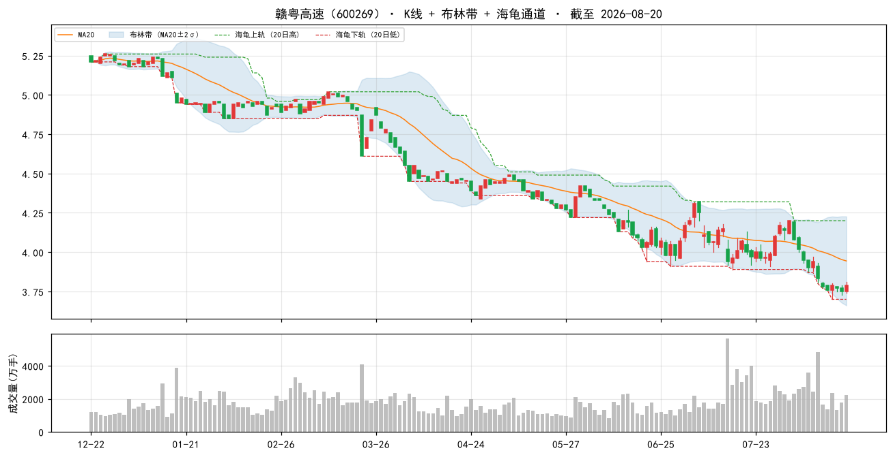

### 2. 鲁泰A（000726）

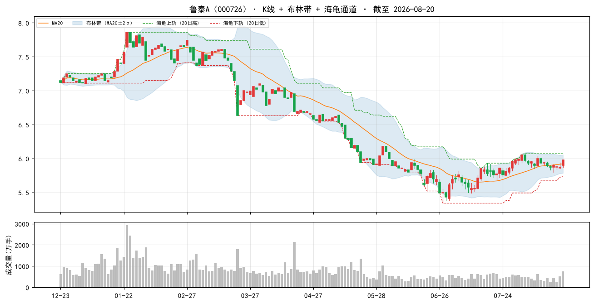

### 3. 浦东金桥（600639）

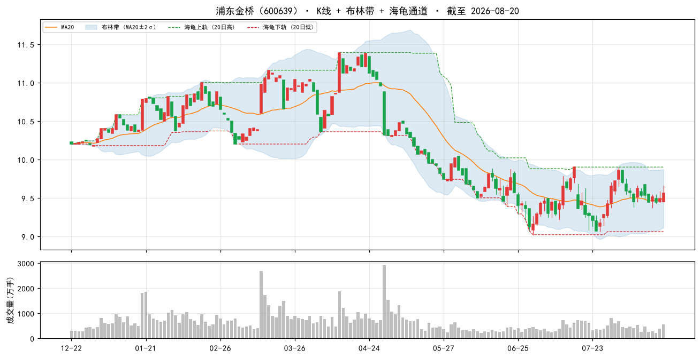

### 4. 安徽建工（600502）

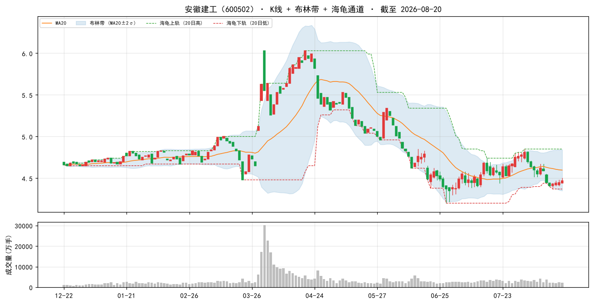

### 5. 大商股份（600694）

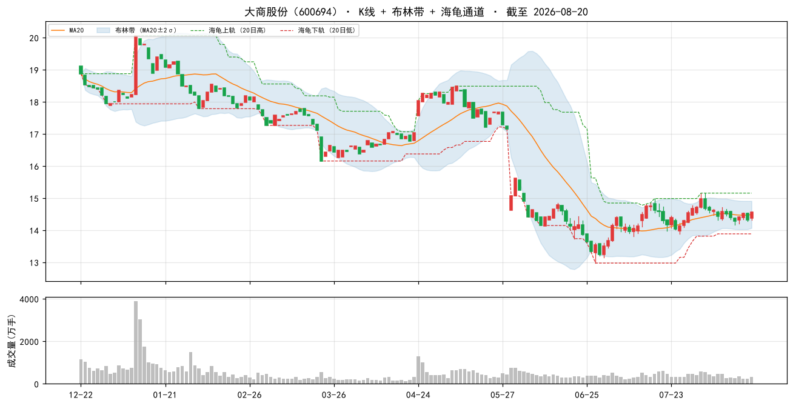

### 6. 山东路桥（000498）

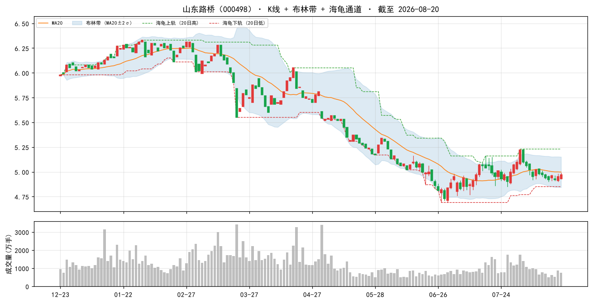

### 7. 中国海油（600938）

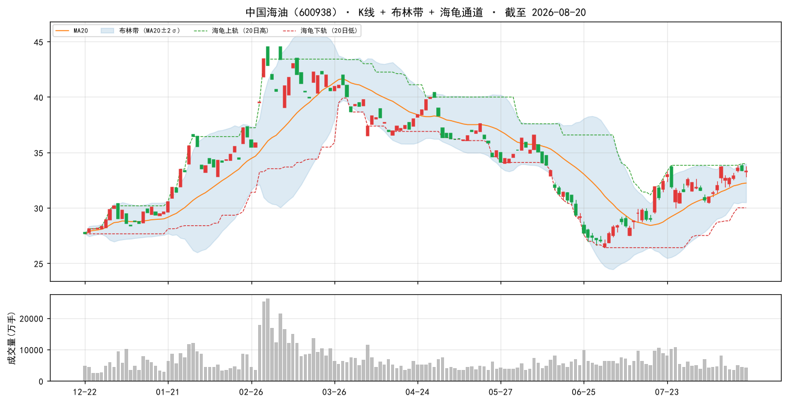

### 8. 现代投资（000900）

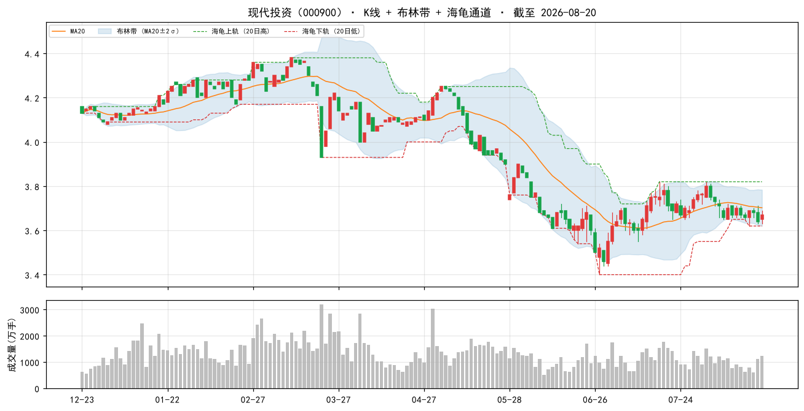

### 9. 中原高速（600020）

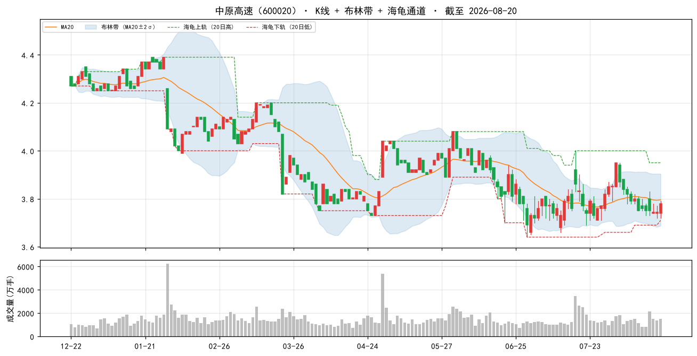

### 10. 中原环保（000544）

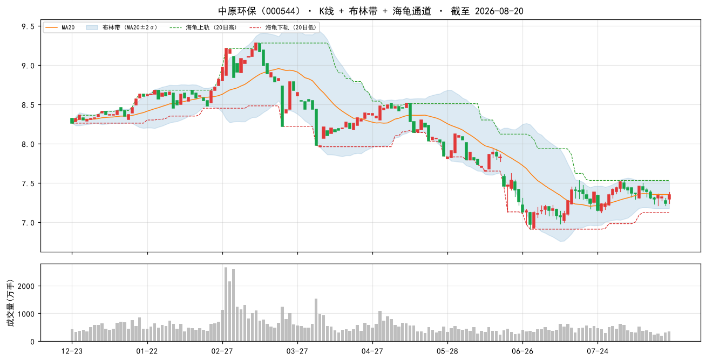

### 当日表现：top-10 vs 大盘

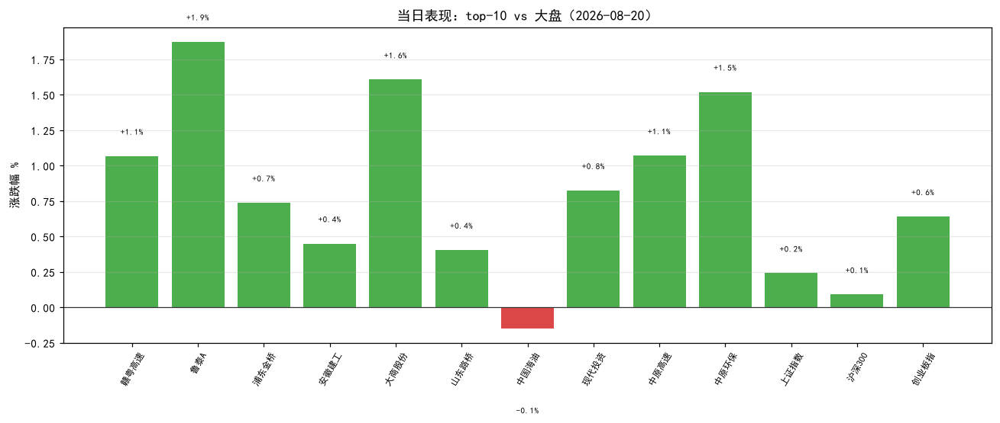

### 组合 vs 沪深300（近 60 交易日，当前名单回放近似）

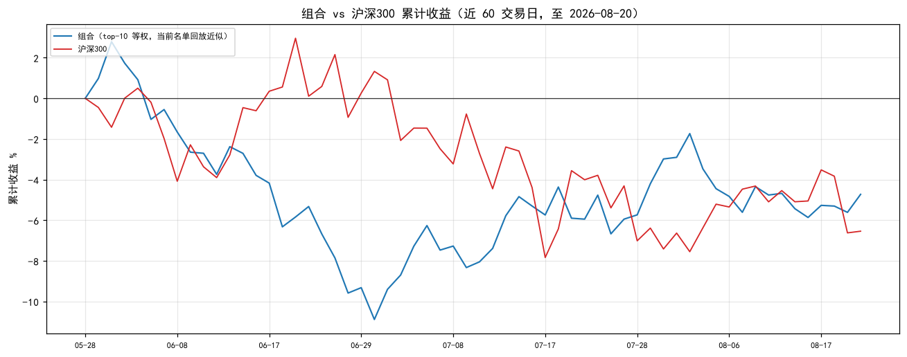

> 组合为**当前 top-10 名单**从窗口起点等权回放（非历史换手），仅作趋势参考；沪深300 用腾讯指数补齐最近两日。

## 九、因子诊断与优化建议

#### 8.1 历史名单表现追踪（至今）

| 名单日 | 股票数 | 名单等权至今 | 沪深300至今 | 超额 |
|---|---|---|---|---|
| 2026-08-11 | 50 | -0.6% | — | — |
| 2026-08-14 | 50 | +0.8% | — | — |
| 2026-08-17 | 50 | +0.4% | — | — |
| 2026-08-18 | 50 | +0.6% | — | — |

> 说明：等权持有名单至今（未换手），个股停牌则该日不计入；分红未计入，短期窗口影响小。

#### 8.2 因子 IC 诊断（近 11 周截面，因子 vs 未来 5 日收益）

| 因子 | 方向 | 近11个快照 IC | 有效快照 | 判断 |
|---|---|---|---|---|
| 账面市值比 | 1 | +0.145 | 11 | 有效 |
| 盈余收益率 | 1 | +0.068 | 11 | 有效 |
| 净资产收益率 | 1 | +0.012 | 11 | 中性（区分度弱） |
| 毛利率 | 1 | +0.019 | 11 | 中性（区分度弱） |
| 现金流/净利 | 1 | +0.032 | 11 | 有效 |
| 60日波动 | -1 | -0.182 | 11 | 有效 |
| 总市值(ln) | -1 | -0.068 | 11 | 有效 |

> IC = 因子值与未来 5 日收益的秩相关（越大越有效）；与注册表方向同号且 |IC|≥0.02 判为有效。 单因子短期 IC 波动大，仅供诊断，不构成当日调权依据。

#### 8.3 月度权重校验（research_panel.pkl 滚动）

> 面板数据截至 2026-07-31。仅作参考：**权重建议月度复核，不日更**（防过拟合）。

| 方案 | 最近37月总收益 | 夏普 | 回撤 |
|---|---|---|---|
| 当前 | +16.2% | +0.20 | -17.6% |
| bp0.3+ep0.2+roe0.15+毛利0.1+现金流0.1+低波0.15 | +15.2% | +0.18 | -16.6% |
| 当前+小市值0.05 | +19.7% | +0.25 | -16.7% |
| 纯价值 bp0.6+ep0.4 | +9.8% | +0.10 | -14.4% |

> ⚠ 候选「当前+小市值0.05」近期夏普最高（+0.25）且高于当前——建议**月度复核时**考虑微调权重，勿当日追改。

## 十、AI 亮点点评

> 数据基准：本地因子数据截至 2026-08-20（已最新，与实时同源），实时行情/指数/新闻为 2026-08-20 收盘（腾讯/新浪）。本段由 AI 基于报告一~九节 + 实时数据生成。

### 10.1 今日市场环境

2026-08-20 A 股呈现「温和 risk-on、成长小盘占优、大盘价值承压」格局：上证 +0.24%、沪深300 +0.09% 微涨，深成 +0.59%、创业板 +0.64% 明显更强，而上证50 逆市 -0.49%。全市场 3943 涨 / 1199 跌，成交 20347 亿，广度与量能健康。风格上小市值与低波价值继续有效（与 8.2 因子 IC 诊断一致），大盘蓝筹（尤其金融/权重）落后。要闻面：国内「抗癌疫苗」主题、SK 海力士 CPO 光互联路线引爆科技/医药热度；外围美债 30Y 收益率重回 5.2% 上方、欧洲天然气升至五月高点，利率与商品波动对权益估值构成潜在压制，但当日未明显外溢。

### 10.2 组合画像

组合延续「深度价值 + 低波 + 中小市值」定位：top-50 账面市值比百分位 99%、盈余收益率 96%、60 日波动 94%（低波），总市值百分位仅 31%（中小盘）；PE 中位 9.8、PB 中位 0.5、市值中位 121.8 亿。即「便宜、稳、不大」的典型小盘价值篮，与当日 risk-on 小盘占优风格方向一致。

### 10.3 今日表现

top-10 当日平均 +0.94%，9 涨 1 跌（仅中国海油 -0.15%），相对上证（+0.24%）超额约 +0.70pp、相对沪深300（+0.09%）超额约 +0.85pp，显著跑赢宽基。领涨：鲁泰A +1.87%、大商股份 +1.61%、中原环保 +1.52%、赣粤高速/中原高速 +1.07%；最弱中国海油 -0.15%（油价/超大盘属性拖累）。

| 代码 | 名称 | 涨跌% | 相对上证 |
|---|---|---|---|
| 600269 | 赣粤高速 | +1.07% | +0.83pp |
| 000726 | 鲁泰A | +1.87% | +1.63pp |
| 600639 | 浦东金桥 | +0.74% | +0.50pp |
| 600502 | 安徽建工 | +0.45% | +0.21pp |
| 600694 | 大商股份 | +1.61% | +1.37pp |
| 000498 | 山东路桥 | +0.40% | +0.16pp |
| 600938 | 中国海油 | -0.15% | -0.39pp |
| 000900 | 现代投资 | +0.82% | +0.58pp |
| 600020 | 中原高速 | +1.07% | +0.83pp |
| 000544 | 中原环保 | +1.52% | +1.28pp |

### 10.4 逐票深度分析（top 5）

**（1）赣粤高速（600269，+1.07%）**
- 主业/定位：江西省高速公路运营，收费路产提供稳定通行费现金流，属防御性红利资产。
- 估值与质量：bp 前 99%、ep 前 99%、毛利率 40.8%（前 98%）、现金流/净利 209.7%（前 74%）——典型的「高现金、低估值」路产股；PE_TTM 12.2、PB 0.5。
- 新闻/催化：8/11 半年报点评称「核心路产主业稳健，金融投资波动致业绩承压」；华创证券此前强推目标价 5.71 元（较现价 3.79 有约 50% 空间）。
- 风险：金融投资敞口使业绩受权益市场波动拖累，非纯收费公路属性。
- 结论：底仓型防御红利，安全边际充足。

**（2）鲁泰A（000726，+1.87%）**
- 主业/定位：全球色织布/衬衫制造龙头，出口导向，受益制造出海。
- 估值与质量：bp 前 100%、ep 前 100%（全市场最便宜一档），但毛利率仅 7.3%（前 62%）、roe 60%，盈利质量偏弱。
- 新闻/催化：近期多份点评指出「Q1 收入与毛利短期承压，汇兑及公允价值变动拖累利润」；今日 +1.87% 为组合最强，或反映超跌修复。
- 风险：外需放缓 + 人民币汇率波动直接冲击利润，毛利率薄。
- 结论：极端深度价值，弹性取决于外需与汇率，适合小仓位博修复。

**（3）浦东金桥（600639，+0.74%）**
- 主业/定位：上海金桥开发区园区物业开发与运营，收租型资产。
- 估值与质量：bp 前 99%、ep 前 99%、现金流/净利 379.8%（前 85%，极优），roe 68%；PE_TTM 10.3、PB 0.7，仍低估。
- 新闻/催化：机构更新报告称「收入高增利润增长，经营性物业出租率稳中有升」。
- 风险：园区经济周期与出租率波动；区域集中（浦东）。
- 结论：稳健收租型价值股，攻守兼备。

**（4）安徽建工（600502，+0.45%）**
- 主业/定位：安徽省属基建施工龙头，订单驱动。
- 估值与质量：bp 前 100%、ep 前 100%（盈余收益率 0.20 极高），但现金流/净利 **-868.9%（全市场前 9%，极差）**、毛利率仅 3.1%——建筑垫资模式导致经营现金流转负，是典型「低估值、弱现金」信号。
- 新闻/催化：点评称「收入利润稳健增长，重点项目持续落地」；4 月融资净买入曾环比 +502%。
- 风险：现金流陷阱/应收账款高企，低 PB 可能由盈利高但回款差支撑，需警惕减值。
- 结论：估值便宜但质量存疑，观察为主、控仓。

**（5）大商股份（600694，+1.61%）**
- 主业/定位：百货零售区域龙头，推进门店调改。
- 估值与质量：bp 前 99%、ep 前 98%、毛利率 19.5%（前 88%）、现金流/净利 193.2%（前 72%）——盈利与现金质量较好；PE_TTM 11.0、PB 0.6。
- 新闻/催化：跟踪报告称「持续推进调改、股东回报优化」，年报分红率提至 70%，红利逻辑清晰；今日 +1.61% 强势。
- 风险：线下零售持续承压，调改成效待验证。
- 结论：红利 + 估值修复双逻辑，组合中质量较优的一只。

### 10.5 操作建议与风险

- **动量反向**：A 股 2018-2026 动量方向反向，本方案不含动量因子；勿因今日涨幅追高，名单是「当日截面快照」，**不构成调仓指令**。建议月度调仓、等权持有、单票止损参考 -8%。
- **数据口径**：因子数据与实时行情均为 2026-08-20（已最新、同源），无滞后；PE/PB 为估算值，个别票（baostock 段市值推算）可能失真，勿单看估值数字。
- **与昨日对比**：较 08-19 top-10，中原环保（000544）新进取代中国移动（600941，降至 #11），前 9 名一致，组合风格延续「高速/路桥/园区/能源」防御价值。
- **显著风险点**：
  1. **建筑股现金流陷阱**：安徽建工 / 山东路桥 现金流/净利 -868.9% / -1839.7%（全市场后 4-9%），低估值由盈利高但现金未回笼支撑，应收账款与垫资风险突出，列入观察而非加仓。
  2. **中国海油风格背离**：-0.15% 逆市，且总市值(ln) 前 3%（超大盘），其「油价 + 大盘股」属性与组合「小市值增强」取向相悖，权重低但拖累弹性。
  3. **风格反转风险**：今日大盘价值（上证50 -0.49%）承压，组合虽跑赢但仍偏价值低波；若市场风险偏好回落至防御极致或转向纯成长，因子有效性需监控（见 8.2 IC 诊断，当前 7 因子均有效/中性、无反向，状态健康）。
  4. **外围外溢**：美债 30Y 重回 5.2% 上方、欧洲天然气升至五月高点，利率与商品波动或压制全球风险资产；当日未明显外溢，但需关注后续。
