# 每日选股报告 · 2026-08-24

> 方案：**smallcap** · 权重 账面市值比 0.30 + 盈余收益率 0.20 + 净资产收益率 0.15 + 毛利率 0.10 + 现金流/净利 0.10 + 60日波动 0.15 + 总市值(ln) 0.10 · 选 top-50 · 等权持仓（建议月频调仓）
> 历史验证 2018-2026（含交易成本）：总收益 **+12.8%** · 夏普 +0.02 · 最大回撤 -27.6%
> 生成：2026-08-24 18:18 · 数据截至 2026-08-24

## 一、市场概况

### 1.1 主要指数表现

| 指数 | 收盘 | 涨跌幅 |
|---|---|---|

### 1.2 市场广度

- 全市场 **5266 只**：上涨 **1412** / 下跌 **3727** / 平盘 127
- 总成交额 ≈ **19724 亿元**

- 当日可交易股票池（剔除 ST/涨跌停/停牌/次新/B股/北交所/金融股）：**4871 只**
- 打分因子：`smallcap` 权重因子共 7 个

## 二、选股方案与方法

- 模型：多因子截面打分。每因子先 [1%,99%] 缩尾去极端 → z-score 标准化 → 乘方向与权重加权求和 → 取 top-50 等权。
- 权重：账面市值比 0.3、盈余收益率 0.2、净资产收益率 0.15、毛利率 0.1、现金流/净利 0.1、60日波动 0.15、总市值(ln) 0.1（研究管线 `validate_daily_schemes.py` 历史验证选定）。
- 无未来函数：基本面用「报告期 + 4 个月披露滞后」；动量 skip 最近 20 交易日；股票池剔除 ST/涨跌停/停牌/次新(<120日)/B股/北交所/金融股。

### 2.1 因子定义与公式

> 打分公式：`综合得分 = Σ wᵢ × 方向ᵢ × z-score(缩尾[1%,99%] 因子ᵢ)`，缺失因子贡献 0。

| 因子 | 方向 | 权重 | 公式/定义 | 数据源 |
|---|---|---|---|---|
| 账面市值比（bp） | 1（越大越好） | 0.30 | 净资产(合并A003000000) / 总市值(元)（账面市值比） | fs_combas+price |
| 盈余收益率（ep_ttm） | 1（越大越好） | 0.20 | TTM归母净利润 / 总市值(元)（盈余收益率） | fs_comins+price |
| 净资产收益率（roe_ttm） | 1（越大越好） | 0.15 | TTM净利润 / 平均净资产 | fs_comins+fs_combas |
| 毛利率（gross_margin） | 1（越大越好） | 0.10 | (收入-营业总成本)/收入 | fs_comins |
| 现金流/净利（op_cf_ratio） | 1（越大越好） | 0.10 | 经营现金流净额/净利润 | fs_comscfd+fs_comins |
| 60日波动（vol_60d） | -1（越小越好） | 0.15 | 60日日收益率标准差，年化×√252 | stock_daily |
| 总市值(ln)（ln_cap） | -1（越小越好） | 0.10 | ln(推算总市值, 元) | stock_daily |

- 选股数：top-50 等权（建议月频调仓）；方向由 `factor_registry.json` 统一管理。

## 三、今日 Top-50 名单

> PE/PB 为按盈余收益率(ep_ttm)/账面市值比(bp)换算的**估算值**，仅供参考；baostock 段市值用参考股本×收盘推算，个别票 PE/PB 可能失真。

| 排名 | 代码 | 名称 | 收盘价 | PE(估) | PB(估) | 综合得分 | 账面市值比 | 盈余收益率 | 净资产收益率 | 毛利率 | 现金流/净利 | 60日波动 | 总市值(ln) |
|---|---|---|---|---|---|---|---|---|---|---|---|---|---|
| 1 | 600269 | 赣粤高速 | 3.7800 | 7.8 | 0.4 | 2.11 | 2.2370 | 0.1276 | 0.0570 | 40.8% | 209.7% | 25.6% | 22.9012 |
| 2 | 000726 | 鲁泰A | 5.9000 | 6.5 | 0.4 | 2.07 | 2.8284 | 0.1544 | 0.0546 | 7.3% | 172.4% | 21.4% | 21.9730 |
| 3 | 600639 | 浦东金桥 | 9.3600 | 7.6 | 0.5 | 1.96 | 1.8925 | 0.1310 | 0.0692 | 11.7% | 379.8% | 21.4% | 22.7975 |
| 4 | 600502 | 安徽建工 | 4.4600 | 4.9 | 0.4 | 1.87 | 2.7693 | 0.2022 | 0.0730 | 3.1% | -868.9% | 28.4% | 22.7587 |
| 5 | 000498 | 山东路桥 | 4.9800 | 3.6 | 0.3 | 1.86 | 3.4645 | 0.2775 | 0.0801 | 3.6% | -1839.7% | 20.3% | 22.7685 |
| 6 | 600938 | 中国海油 | 33.7200 | 0.8 | 0.1 | 1.85 | 8.3027 | 1.2365 | 0.1489 | 44.8% | 140.9% | 40.9% | 25.3366 |
| 7 | 000544 | 中原环保 | 7.1700 | 6.6 | 0.6 | 1.85 | 1.6321 | 0.1522 | 0.0933 | 36.4% | -111.9% | 20.4% | 22.6675 |
| 8 | 600694 | 大商股份 | 14.4300 | 9.9 | 0.5 | 1.84 | 1.8405 | 0.1006 | 0.0547 | 19.5% | 193.2% | 26.2% | 22.3265 |
| 9 | 000900 | 现代投资 | 3.6400 | 14.0 | 0.4 | 1.83 | 2.2962 | 0.0713 | 0.0310 | 15.2% | 24.9% | 19.1% | 22.4325 |
| 10 | 600941 | 中国移动 | 97.5300 | 0.6 | 0.1 | 1.82 | 16.1592 | 1.5424 | 0.0955 | 13.3% | 243.5% | 18.9% | 25.2011 |
| 11 | 000028 | 国药一致 | 19.5900 | 8.7 | 0.5 | 1.80 | 1.9881 | 0.1152 | 0.0580 | 2.2% | -1021.1% | 25.4% | 22.9751 |
| 12 | 600020 | 中原高速 | 3.7900 | 13.3 | 0.5 | 1.80 | 1.8740 | 0.0751 | 0.0401 | 33.2% | 119.8% | 21.7% | 22.8654 |
| 13 | 600820 | 隧道股份 | 5.3800 | 7.8 | 0.4 | 1.75 | 2.6094 | 0.1289 | 0.0494 | 0.2% | -1674.8% | 19.4% | 23.5515 |
| 14 | 600874 | 创业环保 | 5.5700 | 7.8 | 0.7 | 1.74 | 1.5373 | 0.1290 | 0.0839 | 28.9% | -44.9% | 18.4% | 22.6480 |
| 15 | 600035 | 楚天高速 | 3.3700 | 10.8 | 0.6 | 1.74 | 1.6773 | 0.0926 | 0.0552 | 27.4% | 175.9% | 17.5% | 22.4145 |
| 16 | 601107 | 四川成渝 | 5.5700 | 8.0 | 0.6 | 1.73 | 1.7074 | 0.1256 | 0.0736 | 23.1% | 197.6% | 32.7% | 23.2120 |
| 17 | 600548 | 深高速 | 8.2500 | 12.5 | 0.5 | 1.73 | 1.8601 | 0.0799 | 0.0430 | 25.8% | 201.9% | 20.8% | 23.4159 |
| 18 | 601811 | 新华文轩 | 11.9700 | 6.1 | 0.6 | 1.71 | 1.6412 | 0.1652 | 0.1006 | 10.0% | -66.4% | 22.5% | 22.9724 |
| 19 | 600585 | 海螺水泥 | 17.5700 | 9.0 | 0.4 | 1.69 | 2.7582 | 0.1106 | 0.0401 | 8.5% | 22.2% | 24.2% | 24.9757 |
| 20 | 600704 | 物产中大 | 4.8800 | 7.0 | 0.5 | 1.67 | 1.8287 | 0.1431 | 0.0782 | 1.5% | -797.1% | 21.3% | 23.9515 |
| 21 | 601186 | 中国铁建 | 6.0300 | 3.9 | 0.2 | 1.65 | 5.0393 | 0.2538 | 0.0504 | 2.6% | -1424.6% | 18.9% | 24.9626 |
| 22 | 601668 | 中国建筑 | 4.4200 | 4.8 | 0.4 | 1.64 | 2.7655 | 0.2077 | 0.0751 | 3.9% | -554.6% | 18.2% | 25.9308 |
| 23 | 601800 | 中国交建 | 5.8700 | 5.2 | 0.2 | 1.64 | 4.5039 | 0.1924 | 0.0427 | 3.8% | -1344.3% | 23.6% | 24.9660 |
| 24 | 601333 | 广深铁路 | 2.9200 | 10.7 | 0.6 | 1.60 | 1.7532 | 0.0931 | 0.0531 | 10.6% | -6.5% | 20.2% | 23.5269 |
| 25 | 000501 | 武商集团 | 7.0400 | 33.6 | 0.5 | 1.60 | 2.0385 | 0.0298 | 0.0146 | 8.4% | 379.1% | 29.7% | 22.4122 |
| 26 | 600528 | 中铁工业 | 6.9600 | 11.3 | 0.6 | 1.60 | 1.8113 | 0.0885 | 0.0488 | 4.5% | -226.2% | 20.8% | 23.4617 |
| 27 | 000932 | 华菱钢铁 | 3.6400 | 11.1 | 0.4 | 1.59 | 2.2387 | 0.0901 | 0.0402 | 0.4% | -835.9% | 28.0% | 23.9399 |
| 28 | 600104 | 上汽集团 | 10.1900 | 11.6 | 0.4 | 1.59 | 2.5654 | 0.0863 | 0.0336 | 2.3% | 1057.0% | 24.3% | 25.4866 |
| 29 | 000709 | 河钢股份 | 2.1000 | 19.9 | 0.4 | 1.58 | 2.7433 | 0.0503 | 0.0183 | 0.3% | 1069.8% | 26.6% | 23.8009 |
| 30 | 601607 | 上海医药 | 16.1900 | 7.8 | 0.6 | 1.58 | 1.7118 | 0.1286 | 0.0752 | 3.2% | -71.2% | 21.2% | 24.5334 |
| 31 | 002061 | 浙江交科 | 3.4700 | 9.7 | 0.6 | 1.57 | 1.7278 | 0.1036 | 0.0600 | 3.2% | -778.0% | 25.0% | 22.9511 |
| 32 | 601318 | 中国平安 | 54.9200 | 4.4 | 0.6 | 1.57 | 1.7394 | 0.2268 | 0.1304 | 25.4% | 523.8% | 32.4% | 27.0956 |
| 33 | 600827 | 百联股份 | 7.5400 | 9.8 | 0.6 | 1.57 | 1.7011 | 0.1017 | 0.0598 | 2.7% | 133.1% | 27.1% | 23.2163 |
| 34 | 601390 | 中国中铁 | 4.3600 | 4.2 | 0.2 | 1.56 | 4.1919 | 0.2377 | 0.0567 | 2.7% | -1982.8% | 25.3% | 25.2151 |
| 35 | 600011 | 华能国际 | 6.6400 | 5.2 | 0.5 | 1.56 | 1.8420 | 0.1906 | 0.1035 | 12.1% | 277.4% | 45.7% | 25.0141 |
| 36 | 600051 | 宁波联合 | 6.2700 | 25.7 | 0.6 | 1.55 | 1.7545 | 0.0389 | 0.0222 | 0.2% | 1117.3% | 30.8% | 21.3907 |
| 37 | 600717 | 天津港 | 4.3000 | 11.8 | 0.6 | 1.54 | 1.6428 | 0.0851 | 0.0518 | 22.8% | 107.3% | 25.5% | 23.2445 |
| 38 | 000090 | 天健集团 | 3.4200 | 40.0 | 0.4 | 1.52 | 2.2599 | 0.0250 | 0.0111 | -0.2% | 685.9% | 33.2% | 22.5781 |
| 39 | 000885 | 城发环境 | 12.1000 | 6.1 | 0.8 | 1.52 | 1.2605 | 0.1644 | 0.1304 | 26.2% | 100.9% | 23.3% | 22.7734 |
| 40 | 600064 | 南京高科 | 7.5900 | 7.4 | 0.7 | 1.51 | 1.5035 | 0.1344 | 0.0894 | -0.1% | 28.0% | 23.2% | 23.2984 |
| 41 | 002394 | 联发股份 | 9.6000 | 12.8 | 0.7 | 1.51 | 1.3962 | 0.0779 | 0.0558 | 7.3% | 3922.9% | 46.6% | 21.8571 |
| 42 | 601669 | 中国电建 | 4.6200 | 8.5 | 0.5 | 1.51 | 2.1295 | 0.1171 | 0.0550 | 2.3% | -2261.2% | 27.4% | 25.1001 |
| 43 | 000560 | 我爱我家 | 2.1700 | — | 0.6 | 1.49 | 1.8158 | -0.0191 | -0.0105 | -8.7% | 10729.9% | 45.1% | 22.3547 |
| 44 | 000550 | 江铃汽车 | 15.6200 | 6.6 | 0.7 | 1.48 | 1.4845 | 0.1507 | 0.1015 | 1.0% | -584.0% | 28.6% | 22.8164 |
| 45 | 603018 | 华设集团 | 5.2000 | 12.5 | 0.7 | 1.48 | 1.5328 | 0.0800 | 0.0522 | 9.4% | -160.4% | 25.0% | 21.9918 |
| 46 | 600057 | 厦门象屿 | 6.1800 | 13.4 | 0.5 | 1.48 | 1.9385 | 0.0744 | 0.0384 | 1.7% | -1478.6% | 28.5% | 23.5886 |
| 47 | 600033 | 福建高速 | 3.5400 | 10.1 | 0.8 | 1.48 | 1.2959 | 0.0986 | 0.0761 | 51.6% | 221.1% | 22.3% | 22.9970 |
| 48 | 002375 | 亚厦股份 | 3.5800 | 14.6 | 0.6 | 1.48 | 1.7352 | 0.0686 | 0.0395 | 3.9% | -584.5% | 29.9% | 22.2913 |
| 49 | 000027 | 深圳能源 | 6.1400 | 14.6 | 0.6 | 1.47 | 1.8129 | 0.0685 | 0.0378 | 18.0% | 96.8% | 30.4% | 24.0978 |
| 50 | 600017 | 日照港 | 2.6800 | 18.8 | 0.6 | 1.47 | 1.7062 | 0.0532 | 0.0312 | 7.0% | 357.9% | 22.0% | 22.8326 |

## 四、组合画像（top-50 统计）

| 维度 | 数值 | 含义 |
|---|---|---|
| 账面市值比平均百分位 | **99%** | 组合在该因子上相对全市场的位置（越大越好） |
| 盈余收益率平均百分位 | **94%** | 组合在该因子上相对全市场的位置（越大越好） |
| 净资产收益率平均百分位 | **62%** | 组合在该因子上相对全市场的位置（越大越好） |
| 毛利率平均百分位 | **63%** | 组合在该因子上相对全市场的位置（越大越好） |
| 现金流/净利平均百分位 | **48%** | 组合在该因子上相对全市场的位置（越大越好） |
| 60日波动平均百分位 | **94%** | 组合在该因子上相对全市场的位置（越大越好） |
| 总市值(ln)平均百分位 | **32%** | 组合在该因子上相对全市场的位置（越大越好） |
| PE(中位数, 估) | 8.7 | 组合估值水平 |
| PB(中位数, 估) | 0.5 | 组合市净率水平 |
| 市值(中位数) | 120.5 亿元 | 组合规模风格 |

## 五、前 10 入选理由（因子百分位）

> 百分位为当日全市场该因子的分布位置（0-100，**已按因子方向归一**，越大越好）。

### 1. **赣粤高速**（600269，收盘 3.7800）

- 账面市值比 2.2370（权重 0.30，全市场前 99%）
- 盈余收益率 0.1276（权重 0.20，全市场前 99%）
- 净资产收益率 0.0570（权重 0.15，全市场前 62%）
- 毛利率 40.8%（权重 0.10，全市场前 98%）
- 现金流/净利 209.7%（权重 0.10，全市场前 74%）
- 60日波动 25.6%（权重 0.15，全市场前 97%）
- 总市值(ln) 22.9012（权重 0.10，全市场前 37%）

### 2. **鲁泰A**（000726，收盘 5.9000）

- 账面市值比 2.8284（权重 0.30，全市场前 100%）
- 盈余收益率 0.1544（权重 0.20，全市场前 100%）
- 净资产收益率 0.0546（权重 0.15，全市场前 60%）
- 毛利率 7.3%（权重 0.10，全市场前 62%）
- 现金流/净利 172.4%（权重 0.10，全市场前 70%）
- 60日波动 21.4%（权重 0.15，全市场前 99%）
- 总市值(ln) 21.9730（权重 0.10，全市场前 75%）

### 3. **浦东金桥**（600639，收盘 9.3600）

- 账面市值比 1.8925（权重 0.30，全市场前 99%）
- 盈余收益率 0.1310（权重 0.20，全市场前 99%）
- 净资产收益率 0.0692（权重 0.15，全市场前 68%）
- 毛利率 11.7%（权重 0.10，全市场前 75%）
- 现金流/净利 379.8%（权重 0.10，全市场前 85%）
- 60日波动 21.4%（权重 0.15，全市场前 99%）
- 总市值(ln) 22.7975（权重 0.10，全市场前 40%）

### 4. **安徽建工**（600502，收盘 4.4600）

- 账面市值比 2.7693（权重 0.30，全市场前 100%）
- 盈余收益率 0.2022（权重 0.20，全市场前 100%）
- 净资产收益率 0.0730（权重 0.15，全市场前 70%）
- 毛利率 3.1%（权重 0.10，全市场前 46%）
- 现金流/净利 -868.9%（权重 0.10，全市场前 9%）
- 60日波动 28.4%（权重 0.15，全市场前 94%）
- 总市值(ln) 22.7587（权重 0.10，全市场前 42%）

### 5. **山东路桥**（000498，收盘 4.9800）

- 账面市值比 3.4645（权重 0.30，全市场前 100%）
- 盈余收益率 0.2775（权重 0.20，全市场前 100%）
- 净资产收益率 0.0801（权重 0.15，全市场前 74%）
- 毛利率 3.6%（权重 0.10，全市场前 48%）
- 现金流/净利 -1839.7%（权重 0.10，全市场前 4%）
- 60日波动 20.3%（权重 0.15，全市场前 99%）
- 总市值(ln) 22.7685（权重 0.10，全市场前 41%）

### 6. **中国海油**（600938，收盘 33.7200）

- 账面市值比 8.3027（权重 0.30，全市场前 100%）
- 盈余收益率 1.2365（权重 0.20，全市场前 100%）
- 净资产收益率 0.1489（权重 0.15，全市场前 93%）
- 毛利率 44.8%（权重 0.10，全市场前 99%）
- 现金流/净利 140.9%（权重 0.10，全市场前 66%）
- 60日波动 40.9%（权重 0.15，全市场前 72%）
- 总市值(ln) 25.3366（权重 0.10，全市场前 3%）

### 7. **中原环保**（000544，收盘 7.1700）

- 账面市值比 1.6321（权重 0.30，全市场前 98%）
- 盈余收益率 0.1522（权重 0.20，全市场前 100%）
- 净资产收益率 0.0933（权重 0.15，全市场前 80%）
- 毛利率 36.4%（权重 0.10，全市场前 98%）
- 现金流/净利 -111.9%（权重 0.10，全市场前 28%）
- 60日波动 20.4%（权重 0.15，全市场前 99%）
- 总市值(ln) 22.6675（权重 0.10，全市场前 45%）

### 8. **大商股份**（600694，收盘 14.4300）

- 账面市值比 1.8405（权重 0.30，全市场前 99%）
- 盈余收益率 0.1006（权重 0.20，全市场前 98%）
- 净资产收益率 0.0547（权重 0.15，全市场前 60%）
- 毛利率 19.5%（权重 0.10，全市场前 88%）
- 现金流/净利 193.2%（权重 0.10，全市场前 72%）
- 60日波动 26.2%（权重 0.15，全市场前 96%）
- 总市值(ln) 22.3265（权重 0.10，全市场前 59%）

### 9. **现代投资**（000900，收盘 3.6400）

- 账面市值比 2.2962（权重 0.30，全市场前 99%）
- 盈余收益率 0.0713（权重 0.20，全市场前 93%）
- 净资产收益率 0.0310（权重 0.15，全市场前 45%）
- 毛利率 15.2%（权重 0.10，全市场前 83%）
- 现金流/净利 24.9%（权重 0.10，全市场前 45%）
- 60日波动 19.1%（权重 0.15，全市场前 100%）
- 总市值(ln) 22.4325（权重 0.10，全市场前 55%）

### 10. **中国移动**（600941，收盘 97.5300）

- 账面市值比 16.1592（权重 0.30，全市场前 100%）
- 盈余收益率 1.5424（权重 0.20，全市场前 100%）
- 净资产收益率 0.0955（权重 0.15，全市场前 80%）
- 毛利率 13.3%（权重 0.10，全市场前 79%）
- 现金流/净利 243.5%（权重 0.10，全市场前 77%）
- 60日波动 18.9%（权重 0.15，全市场前 100%）
- 总市值(ln) 25.2011（权重 0.10，全市场前 3%）

## 六、口径与风险提示

- 因子无未来函数：基本面用「报告期 + 4 个月滞后」；动量 skip 最近 20 交易日；股票池剔除 ST/涨跌停/次新/金融股。
- **动量在 A 股 2018-2026 方向反向**，本方案不含动量因子；成长因子不显著，仅作参考。
- 小市值增强（ln_cap）是 A 股 2018-2026 有效因子，但小市值波动大、流动性差，请控制单票仓位。
- **名单是「当日截面快照」，不构成调仓指令**。建议月度调仓、等权持有，避免高频换手吞噬收益；单票止损参考 -8%。
- 数据源：CSMAR 全量 + baostock 每日增量；本地因子数据可能落后 1 天（baostock 滞后），实时行情请见 Claude 点评补充。

## 七、基本面与估值快照

> 估值：腾讯行情实时（PE_TTM/PB/总市值，数据日期 2026-08-24）；财务：CSMAR 最新报告期（4 个月披露滞后）。 可与此前因子换算的 PE/PB(估) 互相印证。

| 代码 | 名称 | 现价 | 涨跌% | PE_TTM | PB | 总市值(亿) | 盈余收益率 | ROE_TTM | 毛利率 | 现金流/净利 |
|---|---|---|---|---|---|---|---|---|---|---|
| 600269 | 赣粤高速 | 3.8 | 0.5% | 12.2 | 0.5 | 88.3 | 0.128 | 0.057 | 40.8% | 209.7% |
| 000726 | 鲁泰A | 5.9 | 0.7% | 8.9 | 0.5 | 34.8 | 0.154 | 0.055 | 7.3% | 172.4% |
| 600639 | 浦东金桥 | 9.4 | 0.2% | 10.1 | 0.7 | 79.6 | 0.131 | 0.069 | 11.7% | 379.8% |
| 600502 | 安徽建工 | 4.5 | 0.9% | 5.0 | 0.6 | 76.6 | 0.202 | 0.073 | 3.1% | -868.9% |
| 000498 | 山东路桥 | 5.0 | 1.2% | 3.6 | 0.5 | 72.2 | 0.278 | 0.080 | 3.6% | -1839.7% |
| 600938 | 中国海油 | 33.7 | -0.4% | 12.9 | 2.0 | 1008.2 | 1.236 | 0.149 | 44.8% | 140.9% |
| 000544 | 中原环保 | 7.2 | -0.8% | 6.8 | 0.7 | 69.9 | 0.152 | 0.093 | 36.4% | -111.9% |
| 600694 | 大商股份 | 14.4 | 0.5% | 10.9 | 0.6 | 54.7 | 0.101 | 0.055 | 19.5% | 193.2% |
| 000900 | 现代投资 | 3.6 | 0.8% | 14.0 | 0.5 | 55.2 | 0.071 | 0.031 | 15.2% | 24.9% |
| 600941 | 中国移动 | 97.5 | 1.3% | 16.1 | 1.5 | 880.5 | 1.542 | 0.095 | 13.3% | 243.5% |
| 000028 | 国药一致 | 19.6 | 0.6% | 11.1 | 0.6 | 103.0 | 0.115 | 0.058 | 2.2% | -1021.1% |
| 600020 | 中原高速 | 3.8 | 1.3% | 13.1 | 0.7 | 85.2 | 0.075 | 0.040 | 33.2% | 119.8% |
| 600820 | 隧道股份 | 5.4 | 1.5% | 7.8 | 0.5 | 169.2 | 0.129 | 0.049 | 0.2% | -1674.8% |
| 600874 | 创业环保 | 5.6 | 0.0% | 9.9 | 0.9 | 68.5 | 0.129 | 0.084 | 28.9% | -44.9% |
| 600035 | 楚天高速 | 3.4 | 0.3% | 10.8 | 0.6 | 54.3 | 0.093 | 0.055 | 27.4% | 175.9% |
| 601107 | 四川成渝 | 5.6 | 1.3% | 11.5 | 1.0 | 120.5 | 0.126 | 0.074 | 23.1% | 197.6% |
| 600548 | 深高速 | 8.2 | 0.9% | 17.7 | 0.9 | 141.4 | 0.080 | 0.043 | 25.8% | 201.9% |
| 601811 | 新华文轩 | 12.0 | 0.6% | 9.4 | 1.0 | 94.8 | 0.165 | 0.101 | 10.0% | -66.4% |
| 600585 | 海螺水泥 | 17.6 | 0.9% | 11.9 | 0.5 | 698.8 | 0.111 | 0.040 | 8.5% | 22.2% |
| 600704 | 物产中大 | 4.9 | 0.6% | 7.0 | 0.6 | 252.3 | 0.143 | 0.078 | 1.5% | -797.1% |
| 601186 | 中国铁建 | 6.0 | 0.5% | 4.7 | 0.3 | 693.6 | 0.254 | 0.050 | 2.6% | -1424.6% |
| 601668 | 中国建筑 | 4.4 | 0.7% | 4.8 | 0.4 | 1826.4 | 0.208 | 0.075 | 3.9% | -554.6% |
| 601800 | 中国交建 | 5.9 | 0.2% | 7.1 | 0.3 | 688.1 | 0.192 | 0.043 | 3.8% | -1344.3% |
| 601333 | 广深铁路 | 2.9 | 0.7% | 13.5 | 0.7 | 165.1 | 0.093 | 0.053 | 10.6% | -6.5% |
| 000501 | 武商集团 | 7.0 | 0.3% | 33.6 | 0.5 | 54.1 | 0.030 | 0.015 | 8.4% | 379.1% |
| 600528 | 中铁工业 | 7.0 | 0.3% | 11.3 | 0.6 | 154.6 | 0.088 | 0.049 | 4.5% | -226.2% |
| 000932 | 华菱钢铁 | 3.6 | 1.4% | 22.9 | 0.5 | 249.4 | 0.090 | 0.040 | 0.4% | -835.9% |
| 600104 | 上汽集团 | 10.2 | 0.5% | 11.6 | 0.4 | 1171.4 | 0.086 | 0.034 | 2.3% | 1057.0% |
| 000709 | 河钢股份 | 2.1 | 1.4% | 19.9 | 0.4 | 217.0 | 0.050 | 0.018 | 0.3% | 1069.8% |
| 601607 | 上海医药 | 16.2 | 0.0% | 10.3 | 0.8 | 451.6 | 0.129 | 0.075 | 3.2% | -71.2% |
| 002061 | 浙江交科 | 3.5 | 1.2% | 9.5 | 0.6 | 90.2 | 0.104 | 0.060 | 3.2% | -778.0% |
| 601318 | 中国平安 | 54.9 | 2.9% | 6.2 | 1.0 | 5854.5 | 0.227 | 0.130 | 25.4% | 523.8% |
| 600827 | 百联股份 | 7.5 | 1.1% | 10.9 | 0.7 | 121.0 | 0.102 | 0.060 | 2.7% | 133.1% |
| 601390 | 中国中铁 | 4.4 | 1.4% | 5.0 | 0.3 | 886.1 | 0.238 | 0.057 | 2.7% | -1982.8% |
| 600011 | 华能国际 | 6.6 | 0.6% | 8.9 | 1.6 | 730.2 | 0.191 | 0.103 | 12.1% | 277.4% |
| 600051 | 宁波联合 | 6.3 | -0.6% | 28.8 | 0.6 | 19.5 | 0.039 | 0.022 | 0.2% | 1117.3% |
| 600717 | 天津港 | 4.3 | 1.6% | 10.8 | 0.6 | 124.4 | 0.085 | 0.052 | 22.8% | 107.3% |
| 000090 | 天健集团 | 3.4 | -0.6% | -42.4 | 0.6 | 63.9 | 0.025 | 0.011 | -0.2% | 685.9% |
| 000885 | 城发环境 | 12.1 | -1.6% | 6.4 | 0.8 | 77.7 | 0.164 | 0.130 | 26.2% | 100.9% |
| 600064 | 南京高科 | 7.6 | 1.6% | 7.7 | 0.7 | 131.3 | 0.134 | 0.089 | -0.1% | 28.0% |
| 002394 | 联发股份 | 9.6 | 1.2% | 22.4 | 0.8 | 31.1 | 0.078 | 0.056 | 7.3% | 3922.9% |
| 601669 | 中国电建 | 4.6 | 0.2% | 8.5 | 0.6 | 603.9 | 0.117 | 0.055 | 2.3% | -2261.2% |
| 000560 | 我爱我家 | 2.2 | -2.7% | -52.5 | 0.6 | 50.7 | -0.019 | -0.010 | -8.7% | 10729.9% |
| 000550 | 江铃汽车 | 15.6 | -3.2% | 11.3 | 1.1 | 81.0 | 0.151 | 0.101 | 1.0% | -584.0% |
| 603018 | 华设集团 | 5.2 | -0.2% | 15.0 | 0.8 | 42.6 | 0.080 | 0.052 | 9.4% | -160.4% |
| 600057 | 厦门象屿 | 6.2 | -0.5% | 13.4 | 1.1 | 129.3 | 0.074 | 0.038 | 1.7% | -1478.6% |
| 600033 | 福建高速 | 3.5 | 0.6% | 10.7 | 0.8 | 97.2 | 0.099 | 0.076 | 51.6% | 221.1% |
| 002375 | 亚厦股份 | 3.6 | -0.6% | 14.6 | 0.6 | 47.6 | 0.069 | 0.040 | 3.9% | -584.5% |
| 000027 | 深圳能源 | 6.1 | -0.2% | 14.6 | 0.9 | 292.1 | 0.069 | 0.038 | 18.0% | 96.8% |
| 600017 | 日照港 | 2.7 | 1.5% | 18.8 | 0.6 | 82.4 | 0.053 | 0.031 | 7.0% | 357.9% |

- top-50 估值（腾讯）：PE_TTM 中位 **10.9** · PB 中位 **0.62** · 总市值中位 **120 亿**

> 说明：腾讯 PE/PB 与因子口径不同（腾讯用其财务模型），仅作实时参考；ROE/毛利率/现金流以 CSMAR 季度为准。

## 八、技术面辅助（K线 + 布林带 + 海龟通道）

> 图为**股价 K 线**（红涨绿跌，A 股惯例）+ 布林带（MA20 ± 2σ，超买/超卖参考）+ 海龟通道（20 日唐奇安高低轨，突破上下轨为潜在趋势信号）。 **仅辅助参考，不构成买卖指令。** 数据：`stock_daily` 截至 2026-08-24。

### 1. 赣粤高速（600269）

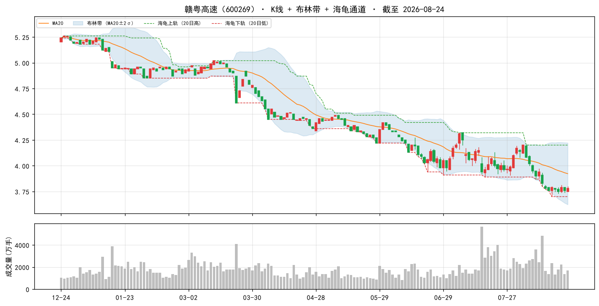

### 2. 鲁泰A（000726）

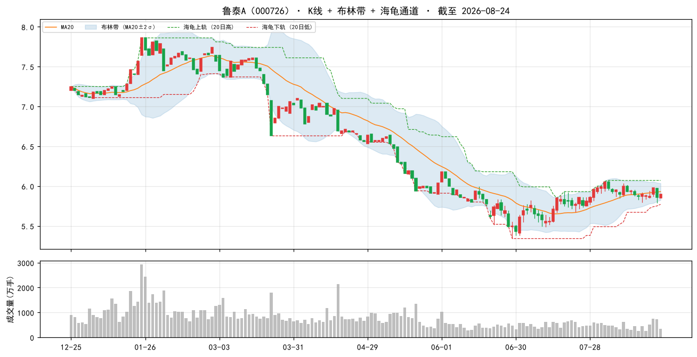

### 3. 浦东金桥（600639）

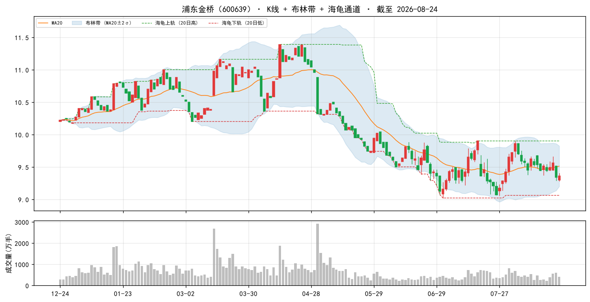

### 4. 安徽建工（600502）

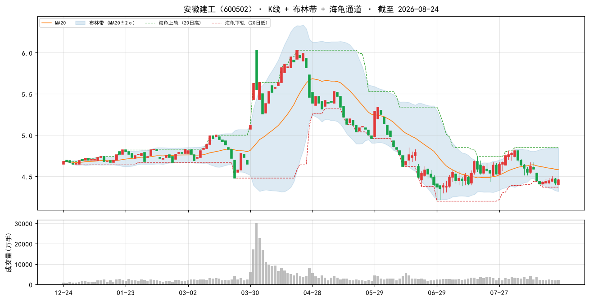

### 5. 山东路桥（000498）

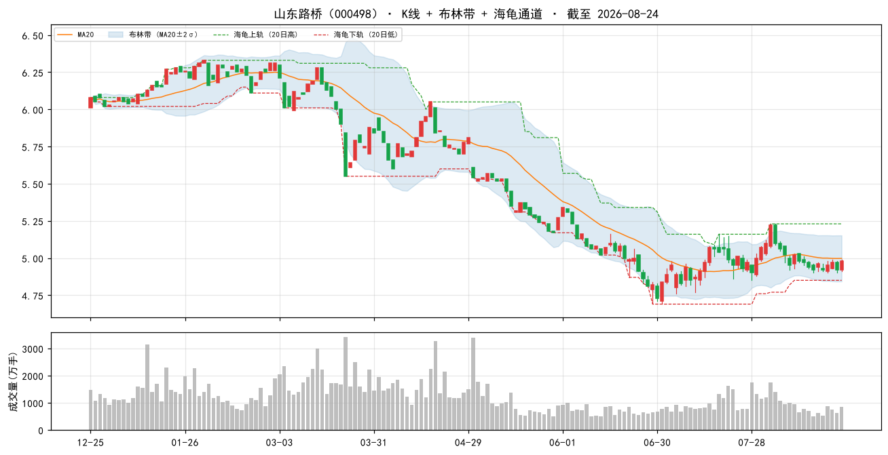

### 6. 中国海油（600938）

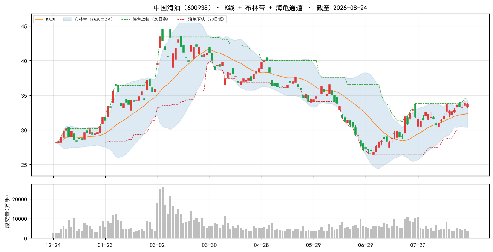

### 7. 中原环保（000544）

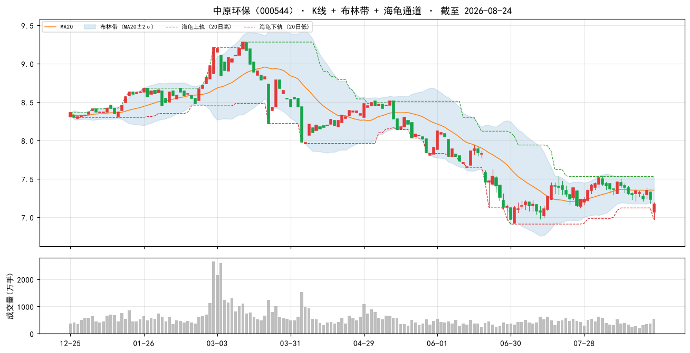

### 8. 大商股份（600694）

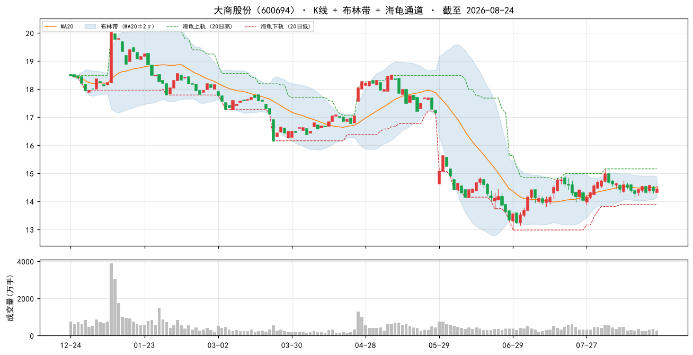

### 9. 现代投资（000900）

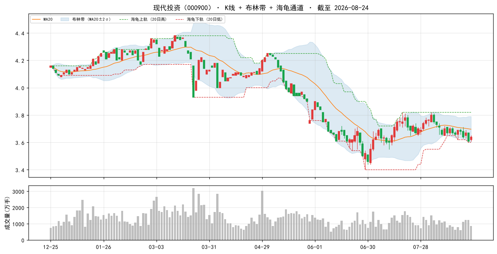

### 10. 中国移动（600941）

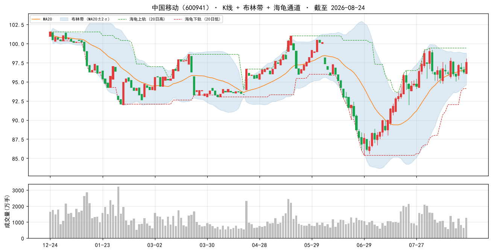

### 当日表现：top-10 vs 大盘

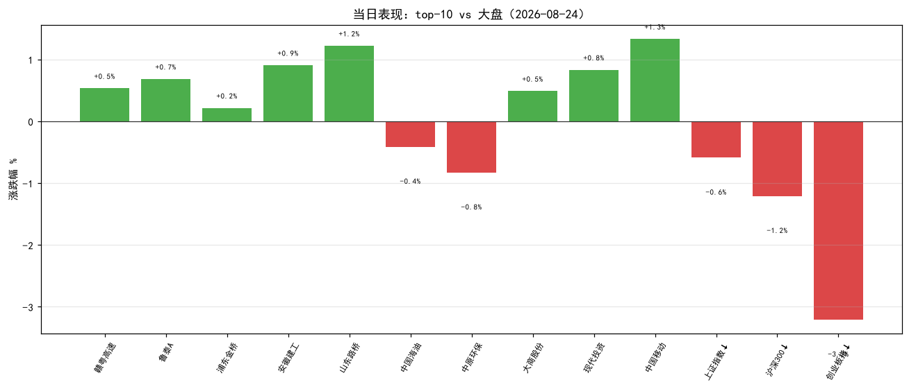

### 组合 vs 沪深300（近 60 交易日，当前名单回放近似）

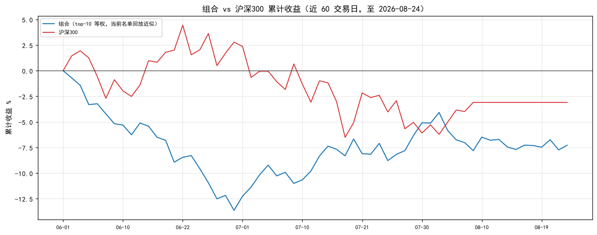

> 组合为**当前 top-10 名单**从窗口起点等权回放（非历史换手），仅作趋势参考；沪深300 用腾讯指数补齐最近两日。

## 九、因子诊断与优化建议

#### 8.1 历史名单表现追踪（至今）

| 名单日 | 股票数 | 名单等权至今 | 沪深300至今 | 超额 |
|---|---|---|---|---|
| 2026-08-11 | 50 | -1.0% | — | — |
| 2026-08-14 | 50 | +0.3% | — | — |
| 2026-08-17 | 50 | -0.0% | — | — |
| 2026-08-18 | 50 | +0.2% | — | — |
| 2026-08-20 | 50 | -0.1% | — | — |

> 说明：等权持有名单至今（未换手），个股停牌则该日不计入；分红未计入，短期窗口影响小。

#### 8.2 因子 IC 诊断（近 11 周截面，因子 vs 未来 5 日收益）

| 因子 | 方向 | 近11个快照 IC | 有效快照 | 判断 |
|---|---|---|---|---|
| 账面市值比 | 1 | +0.038 | 11 | 有效 |
| 盈余收益率 | 1 | +0.007 | 11 | 中性（区分度弱） |
| 净资产收益率 | 1 | -0.007 | 11 | 中性（区分度弱） |
| 毛利率 | 1 | -0.010 | 11 | 中性（区分度弱） |
| 现金流/净利 | 1 | +0.003 | 11 | 中性（区分度弱） |
| 60日波动 | -1 | -0.049 | 11 | 有效 |
| 总市值(ln) | -1 | +0.013 | 11 | 中性（区分度弱） |

> IC = 因子值与未来 5 日收益的秩相关（越大越有效）；与注册表方向同号且 |IC|≥0.02 判为有效。 单因子短期 IC 波动大，仅供诊断，不构成当日调权依据。

#### 8.3 月度权重校验（research_panel.pkl 滚动）

> 面板数据截至 2026-07-31。仅作参考：**权重建议月度复核，不日更**（防过拟合）。

| 方案 | 最近37月总收益 | 夏普 | 回撤 |
|---|---|---|---|
| 当前 | +16.2% | +0.20 | -17.6% |
| bp0.3+ep0.2+roe0.15+毛利0.1+现金流0.1+低波0.15 | +15.2% | +0.18 | -16.6% |
| 当前+小市值0.05 | +19.7% | +0.25 | -16.7% |
| 纯价值 bp0.6+ep0.4 | +9.8% | +0.10 | -14.4% |

> ⚠ 候选「当前+小市值0.05」近期夏普最高（+0.25）且高于当前——建议**月度复核时**考虑微调权重，勿当日追改。

## 十、AI 亮点点评

> 数据口径：本地因子数据截至 **2026-08-24**（完整交易日）；实时行情/大盘指数/个股新闻来自腾讯，时间 **2026-08-24 16:14 收盘**。本段为 AI 基于因子报告 + 实时数据的解读，非买卖指令。

### 10.1 今日市场环境

周一 A 股全面回调、风险偏好明显收缩：**上证 -0.59% / 沪深300 -1.21% / 深成 -2.13% / 创业板 -3.21% / 上证50 -0.44%**。风格上呈现典型的 **「防御价值占优、成长小盘重挫」**：上证50（-0.44%）与沪深300 相对抗跌，而创业板（-3.21%）、深成（-2.13%）领跌，高估值成长与小微盘承压最重。个股层面全市场 5266 只中仅 1412 只上涨、3727 只下跌，广度偏弱。财经要闻中「速腾聚创单日暴跌 14.5%（激光雷达龙头信任危机）」「英伟达二季报临近检验 AI 行情」等提示科技成长链情绪脆弱；美债收益率高位扰动亦压制风险资产。整体为 **risk-off 日**，防御/红利/低波资产获得相对收益。

### 10.2 组合画像

本期 top-50 组合为 **「深度价值 + 低波 + 中盘偏小」的防御型红利组合**：账面市值比百分位 **99%**、盈余收益率百分位 **94%**（极便宜），60日波动百分位 **94%**（即波动处全市场最小档，防御属性强），总市值(ln) 百分位 **32%**（整体偏小盘）。PE 中位 **8.7**、PB 中位 **0.5**、市值中位 **120.5 亿**。因子 IC 诊断（8.2）显示 **账面市值比 +0.038、60日波动 -0.049 均有效**，其余因子中性——价值 + 低波双因子与今日 risk-off、防御占优的风格**正好对齐**，策略状态健康。

### 10.3 今日表现（top-10，2026-08-24 收盘）

| 代码 | 名称 | 涨跌% | 相对上证超额 |
|---|---|---|---|
| 600269 | 赣粤高速 | +0.53% | +1.12pp |
| 000726 | 鲁泰A | +0.68% | +1.27pp |
| 600639 | 浦东金桥 | +0.21% | +0.80pp |
| 600502 | 安徽建工 | +0.90% | +1.49pp |
| 000498 | 山东路桥 | +1.22% | +1.81pp |
| 600938 | 中国海油 | -0.41% | +0.18pp |
| 000544 | 中原环保 | -0.83% | +0.24pp |
| 600694 | 大商股份 | +0.49% | +1.08pp |
| 000900 | 现代投资 | +0.83% | +1.42pp |
| 600941 | 中国移动 | +1.33% | +1.92pp |

top-10 算术平均约 **+0.50%**（10 只中 8 只收红），显著跑赢上证（-0.59%，超额约 +1.1pp）、更大幅跑赢创业板（-3.21%，超额约 +3.7pp）。中国移动、山东路桥、现代投资、安徽建工等防御/红利/基建国企逆市上涨，印证组合在低波风险日的有效防御性；仅中国海油（-0.41%，油价走弱）、中原环保（-0.83%）小幅收绿。

### 10.4 逐票深度分析（top 5）

**① 赣粤高速（600269，+0.53%）**
- **主业/定位**：江西省域收费高速公路运营龙头，路产主业稳健、车流刚性，类债券防御属性强，是组合的「压舱石」。
- **估值与质量**：bp 2.237（全市场前 99%）、ep 0.1276（前 99%）、毛利率 40.8%（前 98%）、现金流/净利 209.7%（前 74%）——便宜且质量尚可；PE_TTM 12.2 / PB 0.5、市值 88 亿。
- **最新催化**：半年报点评「核心路产主业稳健，金融投资波动致业绩承压」；华创证券强推目标价 **5.71 元**（较现价 3.78 有约 51% 上行空间），提供估值安全垫。
- **风险点**：利润受「炒股」等金融投资波动拖累，属非主业风险，需看投资收益稳定性。
- **结论**：深度低估 + 防御 + 强推目标价托底，**适合作为底仓持有**。

**② 鲁泰A（000726，+0.68%）**
- **主业/定位**：高端色织布/衬衫代工龙头（出口型），全球份额居前，但景气处下行周期。
- **估值与质量**：bp 2.828（前 100%）、ep 0.1544（前 100%）极度便宜；但毛利率仅 7.3%（前 62%）、ROE 5.5%（前 60%）偏弱；PE_TTM 8.9 / PB 0.5、市值仅 35 亿。
- **最新催化**：多次业绩点评指向「收入与毛利短期承压，汇兑及公允价值变动拖累利润」，25 年靠投资收益增厚利润——盈利质量依赖非主营。
- **风险点**：出口型企业受**人民币汇率（升值）与海外需求**波动影响大；毛利率低、景气未反转。
- **结论**：深度价值但景气承压，**小仓位观察**，等毛利率/订单拐点。

**③ 浦东金桥（600639，+0.21%）**
- **主业/定位**：上海浦东金桥开发区园区开发 + 物业租赁，收租型国企，现金流稳定。
- **估值与质量**：bp 1.8925（前 99%）、ep 0.131（前 99%）、现金流/净利 379.8%（前 85%）、低波前 99%；PE_TTM 10.1 / PB 0.7、市值 80 亿，质量优于多数地产股。
- **最新催化**：研报「收入高增利润增长，经营性物业出租率稳中有升」，4 月获融资净买入。
- **风险点**：区域商办/园区租赁受上海供需与地产政策影响，租金企稳与否是关键。
- **结论**：稳健收租 + 低估的**防御型标的**，可底仓配置。

**④ 安徽建工（600502，+0.90%）**
- **主业/定位**：安徽国资基建/房建工程承包商，受益于区域基建投资。
- **估值与质量**：bp 2.769（前 100%）、ep 0.202（前 100%）账面极便宜，PE_TTM 仅 5.0；但**毛利率 3.1%、现金流/净利 -868.9%（全市场前 9%）**——经营现金流大幅为负，典型工程垫资/回款慢。
- **最新催化**：「收入利润稳健增长，重点项目持续落地」，4 月获融资净买入 1321 万（环比 +502%）。
- **风险点**：**现金流/净利 -868.9% 极端，价值陷阱预警**；建筑行业回款与应收账款风险高。
- **结论**：低估值但现金流恶化，**谨慎、控制仓位**，警惕「便宜的假象」。

**⑤ 山东路桥（000498，+1.22%）**
- **主业/定位**：山东国资路桥工程施工龙头，基建基建属性，订单驱动。
- **估值与质量**：bp 3.4645（前 100%）、ep 0.2775（前 100%）、ROE 8.0%（前 74%）盈利尚可；但**现金流/净利 -1839.7%（全市场前 4%）**更极端，PE_TTM 仅 3.6。
- **最新催化**：新闻面偏正面——「25 年新签订单较快增长、现金流同比大幅改善」「进城出海激发新动能」「Q1 订单继续增长」，与截面因子显示的极差现金流形成**背离**，值得重点跟踪验证。
- **风险点**：现金流/净利 -1839.7% 极端差，价值陷阱；若新闻面现金流改善兑现则重估，否则慎防低估值陷阱。
- **结论**：低估 + 订单弹性，但现金流风险高，**观察为主、待现金流验证**。

### 10.5 操作建议与风险

- **动量反向**：A 股 2018-2026 动量方向反向，本方案不含动量因子，**不要因个股近期涨幅加仓**；今日上涨多为防御风格驱动，非趋势信号。
- **仓位与节奏**：名单为「当日截面快照，不构成调仓指令」。建议**月度调仓、等权持有**，单票仓位别太重（小市值/建筑股波动与回款风险大），单票止损参考 **-8%**。
- **显著风险点**：
  1. **大盘 risk-off 未止**：沪深300 -1.21%、创业板 -3.21%，成长小盘重挫；要闻提示激光雷达龙头暴跌、英伟达财报临近、美债高位，科技链与外溢风险仍在。
  2. **建筑股价值陷阱**：安徽建工 / 山东路桥 现金流/净利 -869% / -1840%（截面因子），账面便宜但现金流极端恶化，需警惕「低估值陷阱」，建议低配。
  3. **组合内分化**：中国海油（-0.41%，油价与超大盘属性与「小市值增强」相悖）、中原环保（-0.83%）逆市，能源/环保个股受商品价格与主题轮动影响。
  4. **因子依赖集中**：当前仅 bp（价值）+ 低波有效，其余因子中性；月度权重校验提示「当前+小市值0.05」夏普最高（+0.25），可于**月度复核**时微调，勿当日追改。
- **数据滞后说明**：本地因子数据截至 2026-08-24 收盘；实时行情/新闻同为 08-24 16:14。PE/PB 含腾讯实时与因子估算两口径，个别票（baostock 段市值推算）可能失真，勿单看估值数字。
