# 每日选股报告 · 2026-08-26

> 方案：**valuelowvol** · 权重 账面市值比 0.30 + 盈余收益率 0.20 + 60日波动 0.30 + 总市值(ln) 0.20 · 选 top-50 · 等权持仓（建议月频调仓）
> 历史验证 2018-2026（含交易成本）：总收益 **+29.7%** · 夏普 +0.10 · 最大回撤 -24.8%
> 生成：2026-08-26 09:01 · 数据截至 2026-08-25

## 一、市场概况

### 1.1 主要指数表现

| 指数 | 收盘 | 涨跌幅 |
|---|---|---|
| 上证50（000016） | 2875.51 | +0.00% |
| 中证500（000905） | 7710.94 | +0.00% |

### 1.2 市场广度

- 全市场 **5267 只**：上涨 **4000** / 下跌 **1194** / 平盘 73
- 总成交额 ≈ **18183 亿元**

- 当日可交易股票池（剔除 ST/涨跌停/停牌/次新/B股/北交所/金融股）：**4789 只**
- 打分因子：`valuelowvol` 权重因子共 4 个

## 二、选股方案与方法

- 模型：多因子截面打分。每因子先 [1%,99%] 缩尾去极端 → z-score 标准化 → 乘方向与权重加权求和 → 取 top-50 等权。
- 权重：账面市值比 0.3、盈余收益率 0.2、60日波动 0.3、总市值(ln) 0.2（研究管线 `validate_daily_schemes.py` 历史验证选定）。
- 无未来函数：基本面用「报告期 + 4 个月披露滞后」；动量 skip 最近 20 交易日；股票池剔除 ST/涨跌停/停牌/次新(<120日)/B股/北交所/金融股。

### 2.1 因子定义与公式

> 打分公式：`综合得分 = Σ wᵢ × 方向ᵢ × z-score(缩尾[1%,99%] 因子ᵢ)`，缺失因子贡献 0。

| 因子 | 方向 | 权重 | 公式/定义 | 数据源 |
|---|---|---|---|---|
| 账面市值比（bp） | 1（越大越好） | 0.30 | 净资产(合并A003000000) / 总市值(元)（账面市值比） | fs_combas+price |
| 盈余收益率（ep_ttm） | 1（越大越好） | 0.20 | TTM归母净利润 / 总市值(元)（盈余收益率） | fs_comins+price |
| 60日波动（vol_60d） | -1（越小越好） | 0.30 | 60日日收益率标准差，年化×√252 | stock_daily |
| 总市值(ln)（ln_cap） | -1（越小越好） | 0.20 | ln(推算总市值, 元) | stock_daily |

- 选股数：top-50 等权（建议月频调仓）；方向由 `factor_registry.json` 统一管理。

## 三、今日 Top-50 名单

> PE/PB 为按盈余收益率(ep_ttm)/账面市值比(bp)换算的**估算值**，仅供参考；baostock 段市值用参考股本×收盘推算，个别票 PE/PB 可能失真。

| 排名 | 代码 | 名称 | 收盘价 | PE(估) | PB(估) | 综合得分 | 账面市值比 | 盈余收益率 | 60日波动 | 总市值(ln) |
|---|---|---|---|---|---|---|---|---|---|---|
| 1 | 000726 | 鲁泰A | 5.9500 | 6.5 | 0.4 | 2.23 | 2.8046 | 0.1531 | 21.0% | 21.9815 |
| 2 | 600639 | 浦东金桥 | 9.4800 | 7.7 | 0.5 | 2.07 | 1.8686 | 0.1294 | 21.1% | 22.8102 |
| 3 | 600694 | 大商股份 | 14.6200 | 10.1 | 0.6 | 2.03 | 1.8166 | 0.0993 | 25.8% | 22.3396 |
| 4 | 600269 | 赣粤高速 | 3.8200 | 7.9 | 0.5 | 2.00 | 2.2135 | 0.1263 | 24.8% | 22.9117 |
| 5 | 000028 | 国药一致 | 19.8700 | 8.8 | 0.5 | 1.97 | 1.9601 | 0.1136 | 25.6% | 22.9893 |
| 6 | 000900 | 现代投资 | 3.7000 | 14.3 | 0.4 | 1.96 | 2.2589 | 0.0701 | 19.2% | 22.4489 |
| 7 | 600035 | 楚天高速 | 3.4000 | 10.9 | 0.6 | 1.91 | 1.6625 | 0.0918 | 17.0% | 22.4233 |
| 8 | 000544 | 中原环保 | 7.2700 | 6.7 | 0.6 | 1.91 | 1.6097 | 0.1501 | 19.9% | 22.6814 |
| 9 | 600020 | 中原高速 | 3.8000 | 13.3 | 0.5 | 1.90 | 1.8690 | 0.0749 | 20.7% | 22.8680 |
| 10 | 000906 | 浙商中拓 | 5.4200 | 17.7 | 0.5 | 1.88 | 2.0672 | 0.0565 | 29.0% | 22.0704 |
| 11 | 601811 | 新华文轩 | 12.0800 | 6.1 | 0.6 | 1.85 | 1.6262 | 0.1637 | 22.3% | 22.9815 |
| 12 | 600874 | 创业环保 | 5.5800 | 7.8 | 0.7 | 1.85 | 1.5345 | 0.1288 | 18.3% | 22.6498 |
| 13 | 600704 | 物产中大 | 4.8900 | 7.0 | 0.5 | 1.85 | 1.8250 | 0.1428 | 21.3% | 23.9536 |
| 14 | 600051 | 宁波联合 | 6.3400 | 26.0 | 0.6 | 1.84 | 1.7351 | 0.0385 | 30.6% | 21.4018 |
| 15 | 600548 | 深高速 | 8.2200 | 12.5 | 0.5 | 1.81 | 1.8669 | 0.0802 | 20.4% | 23.4123 |
| 16 | 600528 | 中铁工业 | 7.0400 | 11.4 | 0.6 | 1.80 | 1.7908 | 0.0875 | 20.8% | 23.4731 |
| 17 | 601333 | 广深铁路 | 2.9500 | 10.8 | 0.6 | 1.76 | 1.7354 | 0.0922 | 19.8% | 23.5371 |
| 18 | 603018 | 华设集团 | 5.3100 | 12.8 | 0.7 | 1.74 | 1.5011 | 0.0783 | 25.5% | 22.0128 |
| 19 | 000778 | 新兴铸管 | 3.6400 | 14.3 | 0.5 | 1.74 | 1.8475 | 0.0698 | 24.0% | 23.3923 |
| 20 | 600827 | 百联股份 | 7.7100 | 10.1 | 0.6 | 1.74 | 1.6636 | 0.0994 | 24.9% | 23.2386 |
| 21 | 000789 | 万年青 | 4.1400 | — | 0.5 | 1.71 | 2.0000 | -0.0080 | 25.0% | 21.9176 |
| 22 | 600017 | 日照港 | 2.7000 | 18.9 | 0.6 | 1.70 | 1.6935 | 0.0528 | 21.9% | 22.8400 |
| 23 | 603585 | 苏利股份 | 10.2000 | 11.1 | 0.7 | 1.70 | 1.3592 | 0.0897 | 31.7% | 21.4203 |
| 24 | 600894 | 广日股份 | 7.2900 | 8.7 | 0.7 | 1.68 | 1.4329 | 0.1146 | 28.5% | 22.5492 |
| 25 | 600064 | 南京高科 | 7.6800 | 7.5 | 0.7 | 1.68 | 1.4859 | 0.1328 | 21.5% | 23.3102 |
| 26 | 000501 | 武商集团 | 7.2700 | 34.7 | 0.5 | 1.68 | 1.9740 | 0.0288 | 30.5% | 22.4443 |
| 27 | 600168 | 武汉控股 | 4.4200 | 42.7 | 0.6 | 1.67 | 1.6890 | 0.0234 | 23.9% | 22.2028 |
| 28 | 600057 | 厦门象屿 | 6.1600 | 13.4 | 0.5 | 1.67 | 1.9448 | 0.0746 | 28.2% | 23.5854 |
| 29 | 601107 | 四川成渝 | 5.7800 | 8.3 | 0.6 | 1.66 | 1.6453 | 0.1211 | 33.5% | 23.2490 |
| 30 | 000550 | 江铃汽车 | 15.7400 | 6.7 | 0.7 | 1.66 | 1.4732 | 0.1495 | 28.6% | 22.8240 |
| 31 | 000910 | 大亚圣象 | 5.4200 | — | 0.5 | 1.66 | 2.2099 | -0.0047 | 30.8% | 21.8108 |
| 32 | 000589 | 贵州轮胎 | 4.3200 | 9.1 | 0.7 | 1.66 | 1.3686 | 0.1093 | 23.2% | 22.6278 |
| 33 | 000932 | 华菱钢铁 | 3.6600 | 11.2 | 0.4 | 1.66 | 2.2264 | 0.0896 | 27.8% | 23.9454 |
| 34 | 600717 | 天津港 | 4.3100 | 11.8 | 0.6 | 1.65 | 1.6390 | 0.0849 | 25.5% | 23.2468 |
| 35 | 600742 | 富维股份 | 7.7400 | 12.8 | 0.7 | 1.63 | 1.4830 | 0.0779 | 25.7% | 22.4727 |
| 36 | 601607 | 上海医药 | 16.3700 | 7.9 | 0.6 | 1.62 | 1.6929 | 0.1272 | 21.0% | 24.5445 |
| 37 | 600755 | 厦门国贸 | 5.7900 | 36.2 | 0.4 | 1.61 | 2.7866 | 0.0276 | 23.4% | 23.2391 |
| 38 | 600941 | 中国移动 | 98.8600 | 0.7 | 0.1 | 1.60 | 15.9418 | 1.5217 | 19.0% | 25.2147 |
| 39 | 600585 | 海螺水泥 | 17.6000 | 9.1 | 0.4 | 1.60 | 2.7535 | 0.1104 | 23.7% | 24.9774 |
| 40 | 000401 | 金隅冀东 | 3.5800 | 97.7 | 0.4 | 1.59 | 2.7886 | 0.0102 | 24.0% | 22.9763 |
| 41 | 600551 | 时代出版 | 6.9000 | 11.7 | 0.8 | 1.58 | 1.2771 | 0.0857 | 19.7% | 22.2663 |
| 42 | 600373 | 中文传媒 | 7.1200 | 45.0 | 0.5 | 1.58 | 1.8651 | 0.0222 | 27.6% | 22.9843 |
| 43 | 002758 | 浙农股份 | 8.0800 | 7.7 | 0.8 | 1.56 | 1.2396 | 0.1290 | 30.5% | 22.1564 |
| 44 | 000885 | 城发环境 | 12.1500 | 6.1 | 0.8 | 1.56 | 1.2553 | 0.1637 | 22.7% | 22.7775 |
| 45 | 600308 | 华泰股份 | 3.2500 | — | 0.5 | 1.55 | 1.8362 | -0.0209 | 26.7% | 22.3186 |
| 46 | 000709 | 河钢股份 | 2.1100 | 20.0 | 0.4 | 1.55 | 2.7302 | 0.0501 | 26.4% | 23.8057 |
| 47 | 603035 | 常熟汽饰 | 11.2600 | 12.5 | 0.8 | 1.54 | 1.3050 | 0.0800 | 26.5% | 22.1403 |
| 48 | 000507 | 珠海港 | 5.0000 | 19.9 | 0.7 | 1.53 | 1.4735 | 0.0503 | 27.6% | 22.2490 |
| 49 | 603518 | 锦泓集团 | 8.1200 | 11.3 | 0.7 | 1.53 | 1.3703 | 0.0885 | 39.2% | 21.7544 |
| 50 | 600648 | 外高桥 | 9.2700 | 11.8 | 0.7 | 1.53 | 1.4847 | 0.0846 | 26.4% | 23.0979 |

## 四、组合画像（top-50 统计）

| 维度 | 数值 | 含义 |
|---|---|---|
| 账面市值比平均百分位 | **99%** | 组合在该因子上相对全市场的位置（越大越好） |
| 盈余收益率平均百分位 | **88%** | 组合在该因子上相对全市场的位置（越大越好） |
| 60日波动平均百分位 | **96%** | 组合在该因子上相对全市场的位置（越大越好） |
| 总市值(ln)平均百分位 | **45%** | 组合在该因子上相对全市场的位置（越大越好） |
| PE(中位数, 估) | 11.1 | 组合估值水平 |
| PB(中位数, 估) | 0.6 | 组合市净率水平 |
| 市值(中位数) | 81.7 亿元 | 组合规模风格 |

## 五、前 10 入选理由（因子百分位）

> 百分位为当日全市场该因子的分布位置（0-100，**已按因子方向归一**，越大越好）。

### 1. **鲁泰A**（000726，收盘 5.9500）

- 账面市值比 2.8046（权重 0.30，全市场前 100%）
- 盈余收益率 0.1531（权重 0.20，全市场前 100%）
- 60日波动 21.0%（权重 0.30，全市场前 99%）
- 总市值(ln) 21.9815（权重 0.20，全市场前 76%）

### 2. **浦东金桥**（600639，收盘 9.4800）

- 账面市值比 1.8686（权重 0.30，全市场前 99%）
- 盈余收益率 0.1294（权重 0.20，全市场前 99%）
- 60日波动 21.1%（权重 0.30，全市场前 99%）
- 总市值(ln) 22.8102（权重 0.20，全市场前 41%）

### 3. **大商股份**（600694，收盘 14.6200）

- 账面市值比 1.8166（权重 0.30，全市场前 99%）
- 盈余收益率 0.0993（权重 0.20，全市场前 98%）
- 60日波动 25.8%（权重 0.30，全市场前 97%）
- 总市值(ln) 22.3396（权重 0.20，全市场前 60%）

### 4. **赣粤高速**（600269，收盘 3.8200）

- 账面市值比 2.2135（权重 0.30，全市场前 99%）
- 盈余收益率 0.1263（权重 0.20，全市场前 99%）
- 60日波动 24.8%（权重 0.30，全市场前 97%）
- 总市值(ln) 22.9117（权重 0.20，全市场前 37%）

### 5. **国药一致**（000028，收盘 19.8700）

- 账面市值比 1.9601（权重 0.30，全市场前 99%）
- 盈余收益率 0.1136（权重 0.20，全市场前 99%）
- 60日波动 25.6%（权重 0.30，全市场前 97%）
- 总市值(ln) 22.9893（权重 0.20，全市场前 35%）

### 6. **现代投资**（000900，收盘 3.7000）

- 账面市值比 2.2589（权重 0.30，全市场前 99%）
- 盈余收益率 0.0701（权重 0.20，全市场前 93%）
- 60日波动 19.2%（权重 0.30，全市场前 100%）
- 总市值(ln) 22.4489（权重 0.20，全市场前 55%）

### 7. **楚天高速**（600035，收盘 3.4000）

- 账面市值比 1.6625（权重 0.30，全市场前 99%）
- 盈余收益率 0.0918（权重 0.20，全市场前 97%）
- 60日波动 17.0%（权重 0.30，全市场前 100%）
- 总市值(ln) 22.4233（权重 0.20，全市场前 56%）

### 8. **中原环保**（000544，收盘 7.2700）

- 账面市值比 1.6097（权重 0.30，全市场前 98%）
- 盈余收益率 0.1501（权重 0.20，全市场前 100%）
- 60日波动 19.9%（权重 0.30，全市场前 99%）
- 总市值(ln) 22.6814（权重 0.20，全市场前 45%）

### 9. **中原高速**（600020，收盘 3.8000）

- 账面市值比 1.8690（权重 0.30，全市场前 99%）
- 盈余收益率 0.0749（权重 0.20，全市场前 94%）
- 60日波动 20.7%（权重 0.30，全市场前 99%）
- 总市值(ln) 22.8680（权重 0.20，全市场前 38%）

### 10. **浙商中拓**（000906，收盘 5.4200）

- 账面市值比 2.0672（权重 0.30，全市场前 99%）
- 盈余收益率 0.0565（权重 0.20，全市场前 88%）
- 60日波动 29.0%（权重 0.30，全市场前 94%）
- 总市值(ln) 22.0704（权重 0.20，全市场前 72%）

## 六、口径与风险提示

- 因子无未来函数：基本面用「报告期 + 4 个月滞后」；动量 skip 最近 20 交易日；股票池剔除 ST/涨跌停/次新/金融股。
- **动量在 A 股 2018-2026 方向反向**，本方案不含动量因子；成长因子不显著，仅作参考。
- 小市值增强（ln_cap）是 A 股 2018-2026 有效因子，但小市值波动大、流动性差，请控制单票仓位。
- **名单是「当日截面快照」，不构成调仓指令**。建议月度调仓、等权持有，避免高频换手吞噬收益；单票止损参考 -8%。
- 数据源：CSMAR 全量 + baostock 每日增量；本地因子数据可能落后 1 天（baostock 滞后），实时行情请见 Claude 点评补充。

## 七、基本面与估值快照

> 估值：腾讯行情实时（PE_TTM/PB/总市值，数据日期 2026-08-25）；财务：CSMAR 最新报告期（4 个月披露滞后）。 可与此前因子换算的 PE/PB(估) 互相印证。

| 代码 | 名称 | 现价 | 涨跌% | PE_TTM | PB | 总市值(亿) | 盈余收益率 | ROE_TTM | 毛利率 | 现金流/净利 |
|---|---|---|---|---|---|---|---|---|---|---|
| 000726 | 鲁泰A | 6.0 | 0.8% | 9.0 | 0.5 | 35.1 | 0.153 | 0.055 | 7.3% | 172.4% |
| 600639 | 浦东金桥 | 9.5 | 1.3% | 10.2 | 0.7 | 80.6 | 0.129 | 0.069 | 11.7% | 379.8% |
| 600694 | 大商股份 | 14.6 | 1.3% | 11.1 | 0.6 | 55.4 | 0.099 | 0.055 | 19.5% | 193.2% |
| 600269 | 赣粤高速 | 3.8 | 1.1% | 12.3 | 0.5 | 89.2 | 0.126 | 0.057 | 40.8% | 209.7% |
| 000028 | 国药一致 | 19.9 | 1.4% | 11.3 | 0.6 | 104.5 | 0.114 | 0.058 | 2.2% | -1021.1% |
| 000900 | 现代投资 | 3.7 | 1.6% | 14.2 | 0.5 | 56.2 | 0.070 | 0.031 | 15.2% | 24.9% |
| 600035 | 楚天高速 | 3.4 | 0.9% | 10.9 | 0.6 | 54.7 | 0.092 | 0.055 | 27.4% | 175.9% |
| 000544 | 中原环保 | 7.3 | 1.4% | 6.9 | 0.8 | 70.9 | 0.150 | 0.093 | 36.4% | -111.9% |
| 600020 | 中原高速 | 3.8 | 0.3% | 13.1 | 0.7 | 85.4 | 0.075 | 0.040 | 33.2% | 119.8% |
| 000906 | 浙商中拓 | 5.4 | 2.6% | 14.3 | 0.8 | 38.0 | 0.056 | 0.027 | 0.4% | -4988.9% |
| 601811 | 新华文轩 | 12.1 | 0.9% | 9.5 | 1.0 | 95.7 | 0.164 | 0.101 | 10.0% | -66.4% |
| 600874 | 创业环保 | 5.6 | 0.2% | 10.0 | 0.8 | 68.7 | 0.129 | 0.084 | 28.9% | -44.9% |
| 600704 | 物产中大 | 4.9 | 0.2% | 7.1 | 0.6 | 252.9 | 0.143 | 0.078 | 1.5% | -797.1% |
| 600051 | 宁波联合 | 6.3 | 1.1% | 29.1 | 0.6 | 19.7 | 0.038 | 0.022 | 0.2% | 1117.3% |
| 600548 | 深高速 | 8.2 | -0.4% | 18.8 | 0.9 | 140.9 | 0.080 | 0.043 | 25.8% | 201.9% |
| 600528 | 中铁工业 | 7.0 | 1.1% | 12.1 | 0.6 | 156.4 | 0.087 | 0.049 | 4.5% | -226.2% |
| 601333 | 广深铁路 | 3.0 | 1.0% | 13.9 | 0.7 | 166.7 | 0.092 | 0.053 | 10.6% | -6.5% |
| 603018 | 华设集团 | 5.3 | 2.1% | 15.3 | 0.8 | 43.5 | 0.078 | 0.052 | 9.4% | -160.4% |
| 000778 | 新兴铸管 | 3.6 | -2.1% | 15.8 | 0.6 | 141.7 | 0.070 | 0.038 | 2.0% | -636.1% |
| 600827 | 百联股份 | 7.7 | 2.2% | 11.2 | 0.7 | 123.7 | 0.099 | 0.060 | 2.7% | 133.1% |
| 000789 | 万年青 | 4.1 | 1.5% | -124.5 | 0.5 | 33.0 | -0.008 | -0.004 | -5.9% | 464.1% |
| 600017 | 日照港 | 2.7 | 0.8% | 18.9 | 0.6 | 83.0 | 0.053 | 0.031 | 7.0% | 357.9% |
| 603585 | 苏利股份 | 10.2 | 2.2% | 16.8 | 1.0 | 27.6 | 0.090 | 0.066 | 4.0% | 394.2% |
| 600894 | 广日股份 | 7.3 | -5.6% | 10.3 | 0.7 | 61.5 | 0.115 | 0.080 | -0.6% | -1453.2% |
| 600064 | 南京高科 | 7.7 | 1.2% | 7.8 | 0.7 | 132.9 | 0.133 | 0.089 | -0.1% | 28.0% |
| 000501 | 武商集团 | 7.3 | 3.3% | 34.7 | 0.5 | 55.9 | 0.029 | 0.015 | 8.4% | 379.1% |
| 600168 | 武汉控股 | 4.4 | 0.2% | 41.7 | 0.8 | 43.9 | 0.023 | 0.014 | 2.7% | -487.7% |
| 600057 | 厦门象屿 | 6.2 | -0.3% | 13.2 | 1.1 | 128.9 | 0.075 | 0.038 | 1.7% | -1478.6% |
| 601107 | 四川成渝 | 5.8 | 3.8% | 11.9 | 1.1 | 125.0 | 0.121 | 0.074 | 23.1% | 197.6% |
| 000550 | 江铃汽车 | 15.7 | 0.8% | 11.4 | 1.1 | 81.6 | 0.150 | 0.101 | 1.0% | -584.0% |
| 000910 | 大亚圣象 | 5.4 | 2.5% | -213.5 | 0.5 | 29.7 | -0.005 | -0.002 | -15.9% | 492.2% |
| 000589 | 贵州轮胎 | 4.3 | 1.6% | 9.2 | 0.7 | 66.7 | 0.109 | 0.080 | 6.8% | 208.3% |
| 000932 | 华菱钢铁 | 3.7 | 0.6% | 23.1 | 0.5 | 250.8 | 0.090 | 0.040 | 0.4% | -835.9% |
| 600717 | 天津港 | 4.3 | 0.2% | 10.8 | 0.6 | 124.7 | 0.085 | 0.052 | 22.8% | 107.3% |
| 600742 | 富维股份 | 7.7 | 2.1% | 12.8 | 0.7 | 57.5 | 0.078 | 0.053 | 2.7% | 658.6% |
| 601607 | 上海医药 | 16.4 | 1.1% | 10.4 | 0.8 | 456.6 | 0.127 | 0.075 | 3.2% | -71.2% |
| 600755 | 厦门国贸 | 5.8 | 1.9% | 29.9 | 0.7 | 123.5 | 0.028 | 0.010 | 2.5% | -13518.6% |
| 600941 | 中国移动 | 98.9 | 1.4% | 16.3 | 1.5 | 892.5 | 1.522 | 0.095 | 13.3% | 243.5% |
| 600585 | 海螺水泥 | 17.6 | 0.2% | 11.9 | 0.5 | 700.0 | 0.110 | 0.040 | 8.5% | 22.2% |
| 000401 | 金隅冀东 | 3.6 | 1.4% | 97.7 | 0.4 | 94.2 | 0.010 | 0.004 | -38.3% | 64.7% |
| 600551 | 时代出版 | 6.9 | 1.0% | 11.7 | 0.8 | 46.8 | 0.086 | 0.067 | 1.8% | -632.7% |
| 600373 | 中文传媒 | 7.1 | 2.1% | 45.0 | 0.5 | 95.9 | 0.022 | 0.012 | 2.5% | -440.6% |
| 002758 | 浙农股份 | 8.1 | 2.0% | 7.8 | 0.8 | 41.9 | 0.129 | 0.104 | 1.3% | -899.4% |
| 000885 | 城发环境 | 12.2 | 0.4% | 6.4 | 0.8 | 78.0 | 0.164 | 0.130 | 26.2% | 100.9% |
| 600308 | 华泰股份 | 3.2 | 2.5% | -43.0 | 0.5 | 49.3 | -0.021 | -0.011 | 0.7% | -358.8% |
| 000709 | 河钢股份 | 2.1 | 0.5% | 20.9 | 0.4 | 218.1 | 0.050 | 0.018 | 0.3% | 1069.8% |
| 603035 | 常熟汽饰 | 11.3 | 2.1% | 12.5 | 0.8 | 41.2 | 0.080 | 0.061 | 1.7% | 189.6% |
| 000507 | 珠海港 | 5.0 | 0.6% | 19.9 | 0.8 | 45.1 | 0.050 | 0.034 | 9.4% | 269.8% |
| 603518 | 锦泓集团 | 8.1 | 0.5% | 10.8 | 0.7 | 27.9 | 0.089 | 0.065 | 13.0% | 47.1% |
| 600648 | 外高桥 | 9.3 | 2.8% | 13.4 | 0.8 | 105.5 | 0.085 | 0.057 | 3.4% | -6727.5% |

- top-50 估值（腾讯）：PE_TTM 中位 **12.1** · PB 中位 **0.71** · 总市值中位 **82 亿**

> 说明：腾讯 PE/PB 与因子口径不同（腾讯用其财务模型），仅作实时参考；ROE/毛利率/现金流以 CSMAR 季度为准。

## 八、技术面辅助（K线 + 布林带 + 海龟通道）

> 图为**股价 K 线**（红涨绿跌，A 股惯例）+ 布林带（MA20 ± 2σ，超买/超卖参考）+ 海龟通道（20 日唐奇安高低轨，突破上下轨为潜在趋势信号）。 **仅辅助参考，不构成买卖指令。** 数据：`stock_daily` 截至 2026-08-25。

### 1. 鲁泰A（000726）

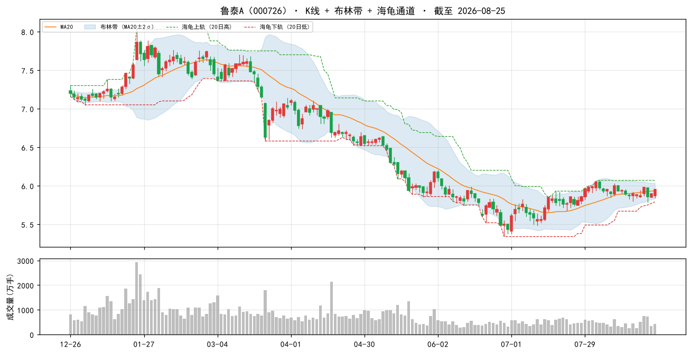

### 2. 浦东金桥（600639）

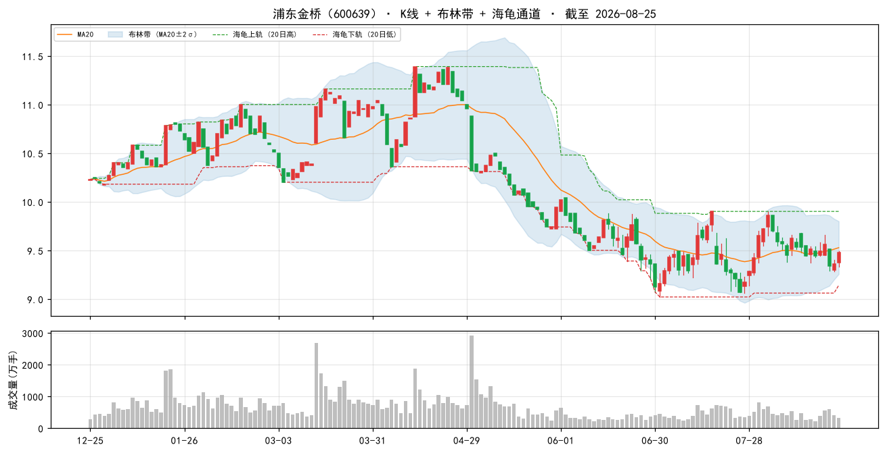

### 3. 大商股份（600694）

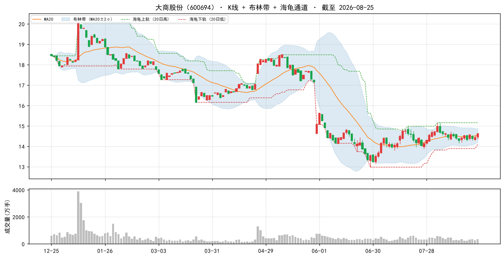

### 4. 赣粤高速（600269）

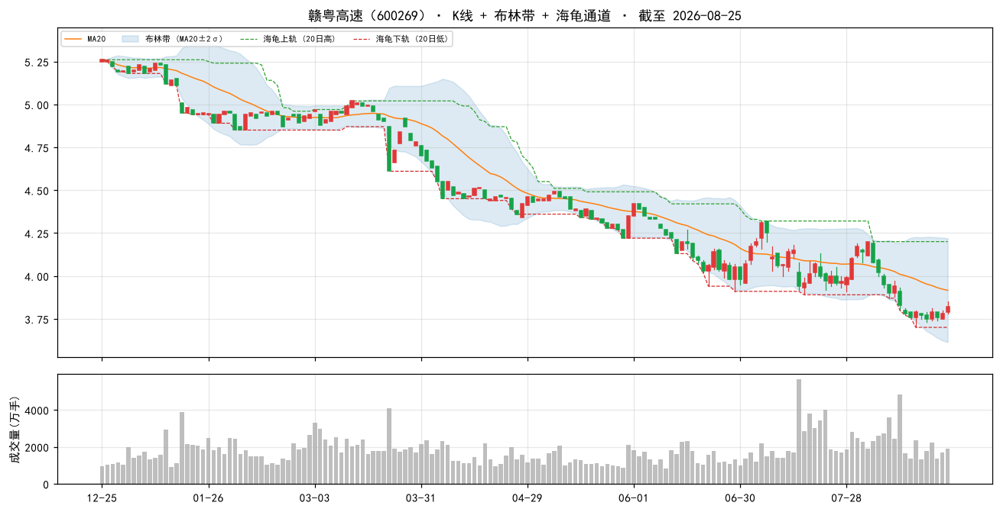

### 5. 国药一致（000028）

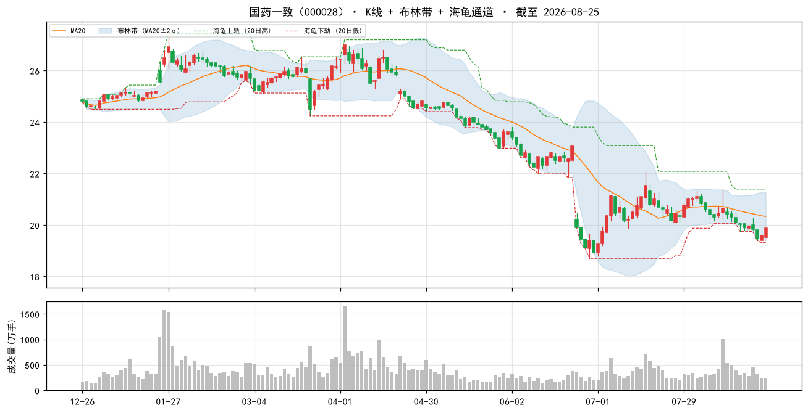

### 6. 现代投资（000900）

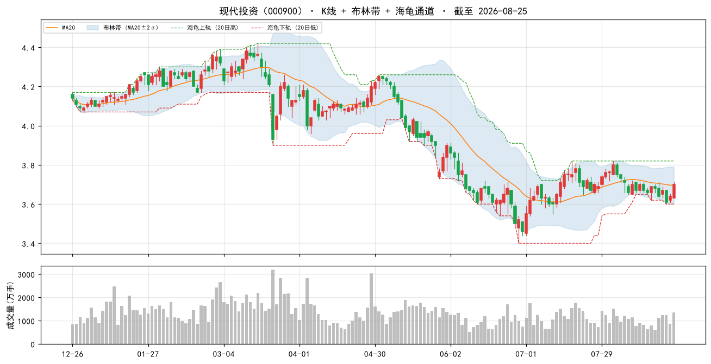

### 7. 楚天高速（600035）

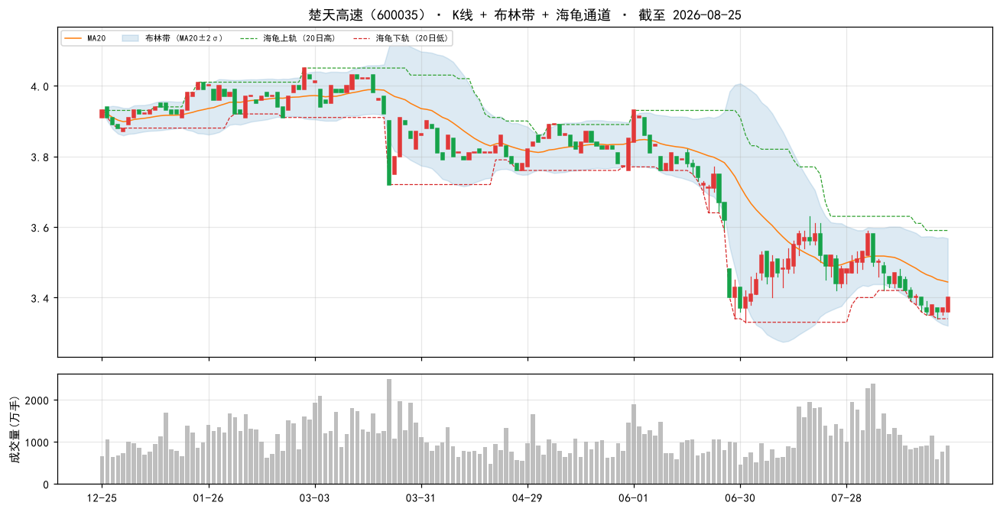

### 8. 中原环保（000544）

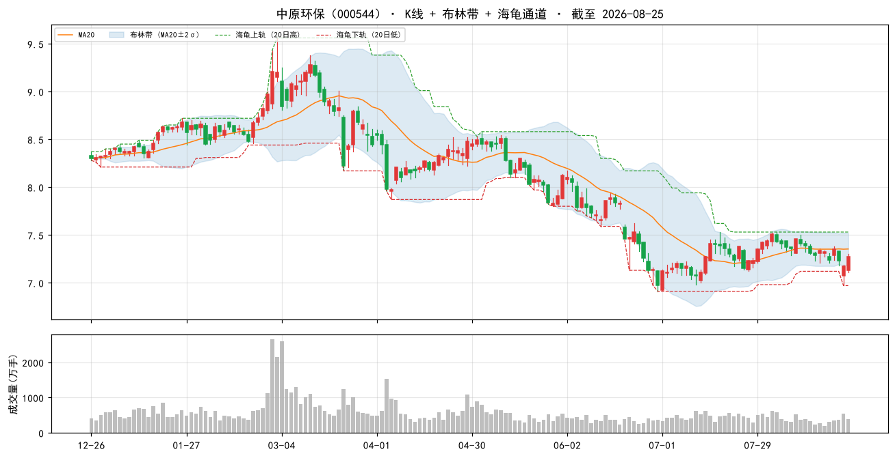

### 9. 中原高速（600020）

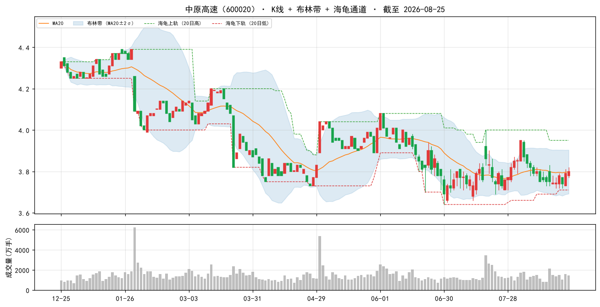

### 10. 浙商中拓（000906）

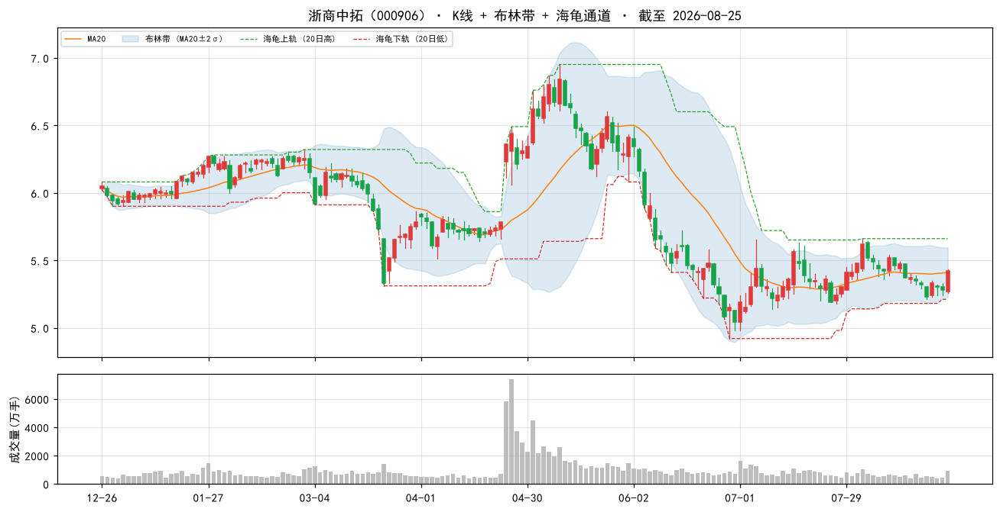

### 当日表现：top-10 vs 大盘

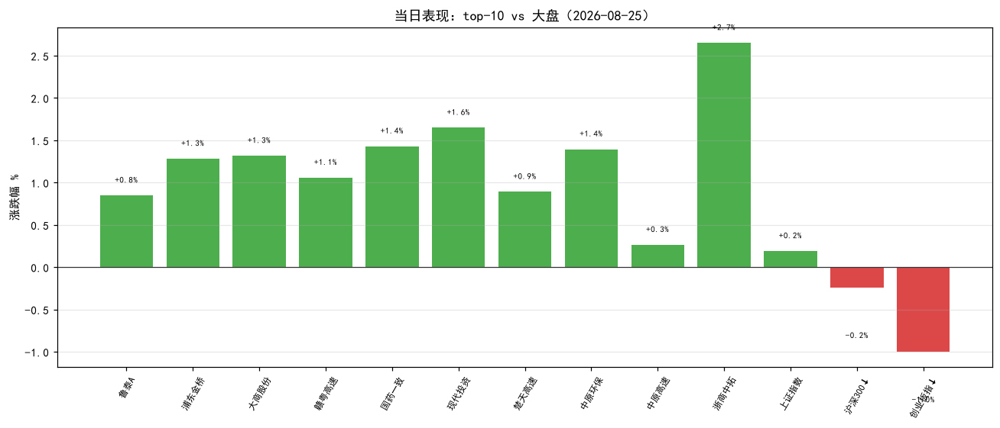

### 组合 vs 沪深300（近 60 交易日，当前名单回放近似）

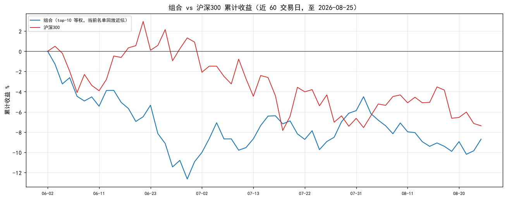

> 组合为**当前 top-10 名单**从窗口起点等权回放（非历史换手），仅作趋势参考；沪深300 用腾讯指数补齐最近两日。

## 九、因子诊断与优化建议

#### 8.1 历史名单表现追踪（至今）

| 名单日 | 股票数 | 名单等权至今 | 沪深300至今 | 超额 |
|---|---|---|---|---|
| 2026-08-11 | 50 | +0.5% | — | — |
| 2026-08-14 | 50 | +1.8% | — | — |
| 2026-08-17 | 50 | +1.5% | — | — |
| 2026-08-18 | 50 | +1.6% | — | — |
| 2026-08-20 | 50 | +1.2% | — | — |
| 2026-08-24 | 50 | +1.3% | — | — |

> 说明：等权持有名单至今（未换手），个股停牌则该日不计入；分红未计入，短期窗口影响小。

#### 8.2 因子 IC 诊断（近 11 周截面，因子 vs 未来 5 日收益）

| 因子 | 方向 | 近11个快照 IC | 有效快照 | 判断 |
|---|---|---|---|---|
| 账面市值比 | 1 | +0.070 | 11 | 有效 |
| 盈余收益率 | 1 | +0.027 | 11 | 有效 |
| 60日波动 | -1 | -0.122 | 11 | 有效 |
| 总市值(ln) | -1 | -0.043 | 11 | 有效 |

> IC = 因子值与未来 5 日收益的秩相关（越大越有效）；与注册表方向同号且 |IC|≥0.02 判为有效。 单因子短期 IC 波动大，仅供诊断，不构成当日调权依据。

#### 8.3 月度权重校验（research_panel.pkl 滚动）

> 面板数据截至 2026-07-31。仅作参考：**权重建议月度复核，不日更**（防过拟合）。

| 方案 | 最近37月总收益 | 夏普 | 回撤 |
|---|---|---|---|
| 当前 | +16.5% | +0.20 | -17.4% |
| bp0.3+ep0.2+roe0.15+毛利0.1+现金流0.1+低波0.15 | +15.2% | +0.18 | -16.6% |
| 当前+小市值0.05 | +17.8% | +0.22 | -16.5% |
| 纯价值 bp0.6+ep0.4 | +9.8% | +0.10 | -14.4% |

> ⚠ 候选「当前+小市值0.05」近期夏普最高（+0.22）且高于当前——建议**月度复核时**考虑微调权重，勿当日追改。

## 十、AI 亮点点评

> 数据口径：因子截面数据截至 2026-08-25（已最新）；实时行情与大盘指数截至 2026-08-25 16:14 收盘（今日 08-26 早盘未开，沿用上一交易日收盘）；个股新闻来自腾讯（前 5 只各 3 条）、财经要闻来自新浪。**本版起已剔除建筑业（证监会行业分类 E47房屋建筑/E48土木工程建筑/E49建筑安装/E50建筑装饰装修，共 98 只）——山东路桥/安徽建工/隧道股份等价值陷阱建筑股不再入选；策略仍为 `valuelowvol`（bp+ep+低波+小市值）。**

### 10.1 今日市场环境

2026-08-25（周三，上一交易日）A 股呈**权重护盘、成长回调**分化格局：上证 +0.19%、上证50 +0.16% 微红，沪深300 -0.24%、深成 -0.35%、创业板 -1.00% 回落。全市场约 4000 只个股上涨（广度偏暖），但创业板权重股拖累指数，**防御/价值风格占优、成长小盘获利了结**。当日财经要闻以个股/公司级为主（深演智能与德勤战略合作、凯莱英股权激励、天津创业环保/易大宗中期业绩），宏观扰动有限；外围科技面（AI 裁判系统、自研芯片）偏主题性质，对防御组合影响小。

### 10.2 组合画像

组合为**极致价值 + 低波 + 小市值**防御型：账面市值比百分位 99%、盈余收益率 88%、60日低波 96%（均前 5%），总市值中位 81.7 亿（ln_cap 百分位 45%，偏小）。PE(中位) 11.1、PB(中位) 0.6，估值极低。**相比含建筑股的 06:00 版（市值中位 89.2 亿、ep 百分位 89%），剔除建筑后组合市值更小、行业结构更偏公用/交运收租型（高速公路 4/10）。**

### 10.3 今日表现

| 排名 | 代码 | 名称 | 现价 | 涨跌% | 相对上证超额 |
|---|---|---|---|---|---|
| 1 | 000726 | 鲁泰A | 5.95 | +0.85% | +0.66pp |
| 2 | 600639 | 浦东金桥 | 9.48 | +1.28% | +1.09pp |
| 3 | 600694 | 大商股份 | 14.62 | +1.32% | +1.13pp |
| 4 | 600269 | 赣粤高速 | 3.82 | +1.06% | +0.87pp |
| 5 | 000028 | 国药一致 | 19.87 | +1.43% | +1.24pp |
| 6 | 000900 | 现代投资 | 3.70 | +1.65% | +1.46pp |
| 7 | 600035 | 楚天高速 | 3.40 | +0.89% | +0.70pp |
| 8 | 000544 | 中原环保 | 7.27 | +1.39% | +1.20pp |
| 9 | 600020 | 中原高速 | 3.80 | +0.26% | +0.07pp |
| 10 | 000906 | 浙商中拓 | 5.42 | +2.65% | +2.46pp |

top-10 **平均 +1.28%（10/10 全红）**，跑赢上证（+0.19%，超额 +1.09pp）、沪深300（-0.24%，超额 +1.52pp）与创业板（-1.00%，超额 +2.28pp）。注：行情为 2026-08-25 16:14 收盘（今日未开盘），属上一交易日截面；与 06:00 版相比，山东路桥/安徽建工/隧道股份 3 只建筑股退出，楚天高速/中原环保/中原高速 3 只补位（当日均收红）。

### 10.4 逐票深度分析（top 5）

**① 鲁泰A（000726）——深度价值·出口纺织（#1）**
- 主业：全球色织布/衬衫龙头（淄博），出口导向。
- 估值与质量：bp 2.80（前 100%）、ep 0.153（前 100%）、低波 21.0%（前 99%）；PE 9.0 / PB 0.5 / 市值 35 亿，极低估；ROE 5.5%、毛利 7.3%（偏低）、现金流/净利 172.4%（健康）。
- 催化/新闻：多份点评"26Q1 收入与利润率承压，汇兑及公允价值变动拖累利润""2025 年报投资收益贡献显著"。
- 风险：出口+汇兑敏感，毛利率低、基本面短期承压。
- 结论：深度价值登顶，但拐点未现，观察为主。

**② 浦东金桥（600639）——稳健园区收租**
- 主业：上海浦东金桥开发区园区开发与经营性物业租赁，出租率稳中有升。
- 估值与质量：bp 1.87（前 99%）、ep 0.129（前 99%）、低波 21.1%（前 99%）；PE 10.2 / PB 0.7 / 市值 81 亿；毛利 11.7%、现金流/净利 379.8%（优秀）。
- 催化/新闻：研报"收入高增利润增长，经营性物业出租率稳中有升"；4 月获融资净买入 183 万。
- 风险：区域园区去化与租金周期波动。
- 结论：稳健收租+价值，防御佳品。

**③ 大商股份（600694）——高分红零售·股东回报优化**
- 主业：东北区域百货零售龙头（大连）。
- 估值与质量：bp 1.82（前 99%）、ep 0.099（前 98%）、低波 25.8%（前 97%）；PE 11.1 / PB 0.6 / 市值 55 亿；毛利 19.5%、现金流/净利 193.2%（健康）。
- 催化/新闻："Q1 收入同比 +2.7% 重回增长，年报分红率提至 70%""持续推进调改、股东回报优化"。
- 风险：区域零售景气与电商分流。
- 结论：高分红+现金牛，防御价值兼备，可作底仓。

**④ 赣粤高速（600269）——防御收租型**
- 主业：江西省域收费高速运营，路产主业现金流稳定，类债券属性。
- 估值与质量：bp 2.21（前 99%）、ep 0.126（前 99%）、毛利 40.8%（组合最高）、低波 24.8%（前 97%）；PE 12.3 / PB 0.5 / 市值 89 亿。
- 催化/新闻：华创证券强推目标价 5.71 元；半年报"核心路产主业稳健，金融投资波动致业绩承压"。
- 风险：非主业金融投资波动拖累利润。
- 结论：防御底仓首选，回调可配。

**⑤ 国药一致（000028）——医药流通·质量隐忧**
- 主业：国药系医药分销+零售（国大药房），全国化医药流通龙头之一。
- 估值与质量：bp 1.96（前 99%）、ep 0.114（前 99%）、低波 25.6%（前 97%）；PE 11.3 / PB 0.6 / 市值 105 亿；毛利仅 2.2%（流通属性），**现金流/净利 -1021.1%（前 4%，极低）**。
- 催化/新闻："业绩预告符合预期，收入和利润降幅持续收窄""推进提质增效&结构优化，国大药房经营趋势持续向好"。
- 风险：⚠ **现金流/净利因子极低价值陷阱预警**（医药流通应收账款特征，需现金流佐证）。
- 结论：估值低但盈利质量待验证，观察等待验证。

### 10.5 操作建议与风险

- **动量反向**：A 股 2018-2026 动量方向反向，方案不含动量因子；**勿因今日涨幅追高**（浙商中拓 +2.65%、现代投资 +1.65% 等勿追）。
- **仓位与调仓**：小市值波动大、单票仓位别太重；名单为"当日截面快照"，**不构成调仓指令**；建议**月度调仓、等权持有**，单票止损参考 -8%。
- **数据日期**：因子截面与实时行情均为 2026-08-25（已对齐，今日 08-26 未开盘）；PE/PB 为估算，勿单看估值数字。
- **显著风险点**：
  1. **建筑剔除后的行业集中**：top-10 中高速公路类 4 只（赣粤高速/现代投资/楚天高速/中原高速），公用收租属性增强但**对高速板块暴露集中**，若交运板块风格切换或车流/收费政策扰动，组合波动将放大；建议关注行业分散度。
  2. **国药一致现金流陷阱**：现金流/净利 -1021.1%（前 4%），医药流通应收账款特征，仍需警惕盈利质量（已非建筑股，但同样亮黄灯）。
  3. **大盘分化 + 成长回调**：创业板 -1.00%、沪深300 -0.24%，价值占优但若风格反转（成长回归），组合将阶段性跑输。
  4. **因子有效性健康**：4 因子（bp+0.070、ep+0.027、低波-0.122、ln_cap-0.043）IC 全有效、无失效项；月度权重校验"当前+小市值0.05"夏普略高（+0.22 vs +0.20），**维持当前权重即可，勿当日追改**。
  5. **建筑业剔除为一次性规则变更**（2026-08-26 起永久生效，行业映射 data/stock_industry.json 建议季度刷新），历史回测/月度权重校验面板仍含建筑股，对比口径以当日截面为准。

> ⚠ 候选「当前+小市值0.05」近期夏普最高（+0.22）且高于当前——建议**月度复核时**考虑微调权重，勿当日追改。
