# 每日选股报告 · 2026-08-27

> 方案：**valuelowvol** · 权重 账面市值比 0.30 + 盈余收益率 0.20 + 60日波动 0.30 + 总市值(ln) 0.20 · 选 top-50 · 等权持仓（建议月频调仓）
> 历史验证 2018-2026（含交易成本）：总收益 **+29.7%** · 夏普 +0.10 · 最大回撤 -24.8%
> 生成：2026-08-27 08:29 · 数据截至 2026-08-26

## 一、市场概况

### 1.1 主要指数表现

| 指数 | 收盘 | 涨跌幅 |
|---|---|---|

### 1.2 市场广度

- 全市场 **5270 只**：上涨 **2772** / 下跌 **2342** / 平盘 156
- 总成交额 ≈ **17825 亿元**

- 当日可交易股票池（剔除 ST/涨跌停/停牌/次新/B股/北交所/金融股）：**4790 只**
- 打分因子：`valuelowvol` 权重因子共 4 个

## 二、选股方案与方法

- 模型：多因子截面打分。每因子先 [1%,99%] 缩尾去极端 → z-score 标准化 → 乘方向与权重加权求和 → 取 top-50 等权。
- 权重：账面市值比 0.3、盈余收益率 0.2、60日波动 0.3、总市值(ln) 0.2（研究管线 `validate_daily_schemes.py` 历史验证选定）。
- 无未来函数：基本面用「报告期 + 4 个月披露滞后」；动量 skip 最近 20 交易日；股票池剔除 ST/涨跌停/停牌/次新(<120日)/B股/北交所/金融股。

### 2.1 因子定义与公式

> 打分公式：`综合得分 = Σ wᵢ × 方向ᵢ × z-score(缩尾[1%,99%] 因子ᵢ)`，缺失因子贡献 0。

| 因子 | 方向 | 权重 | 公式/定义 | 数据源 |
|---|---|---|---|---|
| 账面市值比（bp） | 1（越大越好） | 0.30 | 净资产(合并A003000000) / 总市值(元)（账面市值比） | fs_combas+price |
| 盈余收益率（ep_ttm） | 1（越大越好） | 0.20 | TTM归母净利润 / 总市值(元)（盈余收益率） | fs_comins+price |
| 60日波动（vol_60d） | -1（越小越好） | 0.30 | 60日日收益率标准差，年化×√252 | stock_daily |
| 总市值(ln)（ln_cap） | -1（越小越好） | 0.20 | ln(推算总市值, 元) | stock_daily |

- 选股数：top-50 等权（建议月频调仓）；方向由 `factor_registry.json` 统一管理。

## 三、今日 Top-50 名单

> PE/PB 为按盈余收益率(ep_ttm)/账面市值比(bp)换算的**估算值**，仅供参考；baostock 段市值用参考股本×收盘推算，个别票 PE/PB 可能失真。

| 排名 | 代码 | 名称 | 收盘价 | PE(估) | PB(估) | 综合得分 | 账面市值比 | 盈余收益率 | 60日波动 | 总市值(ln) |
|---|---|---|---|---|---|---|---|---|---|---|
| 1 | 000726 | 鲁泰A | 5.9900 | 6.6 | 0.4 | 2.22 | 2.7859 | 0.1521 | 20.8% | 21.9882 |
| 2 | 600639 | 浦东金桥 | 9.5400 | 7.8 | 0.5 | 2.05 | 1.8568 | 0.1286 | 21.1% | 22.8165 |
| 3 | 600694 | 大商股份 | 14.6600 | 10.1 | 0.6 | 2.04 | 1.8116 | 0.0991 | 24.6% | 22.3423 |
| 4 | 600269 | 赣粤高速 | 3.8700 | 8.0 | 0.5 | 1.98 | 2.1849 | 0.1246 | 24.8% | 22.9247 |
| 5 | 000028 | 国药一致 | 20.0600 | 8.9 | 0.5 | 1.95 | 1.9415 | 0.1125 | 25.6% | 22.9988 |
| 6 | 000900 | 现代投资 | 3.7400 | 14.4 | 0.4 | 1.95 | 2.2348 | 0.0694 | 19.2% | 22.4596 |
| 7 | 000544 | 中原环保 | 7.3300 | 6.7 | 0.6 | 1.91 | 1.5965 | 0.1489 | 20.0% | 22.6896 |
| 8 | 600035 | 楚天高速 | 3.4500 | 11.1 | 0.6 | 1.90 | 1.6385 | 0.0905 | 16.7% | 22.4379 |
| 9 | 601811 | 新华文轩 | 11.9200 | 6.0 | 0.6 | 1.88 | 1.6480 | 0.1659 | 22.4% | 22.9682 |
| 10 | 600020 | 中原高速 | 3.8700 | 13.6 | 0.5 | 1.88 | 1.8352 | 0.0736 | 20.7% | 22.8863 |
| 11 | 600051 | 宁波联合 | 6.3500 | 26.0 | 0.6 | 1.86 | 1.7324 | 0.0384 | 29.3% | 21.4034 |
| 12 | 600874 | 创业环保 | 5.6200 | 7.8 | 0.7 | 1.85 | 1.5236 | 0.1278 | 17.9% | 22.6570 |
| 13 | 000906 | 浙商中拓 | 5.6200 | 18.4 | 0.5 | 1.83 | 1.9936 | 0.0545 | 30.0% | 22.1066 |
| 14 | 600704 | 物产中大 | 4.9800 | 7.1 | 0.6 | 1.82 | 1.7920 | 0.1402 | 21.6% | 23.9718 |
| 15 | 600528 | 中铁工业 | 7.0500 | 11.4 | 0.6 | 1.82 | 1.7882 | 0.0873 | 20.7% | 23.4745 |
| 16 | 600548 | 深高速 | 8.2700 | 12.5 | 0.5 | 1.80 | 1.8556 | 0.0797 | 20.2% | 23.4183 |
| 17 | 601333 | 广深铁路 | 2.9600 | 10.9 | 0.6 | 1.77 | 1.7296 | 0.0919 | 19.8% | 23.5405 |
| 18 | 600827 | 百联股份 | 7.7100 | 10.1 | 0.6 | 1.75 | 1.6636 | 0.0994 | 24.9% | 23.2386 |
| 19 | 603018 | 华设集团 | 5.3700 | 12.9 | 0.7 | 1.75 | 1.4843 | 0.0775 | 24.4% | 22.0240 |
| 20 | 000778 | 新兴铸管 | 3.6600 | 14.4 | 0.5 | 1.73 | 1.8374 | 0.0694 | 23.7% | 23.3978 |
| 21 | 600894 | 广日股份 | 7.2800 | 8.7 | 0.7 | 1.70 | 1.4348 | 0.1147 | 27.8% | 22.5479 |
| 22 | 603585 | 苏利股份 | 10.3100 | 11.3 | 0.7 | 1.69 | 1.3447 | 0.0888 | 31.0% | 21.4310 |
| 23 | 000789 | 万年青 | 4.1800 | — | 0.5 | 1.69 | 1.9809 | -0.0080 | 25.1% | 21.9272 |
| 24 | 600168 | 武汉控股 | 4.4500 | 42.9 | 0.6 | 1.68 | 1.6776 | 0.0233 | 23.5% | 22.2095 |
| 25 | 600017 | 日照港 | 2.7600 | 19.4 | 0.6 | 1.67 | 1.6567 | 0.0517 | 21.6% | 22.8620 |
| 26 | 600064 | 南京高科 | 7.7600 | 7.6 | 0.7 | 1.67 | 1.4705 | 0.1315 | 21.4% | 23.3206 |
| 27 | 000501 | 武商集团 | 7.3000 | 34.8 | 0.5 | 1.67 | 1.9659 | 0.0287 | 29.9% | 22.4485 |
| 28 | 000910 | 大亚圣象 | 5.4400 | — | 0.5 | 1.66 | 2.2018 | -0.0047 | 30.2% | 21.8145 |
| 29 | 000589 | 贵州轮胎 | 4.3500 | 9.2 | 0.7 | 1.65 | 1.3592 | 0.1086 | 23.3% | 22.6347 |
| 30 | 000550 | 江铃汽车 | 15.9500 | 6.8 | 0.7 | 1.65 | 1.4538 | 0.1476 | 28.5% | 22.8373 |
| 31 | 600742 | 富维股份 | 7.7600 | 12.9 | 0.7 | 1.64 | 1.4792 | 0.0777 | 25.3% | 22.4753 |
| 32 | 600717 | 天津港 | 4.3700 | 11.9 | 0.6 | 1.63 | 1.6165 | 0.0837 | 25.5% | 23.2607 |
| 33 | 000932 | 华菱钢铁 | 3.7400 | 11.4 | 0.5 | 1.63 | 2.1788 | 0.0876 | 28.0% | 23.9670 |
| 34 | 601107 | 四川成渝 | 5.9200 | 8.5 | 0.6 | 1.63 | 1.6064 | 0.1182 | 33.8% | 23.2730 |
| 35 | 601607 | 上海医药 | 16.4200 | 7.9 | 0.6 | 1.63 | 1.6878 | 0.1268 | 21.0% | 24.5476 |
| 36 | 600057 | 厦门象屿 | 6.4500 | 14.0 | 0.5 | 1.61 | 1.8574 | 0.0712 | 29.5% | 23.6314 |
| 37 | 600755 | 厦门国贸 | 5.7800 | 36.1 | 0.4 | 1.60 | 2.7915 | 0.0277 | 23.1% | 23.2374 |
| 38 | 600941 | 中国移动 | 98.4500 | 0.7 | 0.1 | 1.59 | 16.0082 | 1.5280 | 19.0% | 25.2105 |
| 39 | 600551 | 时代出版 | 6.9300 | 11.7 | 0.8 | 1.59 | 1.2716 | 0.0853 | 18.2% | 22.2706 |
| 40 | 600373 | 中文传媒 | 7.2000 | 45.5 | 0.5 | 1.57 | 1.8444 | 0.0220 | 27.1% | 22.9955 |
| 41 | 600585 | 海螺水泥 | 17.8800 | 9.2 | 0.4 | 1.57 | 2.7103 | 0.1087 | 23.9% | 24.9932 |
| 42 | 000401 | 金隅冀东 | 3.6400 | 99.4 | 0.4 | 1.57 | 2.7427 | 0.0101 | 24.3% | 22.9929 |
| 43 | 002758 | 浙农股份 | 8.1300 | 7.8 | 0.8 | 1.56 | 1.2320 | 0.1282 | 30.2% | 22.1626 |
| 44 | 603518 | 锦泓集团 | 8.1500 | 11.3 | 0.7 | 1.56 | 1.3653 | 0.0882 | 37.6% | 21.7581 |
| 45 | 000885 | 城发环境 | 12.2600 | 6.2 | 0.8 | 1.55 | 1.2440 | 0.1623 | 22.8% | 22.7866 |
| 46 | 603035 | 常熟汽饰 | 11.3000 | 12.5 | 0.8 | 1.55 | 1.3004 | 0.0797 | 26.1% | 22.1439 |
| 47 | 600496 | 精工钢构 | 3.3600 | 10.6 | 0.7 | 1.54 | 1.4227 | 0.0945 | 31.7% | 22.6234 |
| 48 | 600308 | 华泰股份 | 3.3000 | — | 0.6 | 1.54 | 1.8084 | -0.0206 | 26.5% | 22.3338 |
| 49 | 002344 | 海宁皮城 | 3.9200 | 104.5 | 0.6 | 1.54 | 1.6822 | 0.0096 | 28.2% | 22.3383 |
| 50 | 000507 | 珠海港 | 5.0400 | 20.1 | 0.7 | 1.54 | 1.4618 | 0.0499 | 26.8% | 22.2570 |

## 四、组合画像（top-50 统计）

| 维度 | 数值 | 含义 |
|---|---|---|
| 账面市值比平均百分位 | **99%** | 组合在该因子上相对全市场的位置（越大越好） |
| 盈余收益率平均百分位 | **87%** | 组合在该因子上相对全市场的位置（越大越好） |
| 60日波动平均百分位 | **96%** | 组合在该因子上相对全市场的位置（越大越好） |
| 总市值(ln)平均百分位 | **46%** | 组合在该因子上相对全市场的位置（越大越好） |
| PE(中位数, 估) | 11.1 | 组合估值水平 |
| PB(中位数, 估) | 0.6 | 组合市净率水平 |
| 市值(中位数) | 78.7 亿元 | 组合规模风格 |

## 五、前 10 入选理由（因子百分位）

> 百分位为当日全市场该因子的分布位置（0-100，**已按因子方向归一**，越大越好）。

### 1. **鲁泰A**（000726，收盘 5.9900）

- 账面市值比 2.7859（权重 0.30，全市场前 100%）
- 盈余收益率 0.1521（权重 0.20，全市场前 100%）
- 60日波动 20.8%（权重 0.30，全市场前 99%）
- 总市值(ln) 21.9882（权重 0.20，全市场前 76%）

### 2. **浦东金桥**（600639，收盘 9.5400）

- 账面市值比 1.8568（权重 0.30，全市场前 99%）
- 盈余收益率 0.1286（权重 0.20，全市场前 99%）
- 60日波动 21.1%（权重 0.30，全市场前 99%）
- 总市值(ln) 22.8165（权重 0.20，全市场前 40%）

### 3. **大商股份**（600694，收盘 14.6600）

- 账面市值比 1.8116（权重 0.30，全市场前 99%）
- 盈余收益率 0.0991（权重 0.20，全市场前 98%）
- 60日波动 24.6%（权重 0.30，全市场前 97%）
- 总市值(ln) 22.3423（权重 0.20，全市场前 60%）

### 4. **赣粤高速**（600269，收盘 3.8700）

- 账面市值比 2.1849（权重 0.30，全市场前 99%）
- 盈余收益率 0.1246（权重 0.20，全市场前 99%）
- 60日波动 24.8%（权重 0.30，全市场前 97%）
- 总市值(ln) 22.9247（权重 0.20，全市场前 37%）

### 5. **国药一致**（000028，收盘 20.0600）

- 账面市值比 1.9415（权重 0.30，全市场前 99%）
- 盈余收益率 0.1125（权重 0.20，全市场前 99%）
- 60日波动 25.6%（权重 0.30，全市场前 97%）
- 总市值(ln) 22.9988（权重 0.20，全市场前 34%）

### 6. **现代投资**（000900，收盘 3.7400）

- 账面市值比 2.2348（权重 0.30，全市场前 99%）
- 盈余收益率 0.0694（权重 0.20，全市场前 92%）
- 60日波动 19.2%（权重 0.30，全市场前 100%）
- 总市值(ln) 22.4596（权重 0.20，全市场前 54%）

### 7. **中原环保**（000544，收盘 7.3300）

- 账面市值比 1.5965（权重 0.30，全市场前 98%）
- 盈余收益率 0.1489（权重 0.20，全市场前 100%）
- 60日波动 20.0%（权重 0.30，全市场前 99%）
- 总市值(ln) 22.6896（权重 0.20，全市场前 45%）

### 8. **楚天高速**（600035，收盘 3.4500）

- 账面市值比 1.6385（权重 0.30，全市场前 98%）
- 盈余收益率 0.0905（权重 0.20，全市场前 97%）
- 60日波动 16.7%（权重 0.30，全市场前 100%）
- 总市值(ln) 22.4379（权重 0.20，全市场前 55%）

### 9. **新华文轩**（601811，收盘 11.9200）

- 账面市值比 1.6480（权重 0.30，全市场前 99%）
- 盈余收益率 0.1659（权重 0.20，全市场前 100%）
- 60日波动 22.4%（权重 0.30，全市场前 99%）
- 总市值(ln) 22.9682（权重 0.20，全市场前 35%）

### 10. **中原高速**（600020，收盘 3.8700）

- 账面市值比 1.8352（权重 0.30，全市场前 99%）
- 盈余收益率 0.0736（权重 0.20，全市场前 94%）
- 60日波动 20.7%（权重 0.30，全市场前 99%）
- 总市值(ln) 22.8863（权重 0.20，全市场前 38%）

## 六、口径与风险提示

- 因子无未来函数：基本面用「报告期 + 4 个月滞后」；动量 skip 最近 20 交易日；股票池剔除 ST/涨跌停/次新/金融股。
- **动量在 A 股 2018-2026 方向反向**，本方案不含动量因子；成长因子不显著，仅作参考。
- 小市值增强（ln_cap）是 A 股 2018-2026 有效因子，但小市值波动大、流动性差，请控制单票仓位。
- **名单是「当日截面快照」，不构成调仓指令**。建议月度调仓、等权持有，避免高频换手吞噬收益；单票止损参考 -8%。
- 数据源：CSMAR 全量 + baostock 每日增量；本地因子数据可能落后 1 天（baostock 滞后），实时行情请见 Claude 点评补充。

## 七、基本面与估值快照

> 估值：腾讯行情实时（PE_TTM/PB/总市值，数据日期 2026-08-26）；财务：CSMAR 最新报告期（4 个月披露滞后）。 可与此前因子换算的 PE/PB(估) 互相印证。

| 代码 | 名称 | 现价 | 涨跌% | PE_TTM | PB | 总市值(亿) | 盈余收益率 | ROE_TTM | 毛利率 | 现金流/净利 |
|---|---|---|---|---|---|---|---|---|---|---|
| 000726 | 鲁泰A | 6.0 | 0.7% | 9.1 | 0.5 | 35.3 | 0.152 | 0.055 | 7.3% | 172.4% |
| 600639 | 浦东金桥 | 9.5 | 0.6% | 10.3 | 0.7 | 81.1 | 0.129 | 0.069 | 11.7% | 379.8% |
| 600694 | 大商股份 | 14.7 | 0.3% | 11.1 | 0.6 | 55.5 | 0.099 | 0.055 | 19.5% | 193.2% |
| 600269 | 赣粤高速 | 3.9 | 1.3% | 12.5 | 0.5 | 90.4 | 0.125 | 0.057 | 40.8% | 209.7% |
| 000028 | 国药一致 | 20.1 | 1.0% | 11.4 | 0.7 | 105.5 | 0.113 | 0.058 | 2.2% | -1021.1% |
| 000900 | 现代投资 | 3.7 | 1.1% | 14.4 | 0.5 | 56.8 | 0.069 | 0.031 | 15.2% | 24.9% |
| 000544 | 中原环保 | 7.3 | 0.8% | 6.9 | 0.8 | 71.4 | 0.149 | 0.093 | 36.4% | -111.9% |
| 600035 | 楚天高速 | 3.5 | 1.5% | 9.7 | 0.6 | 55.5 | 0.090 | 0.055 | 27.4% | 175.9% |
| 601811 | 新华文轩 | 11.9 | -1.3% | 10.8 | 1.0 | 94.4 | 0.166 | 0.101 | 10.0% | -66.4% |
| 600020 | 中原高速 | 3.9 | 1.8% | 13.3 | 0.7 | 87.0 | 0.074 | 0.040 | 33.2% | 119.8% |
| 600051 | 宁波联合 | 6.3 | 0.2% | 29.2 | 0.6 | 19.7 | 0.038 | 0.022 | 0.2% | 1117.3% |
| 600874 | 创业环保 | 5.6 | 0.7% | 10.1 | 0.8 | 69.2 | 0.128 | 0.084 | 28.9% | -44.9% |
| 000906 | 浙商中拓 | 5.6 | 3.7% | 14.9 | 0.8 | 39.5 | 0.054 | 0.027 | 0.4% | -4988.9% |
| 600704 | 物产中大 | 5.0 | 1.8% | 7.2 | 0.6 | 257.5 | 0.140 | 0.078 | 1.5% | -797.1% |
| 600528 | 中铁工业 | 7.0 | 0.1% | 12.1 | 0.6 | 156.6 | 0.087 | 0.049 | 4.5% | -226.2% |
| 600548 | 深高速 | 8.3 | 0.6% | 18.9 | 0.9 | 141.8 | 0.080 | 0.043 | 25.8% | 201.9% |
| 601333 | 广深铁路 | 3.0 | 0.3% | 13.9 | 0.7 | 167.3 | 0.092 | 0.053 | 10.6% | -6.5% |
| 600827 | 百联股份 | 7.7 | 0.0% | 11.2 | 0.7 | 123.7 | 0.099 | 0.060 | 2.7% | 133.1% |
| 603018 | 华设集团 | 5.4 | 1.1% | 15.5 | 0.8 | 44.0 | 0.077 | 0.052 | 9.4% | -160.4% |
| 000778 | 新兴铸管 | 3.7 | 0.6% | 15.9 | 0.6 | 142.5 | 0.069 | 0.038 | 2.0% | -636.1% |
| 600894 | 广日股份 | 7.3 | -0.1% | 10.3 | 0.7 | 61.4 | 0.115 | 0.080 | -0.6% | -1453.2% |
| 603585 | 苏利股份 | 10.3 | 1.1% | 17.0 | 1.0 | 27.9 | 0.089 | 0.066 | 4.0% | 394.2% |
| 000789 | 万年青 | 4.2 | 1.0% | -55.5 | 0.5 | 33.3 | -0.008 | -0.004 | -5.9% | 464.1% |
| 600168 | 武汉控股 | 4.5 | 0.7% | 41.9 | 0.8 | 44.2 | 0.023 | 0.014 | 2.7% | -487.7% |
| 600017 | 日照港 | 2.8 | 2.2% | 18.1 | 0.6 | 84.9 | 0.052 | 0.031 | 7.0% | 357.9% |
| 600064 | 南京高科 | 7.8 | 1.0% | 7.9 | 0.7 | 134.3 | 0.131 | 0.089 | -0.1% | 28.0% |
| 000501 | 武商集团 | 7.3 | 0.4% | 34.8 | 0.5 | 56.1 | 0.029 | 0.015 | 8.4% | 379.1% |
| 000910 | 大亚圣象 | 5.4 | 0.4% | -214.3 | 0.5 | 29.8 | -0.005 | -0.002 | -15.9% | 492.2% |
| 000589 | 贵州轮胎 | 4.3 | 0.7% | 9.2 | 0.8 | 67.2 | 0.109 | 0.080 | 6.8% | 208.3% |
| 000550 | 江铃汽车 | 15.9 | 1.3% | 11.5 | 1.1 | 82.7 | 0.148 | 0.101 | 1.0% | -584.0% |
| 600742 | 富维股份 | 7.8 | 0.3% | 12.9 | 0.7 | 57.7 | 0.078 | 0.053 | 2.7% | 658.6% |
| 600717 | 天津港 | 4.4 | 1.4% | 10.9 | 0.6 | 126.5 | 0.084 | 0.052 | 22.8% | 107.3% |
| 000932 | 华菱钢铁 | 3.7 | 2.2% | 23.6 | 0.5 | 256.3 | 0.088 | 0.040 | 0.4% | -835.9% |
| 601107 | 四川成渝 | 5.9 | 2.4% | 12.2 | 1.1 | 128.0 | 0.118 | 0.074 | 23.1% | 197.6% |
| 601607 | 上海医药 | 16.4 | 0.3% | 10.5 | 0.8 | 458.0 | 0.127 | 0.075 | 3.2% | -71.2% |
| 600057 | 厦门象屿 | 6.5 | 4.7% | 13.8 | 1.2 | 135.0 | 0.071 | 0.038 | 1.7% | -1478.6% |
| 600755 | 厦门国贸 | 5.8 | -0.2% | 29.9 | 0.7 | 123.2 | 0.028 | 0.010 | 2.5% | -13518.6% |
| 600941 | 中国移动 | 98.5 | -0.4% | 16.2 | 1.5 | 888.8 | 1.528 | 0.095 | 13.3% | 243.5% |
| 600551 | 时代出版 | 6.9 | 0.4% | 11.7 | 0.8 | 47.0 | 0.085 | 0.067 | 1.8% | -632.7% |
| 600373 | 中文传媒 | 7.2 | 1.1% | 34.9 | 0.6 | 97.0 | 0.022 | 0.012 | 2.5% | -440.6% |
| 600585 | 海螺水泥 | 17.9 | 1.6% | 15.2 | 0.5 | 711.2 | 0.109 | 0.040 | 8.5% | 22.2% |
| 000401 | 金隅冀东 | 3.6 | 1.7% | 99.3 | 0.4 | 95.8 | 0.010 | 0.004 | -38.3% | 64.7% |
| 002758 | 浙农股份 | 8.1 | 0.6% | 7.8 | 0.8 | 42.1 | 0.128 | 0.104 | 1.3% | -899.4% |
| 603518 | 锦泓集团 | 8.2 | 0.4% | 10.9 | 0.7 | 28.0 | 0.088 | 0.065 | 13.0% | 47.1% |
| 000885 | 城发环境 | 12.3 | 0.9% | 6.5 | 0.8 | 78.7 | 0.162 | 0.130 | 26.2% | 100.9% |
| 603035 | 常熟汽饰 | 11.3 | 0.4% | 12.5 | 0.8 | 41.4 | 0.080 | 0.061 | 1.7% | 189.6% |
| 600496 | 精工钢构 | 3.4 | -1.8% | 10.7 | 0.7 | 66.9 | 0.095 | 0.066 | 2.5% | -55.6% |
| 600308 | 华泰股份 | 3.3 | 1.5% | -43.6 | 0.6 | 50.1 | -0.021 | -0.011 | 0.7% | -358.8% |
| 002344 | 海宁皮城 | 3.9 | 0.3% | 60.5 | 0.6 | 50.2 | 0.010 | 0.006 | 16.2% | 146.9% |
| 000507 | 珠海港 | 5.0 | 0.8% | 20.1 | 0.8 | 45.5 | 0.050 | 0.034 | 9.4% | 269.8% |

- top-50 估值（腾讯）：PE_TTM 中位 **12.2** · PB 中位 **0.71** · 总市值中位 **79 亿**

> 说明：腾讯 PE/PB 与因子口径不同（腾讯用其财务模型），仅作实时参考；ROE/毛利率/现金流以 CSMAR 季度为准。

## 八、技术面辅助（K线 + 布林带 + 海龟通道）

> 图为**股价 K 线**（红涨绿跌，A 股惯例）+ 布林带（MA20 ± 2σ，超买/超卖参考）+ 海龟通道（20 日唐奇安高低轨，突破上下轨为潜在趋势信号）。 **仅辅助参考，不构成买卖指令。** 数据：`stock_daily` 截至 2026-08-26。

### 1. 鲁泰A（000726）

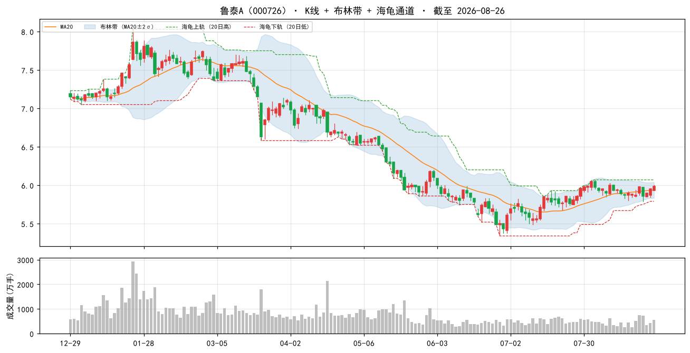

### 2. 浦东金桥（600639）

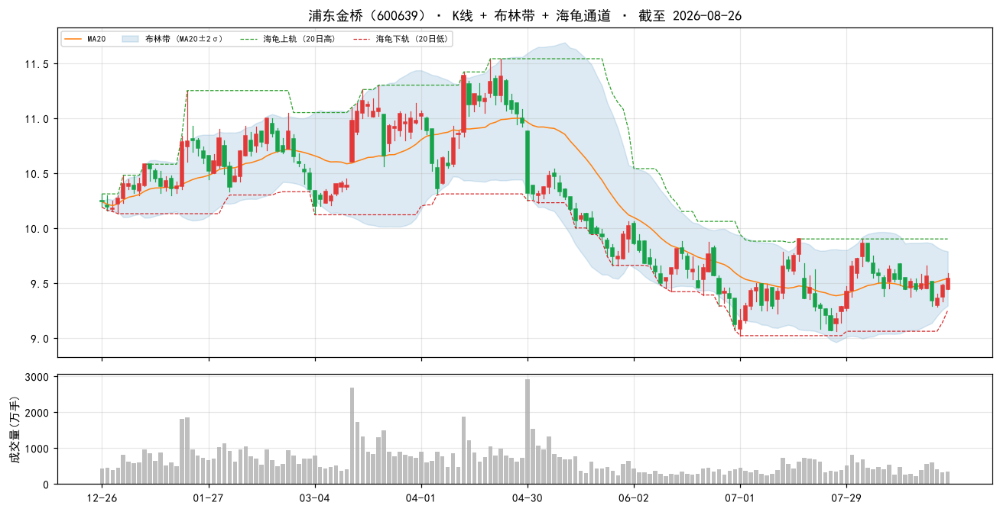

### 3. 大商股份（600694）

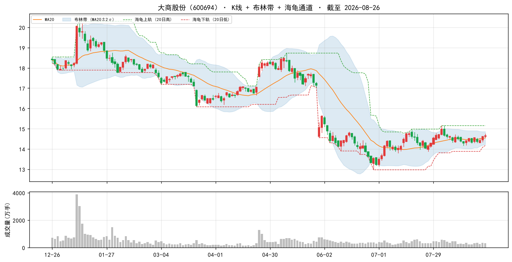

### 4. 赣粤高速（600269）

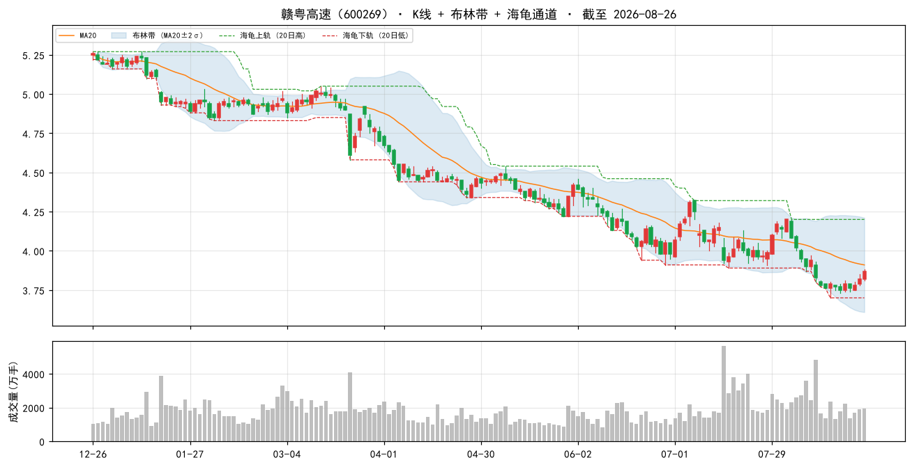

### 5. 国药一致（000028）

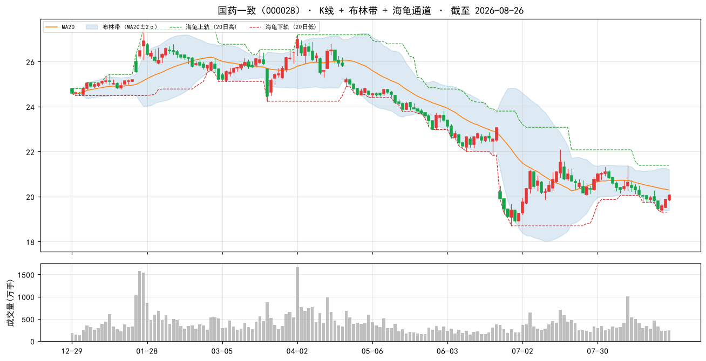

### 6. 现代投资（000900）

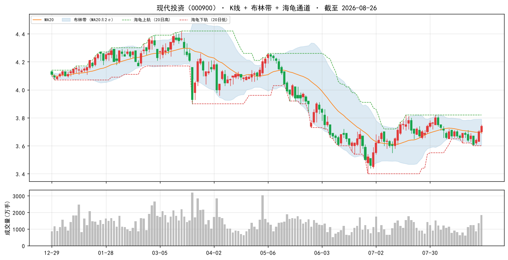

### 7. 中原环保（000544）

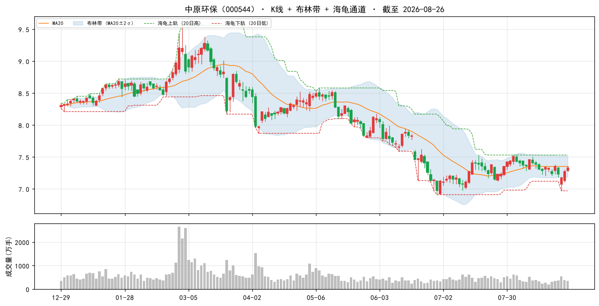

### 8. 楚天高速（600035）

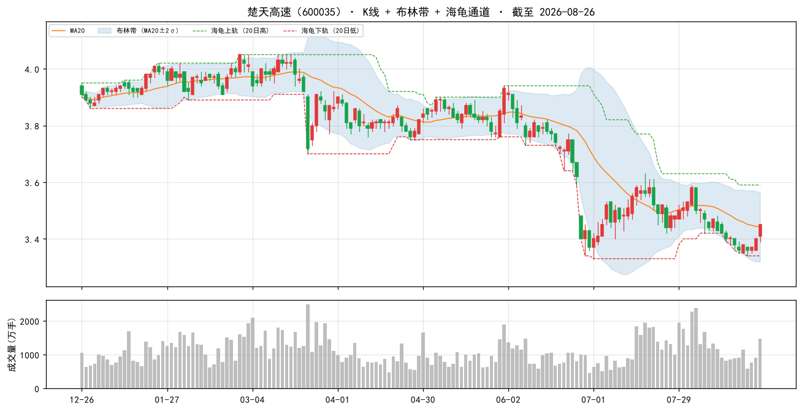

### 9. 新华文轩（601811）

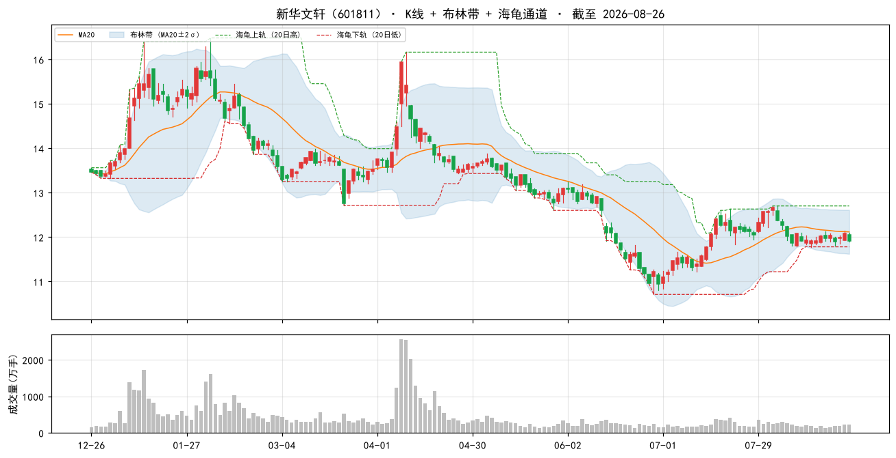

### 10. 中原高速（600020）

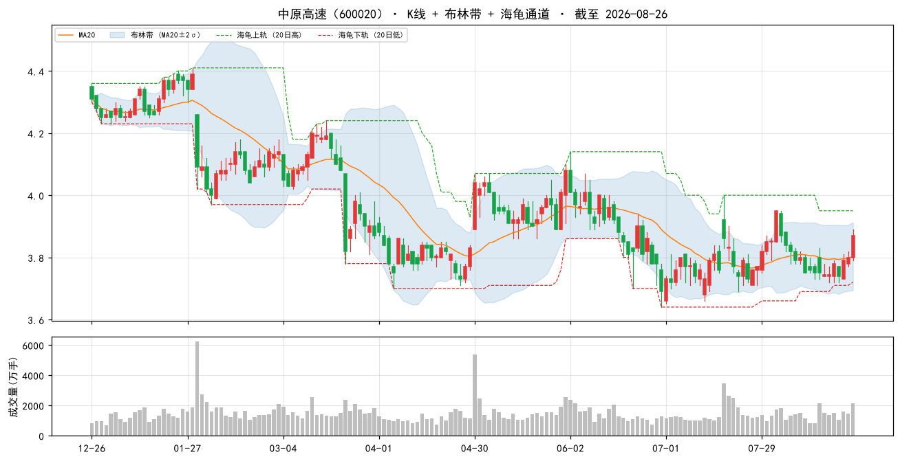

### 当日表现：top-10 vs 大盘

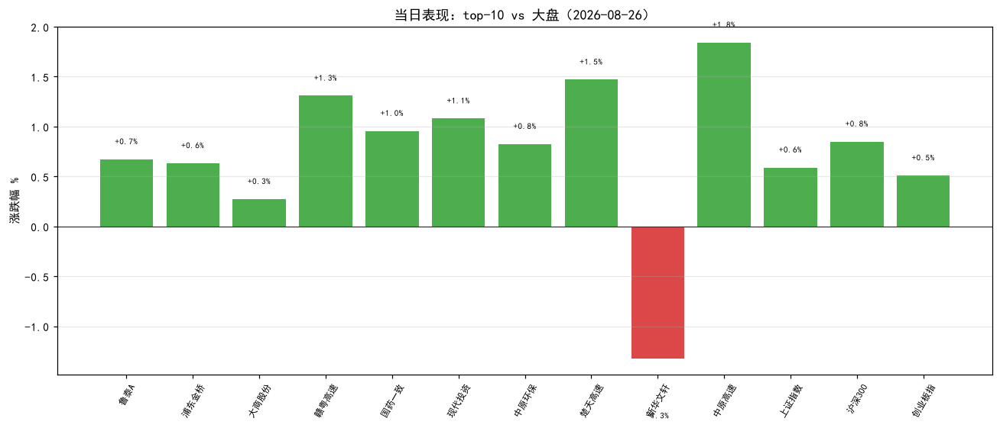

### 组合 vs 沪深300（近 60 交易日，当前名单回放近似）

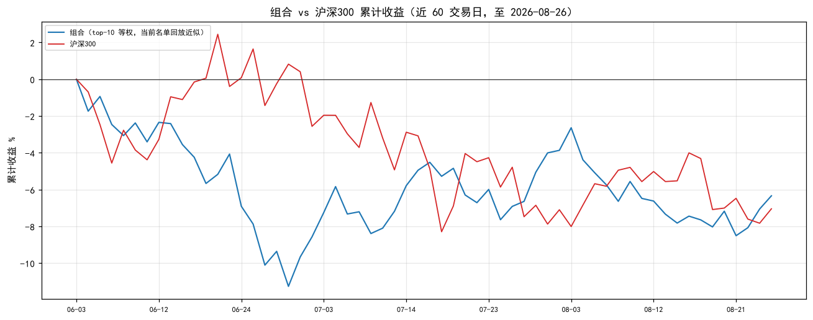

> 组合为**当前 top-10 名单**从窗口起点等权回放（非历史换手），仅作趋势参考；沪深300 用腾讯指数补齐最近两日。

## 九、因子诊断与优化建议

#### 8.1 历史名单表现追踪（至今）

| 名单日 | 股票数 | 名单等权至今 | 沪深300至今 | 超额 |
|---|---|---|---|---|
| 2026-08-11 | 50 | +1.6% | — | — |
| 2026-08-14 | 50 | +2.9% | — | — |
| 2026-08-17 | 50 | +2.6% | — | — |
| 2026-08-18 | 50 | +2.8% | — | — |
| 2026-08-20 | 50 | +2.4% | — | — |
| 2026-08-24 | 50 | +2.4% | — | — |
| 2026-08-25 | 50 | +1.0% | — | — |

> 说明：等权持有名单至今（未换手），个股停牌则该日不计入；分红未计入，短期窗口影响小。

#### 8.2 因子 IC 诊断（近 11 周截面，因子 vs 未来 5 日收益）

| 因子 | 方向 | 近11个快照 IC | 有效快照 | 判断 |
|---|---|---|---|---|
| 账面市值比 | 1 | -0.028 | 11 | ⚠ 方向反了/失效 |
| 盈余收益率 | 1 | -0.011 | 11 | 中性（区分度弱） |
| 60日波动 | -1 | +0.029 | 11 | ⚠ 方向反了/失效 |
| 总市值(ln) | -1 | -0.057 | 11 | 有效 |

> IC = 因子值与未来 5 日收益的秩相关（越大越有效）；与注册表方向同号且 |IC|≥0.02 判为有效。 单因子短期 IC 波动大，仅供诊断，不构成当日调权依据。

#### 8.3 月度权重校验（research_panel.pkl 滚动）

> 面板数据截至 2026-07-31。仅作参考：**权重建议月度复核，不日更**（防过拟合）。

| 方案 | 最近37月总收益 | 夏普 | 回撤 |
|---|---|---|---|
| 当前 | +16.5% | +0.20 | -17.4% |
| bp0.3+ep0.2+roe0.15+毛利0.1+现金流0.1+低波0.15 | +15.2% | +0.18 | -16.6% |
| 当前+小市值0.05 | +17.8% | +0.22 | -16.5% |
| 纯价值 bp0.6+ep0.4 | +9.8% | +0.10 | -14.4% |

> ⚠ 候选「当前+小市值0.05」近期夏普最高（+0.22）且高于当前——建议**月度复核时**考虑微调权重，勿当日追改。

## 十、AI 亮点点评

> 撰写时间 2026-08-27 08:35（今日尚未开盘）。因子/技术面数据截至 **2026-08-26 收盘**，实时行情亦为 **2026-08-26 16:14**——因此下文「今日表现」实为**选股基准日当日收盘**（同日、非前瞻收益），仅用于观察名单与当日风格的契合度。

### 10.1 今日市场环境（2026-08-26 收盘）

| 指数 | 点位 | 涨跌% |
|---|---|---|
| 上证指数 | 3912.52 | **+0.59%** |
| 沪深300 | 4590.79 | **+0.85%** |
| 深证成指 | 13841.33 | +0.69% |
| 创业板指 | 3414.88 | +0.51% |
| 上证50 | 2905.08 | **+1.03%** |

普涨的 risk-on 日，但结构上是**大盘权重领涨、成长小盘落后**：上证50 +1.03% > 沪深300 +0.85% > 深成 +0.69% > 上证 +0.59% > 创业板 +0.51%，市值越大越强。市场广度健康（涨 2772 / 跌 2342 / 平 156），成交额 1.78 万亿。外围同步偏暖——英伟达财报带动芯片股上涨、韩国 Kospi 走高，风险偏好回升。对本组合而言是**半个顺风**：价值方向对了（权重蓝筹走强），但「小市值增强」这条腿逆风（大票跑赢小票）。

### 10.2 组合画像

深度价值 + 低波 + 中小盘：账面市值比平均百分位 **99%**、盈余收益率 **87%**、60日波动 **96%**、总市值(ln) 46%（偏中盘而非微盘）；PE(中位) **11.1**、PB(中位) **0.6**（整体破净）、市值中位 **78.7 亿**。一句话——**买的是破净、有盈余、股价不折腾的中小盘老资产**。

### 10.3 今日表现（top-10，2026-08-26 收盘）

| 代码 | 名称 | 现价 | 涨跌% |
|---|---|---|---|
| 000726 | 鲁泰A | 5.99 | +0.67% |
| 600639 | 浦东金桥 | 9.54 | +0.63% |
| 600694 | 大商股份 | 14.66 | +0.27% |
| 600269 | 赣粤高速 | 3.87 | **+1.31%** |
| 000028 | 国药一致 | 20.06 | +0.96% |
| 000900 | 现代投资 | 3.74 | +1.08% |
| 000544 | 中原环保 | 7.33 | +0.83% |
| 600035 | 楚天高速 | 3.45 | **+1.47%** |
| 601811 | 新华文轩 | 11.92 | **-1.32%** |
| 600020 | 中原高速 | 3.87 | **+1.84%** |

**top-10 平均 +0.77%，9/10 收红**。相对上证 **+0.18pp**、相对创业板 **+0.26pp**，但小幅落后沪深300（-0.08pp）与上证50（-0.26pp）——与 10.1 的「大盘权重领涨」判断一致：组合能跟上普涨，却跑不过超大盘蓝筹。唯一下跌的是今日唯一新进 top-10 的新华文轩（-1.32%）。

### 10.4 逐票深度分析（top 5）

**1. 鲁泰A（000726，+0.67%）——名单里最"纯"的深度价值+低波标的**
高档色织面料全球龙头，主营色织布/衬衫成衣，外销占比高。四因子几乎满格：bp 2.7859（前 **100%**）、ep 0.1521（前 **100%**）、60日波动 20.8%（前 99%），市值 35.3 亿为 top-10 最小。PE_TTM 9.1、PB 0.5，经营现金流/净利 **172.4%** 说明利润是真金白银。最新研报口径偏冷：2026Q1「收入和毛利短期均承压，汇兑及公允价值变动拖累利润」，2025 年报也是「投资收益增厚利润」为主。**风险**：主业毛利率仅 7.3%、ROE 5.5%，利润高度依赖投资收益与汇兑，报表波动大；外需与人民币汇率是双重变量。**结论：防御**——资产足够便宜、股价足够稳，但主业拐点要等外需回暖。

**2. 浦东金桥（600639，+0.63%）——上海园区租金现金流**
上海金桥经济技术开发区的产业园区开发与经营性物业出租商，收入以租金为主。bp 1.8568（前 99%）、ep 0.1286（前 99%）、60日波动 21.1%（前 99%），PE 10.3、PB 0.7、市值 81.1 亿；现金流/净利 **379.8%**，是 top-10 里现金流质量最好的一只。研报口径正面：「收入高增利润增长，经营性物业出租率稳中有升」，4 月还录得融资净买入 183 万元。**风险**：重资产、成长弹性小，估值绑定上海商办租金与产业园去化周期；地产板块情绪外溢会压制估值。**结论：防御**——本组合的"类债"底仓。

**3. 大商股份（600694，+0.27%）——高分红 + 门店调改双催化**
东北（大连）百货零售龙头。bp 1.8116（前 99%）、ep 0.0991（前 98%）、60日波动 24.6%（前 97%），PE 11.1、PB 0.6、市值 55.5 亿，毛利率 19.5% 为 top-10 前列，现金流/净利 193.2%。催化最清晰：2025 年报**分红率提至 70%**、Q1 收入同比 +2.7% **重回增长**、券商跟踪报告点明「持续推进调改、股东回报优化」。**风险**：传统百货客流长期被电商与购物中心分流，调改能否持续提效仍需验证。**结论：弹性偏防御**——top-10 里股东回报逻辑最硬的一只。

**4. 赣粤高速（600269，+1.31%）——路产稳健，业绩噪音来自非主业**
江西核心收费高速运营商。bp 2.1849（前 99%）、ep 0.1246（前 99%）、60日波动 24.8%（前 97%），PE 12.5、PB 0.5、市值 90.4 亿；毛利率 **40.8%**、现金流/净利 209.7%，典型的高毛利+强现金流公路资产。最新催化：2026 半年报点评「核心路产主业稳健，金融投资波动致业绩承压」；另有华创证券**强推目标价 5.71 元**（对应现价 3.87 元约 48% 空间）。**风险**：参股金融资产的公允价值波动直接搅动净利，路产车流对宏观与免费政策敏感。**结论：防御**——主业质量好，看财报要把金融投资损益剥离看。

**5. 国药一致（000028，+0.96%）——最便宜，但现金流亮红灯**
国药系华南医药分销 + 国大药房零售双主业。bp 1.9415（前 99%）、ep 0.1125（前 99%）、60日波动 25.6%（前 97%），PE 11.4、PB 0.7、市值 105.5 亿。基本面在改善：8 月中公告「业绩预告符合预期，收入和利润降幅持续收窄」，国大药房经营趋势向好。**风险（重要）**：现金流/净利 **-1021.1%**——经营现金流为大额净流出（分销垫资、应收账款与存货占用），叠加毛利率仅 2.2%，是 top-10 内财务质量最需警惕的一只，存在**低估值陷阱**嫌疑。**结论：观察**——估值确实便宜，但现金流未修复前仓位从轻。

### 10.5 操作建议与风险

**操作纪律**
- **动量在 A 股 2018-2026 方向反向**，本方案不含动量因子——**不要因为近期涨幅去加仓**，也不要因为一天下跌就砍（新华文轩）。
- 名单是**当日截面快照，不构成调仓指令**。建议**月度调仓、等权持有**，避免高频换手吞噬收益；单票止损参考 **-8%**。
- 市值中位 78.7 亿，中小盘为主，**单票仓位别太重**；实盘会因流动性/涨跌停对回测收益打折。
- PE/PB 为估算口径（腾讯与因子口径不同，段市值推算可能失真），**勿单看估值数字下结论**。

**显著风险点（按优先级）**
1. **⚠ 因子 IC 明显恶化——本次 4 因子仅 1 个有效**：账面市值比 IC **-0.028（方向反转）**、60日波动 **+0.029（方向反转）**、盈余收益率 -0.011（中性），仅总市值(ln) **-0.057 有效**。这与昨日（08-26）报告「4/4 全部有效」形成鲜明反差，与 10.1 的风格观察相互印证——近一周资金转向大盘权重，**深度价值 + 低波的双主力暴露正处逆风**。处理原则：**不当日调权**（单周 IC 波动大，日更即过拟合），维持月度复核；若下周 IC 仍反向，再参考 8.3 的候选「当前+小市值0.05」（夏普 +0.22 vs 当前 +0.20）微调。
2. **现金流红灯（价值陷阱预警）**：top-10 内国药一致 **-1021.1%**、中原环保 -111.9%、新华文轩 -66.4%；top-50 内更极端的有厦门国贸 **-13518.6%**、浙商中拓 -4988.9%、厦门象屿 -1478.6%、广日股份 -1453.2%、江铃汽车 -584.0%。贸易/供应链类经营现金流波动有行业属性，但**当前 valuelowvol 方案已剔除现金流因子（近期失效），等于不再惩罚这一项**——必须人工把关，别让"便宜"掩盖回款问题。
3. **交运/公路板块高度集中**：top-10 中赣粤高速、楚天高速、中原高速 + 现代投资（湖南高速）合计 **4 席**；扩展到 top-50 还有深高速、四川成渝、广深铁路、日照港、天津港、珠海港，**交运合计 10 席、占 20%**，是组合最大单一风格暴露。若公路收费政策调整或车流数据转弱，会同步回撤，等权也难分散。
4. **新华文轩（601811）为今日唯一新进 top-10 且唯一收跌（-1.32%）**：四川出版发行龙头，盈余收益率 0.1659 为名单最高（前 100%）、ROE 10.1% 也在 top-10 领先，但 PB 1.0 是 top-10 最高（唯一未破净）、现金流/净利 -66.4%。教材教辅发行节奏与政策是主要变量，建议**先观察一周**再决定是否等权纳入。
5. **风格反转风险**：外围 risk-on（英伟达财报、芯片股上涨、Kospi 走高）若延续，资金可能持续流向 AI/科技成长与大盘权重，本组合「破净 + 低波 + 中小盘」三重暴露都不在风口上。截面稳定性倒是很高（top-50 与昨日 48/50 重合），意味着**名单不会频繁抖动，但也不会主动追风格**——这是方案设计选择，不是 bug。

**名单变化（vs 2026-08-26 报告）**
- top-10：601811 **新华文轩新进**（#9），000906 浙商中拓退出前十（降至 #13）；其余 9 只与昨日一致，仅排序微调（中原环保 #8→#7、楚天高速 #7→#8）。
- top-50：新进 **600496 精工钢构、002344 海宁皮城**；掉出 **000709 河钢股份、600648 外高桥**。48/50 重合，截面高度稳定。

**历史名单追踪（8.1）**：08-11 至 08-25 共 7 期名单等权持有至今**全部为正**（+1.0% ~ +2.9%），本方案近两周实盘方向没跑偏——但注意这段窗口本身是普涨行情，尚不足以证明超额能力。
