# 每日选股报告 · 2026-08-28

> 方案：**valuelowvol** · 权重 账面市值比 0.30 + 盈余收益率 0.20 + 60日波动 0.30 + 总市值(ln) 0.20 · 选 top-50 · 等权持仓（建议月频调仓）
> 历史验证 2018-2026（含交易成本）：总收益 **+29.7%** · 夏普 +0.10 · 最大回撤 -24.8%
> 生成：2026-08-28 06:11 · 数据截至 2026-08-27

## 一、市场概况

### 1.1 主要指数表现

| 指数 | 收盘 | 涨跌幅 |
|---|---|---|

### 1.2 市场广度

- 全市场 **5169 只**：上涨 **3165** / 下跌 **1810** / 平盘 194
- 总成交额 ≈ **21041 亿元**

- 当日可交易股票池（剔除 ST/涨跌停/停牌/次新/B股/北交所/金融股）：**4767 只**
- 打分因子：`valuelowvol` 权重因子共 4 个

## 二、选股方案与方法

- 模型：多因子截面打分。每因子先 [1%,99%] 缩尾去极端 → z-score 标准化 → 乘方向与权重加权求和 → 取 top-50 等权。
- 权重：账面市值比 0.3、盈余收益率 0.2、60日波动 0.3、总市值(ln) 0.2（研究管线 `validate_daily_schemes.py` 历史验证选定）。
- 无未来函数：基本面用「报告期 + 4 个月披露滞后」；动量 skip 最近 20 交易日；股票池剔除 ST/涨跌停/停牌/次新(<120日)/B股/北交所/金融股。

### 2.1 因子定义与公式

> 打分公式：`综合得分 = Σ wᵢ × 方向ᵢ × z-score(缩尾[1%,99%] 因子ᵢ)`，缺失因子贡献 0。

| 因子 | 方向 | 权重 | 公式/定义 | 数据源 |
|---|---|---|---|---|
| 账面市值比（bp） | 1（越大越好） | 0.30 | 净资产(合并A003000000) / 总市值(元)（账面市值比） | fs_combas+price |
| 盈余收益率（ep_ttm） | 1（越大越好） | 0.20 | TTM归母净利润 / 总市值(元)（盈余收益率） | fs_comins+price |
| 60日波动（vol_60d） | -1（越小越好） | 0.30 | 60日日收益率标准差，年化×√252 | stock_daily |
| 总市值(ln)（ln_cap） | -1（越小越好） | 0.20 | ln(推算总市值, 元) | stock_daily |

- 选股数：top-50 等权（建议月频调仓）；方向由 `factor_registry.json` 统一管理。

## 三、今日 Top-50 名单

> PE/PB 为按盈余收益率(ep_ttm)/账面市值比(bp)换算的**估算值**，仅供参考；baostock 段市值用参考股本×收盘推算，个别票 PE/PB 可能失真。

| 排名 | 代码 | 名称 | 收盘价 | PE(估) | PB(估) | 综合得分 | 账面市值比 | 盈余收益率 | 60日波动 | 总市值(ln) |
|---|---|---|---|---|---|---|---|---|---|---|
| 1 | 000726 | 鲁泰A | 5.9700 | 6.6 | 0.4 | 2.22 | 2.7952 | 0.1526 | 20.6% | 21.9848 |
| 2 | 600639 | 浦东金桥 | 9.5000 | 7.7 | 0.5 | 2.06 | 1.8647 | 0.1291 | 20.9% | 22.8123 |
| 3 | 600694 | 大商股份 | 14.4900 | 10.0 | 0.5 | 2.06 | 1.8329 | 0.1002 | 24.2% | 22.3307 |
| 4 | 600269 | 赣粤高速 | 3.8300 | 7.9 | 0.5 | 1.99 | 2.2078 | 0.1259 | 24.8% | 22.9143 |
| 5 | 000028 | 国药一致 | 19.9500 | 8.8 | 0.5 | 1.96 | 1.9522 | 0.1132 | 25.5% | 22.9933 |
| 6 | 000900 | 现代投资 | 3.7400 | 14.4 | 0.4 | 1.95 | 2.2348 | 0.0694 | 19.2% | 22.4596 |
| 7 | 601811 | 新华文轩 | 11.2300 | 5.7 | 0.6 | 1.94 | 1.7493 | 0.1761 | 25.2% | 22.9085 |
| 8 | 000544 | 中原环保 | 7.3200 | 6.7 | 0.6 | 1.91 | 1.5987 | 0.1491 | 19.9% | 22.6882 |
| 9 | 600051 | 宁波联合 | 6.3200 | 25.9 | 0.6 | 1.88 | 1.7406 | 0.0386 | 28.6% | 21.3986 |
| 10 | 600020 | 中原高速 | 3.9500 | 13.9 | 0.6 | 1.87 | 1.7980 | 0.0721 | 20.9% | 22.9067 |
| 11 | 600874 | 创业环保 | 5.5700 | 7.8 | 0.7 | 1.86 | 1.5373 | 0.1290 | 17.9% | 22.6480 |
| 12 | 000906 | 浙商中拓 | 5.6900 | 18.6 | 0.5 | 1.84 | 1.9691 | 0.0538 | 29.6% | 22.1190 |
| 13 | 600528 | 中铁工业 | 6.9900 | 11.4 | 0.6 | 1.83 | 1.8036 | 0.0881 | 20.5% | 23.4660 |
| 14 | 600704 | 物产中大 | 4.9600 | 7.1 | 0.6 | 1.83 | 1.7992 | 0.1408 | 21.6% | 23.9678 |
| 15 | 600548 | 深高速 | 8.2300 | 12.5 | 0.5 | 1.81 | 1.8647 | 0.0801 | 20.2% | 23.4135 |
| 16 | 600035 | 楚天高速 | 3.6300 | 11.6 | 0.6 | 1.79 | 1.5572 | 0.0860 | 20.0% | 22.4888 |
| 17 | 603018 | 华设集团 | 5.2800 | 12.7 | 0.7 | 1.77 | 1.5096 | 0.0788 | 24.5% | 22.0071 |
| 18 | 600827 | 百联股份 | 7.7000 | 10.0 | 0.6 | 1.75 | 1.6658 | 0.0996 | 24.6% | 23.2373 |
| 19 | 601333 | 广深铁路 | 2.9800 | 11.0 | 0.6 | 1.75 | 1.7179 | 0.0913 | 19.4% | 23.5472 |
| 20 | 000778 | 新兴铸管 | 3.6500 | 14.4 | 0.5 | 1.74 | 1.8424 | 0.0696 | 23.5% | 23.3950 |
| 21 | 600168 | 武汉控股 | 4.4100 | 42.6 | 0.6 | 1.71 | 1.6928 | 0.0235 | 22.4% | 22.2005 |
| 22 | 000789 | 万年青 | 4.1800 | — | 0.5 | 1.70 | 1.9809 | -0.0080 | 24.8% | 21.9272 |
| 23 | 603585 | 苏利股份 | 10.3000 | 11.3 | 0.7 | 1.70 | 1.3460 | 0.0888 | 30.7% | 21.4301 |
| 24 | 600894 | 广日股份 | 7.3100 | 8.8 | 0.7 | 1.69 | 1.4289 | 0.1143 | 27.8% | 22.5520 |
| 25 | 000501 | 武商集团 | 7.3000 | 34.8 | 0.5 | 1.68 | 1.9659 | 0.0287 | 29.4% | 22.4485 |
| 26 | 600064 | 南京高科 | 7.7300 | 7.6 | 0.7 | 1.68 | 1.4763 | 0.1320 | 21.1% | 23.3167 |
| 27 | 000910 | 大亚圣象 | 5.4200 | — | 0.5 | 1.66 | 2.2099 | -0.0047 | 30.0% | 21.8108 |
| 28 | 000589 | 贵州轮胎 | 4.3300 | 9.2 | 0.7 | 1.66 | 1.3654 | 0.1091 | 23.1% | 22.6301 |
| 29 | 000932 | 华菱钢铁 | 3.7200 | 11.3 | 0.5 | 1.65 | 2.1905 | 0.0881 | 27.7% | 23.9616 |
| 30 | 600742 | 富维股份 | 7.7500 | 12.9 | 0.7 | 1.65 | 1.4811 | 0.0778 | 25.0% | 22.4740 |
| 31 | 600717 | 天津港 | 4.3400 | 11.9 | 0.6 | 1.65 | 1.6277 | 0.0843 | 25.4% | 23.2538 |
| 32 | 601107 | 四川成渝 | 5.8600 | 8.4 | 0.6 | 1.64 | 1.6229 | 0.1194 | 33.9% | 23.2628 |
| 33 | 000550 | 江铃汽车 | 16.0900 | 6.8 | 0.7 | 1.64 | 1.4411 | 0.1463 | 28.1% | 22.8460 |
| 34 | 601607 | 上海医药 | 16.2700 | 7.8 | 0.6 | 1.64 | 1.7034 | 0.1280 | 21.1% | 24.5384 |
| 35 | 600057 | 厦门象屿 | 6.4100 | 13.9 | 0.5 | 1.63 | 1.8689 | 0.0717 | 28.7% | 23.6251 |
| 36 | 600755 | 厦门国贸 | 5.7200 | 35.8 | 0.4 | 1.61 | 2.8207 | 0.0280 | 23.0% | 23.2269 |
| 37 | 600551 | 时代出版 | 6.8200 | 11.5 | 0.8 | 1.61 | 1.2921 | 0.0867 | 18.0% | 22.2546 |
| 38 | 600941 | 中国移动 | 98.0400 | 0.7 | 0.1 | 1.60 | 16.0751 | 1.5344 | 18.8% | 25.2064 |
| 39 | 603518 | 锦泓集团 | 8.0200 | 11.2 | 0.7 | 1.59 | 1.3874 | 0.0896 | 36.7% | 21.7420 |
| 40 | 600373 | 中文传媒 | 7.1900 | 45.5 | 0.5 | 1.59 | 1.8470 | 0.0220 | 26.6% | 22.9941 |
| 41 | 600585 | 海螺水泥 | 18.0200 | 9.3 | 0.4 | 1.58 | 2.6893 | 0.1078 | 23.9% | 25.0010 |
| 42 | 000401 | 金隅冀东 | 3.6200 | 98.8 | 0.4 | 1.58 | 2.7578 | 0.0101 | 24.1% | 22.9874 |
| 43 | 601163 | 三角轮胎 | 12.4800 | 10.2 | 0.7 | 1.56 | 1.4186 | 0.0976 | 24.9% | 23.0242 |
| 44 | 600496 | 精工钢构 | 3.3500 | 10.5 | 0.7 | 1.56 | 1.4269 | 0.0948 | 30.5% | 22.6204 |
| 45 | 000885 | 城发环境 | 12.3000 | 6.2 | 0.8 | 1.55 | 1.2400 | 0.1617 | 22.6% | 22.7898 |
| 46 | 600308 | 华泰股份 | 3.2900 | — | 0.6 | 1.55 | 1.8139 | -0.0206 | 26.3% | 22.3308 |
| 47 | 000507 | 珠海港 | 5.0300 | 20.0 | 0.7 | 1.54 | 1.4647 | 0.0500 | 26.8% | 22.2550 |
| 48 | 000709 | 河钢股份 | 2.1300 | 20.1 | 0.4 | 1.54 | 2.7046 | 0.0496 | 26.6% | 23.8151 |
| 49 | 600648 | 外高桥 | 9.2800 | 11.8 | 0.7 | 1.54 | 1.4831 | 0.0845 | 26.4% | 23.0990 |
| 50 | 603035 | 常熟汽饰 | 11.3600 | 12.6 | 0.8 | 1.53 | 1.2935 | 0.0793 | 26.2% | 22.1492 |

## 四、组合画像（top-50 统计）

| 维度 | 数值 | 含义 |
|---|---|---|
| 账面市值比平均百分位 | **99%** | 组合在该因子上相对全市场的位置（越大越好） |
| 盈余收益率平均百分位 | **88%** | 组合在该因子上相对全市场的位置（越大越好） |
| 60日波动平均百分位 | **96%** | 组合在该因子上相对全市场的位置（越大越好） |
| 总市值(ln)平均百分位 | **45%** | 组合在该因子上相对全市场的位置（越大越好） |
| PE(中位数, 估) | 11.2 | 组合估值水平 |
| PB(中位数, 估) | 0.6 | 组合市净率水平 |
| 市值(中位数) | 83.5 亿元 | 组合规模风格 |

## 五、前 10 入选理由（因子百分位）

> 百分位为当日全市场该因子的分布位置（0-100，**已按因子方向归一**，越大越好）。

### 1. **鲁泰A**（000726，收盘 5.9700）

- 账面市值比 2.7952（权重 0.30，全市场前 100%）
- 盈余收益率 0.1526（权重 0.20，全市场前 100%）
- 60日波动 20.6%（权重 0.30，全市场前 99%）
- 总市值(ln) 21.9848（权重 0.20，全市场前 76%）

### 2. **浦东金桥**（600639，收盘 9.5000）

- 账面市值比 1.8647（权重 0.30，全市场前 99%）
- 盈余收益率 0.1291（权重 0.20，全市场前 99%）
- 60日波动 20.9%（权重 0.30，全市场前 99%）
- 总市值(ln) 22.8123（权重 0.20，全市场前 41%）

### 3. **大商股份**（600694，收盘 14.4900）

- 账面市值比 1.8329（权重 0.30，全市场前 99%）
- 盈余收益率 0.1002（权重 0.20，全市场前 98%）
- 60日波动 24.2%（权重 0.30，全市场前 98%）
- 总市值(ln) 22.3307（权重 0.20，全市场前 61%）

### 4. **赣粤高速**（600269，收盘 3.8300）

- 账面市值比 2.2078（权重 0.30，全市场前 99%）
- 盈余收益率 0.1259（权重 0.20，全市场前 99%）
- 60日波动 24.8%（权重 0.30，全市场前 97%）
- 总市值(ln) 22.9143（权重 0.20，全市场前 37%）

### 5. **国药一致**（000028，收盘 19.9500）

- 账面市值比 1.9522（权重 0.30，全市场前 99%）
- 盈余收益率 0.1132（权重 0.20，全市场前 99%）
- 60日波动 25.5%（权重 0.30，全市场前 97%）
- 总市值(ln) 22.9933（权重 0.20，全市场前 35%）

### 6. **现代投资**（000900，收盘 3.7400）

- 账面市值比 2.2348（权重 0.30，全市场前 99%）
- 盈余收益率 0.0694（权重 0.20，全市场前 92%）
- 60日波动 19.2%（权重 0.30，全市场前 100%）
- 总市值(ln) 22.4596（权重 0.20，全市场前 55%）

### 7. **新华文轩**（601811，收盘 11.2300）

- 账面市值比 1.7493（权重 0.30，全市场前 99%）
- 盈余收益率 0.1761（权重 0.20，全市场前 100%）
- 60日波动 25.2%（权重 0.30，全市场前 97%）
- 总市值(ln) 22.9085（权重 0.20，全市场前 38%）

### 8. **中原环保**（000544，收盘 7.3200）

- 账面市值比 1.5987（权重 0.30，全市场前 98%）
- 盈余收益率 0.1491（权重 0.20，全市场前 100%）
- 60日波动 19.9%（权重 0.30，全市场前 99%）
- 总市值(ln) 22.6882（权重 0.20，全市场前 46%）

### 9. **宁波联合**（600051，收盘 6.3200）

- 账面市值比 1.7406（权重 0.30，全市场前 99%）
- 盈余收益率 0.0386（权重 0.20，全市场前 78%）
- 60日波动 28.6%（权重 0.30，全市场前 94%）
- 总市值(ln) 21.3986（权重 0.20，全市场前 98%）

### 10. **中原高速**（600020，收盘 3.9500）

- 账面市值比 1.7980（权重 0.30，全市场前 99%）
- 盈余收益率 0.0721（权重 0.20，全市场前 94%）
- 60日波动 20.9%（权重 0.30，全市场前 99%）
- 总市值(ln) 22.9067（权重 0.20，全市场前 38%）

## 六、口径与风险提示

- 因子无未来函数：基本面用「报告期 + 4 个月滞后」；动量 skip 最近 20 交易日；股票池剔除 ST/涨跌停/次新/金融股。
- **动量在 A 股 2018-2026 方向反向**，本方案不含动量因子；成长因子不显著，仅作参考。
- 小市值增强（ln_cap）是 A 股 2018-2026 有效因子，但小市值波动大、流动性差，请控制单票仓位。
- **名单是「当日截面快照」，不构成调仓指令**。建议月度调仓、等权持有，避免高频换手吞噬收益；单票止损参考 -8%。
- 数据源：CSMAR 全量 + baostock 每日增量；本地因子数据可能落后 1 天（baostock 滞后），实时行情请见 Claude 点评补充。

## 七、基本面与估值快照

> 估值：腾讯行情实时（PE_TTM/PB/总市值，数据日期 2026-08-27）；财务：CSMAR 最新报告期（4 个月披露滞后）。 可与此前因子换算的 PE/PB(估) 互相印证。

| 代码 | 名称 | 现价 | 涨跌% | PE_TTM | PB | 总市值(亿) | 盈余收益率 | ROE_TTM | 毛利率 | 现金流/净利 |
|---|---|---|---|---|---|---|---|---|---|---|
| 000726 | 鲁泰A | 6.0 | -0.3% | 9.1 | 0.5 | 35.2 | 0.153 | 0.055 | 7.3% | 172.4% |
| 600639 | 浦东金桥 | 9.5 | -0.4% | 10.4 | 0.7 | 80.8 | 0.129 | 0.069 | 11.7% | 379.8% |
| 600694 | 大商股份 | 14.5 | -1.2% | 11.0 | 0.6 | 54.9 | 0.100 | 0.055 | 19.5% | 193.2% |
| 600269 | 赣粤高速 | 3.8 | -1.0% | 12.4 | 0.5 | 89.5 | 0.126 | 0.057 | 40.8% | 209.7% |
| 000028 | 国药一致 | 19.9 | -0.6% | 11.3 | 0.7 | 104.9 | 0.113 | 0.058 | 2.2% | -1021.1% |
| 000900 | 现代投资 | 3.7 | 0.0% | 17.1 | 0.5 | 56.8 | 0.069 | 0.031 | 15.2% | 24.9% |
| 601811 | 新华文轩 | 11.2 | -5.8% | 10.1 | 0.9 | 88.9 | 0.176 | 0.101 | 10.0% | -66.4% |
| 000544 | 中原环保 | 7.3 | -0.1% | 6.9 | 0.8 | 71.3 | 0.149 | 0.093 | 36.4% | -111.9% |
| 600051 | 宁波联合 | 6.3 | -0.5% | 29.0 | 0.6 | 19.6 | 0.039 | 0.022 | 0.2% | 1117.3% |
| 600020 | 中原高速 | 4.0 | 2.1% | 13.6 | 0.8 | 88.8 | 0.072 | 0.040 | 33.2% | 119.8% |
| 600874 | 创业环保 | 5.6 | -0.9% | 10.0 | 0.8 | 68.5 | 0.129 | 0.084 | 28.9% | -44.9% |
| 000906 | 浙商中拓 | 5.7 | 1.2% | 15.1 | 0.8 | 40.0 | 0.054 | 0.027 | 0.4% | -4988.9% |
| 600528 | 中铁工业 | 7.0 | -0.8% | 12.0 | 0.6 | 155.3 | 0.088 | 0.049 | 4.5% | -226.2% |
| 600704 | 物产中大 | 5.0 | -0.4% | 7.2 | 0.6 | 256.5 | 0.141 | 0.078 | 1.5% | -797.1% |
| 600548 | 深高速 | 8.2 | -0.5% | 18.9 | 0.9 | 141.1 | 0.080 | 0.043 | 25.8% | 201.9% |
| 600035 | 楚天高速 | 3.6 | 5.2% | 10.2 | 0.6 | 58.5 | 0.086 | 0.055 | 27.4% | 175.9% |
| 603018 | 华设集团 | 5.3 | -1.7% | 15.2 | 0.8 | 43.2 | 0.079 | 0.052 | 9.4% | -160.4% |
| 600827 | 百联股份 | 7.7 | -0.1% | 11.2 | 0.7 | 123.5 | 0.100 | 0.060 | 2.7% | 133.1% |
| 601333 | 广深铁路 | 3.0 | 0.7% | 14.0 | 0.7 | 168.4 | 0.091 | 0.053 | 10.6% | -6.5% |
| 000778 | 新兴铸管 | 3.6 | -0.3% | 15.8 | 0.6 | 142.1 | 0.070 | 0.038 | 2.0% | -636.1% |
| 600168 | 武汉控股 | 4.4 | -0.9% | 41.6 | 0.8 | 43.8 | 0.023 | 0.014 | 2.7% | -487.7% |
| 000789 | 万年青 | 4.2 | 0.0% | -55.5 | 0.5 | 33.3 | -0.008 | -0.004 | -5.9% | 464.1% |
| 603585 | 苏利股份 | 10.3 | -0.1% | 17.0 | 1.0 | 27.9 | 0.089 | 0.066 | 4.0% | 394.2% |
| 600894 | 广日股份 | 7.3 | 0.4% | 10.4 | 0.7 | 61.6 | 0.114 | 0.080 | -0.6% | -1453.2% |
| 000501 | 武商集团 | 7.3 | 0.0% | 38.4 | 0.5 | 56.1 | 0.029 | 0.015 | 8.4% | 379.1% |
| 600064 | 南京高科 | 7.7 | -0.4% | 7.8 | 0.7 | 133.8 | 0.132 | 0.089 | -0.1% | 28.0% |
| 000910 | 大亚圣象 | 5.4 | -0.4% | -13.7 | 0.5 | 29.7 | -0.005 | -0.002 | -15.9% | 492.2% |
| 000589 | 贵州轮胎 | 4.3 | -0.5% | 9.2 | 0.7 | 66.9 | 0.109 | 0.080 | 6.8% | 208.3% |
| 000932 | 华菱钢铁 | 3.7 | -0.5% | 23.4 | 0.5 | 254.9 | 0.088 | 0.040 | 0.4% | -835.9% |
| 600742 | 富维股份 | 7.8 | -0.1% | 12.8 | 0.7 | 57.6 | 0.078 | 0.053 | 2.7% | 658.6% |
| 600717 | 天津港 | 4.3 | -0.7% | 10.9 | 0.6 | 125.6 | 0.084 | 0.052 | 22.8% | 107.3% |
| 601107 | 四川成渝 | 5.9 | -1.0% | 11.7 | 1.1 | 126.7 | 0.119 | 0.074 | 23.1% | 197.6% |
| 000550 | 江铃汽车 | 16.1 | 0.9% | 11.6 | 1.2 | 83.4 | 0.146 | 0.101 | 1.0% | -584.0% |
| 601607 | 上海医药 | 16.3 | -0.9% | 12.7 | 0.8 | 453.8 | 0.128 | 0.075 | 3.2% | -71.2% |
| 600057 | 厦门象屿 | 6.4 | -0.6% | 13.7 | 1.2 | 134.1 | 0.072 | 0.038 | 1.7% | -1478.6% |
| 600755 | 厦门国贸 | 5.7 | -1.0% | 29.6 | 0.6 | 122.0 | 0.028 | 0.010 | 2.5% | -13518.6% |
| 600551 | 时代出版 | 6.8 | -1.6% | 11.5 | 0.8 | 46.2 | 0.087 | 0.067 | 1.8% | -632.7% |
| 600941 | 中国移动 | 98.0 | -0.4% | 16.1 | 1.5 | 885.1 | 1.534 | 0.095 | 13.3% | 243.5% |
| 603518 | 锦泓集团 | 8.0 | -1.6% | 10.7 | 0.7 | 27.6 | 0.090 | 0.065 | 13.0% | 47.1% |
| 600373 | 中文传媒 | 7.2 | -0.1% | 34.9 | 0.5 | 96.9 | 0.022 | 0.012 | 2.5% | -440.6% |
| 600585 | 海螺水泥 | 18.0 | 0.8% | 15.3 | 0.5 | 716.7 | 0.108 | 0.040 | 8.5% | 22.2% |
| 000401 | 金隅冀东 | 3.6 | -0.6% | -16.4 | 0.4 | 95.3 | 0.010 | 0.004 | -38.3% | 64.7% |
| 601163 | 三角轮胎 | 12.5 | -3.5% | 11.5 | 0.7 | 99.8 | 0.098 | 0.069 | 8.7% | 3.6% |
| 600496 | 精工钢构 | 3.4 | -0.3% | 10.7 | 0.7 | 66.7 | 0.095 | 0.066 | 2.5% | -55.6% |
| 000885 | 城发环境 | 12.3 | 0.3% | 6.5 | 0.8 | 79.0 | 0.162 | 0.130 | 26.2% | 100.9% |
| 600308 | 华泰股份 | 3.3 | -0.3% | -43.5 | 0.6 | 49.9 | -0.021 | -0.011 | 0.7% | -358.8% |
| 000507 | 珠海港 | 5.0 | -0.2% | 20.0 | 0.8 | 45.4 | 0.050 | 0.034 | 9.4% | 269.8% |
| 000709 | 河钢股份 | 2.1 | -0.9% | 21.1 | 0.4 | 220.1 | 0.050 | 0.018 | 0.3% | 1069.8% |
| 600648 | 外高桥 | 9.3 | -1.0% | 13.4 | 0.8 | 105.6 | 0.085 | 0.057 | 3.4% | -6727.5% |
| 603035 | 常熟汽饰 | 11.4 | 0.5% | 12.6 | 0.8 | 41.6 | 0.079 | 0.061 | 1.7% | 189.6% |

- top-50 估值（腾讯）：PE_TTM 中位 **12.0** · PB 中位 **0.71** · 总市值中位 **83 亿**

> 说明：腾讯 PE/PB 与因子口径不同（腾讯用其财务模型），仅作实时参考；ROE/毛利率/现金流以 CSMAR 季度为准。

## 八、技术面辅助（K线 + 布林带 + 海龟通道）

> 图为**股价 K 线**（红涨绿跌，A 股惯例）+ 布林带（MA20 ± 2σ，超买/超卖参考）+ 海龟通道（20 日唐奇安高低轨，突破上下轨为潜在趋势信号）。 **仅辅助参考，不构成买卖指令。** 数据：`stock_daily` 截至 2026-08-27。

### 1. 鲁泰A（000726）

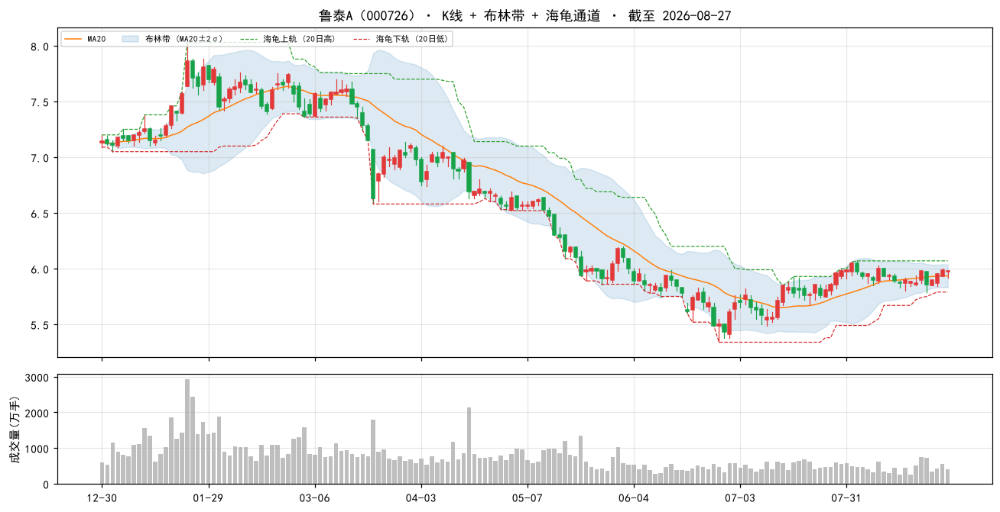

### 2. 浦东金桥（600639）

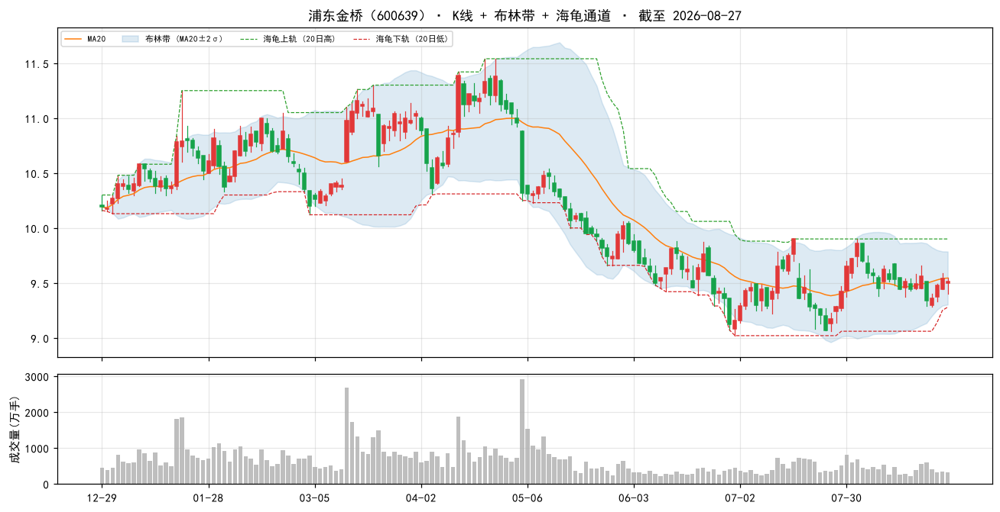

### 3. 大商股份（600694）

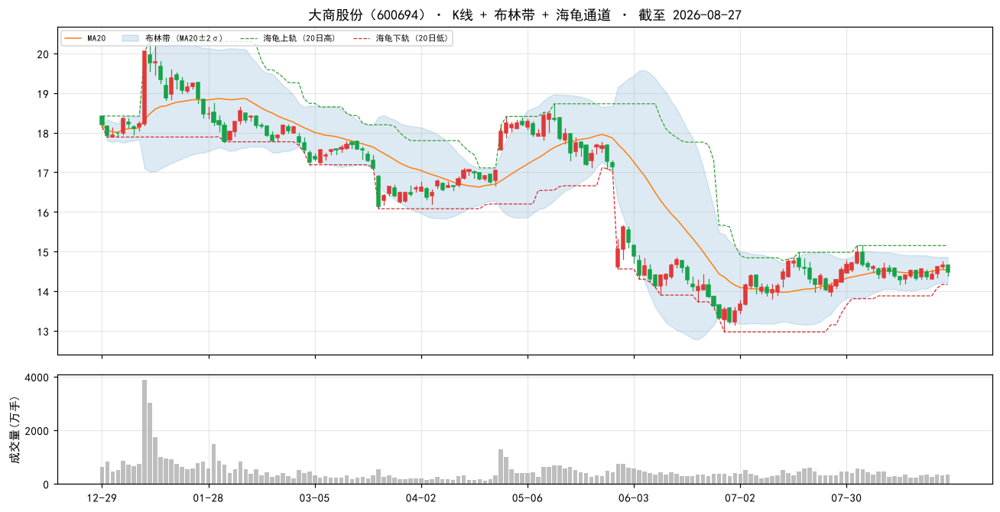

### 4. 赣粤高速（600269）

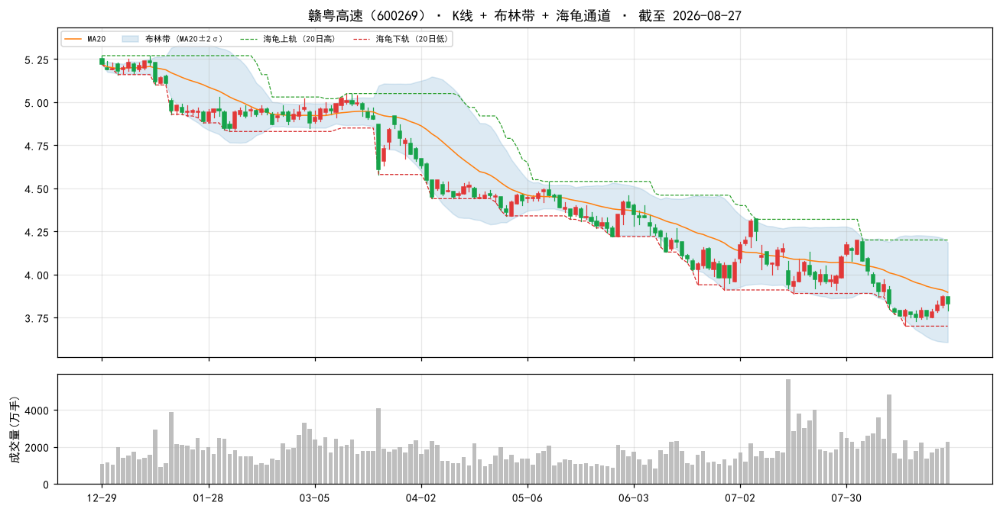

### 5. 国药一致（000028）

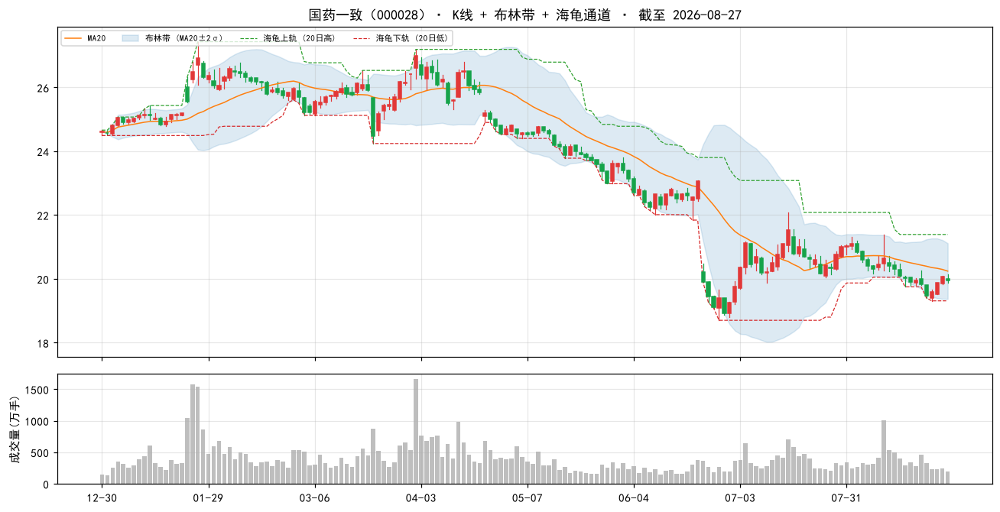

### 6. 现代投资（000900）

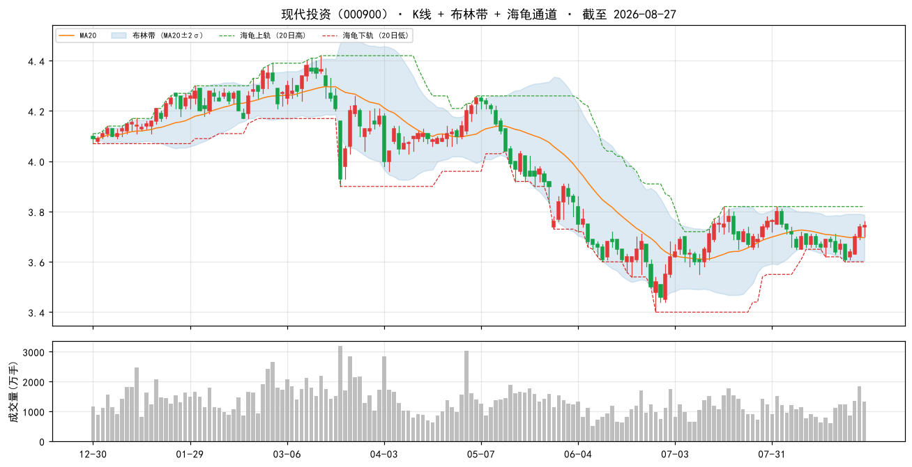

### 7. 新华文轩（601811）

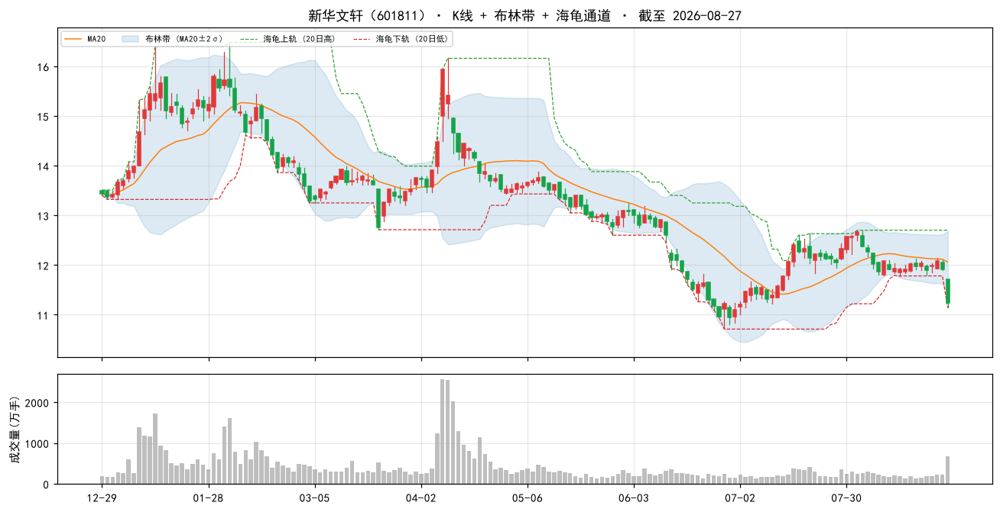

### 8. 中原环保（000544）

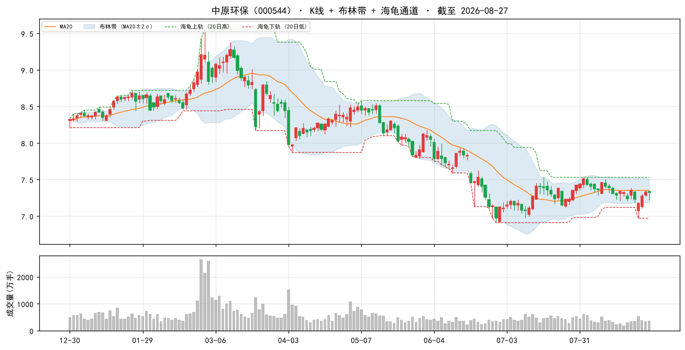

### 9. 宁波联合（600051）

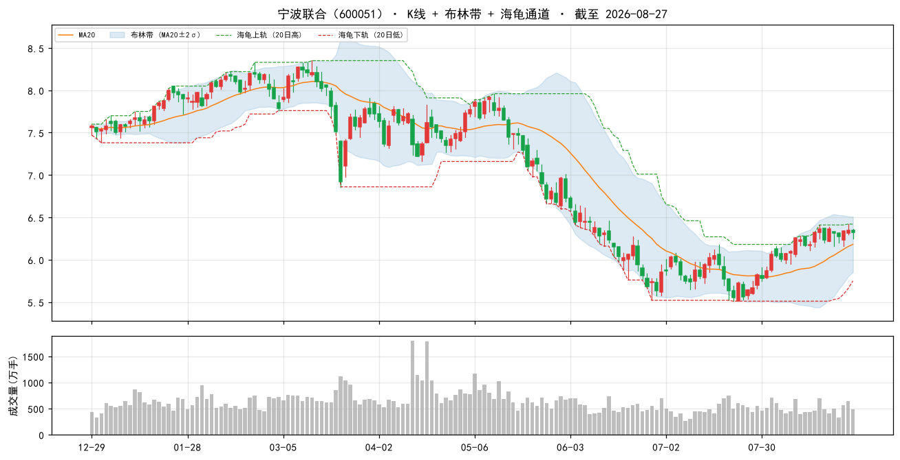

### 10. 中原高速（600020）

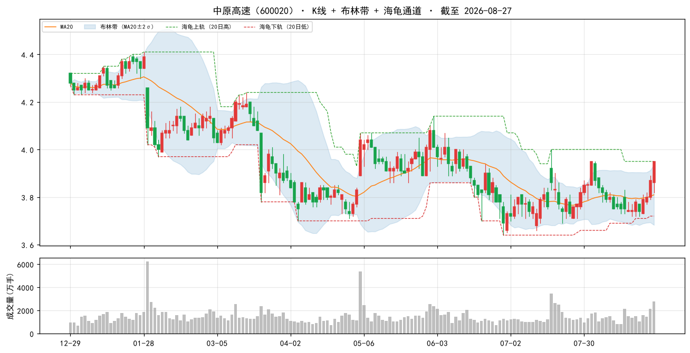

### 当日表现：top-10 vs 大盘

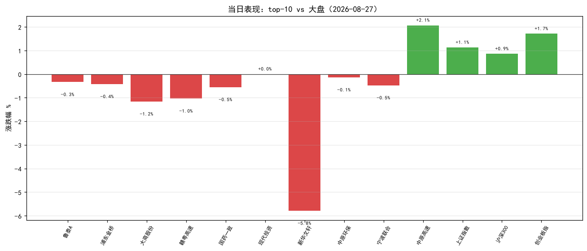

### 组合 vs 沪深300（近 60 交易日，当前名单回放近似）

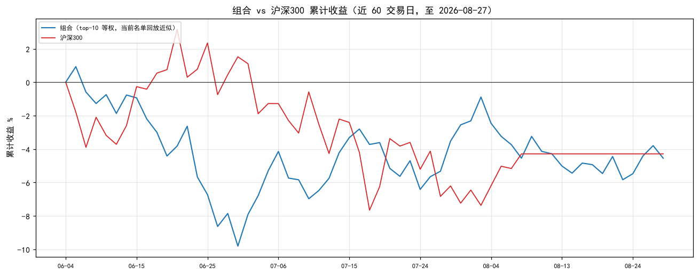

> 组合为**当前 top-10 名单**从窗口起点等权回放（非历史换手），仅作趋势参考；沪深300 用腾讯指数补齐最近两日。

## 九、因子诊断与优化建议

#### 8.1 历史名单表现追踪（至今）

| 名单日 | 股票数 | 名单等权至今 | 沪深300至今 | 超额 |
|---|---|---|---|---|
| 2026-08-11 | 50 | +1.4% | — | — |
| 2026-08-14 | 50 | +2.7% | — | — |
| 2026-08-17 | 50 | +2.4% | — | — |
| 2026-08-18 | 50 | +2.6% | — | — |
| 2026-08-20 | 50 | +2.1% | — | — |
| 2026-08-24 | 50 | +2.1% | — | — |
| 2026-08-25 | 50 | +0.9% | — | — |
| 2026-08-26 | 50 | -0.0% | — | — |

> 说明：等权持有名单至今（未换手），个股停牌则该日不计入；分红未计入，短期窗口影响小。

#### 8.2 因子 IC 诊断（近 11 周截面，因子 vs 未来 5 日收益）

| 因子 | 方向 | 近11个快照 IC | 有效快照 | 判断 |
|---|---|---|---|---|
| 账面市值比 | 1 | +0.162 | 11 | 有效 |
| 盈余收益率 | 1 | +0.087 | 11 | 有效 |
| 60日波动 | -1 | -0.197 | 11 | 有效 |
| 总市值(ln) | -1 | -0.037 | 11 | 有效 |

> IC = 因子值与未来 5 日收益的秩相关（越大越有效）；与注册表方向同号且 |IC|≥0.02 判为有效。 单因子短期 IC 波动大，仅供诊断，不构成当日调权依据。

#### 8.3 月度权重校验（research_panel.pkl 滚动）

> 面板数据截至 2026-07-31。仅作参考：**权重建议月度复核，不日更**（防过拟合）。

| 方案 | 最近37月总收益 | 夏普 | 回撤 |
|---|---|---|---|
| 当前 | +16.5% | +0.20 | -17.4% |
| bp0.3+ep0.2+roe0.15+毛利0.1+现金流0.1+低波0.15 | +15.2% | +0.18 | -16.6% |
| 当前+小市值0.05 | +17.8% | +0.22 | -16.5% |
| 纯价值 bp0.6+ep0.4 | +9.8% | +0.10 | -14.4% |

> ⚠ 候选「当前+小市值0.05」近期夏普最高（+0.22）且高于当前——建议**月度复核时**考虑微调权重，勿当日追改。

## 十、AI 亮点点评

> 数据日期：选股因子数据截至 2026-08-27（最近交易日）；实时行情/大盘指数为腾讯 2026-08-27 16:14 收盘（今日 08-28 06:00 未开盘，属预期内）。以下"当日表现"为选股基准日 08-27 收盘，非前瞻收益。

### 10.1 今日市场环境

2026-08-27（周四）A 股全面反弹、risk-on 普涨：上证 +1.13% / 沪深300 +0.86% / 深成 +1.50% / 创业板 +1.71% / 上证50 +0.87%，创业板以 +1.71% 领涨，成长/小盘显著强于大盘价值，与 08-26（大盘权重领涨）风格反转。全市场涨 3165 / 跌 1810，成交 2.10 万亿（较前日 1.78 万亿放量），广度与量能同步改善。外围驱动明确：新浪要闻显示英伟达单日市值暴涨 4400 亿美元、标普500 收涨、科技股走强，全球 risk-on 外溢至 A 股成长链；大宗商品原油/黄金上涨。

### 10.2 组合画像

valuelowvol 组合为**深度价值 + 低波 + 小市值**风格：bp 平均百分位 99%、ep 88%、60日波动 96%（极低波）、ln_cap 45%（中等偏小）；PE 中位 11.2、PB 中位 0.6（破净边缘）、市值中位 83.5 亿。剔除建筑业 E47-E50 后，交运/公路、出版、医药流通、区域物业为权重集中行业。

### 10.3 今日表现（2026-08-27 收盘）

top-10 当日平均 **-0.78%**（9 跌 1 平 1 涨），显著**跑输大盘**（vs 上证 +1.13% 超额 **-1.91pp**、vs 创业板 +1.71% 超额 **-2.49pp**）。明细：中原高速 +2.07%（独涨，受益路产稳健）、现代投资 0.00%、其余 8 只小跌 -0.14%~-1.16%，新华文轩 -5.79% 为最大拖累。组合防御/低波属性在 risk-on 普涨日落后，动量不在本组合风格——与 08-24/08-25（防御占优时跑赢）形成镜像。

### 10.4 逐票深度分析（top 5）

**① 鲁泰A（000726，5.97，-0.33%）** — 区域性纺织制造龙头，凭高 bp（2.80，全市场前 100%）+ 高 ep（0.15）入选，破净 PB 0.4、低波 20.6%。新闻：2026Q1 收入与毛利短期承压，汇兑及公允价值变动拖累利润；25 年投资收益增厚利润。风险：外需/汇率敏感，业绩拐点未明。结论：典型深度价值票，防御属性强，等待盈利修复催化。

**② 浦东金桥（600639，9.50，-0.42%）** — 上海浦东园区物业运营商，靠经营性物业出租率稳中有升支撑高 bp（1.86）+ 高 ep（0.13），PB 0.5 破净。新闻：收入高增利润增长、出租率稳升、4/27 获融资净买入。风险：区域园区经济周期、租金波动。结论：现金流稳定的收租型价值股，防御压舱石。

**③ 大商股份（600694，14.49，-1.16%）** — 东北百货零售龙头，bp 1.83、ep 0.10、PB 0.5 破净、低波 24.2%。新闻：推进调改、股东回报优化，Q1 收入 +2.7% 重回增长，年报分红率提至 70%。风险：线下零售承压、调改成效待验证。结论：高分红+破净的价值修复标的，分红提供安全垫。

**④ 赣粤高速（600269，3.83，-1.03%）** — 江西收费公路运营商，bp 2.21、ep 0.13、低波 24.8%、市值 89.5 亿。新闻：2026 半年报核心路产主业稳健，金融投资波动致业绩承压；华创证券强推目标价 5.71 元（较现价 +49% 空间）。风险：金融投资波动拖累净利。结论：稳健收费公路+机构强推，攻守兼备。

**⑤ 国药一致（000028，19.95，-0.55%）** — 医药流通/零售（国大药房）龙头，bp 1.95、ep 0.11、PB 0.5 破净。新闻：业绩预告符合预期、收入和利润降幅持续收窄，国大药房经营趋势向好。⚠ 现金流红灯：经营现金流/净利 -1021.1%（周转占用大）。风险：药店集采/合规压力。结论：困境改善型价值股，降幅收窄为正向信号，但现金流质量需盯。

### 10.5 操作建议与风险

- **风格错位提示**：因子不含动量，近 11 周 IC 4/4 全有效（bp+0.162 / ep+0.087 / 低波-0.197 / ln_cap-0.037），策略状态健康；但 08-27 普涨日组合跑输，系防御/低波风格与 risk-on 错位，**非因子失效**，勿因单日落后调仓。
- **名单变化**：vs 08-27，宁波联合（600051）新进 top-10（取代楚天高速 600035 退至 #16）；其余 9 只不变。top-50 截面高度稳定（连续多日 48/50 重合）。
- **权重纪律**：月度权重校验「当前+小市值0.05」夏普最高（+0.22 vs 当前 +0.20），**建议月度复核时微调，勿当日追改**（防过拟合）。
- **显著风险点**：
  1. **现金流红灯**——top-10 国药一致 -1021% / 中原环保 -112% / 新华文轩 -66%；top-50 极端 厦门国贸 -13519% / 浙商中拓 -4989%（方案已剔除现金流因子不惩罚，须人工把关）。
  2. **新华文轩 -5.79% 独大跌** + PB 0.9（唯一未深破净）+ 现金流 -66.4% 红灯，出版行业政策/业绩扰动，建议观察。
  3. **交运/公路集中**——top-10 占 3-4 席（赣粤/中原高速/楚天/宁波联合），单一风格暴露，行业系统性风险需警惕。
  4. **外围 risk-on 延续**——英伟达/标普走强、原油黄金涨，若成长小盘持续占优，本防御组合继续落后；但估值低位提供下行保护。
  5. **小市值集中**——中位 83.5 亿，流动性/涨跌停限制下实盘容量受限，单票仓位勿重。
- **执行纪律**：名单为当日截面快照，不构成调仓指令；建议月频调仓、等权持有、单票止损参考 -8%；PE/PB 为估算，市值推算可能失真，勿单看估值数字。
